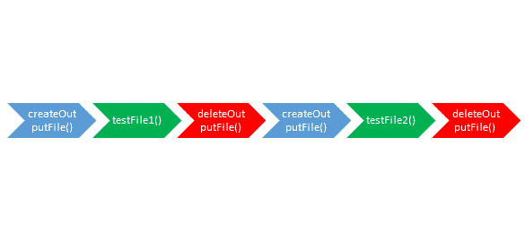
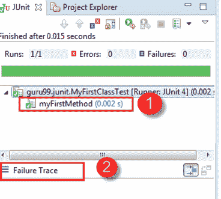

# JUnit 测试用例@Before @BeforeClass 注释

> 原文： [https://www.guru99.com/junit-test-framework.html](https://www.guru99.com/junit-test-framework.html)

JUnit 是 Java 中最受欢迎的单元[测试](/software-testing.html)框架。 明确建议将其用于[单元测试](/unit-testing-guide.html)。 JUnit 不需要服务器来测试 Web 应用程序，这可以使测试过程更快。

JUnit 框架还允许快速轻松地生成测试用例和测试数据。 **org.Junit** 软件包包含许多用于 JUnit 测试的接口和类，例如 Test，Assert，After，Before 等。

## 什么是测试治具

在了解什么是测试夹具之前，让我们研究以下代码

此代码旨在在一个简单的文件上执行两个测试用例。

```
public class OutputFileTest {
    private File output; 
    output = new File(...);
    output.delete(); 
public void testFile1(){
        //Code to verify Test Case 1
}
    output.delete();
    output = new File(...);
public void testFile2(){
        //Code to verify Test Case 2
}
 output.delete(); 
}

```

这里的几个问题

*   该代码不可读
*   该代码不容易维护。
*   当测试套件很复杂时，代码可能包含逻辑问题。

使用 JUnit 比较相同的代码

```
public class OutputFileTest		
{
    private File output; 
    @Before public void createOutputFile() 
    { 
       output = new File(...);
    }

	@After public void deleteOutputFile() 
    {
        output.delete(); 
    } 

    @Test public void testFile1() 
    {
       // code for test case objective
    } 
	@Test public void testFile2() 
    {
       // code for test case objective
    }
}

```

该代码更具可读性和可维护性。 上面的代码结构是**测试装置。**

测试夹具是运行[测试用例](/test-case.html)的环境。 通常，测试装置包括：

*   可用于任何测试用例的对象或资源。
*   需要进行活动以使这些对象/资源可用。
*   这些活动是
    1.  分配（**设置**）
    2.  取消分配（**拆解**）。

### 设置和拆卸

*   通常，在每个测试用例之前必须完成一些重复的任务。 **示例：**创建数据库连接。
*   同样，在每个测试用例的结尾，可能会有一些重复的任务。 **示例：**在测试执行结束后进行清理。
*   JUnit 提供了有助于设置和拆卸的注释。 它确保释放资源，并且测试系统处于准备好下一个测试用例的状态。

这些注释将在下面进行讨论-

**设置**

**@Before** 注释用于包含 [Java](/java-tutorial.html) 代码的方法，以在每个测试用例之前运行。 即它在每次测试执行之前运行。

**拆解（与判决无关）**

在包含 Java 代码的方法上使用 **@After** 批注，以在每个测试用例之后运行。 即使在测试用例或断言失败的情况下引发任何异常，这些方法也将运行。

**注意：**

*   允许上面列出任意数量的注释。
*   用 **@Before** 注释的所有方法将在每个测试用例之前运行，但是它们可以按任何顺序运行。
*   您可以从超类继承@Before 和@After 方法，执行如下：它是 JUnit 中的标准执行过程。

1.  执行超类中的@Before 方法
2.  在此类中执行@Before 方法
3.  在此类中执行@Test 方法
4.  在此类中执行@After 方法
5.  在超类中执行@After 方法

**示例：使用文件作为测试夹具创建一个类**

```
public class OutputFileTest		
{
    private File output; 
    @Before	public void createOutputFile() 
    { 
       output = new File(...);
    }

	@After public void deleteOutputFile() 
    {
        output.delete(); 
    } 

    @Test public void testFile1() 
    {
       // code for test case objective
    } 
	@Test public void testFile2() 
    {
       // code for test case objective
    }
}

```

在上面的示例中，执行链如下：



1.  createOutputFile（）
2.  testFile1（）
3.  deleteOutputFile（）
4.  createOutputFile（）
5.  testFile2（）
6.  deleteOutputFile（）

**假设：** testFile1（）在 testFile2（）之前运行–无法保证。

### 一次性设置

*   在执行任何测试之前，以及在任何 **@Before** 方法之前，对于整个测试类只能运行一次方法。
*   “仅设置一次”对于启动服务器，打开通信等很有用。关闭和重新打开每个测试的资源非常耗时。
*   可以使用 **@BeforeClass** 批注来完成

```
@BeforeClass public static void Method_Name() {	
    // class setup code here	
 }	

```

### 一次拆解

*   与仅一次安装类似，也可以使用仅一次清除方法。 它在所有测试用例方法和注释执行完毕后运行。
*   对于停止服务器，关闭通信链接等很有用。
*   可以使用 **@AfterClass** 批注来完成

```
 @AfterClass public static void Method_Name()	
 {	
    // class cleanup code here	
 }	

```

## JUnit 测试套件

如果要按指定的顺序执行多个测试，可以通过将所有测试合并到一个位置来完成。 这个地方称为测试套件。 [教程](/create-junit-test-suite.html)涵盖了有关如何执行测试套件以及如何在 JUnit 中使用测试套件的更多详细信息。

## Junit 测试运行器

JUnit 提供了用于执行测试用例的工具。

*   **JUnitCore** 类用于执行这些测试。
*   **org.junit.runner.JUnitCore** 提供的称为 **runClasses** 的方法用于运行一个或几个测试类。
*   此方法的返回类型是**结果**对象（ **org.junit.runner.Result** ），该对象用于访问有关测试的信息。 请参阅以下代码示例，以获取更多清晰信息。

```
public class Test {				
			public static void main(String[] args) {									
       		Result result = JUnitCore.runClasses(CreateAndSetName.class);					
			for (Failure failure : result.getFailures()) {							
         		System.out.println(failure.toString());					
      }		
      System.out.println(result.wasSuccessful());					
   }		
}      

```

在上面的代码中，处理“结果”对象以获取我们正在执行的测试用例的失败和成功结果。

## 第一个 JUnit 程序

对 SDLC，Java 编程的了解以及对软件测试过程的了解有助于理解 JUnit 程序。

让我们通过一个实例来了解单元测试。 我们需要使用带有 **@Test** 的测试方法创建一个测试类，如下所示：

**MyFirstClassTest.java**

```
package guru99.JUnit;		

import static org.JUnit.Assert.*;				

import org.JUnit.Test;		

public class MyFirstClassTest {				

    @Test		
    public void myFirstMethod(){					
        String str= "JUnit is working fine";					
        assertEquals("JUnit is working fine",str);					
    }
}		

```

**TestRunner.java**

要执行我们的测试方法（上述），我们需要创建一个测试运行器。 在测试运行器中，我们必须在 JUnitCore 的 runclasses（）方法中添加测试类作为参数。 它将根据测试是通过还是失败返回测试结果。

有关此的更多详细信息，请参见下面的代码：

```
package guru99.JUnit;		

import org.JUnit.runner.JUnitCore;		
import org.JUnit.runner.Result;		
import org.JUnit.runner.notification.Failure;		

public class TestRunner {				
			public static void main(String[] args) {									
            Result result = JUnitCore.runClasses(MyFirstClassTest.class);					
			for (Failure failure : result.getFailures()) {							
              System.out.println(failure.toString());					
      }		
      System.out.println("Result=="+result.wasSuccessful());							
   }		
}      	

```

**输出**

一旦 **TestRunner.java** 执行了我们的测试方法，我们将获得失败或通过的输出。 请在下面的输出说明中找到：

1.  在此示例中，在执行 **MyFirstClassTest.java** 之后，测试通过，结果为绿色。
2.  如果失败，则结果应该显示为红色，并且可以在失败跟踪中观察到失败。 参见下面的 JUnit gui：



**摘要**：

*   JUnit 是一个框架，它支持多个批注以标识包含测试的方法。
*   JUnit 提供了一个称为 **@Test，**的注释，该注释告诉 JUnit 使用该注释的公共 void 方法可以作为测试用例运行。
*   测试装置是测试用例运行的环境
*   要以指定的顺序执行多个测试，可以通过将所有测试合并到一个位置来完成。 这个地方称为测试套件。
*   JUnit 提供了用于执行测试的工具，在这里我们可以运行称为 Test Runner 的测试用例。