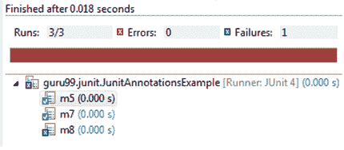

# 带有示例的 JUnit 注释教程

> 原文： [https://www.guru99.com/junit-annotations-api.html](https://www.guru99.com/junit-annotations-api.html)

## 什么是 JUnit 注释？

**JUNIT 注释**是语法元数据的一种特殊形式，可以将其添加到 Java 源代码中，以提高代码的可读性和结构性。 可以注释变量，参数，包，方法和类。 注释是在 Junit4 中引入的，它使 Java 代码更具可读性和简单性。 这是 Junit3 和 Junit4 之间最大的区别，因为 Junit4 是基于注释的。

借助 Junit5 中的注释知识，您可以轻松学习和实现 JUnit 测试。 以下是重要和常用注释的列表：

| **编号** | **批注** | **说明** |
| 1. | @测试 | 此注释是 org.junit.TestCase 的替换，它指示它所附加的 public void 方法可以作为测试用例执行。 |
| 2. | @之前 | 如果要在每个测试用例之前执行一些语句（例如前提条件），则使用此批注。 |
| 3. | @课前 | 如果您想在所有测试用例之前执行某些语句，例如 测试连接必须在所有测试用例之前执行。 |
| 4. | @后 | 如果您想在每个[测试用例](/test-case.html)之后执行一些语句，例如重置变量，删除临时文件，变量等，则可以使用此注释。 |
| 5. | @下课以后 | 如果您想在所有测试用例之后执行一些语句，例如，可以使用此注释。 执行所有测试用例后释放资源。 |
| 6. | @忽略 | 如果您想在测试执行期间忽略某些语句，例如，可以使用此注释。 在测试执行期间禁用一些测试用例。 |
| 7. | @Test（超时= 500） | 如果您想在测试执行期间设置一些超时时间（例如， 如果您正在使用某些 SLA（服务水平协议），并且测试需要在指定的时间内完成。 |
| 8. | @Test（expected = IllegalArgumentException.class） | 如果要在测试执行期间处理某些异常，可以使用此批注。 例如，如果要检查特定方法是否抛出指定的异常。 |

在本教程中，您将学习-

*   [JUnit 注释示例](#7)
*   [JUnit 声明类](#2)
*   [JUnit 测试用例类](#3)
*   [JUnit TestResult 类](#4)
*   [JUnit 测试套件类](#5)

## JUnit 注释示例

让我们用简单的打印语句创建一个覆盖重要的 JUnit 批注的类，并使用测试运行器类执行它：

**步骤 1）**考虑下面的 java 类，该类具有各种方法，这些方法附加到上面列出的注释中：

**JunitAnnotationsExample.java**

```
package guru99.junit;		

import static org.junit.Assert.assertEquals;				
import static org.junit.Assert.assertFalse;				

import java.util.ArrayList;		

import org.junit.After;		
import org.junit.AfterClass;		
import org.junit.Before;		
import org.junit.BeforeClass;		
import org.junit.Ignore;		
import org.junit.Test;		

public class JunitAnnotationsExample {				

    private ArrayList<String> list;					

    @BeforeClass		
    public static void m1() {							
        System.out.println("Using @BeforeClass , executed before all test cases ");					
    }		

    @Before		
    public void m2() {					
        list = new ArrayList<String>();					
        System.out.println("Using @Before annotations ,executed before each test cases ");					
    }		

    @AfterClass		
    public static void m3() {							
        System.out.println("Using @AfterClass ,executed after all test cases");					
    }		

    @After		
    public void m4() {					
        list.clear();			
        System.out.println("Using @After ,executed after each test cases");					
    }		

    @Test		
    public void m5() {					
        list.add("test");					
        assertFalse(list.isEmpty());			
        assertEquals(1, list.size());			
    }		

    @Ignore		
    public void m6() {					
        System.out.println("Using @Ignore , this execution is ignored");					
    }		

    @Test(timeout = 10)			
    public void m7() {					
        System.out.println("Using @Test(timeout),it can be used to enforce timeout in JUnit4 test case");					
    }		

    @Test(expected = NoSuchMethodException.class)					
    public void m8() {					
        System.out.println("Using @Test(expected) ,it will check for specified exception during its execution");					

    }		

}		

```

**步骤 2）**让我们创建一个测试运行器类以执行上述测试：

**TestRunner.java**

```
package guru99.junit;		

import org.junit.runner.JUnitCore;		
import org.junit.runner.Result;		
import org.junit.runner.notification.Failure;		

public class TestRunner {				
			public static void main(String[] args) {									
      Result result = JUnitCore.runClasses(JunitAnnotationsExample.class);					
			for (Failure failure : result.getFailures()) {							
         System.out.println(failure.toString());					
      }		
      System.out.println("Result=="+result.wasSuccessful());							
   }		
}      	

```

**预期结果**

*   所有测试用例将一个接一个地执行，并且所有打印语句都可以在控制台上看到。
*   如上表@Before 中所述，@BeforeClass [方法 m1（）和 m2（）]将分别在每个测试用例之前和所有测试用例之前执行。
*   以相同的方式，@ after，@ afterClass（方法 m3（）和 m4（））将分别在每个测试用例之后和所有测试用例之后执行。 @ignore（方法 m6（））将被视为忽略测试。

让我们详细分析上述 java 类中使用的测试用例：

1.  考虑如下方法 m5（）：

```
	@Test		
    public void m5() {					
        list.add("test");					
        assertFalse(list.isEmpty());			
        assertEquals(1, list.size());			
    }		

```

在上面的方法中，因为您要在变量“列表”中添加一个字符串，所以

*   **list.isEmpty（）**将返回 false。
*   **assertFalse（list.isEmpty（））**必须返回 true。
*   结果，测试用例将通过**通过**。

由于您仅在列表中添加了一个字符串，因此大小为 1。

*   **list.size（）**必须将 int 值返回为“ 1”。
*   因此 **assertEquals（1，list.size（））**必须返回 true。
*   结果，测试用例将通过**通过**。

2.  考虑如下所示的方法 m7（）：

```
@Test(timeout = 10)		
    public void m7() {					
        System.out.println("Using @Test(timeout),it can be used to enforce timeout in JUnit4 test case");					
    }		

```

如上所述， **@Test（timeout = 10）**注释用于在测试用例中强制超时。

3.  考虑如下所示的方法 m8（）：

```
@Test(expected = NoSuchMethodException.class)				
    public void m8() {					
        System.out.println("Using @Test(expected) ,it will check for specified exception during its execution");					

    }		

```

如上所述， **@Test（expected）**将在执行期间检查指定的异常，因此方法 m8（）将抛出“无此类方法异常”。 结果，将异常执行测试。

通过所有测试用例后，这将导致成功执行测试。

**实际结果**

由于上面的示例中有三个测试用例，因此所有测试用例将一一执行。 参见下面的输出**：**



**请参阅下面的打印语句，可以在控制台上看到它们：**

使用@BeforeClass，在所有测试用例之前执行

使用@Before 批注，在每个测试用例之前执行

使用@After，在每个测试用例之后执行

Using @Before annotations, executed before each test cases

使用@Test（timeout），它可以用于在 JUnit4 测试用例中强制执行超时

Using @After, executed after each test cases

Using @Before annotations, executed before each test cases

使用@Test（expected），它将在执行过程中检查指定的异常

Using @After, executed after each test cases

使用@AfterClass，在所有测试用例之后执行

## JUnit 声明类

此类提供了一些断言方法，可用于编写测试用例。 如果所有的 assert 语句都通过，则测试结果成功。 如果任何 assert 语句失败，则测试结果将失败。

如前所述，下表描述了重要的 Assert 方法和说明：

| **编号** | **方法** | **说明** |
| 1\. | void assertEquals（期望的布尔值，实际的布尔值） | 它检查两个值是否等于 Object 类的 equals 方法 |
| 2\. | void assertFalse（布尔条件） | 功能是检查条件是否为假。 |
| 3\. | void assertNotNull（Object object） | “ assertNotNull”功能是检查对象是否不为空。 |
| 4\. | void assertNull（Object 对象） | “ assertNull”功能是检查对象是否为空。 |
| 5\. | void assertTrue（布尔条件） | “ assertTrue”功能是检查条件是否为真。 |
| 6\. | 无效 fail（） | 如果要抛出任何断言错误，则具有 fail（）总是会导致失败判定。 |
| 7\. | void assertSame（[字符串消息] | “ assertSame”功能是检查两个对象是否引用相同的对象。 |
| 8\. | void assertNotSame（[字符串消息] | “ assertNotSame”功能是检查两个对象没有引用相同的对象。 |

## JUnit 测试用例类

要运行多个测试，可以在 **org.junit.TestCase** 程序包中使用 TestCase 类。 注释@Test 告诉 JUnit，可以将它附加到的此公共无效方法（此处为测试用例）作为测试用例运行。

下表显示了 **org.junit.TestCase** 类中可用的一些重要方法：

| **S.No.** | **Method** | **Description** |
| 1\. | int countTestCases（） | 此方法用于计算通过 **run（TestResult tr）**方法执行的测试用例数。 |
| 2\. | TestResult createResult（） | 此方法用于创建 **TestResult** 对象。 |
| 3\. | 字符串 getName（） | 此方法返回的字符串不过是 **TestCase** 。 |
| 4\. | 运行 TestResult（） | 此方法用于执行返回 **TestResult** 对象的测试 |
| 5\. | 无效运行（TestResult 结果） | 此方法用于执行具有 **TestResult** 对象的测试，该对象不返回任何内容。 |
| 6\. | setName（String name）无效 | 此方法用于设置 **TestCase 的名称。** |
| 7\. | 无效 setUp（） | 此方法用于编写资源关联代码。 例如 创建数据库连接。 |
| 8\. | 无效 tearDown（） | 此方法用于编写资源释放代码。 例如 执行事务操作后释放数据库连接。 |

## JUnit TestResult 类

When you execute a test, it returns a result (in the form of **TestResult** object). This TestResult object can be used to analyse the resultant object. This test result can be either failure or successful. See below table for important methods used in org.junit.TestResult class:

| **S.No.** | **Method** | **Description** |
| 1\. | void addError（Test test，Throwable t） | 如果您需要在测试中添加错误，请使用此方法。 |
| 2\. | void addFailure（测试测试，AssertionFailedError t） | 如果需要将故障添加到故障列表中，则使用此方法。 |
| 3\. | 无效 endTest（测试测试） | 此方法用于通知已执行测试（完成） |
| 4\. | int errorCount（） | 此方法用于获取在测试执行期间检测到的错误。 |
| 5\. | 枚举< TestFailure > errors（） | 此方法仅返回错误的集合（此处为 Enumeration）。 |
| 6\. | int failureCount（） | 此方法用于获取在测试执行期间检测到的错误计数。 |
| 7\. | 无效运行（TestCase 测试） | 此方法用于执行测试用例。 |
| 8\. | int runCount（） | 此方法仅计算执行的测试。 |
| 9. | void startTest（测试测试） | 此方法用于通知测试已开始。 |
| 10. | 无效 stop（） | 此方法用于测试要停止的运行。 |

## JUnit 测试套件类

如果要以指定的顺序执行多个测试，可以通过将所有测试合并到一个位置来完成。 这个地方称为测试套件。

有关 **org.junit.TestSuite** 类中使用的重要方法，请参见下表：

| **S.No.** | **Method** | **Description** |
| 1\. | void addTest（测试测试） | 如果要向套件添加测试，则使用此方法。 |
| 2\. | void addTestSuite（Class <？扩展了 TestCase > testClass） | 如果要在向套件添加测试时指定类，则使用此方法。 |
| 3\. | int countTestCases() | 如果要计算测试用例的数量，则使用此方法。 |
| 4\. | String getName() | 此方法用于获取测试套件的名称。 |
| 5\. | void run(TestResult result) | 此方法用于执行测试并在 **TestResult** 对象中收集测试结果。 |
| 6\. | void setName(String name) | 此方法用于设置 **TestSuite** 的名称。 |
| 7\. | 测试 testAt（int 索引） | 如果要返回给定索引的测试，则使用此方法。 |
| 8\. | int testCount（） | 如果要在套件中返回许多测试，则使用此方法。 |
| 9\. | 静态测试警告（字符串消息） | 此方法返回将失败的测试并记录警告消息。 |

**摘要：**

*   JUnit 提供了一个可移植的 API，该 API 提供了对编写单元测试有用的所有重要的类和注释。
*   在编写测试用例时非常有用的类
    *   org.junit.Assert
    *   org.junit.TestCase
    *   org.junit.TestResult
    *   org.junit.TestSuite
*   list of important and frequently used annotations

    @之前

    @课前

    @后

    @下课以后

    @测试

    @忽视