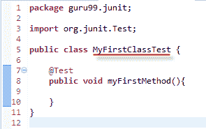
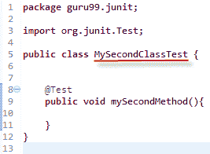
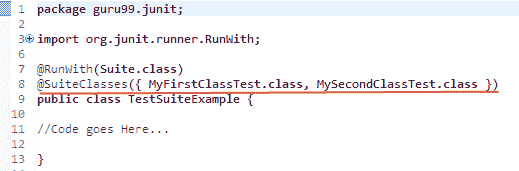
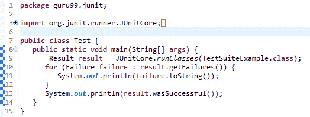
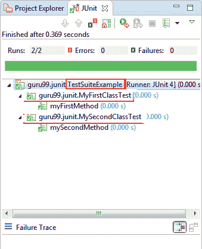
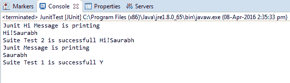
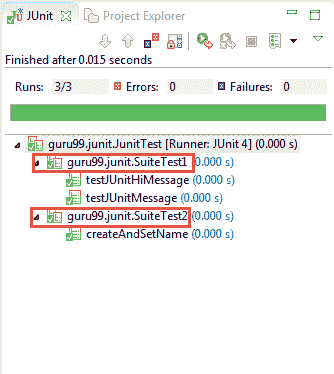

# 使用示例创建 JUnit 测试套件：@RunWith @SuiteClasses

> 原文： [https://www.guru99.com/create-junit-test-suite.html](https://www.guru99.com/create-junit-test-suite.html)

在 Junit 中，测试套件使我们可以在一个地方聚合来自多个类的所有测试用例并一起运行。

要运行套件测试，您需要使用以下提到的注释来注释一个类：

1.  @Runwith（Suite.class）
2.  @SuiteClasses(test1.class,test2.class……) or

    @ Suite.SuiteClasses（{test1.class，test2.class……}）

使用上面的注释，套件中的所有测试类将开始一个接一个地执行。

## 创建测试套件和测试运行器的步骤

**步骤 1）**创建一个简单的测试类（例如 MyFirstClassTest），并添加带有@test 注释的方法。



**步骤 2）**创建另一个要添加的测试类（例如 MySecondClassTest），并创建一个以@test 注释的方法。



**步骤 3）**要创建 testSuite，您需要首先使用@RunWith（Suite.class）和@SuiteClasses（class1.class2…..）对该类进行注释。



**步骤 4）**创建一个 Test Runner 类来运行我们的测试套件，如下所示；



**代码说明：**

*   **代码行 8：**声明将运行我们的 JUnit 测试的类测试的主要方法。
*   **代码行 9：**使用 JunitCore.runclasses 执行测试案例，该测试案例将测试类名作为参数（在上面的示例中，您使用的是步骤 3 中显示的 TestSuiteExample.class）。
*   **代码行 11：**使用 for 循环处理结果并打印出失败的结果。
*   **代码行 13：**打印成功结果。

**输出：**这是显示成功测试且没有失败跟踪的输出，如下所示：



## JUnit 测试套件示例

考虑一个更复杂的例子

**JunitTest.java**

JunitTest.java 是一个简单的类，带有 **@RunWith** 和 **@Suite** 批注。 您可以列出套件中.class 的数量作为参数，如下所示：

```
package guru99.junit;		
import org.junit.runner.RunWith;		
import org.junit.runners.Suite;		

@RunWith(Suite.class)				
@Suite.SuiteClasses({				
  SuiteTest1.class,
  SuiteTest2.class,  			
})		

public class JunitTest {				
			// This class remains empty, it is used only as a holder for the above annotations		
}

```

**SuiteTest1.java**

**SuiteTest1.java** 是一个测试类，具有一个测试方法，可以打印出如下所示的消息。 您将在上述课程中将此课程用作套件。

```
package guru99.junit;		

import static org.junit.Assert.assertEquals;				

import org.junit.Test;		

public class SuiteTest1 {				

    public String message = "Saurabh";							

    JUnitMessage junitMessage = new JUnitMessage(message);							

    @Test(expected = ArithmeticException.class)					
    public void testJUnitMessage() {					

        System.out.println("Junit Message is printing ");					
        junitMessage.printMessage();			

    }		

    @Test		
    public void testJUnitHiMessage() {					
        message = "Hi!" + message;							
        System.out.println("Junit Hi Message is printing ");					
        assertEquals(message, junitMessage.printHiMessage());					
        System.out.println("Suite Test 2 is successful " + message);							
    }		
}		

```

**SuiteTest2.java**

**SuiteTest2.java** 是另一个类似于 **SuiteTest1.java** 的测试类，具有如下打印消息的测试方法。 您将在 **JunitTest.java** 中将此类作为套件使用。

```
package guru99.junit;		

import org.junit.Assert;		
import org.junit.Test;		

public class SuiteTest2 {				

    @Test		
    public void createAndSetName() {					

        String expected = "Y";					
        String actual = "Y";					

        Assert.assertEquals(expected, actual);					
        System.out.println("Suite Test 1 is successful " + actual);							
    }		

}		

```

**输出**

执行 **JunitTest** .java，其中包含具有 **test1.java** 和 **test2.java** 的套件，您将获得以下输出：

[ ](/images/junit/052416_0732_CreateJUnit6.png) 



**摘要**

在本教程中，您通过示例详细了解了测试工具和测试套件的基础。

*   测试工具或自动化[测试](/software-testing.html)是一种软件或软件集合，它使用户可以使用多个输入来测试数据并控制执行
*   测试工具实际上启用了一个测试框架，该框架执行使用测试库执行测试并生成测试报告的所有工作
*   在 Junit 中，测试套件允许我们将多个类的所有测试用例集中在一个地方，然后一起运行。