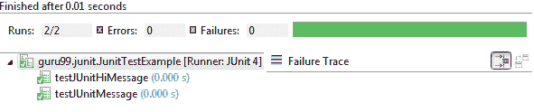
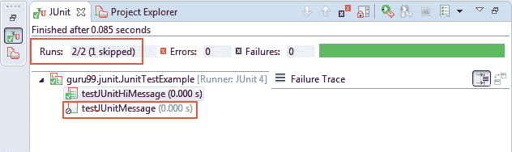
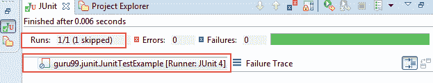

# JUnit @Ignore 测试注释与示例

> 原文： [https://www.guru99.com/junit-ignore-test.html](https://www.guru99.com/junit-ignore-test.html)

有时您可能需要不执行方法/代码或[测试用例](/test-case.html)，因为编码未完全完成。 对于该特定测试，JUnit 提供 **@Ignore** 批注以跳过测试。

在本教程中，您将学习-

*   [什么是 JUnit @Ignore 测试注释](#1)
*   [Junit 测试示例-忽略](#2)
*   [创建一个简单的测试类而不忽略测试](#3)
*   [忽略使用@Ignore 批注的测试方法](#4)
*   [在条件](#5)中使用@忽略注释
*   [使用@Ignore 批注忽略所有测试方法。](#6)

## 什么是 JUnit @Ignore 测试注释

@Ignore 测试注释用于忽略特定测试或测试组，以跳过构建失败。

**@Ignore** 批注可在以下两种情况下使用：

1.  如果要忽略测试方法，请与@Test 批注一起使用@Ignore。
2.  如果要忽略类的所有测试，请在类级别使用@Ignore 批注。

您可以在@Ignore 批注提供的可选参数中提供禁用测试的原因。

它将帮助其他开发人员在同一段代码上工作，以了解“为什么禁用特定测试？” 解决了特定测试的问题后，只需删除 **@Ignore 批注**即可启用它。

## Junit 测试示例-忽略

如以上定义所讨论，可以使用@Ignore 批注忽略测试或测试组。

让我们使用简单的示例并在以下给定场景中了解它：

1.  创建一个简单的测试类而不忽略测试。
2.  忽略使用@Ignore 批注的测试方法。
3.  忽略使用@Ignore 批注的测试方法，并具有适当的理由。
4.  使用@Ignore 批注忽略所有测试方法。

## 创建一个简单的测试类而不忽略测试

让我们创建一个简单的 [Java](/java-tutorial.html) 类，该类输出两种类型的消息。

*   第一种方法打印一条简单的消息，然后
*   第二种方法打印一条“ hi”消息

**JUnitMessage.java**

```
package guru99.junit;		

public class JUnitMessage {				

    private String message;					

    public JUnitMessage(String message) {					
        this.message = message;							
    }		

public String printMessage(){		

    System.out.println(message);					

    return message;					
}    		

public String printHiMessage(){		

    message="Hi!"+ message;							

    System.out.println(message);					

    return message;					
}    		

}		

```

**JunitTestExample.java**

让我们创建一个 JUnit 测试类来测试 JUnitMessage.java。

在这个 JUnit 测试类中，

*   第一个测试名为“ testJUnitMessage（）”，测试上述类的“ printMessage（）”方法。
*   类似地，名为“ testJUnitHiMessage”的第二个测试将测试上述类的“ testJUnitHiMessage”。

```
package guru99.junit;		

import static org.junit.Assert.assertEquals;				

import org.junit.Test;		

public class JunitTestExample {				

    public String message = "Guru99";							

    JUnitMessage junitMessage = new JUnitMessage(message);							

    @Test		
    public void testJUnitMessage() {					

        System.out.println("Junit Message is printing");					
        assertEquals(message, junitMessage.printMessage());					

    }		

    @Test		
    public void testJUnitHiMessage() {					
        message="Hi!" +message;							
        System.out.println("Junit Hi Message is printing ");					
        assertEquals(message, junitMessage.printHiMessage());					

    }		
}		

```

**TestRunner.java**

让我们创建一个测试运行器类以执行 JunitTestExample.java

```
package guru99.junit;		

import org.junit.runner.JUnitCore;		
import org.junit.runner.Result;		
import org.junit.runner.notification.Failure;		

public class TestRunner {				
			public static void main(String[] args) {									
      Result result = JUnitCore.runClasses(JunitTestExample.class);				
			for (Failure failure : result.getFailures()) {							
         System.out.println(failure.toString());					
      }		
      System.out.println("Result=="+result.wasSuccessful());							
   }		
}      	

```

**输出：**



**控制台上的打印语句：**

Junit Hi 消息正在打印

嗨 Guru99

Junit 消息正在打印

大师 99

## 使用@Ignore 批注忽略测试方法

让我们创建忽略测试以在上面的示例中禁用测试。 为此，您需要在要跳过的方法中使用@Ignore。

让我们为 JunitTestExample.java 的 testJUnitMessage（）做一下

**JunitTestExample.java**

```
package guru99.junit;		

import static org.junit.Assert.assertEquals;				

import org.junit.Ignore;		
import org.junit.Test;		

public class JunitTestExample {				

    public String message = "Guru99";							

    JUnitMessage junitMessage = new JUnitMessage(message);							

    @Ignore		
    @Test		
    public void testJUnitMessage() {					

        System.out.println("Junit Message is printing ");					
        assertEquals(message, junitMessage.printMessage());					

    }		

    @Test		
    public void testJUnitHiMessage() {					
        message="Hi!" +message;							
        System.out.println("Junit Hi Message is printing ");					
        assertEquals(message, junitMessage.printHiMessage());					

    }		
}

```

**Output:**

让我们执行并验证以上示例的输出。

下面的输出显示已跳过（禁用）一项测试，请参见以下标记：



**Print statement on console:**

Junit Hi Message is printing

Hi!Guru99

## 在条件中使用@忽略注释

让我们以如何忽略测试并定义忽略测试的原因为例。 如上所述，要提供原因，您可以在@Ignore 批注中有一个可选参数，您可以在其中提供 reason 语句。

**JunitTestExample.java**

```
package guru99.junit;		

import static org.junit.Assert.assertEquals;				

import org.junit.Ignore;		
import org.junit.Test;		

public class JunitTestExample {				

    public String message = "Guru99";							

    JUnitMessage junitMessage = new JUnitMessage(message);							

    @Ignore("not yet ready , Please ignore.")					
    @Test		
    public void testJUnitMessage() {					

        System.out.println("Junit Message is printing ");					
        assertEquals(message, junitMessage.printMessage());					

    }		

    @Test		
    public void testJUnitHiMessage() {					
        message="Hi!" +message;							
        System.out.println("Junit Hi Message is printing ");					
        assertEquals(message, junitMessage.printHiMessage());					

    }		
}		

```

**Output:**

同上。

## 使用@Ignore 批注忽略所有测试方法。

如上所述，要忽略类中的所有测试，您需要在类级别使用@Ignore 批注。

让我们修改上面的示例，以了解如何忽略所有测试：

```
package guru99.junit;		

import static org.junit.Assert.assertEquals;				

import org.junit.Ignore;		
import org.junit.Test;		

@Ignore		
public class JunitTestExample {				

    public String message = "Guru99";							

    JUnitMessage junitMessage = new JUnitMessage(message);							

    @Test		
    public void testJUnitMessage() {					

        System.out.println("Junit Message is printing ");					
        assertEquals(message, junitMessage.printMessage());					

    }		

    @Test		
    public void testJUnitHiMessage() {					
        message="Hi!" +message;							
        System.out.println("Junit Hi Message is printing ");					
        assertEquals(message, junitMessage.printHiMessage());					

    }		
}		

```

**输出：**



**Print statement on console:**

由于在类级别使用@Ignore 跳过了这两个测试，因此不会在控制台上打印任何语句。

**摘要：**

在本教程中，您学习了如何使用@Ignore 批注忽略单个测试，一组测试或所有测试。

**@Ignore** 批注可在以下两种情况下使用：

1.  如果要忽略测试方法，请与@Test 批注一起使用@Ignore。
2.  如果要忽略类的所有测试，请在类级别使用@Ignore 批注。

您还学习了如何提供声明以使其他开发人员了解为什么禁用特定测试。