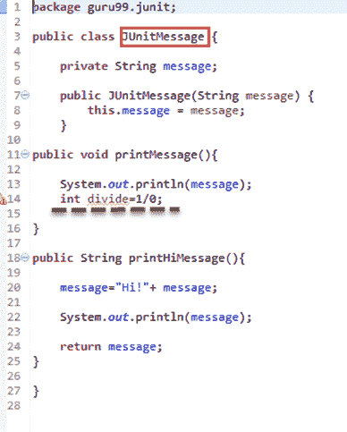
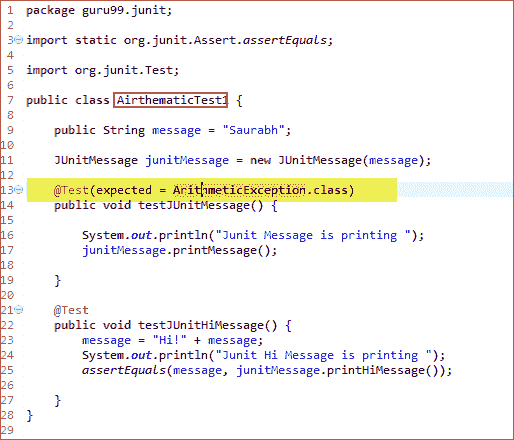
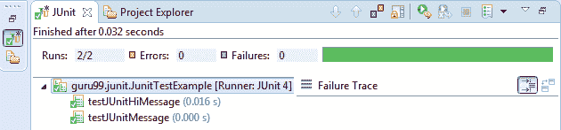

# JUnit 预期的异常测试：@Test（预期）

> 原文： [https://www.guru99.com/junit-exception-test.html](https://www.guru99.com/junit-exception-test.html)

JUnit 提供了跟踪异常并检查代码是否引发预期异常的功能。

Junit4 提供了一种易于理解的异常测试方法，您可以使用

*   @test 注释的可选参数（预期）和
*   要跟踪信息，可以使用“ fail（）”

在[测试](/software-testing.html)异常时，您需要确保在 **@test 注释**的可选参数中提供的异常类相同。 这是因为您在[单元测试](/unit-testing-guide.html)的方法中期望出现异常，否则我们的 JUnit 测试将失败。

**Example @ Test（expected = IllegalArgumentException.class）**

通过使用“ expected”参数，您可以指定测试可能抛出的异常名称。 在上面的示例中，您正在使用“ **IllegalArgumentException”** ，如果开发人员使用不允许的参数，则测试会抛出该异常。

## 使用@test（expected）的示例

让我们通过使用抛出异常的方法创建 [Java](/java-tutorial.html) 类来了解异常测试。 您将处理它并在测试类中对其进行测试。 考虑一下 JUnitMessage.java，该方法具有一种简单的方法，可以根据用户接收的输入进行数学运算。 如果输入任何非法参数，它将抛出“ ArithmeticException **”** 。 见下文：



```
package guru99.junit;

public class JUnitMessage{

	private String message;

	public JUnitMessage(String message) {
		this.message = message;
	}

public void printMessage(){

	System.out.println(message); 
	int divide=1/0;

}

public String printHiMessage(){ 

	message="Hi!" + message;

	System.out.println(message);

	return message;
}

}

```

**代码说明：**

*   **代码行 7：**创建带有字段初始化的参数化构造函数。
*   **代码行 11-14：**创建用于数学运算的方法。
*   **代码行 18：**创建另一种打印消息的方法。
*   **代码行 20：**创建新字符串以打印消息。
*   **代码行 21：**打印在第 20 行中创建的新消息。

让我们为上述 java 类创建一个测试类以验证异常。

请参阅下面的测试类，以从上面的 Java 类抛出单元测试异常（此处为 ArithmeticException）：

**AirthematicTest.java**



```
package guru99.junit;

import static org.junit.Assert.assertEquals;

import org.junit.Test;

public class AirthematicTest {

	public String message = "Saurabh";

	JUnitMessage junitMessage = new JUnitMessage(message);

	@Test(expected = ArithmeticException.class)
	public void testJUnitMessage(){

		System.out.println("Junit Message is printing ");
		junitMessage.printMessage();

	}

	@Test
	public void testJUnitHiMessage(){ 
		message="Hi!" + message;
		System.out.println("Junit Message is printing ");
		assertEquals(message, junitMessage.printMessage());

	}
}

```

**Code Explanation:**

*   **代码行 13：**使用@Test 批注创建测试。 当您执行上述类方法时，它将调用数学运算。 这里需要算术异常，因此您将其列为@Test 中的参数。
*   **代码行 17：**调用 printMessage（）JUnitMessage.java
*   **代码行 18：**创建另一种打印 HI 消息的方法。

如果执行此测试类，则将使用每个定义的参数执行测试方法。 在上面的示例中，测试方法执行了五次。

让我们执行它并验证结果。 参见下面的测试运行器类，以执行 **JunitTestExample.java**

**输出：**

这是显示成功测试且没有失败跟踪的输出，如下所示：

[ ](/images/junit/052416_1148_JUnitExcept3.png) 

**摘要：**

*   异常测试是 JUnit4 中引入的一项特殊功能。 在本教程中，您学习了如何使用@test（excepted）在 JUnit 中测试异常。
*   Junit 提供了跟踪异常并检查代码是否引发异常的功能。
*   对于异常测试，您可以使用
    *   @test 注释的可选参数（预期）和
    *   要跟踪信息，可以使用“ fail（）”