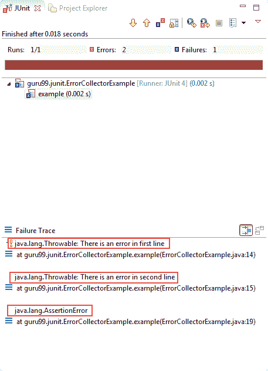

# JUnit ErrorCollector @Rule 与示例

> 原文： [https://www.guru99.com/junit-errorcollector.html](https://www.guru99.com/junit-errorcollector.html)

在正常情况下，只要在测试执行过程中发现任何错误，就将停止测试，更正错误并重新运行测试。

但是 JUnit 的方法稍有不同。 使用 JUnit 错误收集器，即使在发现问题或测试失败之后，仍然可以继续执行测试。 错误收集器收集所有错误对象，并在测试执行结束后仅报告一次。

在本教程中，您将学习-

*   [JUnit 中的错误收集器是什么？](#1)
*   [jUnit 中的@Rule 是什么？](#2)
*   [使用 ErrorCollector](#3) 的示例
*   [JUnit ErrorCollector](#4) 的好处

## 为什么使用错误收集器？

编写测试脚本时，即使由于网络故障，断言失败或任何其他原因而导致任何代码行失败，也要执行所有测试。 在这种情况下，您仍然可以使用 JUnit 提供的称为“错误收集器”的特殊功能继续执行测试脚本。

为此，JUnit 使用 **@Rule 批注**，该批注用于创建错误收集器的对象。 一旦创建了错误收集器对象，就可以使用方法 **addError（可抛出错误）轻松地将所有错误添加到对象中。** 如您所知， **Throwable** 是 Java 中**异常**和**错误**类的超类。 当您以这种方式添加错误时，这些错误将记录在 JUnit 测试结果中。

在错误收集器中添加所有错误的好处是您可以一次验证所有错误。 另外，如果脚本在中间失败，它仍然可以继续执行

**注意**：在使用简单的 assert 或 try / catch 块的情况下，将无法使用错误收集器方法。

**示例代码**

要了解有关 Error Collector 的更多信息，请参见下面的代码示例，该示例演示如何创建 Error Collector 对象并在该对象中添加所有错误以跟踪问题：

```
package guru99.junit;		

import org.junit.Rule;		
import org.junit.Test;		
import org.junit.rules.ErrorCollector;		

public class ErrorCollectorExample {				
    @Rule		
    public ErrorCollector collector = new ErrorCollector();							

    @Test		
    public void example() {					
    collector.addError(new Throwable("There is an error in first line"));							
    collector.addError(new Throwable("There is an error in second line"));							
    collector.checkThat(getResults(),			
                not(containsString("here is an error")));			
    // all lines of code will execute and at the end a combined failure will		
    be logged in.		
    }		
}	

```

## jUnit 中的@Rule 是什么？

JUnit 通过使用 **@rule 注释**提供了一种特殊的测试处理，即[测试用例](/test-case.html)或测试套件。 使用@rule，您可以轻松添加或重新定义测试行为。

JUnit API 提供了一些内置规则，测试人员可以使用这些规则，甚至您也可以编写我们自己的规则。

请参阅下面的代码行，其中显示了如何将@rule 注释与 Error Collector 一起使用：

```
@Rule				
public ErrorCollector collector= new ErrorCollector();
```

## 使用 ErrorCollector 的示例

为了理解错误收集器，让我们创建一个类和一个规则来收集所有错误。 您将在此处使用 addError（throwable）添加所有错误。

参见下面的代码，该代码仅创建一条规则，该规则只不过是创建“ Error Collector 对象”。 进一步将其用于添加所有错误，以便最后报告问题：

**ErrorCollectorExample.java**

```
package guru99.junit;		

import org.junit.Assert;		
import org.junit.Rule;		
import org.junit.Test;		
import org.junit.rules.ErrorCollector;		

public class ErrorCollectorExample {				
    @Rule		
    public ErrorCollector collector = new ErrorCollector();							

    @Test		
    public void example() {					
    collector.addError(new Throwable("There is an error in first line"));							
    collector.addError(new Throwable("There is an error in second line"));							

        System.out.println("Hello");					
        try {			
            Assert.assertTrue("A " == "B");					
        } catch (Throwable t) {					
            collector.addError(t);					
        }		
        System.out.println("World!!!!");					
    }		
}		

```

**TestRunner.java**

让我们在测试运行器中添加以上测试类，并执行它以收集所有错误。 参见下面的代码：

```
package guru99.junit;		

import org.junit.runner.JUnitCore;		
import org.junit.runner.Result;		
import org.junit.runner.notification.Failure;		

public class TestRunner {				
			public static void main(String[] args) {									
      Result result = JUnitCore.runClasses(ErrorCollectorExample.class);					
			for (Failure failure : result.getFailures()) {							
         System.out.println(failure.toString());					
      }		
      System.out.println("Result=="+result.wasSuccessful());							
   }		
}      

```

**输出：**

请参阅故障跟踪，该跟踪将所有错误集中在一个位置：

[ ](/images/junit/052416_1156_JUnitErrorC1.png) 

## JUnit ErrorCollector 的好处

您可以将 JUnit 断言用于功能验证或 GUI 验证，例如

1.  assertEquals（String message，预期对象，实际对象）比较两个对象是否相等。
2.  同样，assertTrue（Boolean condition）断言条件为 true。

使用断言，验证测试变得容易。 但是一个主要问题是，即使单个断言失败，测试执行也会停止。

测试的连续性和恢复处理对于测试自动化的成功至关重要。 错误收集器是处理此类情况的最佳方法。

**摘要**：

*   Junit 错误收集器即使在发现第一个问题之后也可以使测试继续进行，并且最终测试失败
*   错误收集器收集所有错误对象并仅报告，毕竟测试执行
*   在错误收集器中添加所有错误的好处是您可以一次验证所有错误
*   错误收集器仅使用 ErrorCollector.java 提供的方法 addError（throwable err）添加错误。