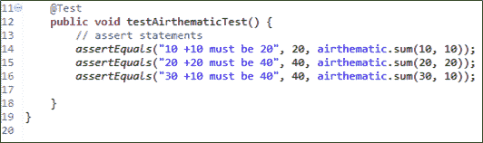
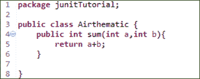
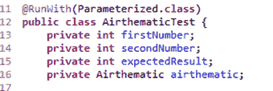
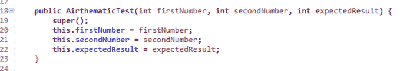
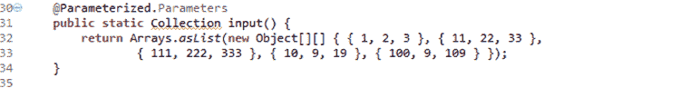
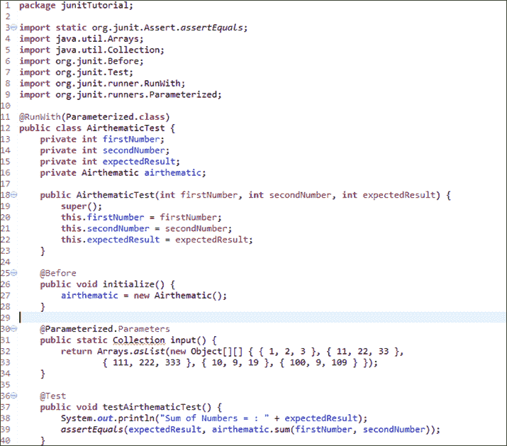
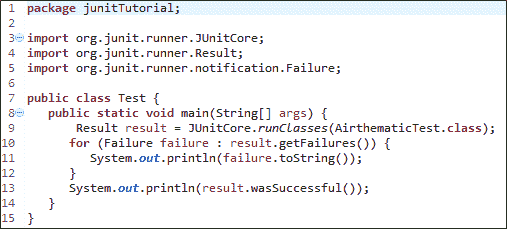
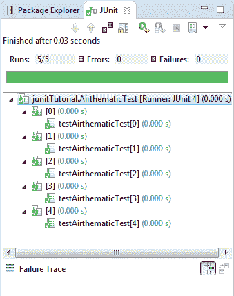
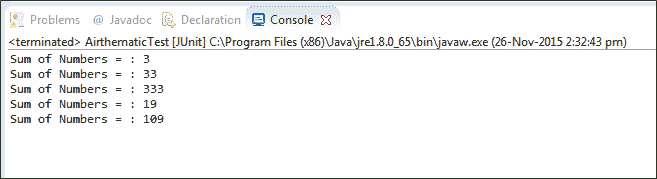

# 使用@Parameters 的示例进行 JUnit 参数化测试

> 原文： [https://www.guru99.com/junit-parameterized-test.html](https://www.guru99.com/junit-parameterized-test.html)

## 什么是 Junit 中的参数化测试？

参数化测试是使用不同的值一次又一次地执行相同的测试。 它可以帮助开发人员节省执行相同测试的时间，该测试仅在输入内容和预期结果上有所不同。

使用参数化测试，可以设置一种从某些数据源检索数据的测试方法。

考虑一个简单的测试来求和不同的数字。 该代码可能看起来像-

上面的方法导致很多冗余。

我们需要一个简单的方法。 使用参数化测试，您只需添加一种方法即可输入 10 个数据输入，并且测试将自动运行 10 次。

## 创建参数化 JUnit 测试的步骤

以下代码显示了参数化测试的示例。 它测试 Arithmetic 类的 sum（）方法：

**步骤 1）**创建一个类。 在此示例中，我们将使用 sum（int，int）方法输入两个数字，该方法将返回给定数字的总和

**步骤 2）**创建参数化测试类

代码说明

*   **代码行 11：**使用@runWith（Parameterized.class）注释测试类。
*   **代码行 13：**声明变量“ firstNumber”为私有，类型为 int。
*   **代码行 14：**声明变量“ secondNumber”为私有，类型为 int。
*   **代码行 15：**声明变量'expectedResult'为私有，类型为 int。
*   **代码行 16：**声明变量“ airthematic”为私有，类型为 Airthematic。

**@RunWith** （class_name.class）： **@RunWith** 批注用于指定其运行程序类名称。 如果我们未指定任何类型作为参数，则运行时默认情况下将选择 **BlockJunit4ClassRunner** 。

此类负责使用新的测试实例运行的测试。 它负责调用 JUnit 生命周期方法，例如 setup（关联资源）和 teardown（释放资源）。

要进行参数化，您需要使用@RunWith 进行注释并传递所需的.class 进行测试

**步骤 3）**创建一个存储测试数据的构造函数。 它存储 3 个变量

**步骤 4）**创建一个静态方法来生成并返回测试数据。

**代码行 32,33：**创建一个二维数组（提供用于添加的输入参数）。 使用 asList 方法，我们将数据转换为 List 类型。 因为，方法输入的返回类型是 collection。

**代码行 30：**使用 **@Parameters** 批注创建一组输入数据以运行我们的测试。

由@Parameters 批注标识的静态方法返回一个 Collection，其中 Collection 中的每个条目都是该测试的一次迭代的输入数据。

考虑元素

{1,2,3}

这里

firstNumber = 1

secondNumber = 2

ExpectedResult = 3

这里，每个数组元素将被传递给构造函数，一次将其传递一次，因为类被多次实例化。

**步骤 5）**完整的代码

**代码说明：**

*   **代码行 25：**使用@Before 批注设置资源（此处为 Airthematic.class）。 @Before 注释在此处用于在每个测试用例之前运行。 它包含测试的前提条件。
*   **代码行 36：**使用@Test 批注创建测试。
*   **代码行 39：**创建一个 assert 语句来检查我们的总和是否等于我们的期望。

**步骤 6）**创建一个测试运行器类以运行参数化测试：

**代码说明：**

*   **代码行 8：**声明将运行我们的 JUnit 测试的类测试的主要方法。
*   **代码行 9：**使用 JunitCore.runclasses 执行测试用例，它将把测试类名作为参数（在我们的示例中，我们使用 Airthematic.class）。
*   **代码行 11：**使用 for 循环处理结果并打印出失败的结果。
*   **代码行 13：**打印成功结果。

**输出：**

这是显示成功测试且没有失败跟踪的输出，如下所示：

在控制台上查看结果，该结果显示两个数字相加：-

**摘要**：

参数化测试使开发人员可以使用不同的值一次又一次地执行相同的测试。

参数化期间要使用的重要注释

*   **@RunWith**
*   **@参数**