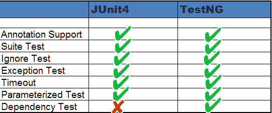

# TestNG 与 JUnit：有什么区别？

> 原文： [https://www.guru99.com/junit-vs-testng.html](https://www.guru99.com/junit-vs-testng.html)

Testng 和 Junit 均为[测试](/software-testing.html)框架，用于[单元测试](/unit-testing-guide.html)。 TestNG 与 JUnit 相似。 几乎没有其他功能可以使 TestNG 比 JUnit 强大。

本教程主要侧重于分析 JUnit 和 TestNG 的功能。 它可以帮助开发人员确定用于单元测试的框架。 首先让我们分析一下 TestNG 和 JUnit4 之间的相似之处。

TestNG 是一个受 JUnit 和 NUnit 启发的测试框架。

下表显示了 JUnit 和 TestNG 支持的功能。

## JUnit4 和 TestNG 功能比较

除了一个或两个功能外，TestNG 和 JUnit4 看起来都很相似。 让我们对两者进行比较以快速确定哪种技术更适合单元测试。 下表突出显示了两者均支持的功能：



## 注解

JUnit 和 TestNG 都使用注释，并且几乎所有注释看起来都相似。

TestNG 使用@BeforeMethod，@ AfterMethod 类似于 JUnit4 中的@Before，@ After。

TestNG 和 Junit4 都使用@Test（timeout = 1000）进行超时。有关更多详细信息，请查看下表-

| **S.N.** | **说明** | **TestNG** | **JUnit 4** |
| 1 | 测试注解 | @测试 | @Test |
| 2 | 在当前类中调用第一个测试方法之前执行 | @课前 | @BeforeClass |
| 3 | 在当前类中的所有测试方法之后执行 | @下课以后 | @AfterClass |
| 4 | 在每种测试方法之前执行 | @BeforeMethod | @之前 |
| 5 | 在每种测试方法之后执行 | @AfterMethod | @后 |
| 6 | 注解忽略测试 | @Test（启用=假） | @忽视 |
| 7 | 异常注释 | @Test（expectedExceptions = ArithmeticException.class） | @Test（expected = ArithmeticException.class） |
| 8 | 超时 | @Test（超时= 1000） | @Test(timeout = 1000) |
| 9 | 在套件中的所有测试之前执行 | @BeforeSuite | 不适用 |
| 10 | 在套件中的所有测试之后执行 | @AfterSuite | n/a |
| 11 | 在测试运行之前执行 | @BeforeTest | n/a |
| 12 | 在测试运行后执行 | @AfterTest | n/a |
| 13 | 在调用属于任何这些组的第一个测试方法之前执行 | @BeforeGroups | n/a |
| 14 | 在属于这里任何组的最后一个测试方法之后运行 | @AfterGroups | n/a |

## 套件测试

套件用于一起执行多个测试。 套件可以使用 TestNG 和 JUnit4 创建。 但是，套件在 TestNG 中功能更强大，因为它使用非常不同的方法来执行测试。 让我们使用下面给出的代码片段来了解它：

**使用 JUnit4**

下面的类描述了在使用 JUnit4 时套件的使用：

```
package guru99.junit;		
import org.junit.runner.RunWith;		
import org.junit.runners.Suite;		

@RunWith(Suite.class)				
@Suite.SuiteClasses({				
    SuiteTest1.class,			
    SuiteTest2.class,			

})		

public class JunitTest {		
// This class remains empty,it is used only as a holder for the above annotations		
}

```

**使用 TestNG**

TestNG 使用 xml 将所有测试捆绑在一个地方。下面的 xml 描述了使用 TestNG 时套件的使用：

```

<!DOCTYPE suite SYSTEM "http://beust.com/testng/testng-1.0.dtd" >
<suite name="My test suite">
<test name="testing">
<classes>
<class name="com.guru99.SuiteTest1" />
<class name="com.guru99.SuiteTest2" />
</classes>
</test>
</suite>

```

## 忽略测试

两者都可以跳过测试，下面用代码示例来看一下：

**Using JUnit4**

下面的代码片段描述了在使用 JUnit4 时使用@ignore 批注：

```
@Ignore
public void method1() 
{
	System.out.println("Using @Ignore , this execution is ignored");
}
```

**Using TestNG**

以下代码段描述了在使用 TestNG 时使用@Test（enabled = false）批注：

```
@Test(enabled=false)
public void TestWithException()
{  
	System.out.println("Method should be ignored as it's not ready yet");
}

```

## 异常测试

在 TestNG 和 JUnit4 中都可以使用异常测试。 它用于检查测试中抛出了哪个异常？

**Using JUnit4**

下面的代码片段描述了使用 JUnit4 时异常测试的使用：

```
@Test(expected = ArithmeticException.class)  
public void divideByZero() 
{  
	Int i = 1/0;
}

```

**Using TestNG**

下面的代码片段描述了在使用 TestNG 时使用异常测试的方法：

```
@Test(expectedExceptions = ArithmeticException.class)  
public void divideByZero()
{  
Int i = 1/0;
}	

```

## 超时

TestNg 和 JUnit4 中都实现了此功能。Timeout 用于终止测试，该测试花费的时间超过指定的时间（毫秒）。

**Using JUnit4**

下面的代码片段描述了使用 JUnit4 时超时测试的使用：

```
@Test(timeout = 1000)  
public void method1()
{  
	while (true);  
}

```

**使用 TestNG**

下面的代码段描述了在使用 TestNG 时超时测试的用法：

```
@Test(timeOut = 1000)  
public void method1()
{  
	while (true);  
}
```

## 参数化测试

JUnit 提供了一种更简单易懂的测试方法，称为参数化测试。 TestNG 和 JUnit 都支持参数化测试，但是它们定义参数值的方式不同。 让我们一一看。

**Using JUnit4**

“ @RunWith”和“ @Parameter”批注用于为单元测试提供参数值。 注释@Parameters 必须返回 List []。此参数将作为参数传递到类构造函数中。

```
@RunWith(value = Parameterized.class)
public class JunitTest{

    privateint number;

    public JunitTest6(int number)
 {
    this.number = number;
     }

     @Parameters
    public static Collection<Object[]> data() 
{
       Object[][] data = new Object[][] { { 1 }, { 2 }, { 3 }, { 4 } };
    returnArrays.asList(data);
    }

     @Test
    public void parameterTest()
 {
    System.out.println("Parameterized Number is : " + number);
     }
}

```

**Using TestNG**

在 TestNG 中，XML 文件或“ @DataProvider”用于提供测试参数。

这里在方法中声明的@Parameters 批注需要一个参数进行测试。 用作参数的数据将在 TestNG 的 XML 配置文件中提供。 通过这样做，我们可以将具有不同数据集的单个[测试用例](/test-case.html)重用，并且可以获得不同的结果。

```
public class Test1 {

    @Test
    @Parameters(value="number")
    public void parameterTest(int number)
	{
    	System.out.println("Parameterized Number is : " + number);
    }

}

```

请参阅以下用于以上类的 xml 文件：

```
<!DOCTYPE suite SYSTEM "http://beust.com/testng/testng-1.0.dtd" >
<suite name="My test suite">
<test name="testing">

<parameter name="number" value="2"/>    

<classes>
<class name="com.guru99.Test1" />
</classes>
</test>
</suite>

```

## 总结：

我们详细看到了 JUnit4 和 TestNG 的比较。 我们还看到除了参数化测试和依赖测试以外，两者都相似。 简而言之，我们可以说，基于灵活性和要求，我们可以选择其中任意一种进行单元测试。

*   [下一个](/selenium-tutorial.html)