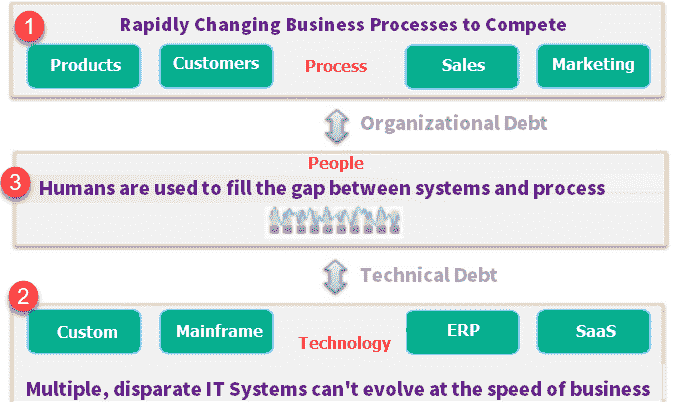
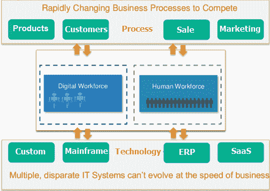
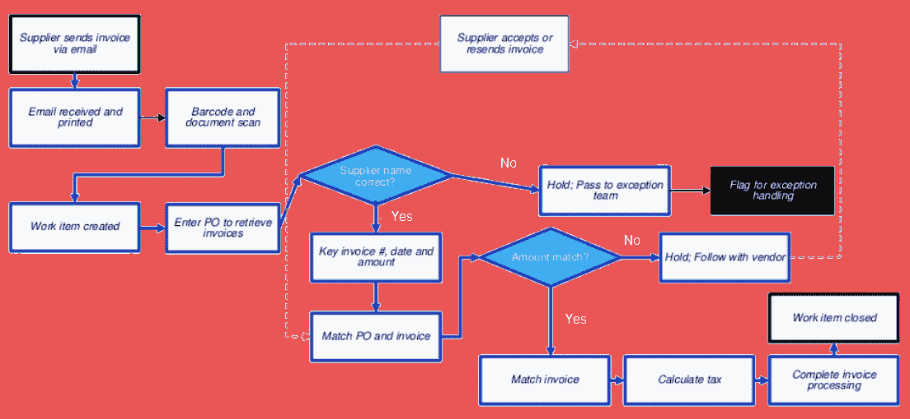

# 机械手流程自动化（RPA）教程：什么是工具&示例

> 原文： [https://www.guru99.com/robotic-process-automation-tutorial.html](https://www.guru99.com/robotic-process-automation-tutorial.html)

## 什么是机器人过程自动化？

**机器人过程自动化（RPA）**使组织能够像人类在应用程序和系统中执行任务一样自动执行任务。 RPA 的目的是将流程执行从人转移到机器人。 机器人自动化与现有的 IT 体系结构进行交互，而无需复杂的系统集成。

RPA 可用于自动化劳动密集型的工作流程，基础架构和后台办公流程。 这些软件机器人可以与内部应用程序，网站，用户门户等进行交互。RPA 是一种在最终用户的 PC，便携式计算机或移动设备上运行的软件程序。 它是一系列命令，由 Bots 根据一组定义的业务规则执行。

机器人过程自动化过程的主要目标是用虚拟劳动力代替人工执行的重复性和无聊的文书工作。 RPA 不需要开发代码，也不需要直接访问应用程序的代码或数据库。

**What You Will Learn:** []

*   [为什么选择机器人流程自动化？](#2)
*   [RPA 的示例](#3)
*   [测试自动化和 RPA 之间的区别](#4)
*   [RPA 实施方法](#5)
*   [RPA 实施的最佳做法](#6)
*   [RPA 的常规用法](#7)
*   [RPA 的应用](#8)
*   [机器人过程自动化工具](#9)
*   [RPA 的好处](#10)
*   [RPA 的神话](#11)

## 为什么要进行机器人流程自动化？

在典型企业中考虑以下情形

1.  商业环境不断变化。 企业需要不断发展其产品，销售，营销等流程，以发展并保持相关性
2.  典型的企业使用多个不相连的 IT 系统来运行其业务。 随着业务流程的更改，由于预算，时间和实施复杂性问题，这些 IT 系统不会经常更改。 因此，业务流程不会映射 IT 系统中映射的技术流程。
3.  为了克服这种技术和组织上的债务，雇用了人力来填补系统和流程之间的空白。 示例：某公司对销售流程进行了更改，因此需要强制性 50％的预付款以确认其产品的预订。 但这尚未在 IT 系统中进行编码。 仅当提前 50％时，人工才需要人工检查发票和付款明细并处理销售订单。

**问题？ ---人类**

随着业务流程的任何变化，公司将需要雇用新员工或培训现有员工以绘制 IT 系统和业务流程。 两种解决方案都是耗时和金钱的。 此外，对于任何后续的业务流程更改，也将需要雇用或重新培训。

**输入 RPA**

借助机器人自动化，公司可以部署模仿人类工人的虚拟工人。 如果流程发生变化，与再培训数百名员工相比，更改几行软件代码总是更快，更便宜。

在这里，有一些原因使 Robotics Process Automation 更具优势

*   一个人一天平均可以工作 8 个小时，而机器人可以 24 小时工作，而不会感到疲倦。
*   人的平均生产率为 60％，几乎没有错误，而机器人的生产率为 100％，没有任何错误。
*   与人类相比，机器人可以很好地处理多种任务

## RPA 的示例

考虑以下发票处理业务流程

| **说明** | **是否可以通过 RPA 自动执行？** |
| --- | --- |
| 打开供应商提供的发票电子邮件并打印以作记录 | 是

 |
| 条码扫描 | 手册

 |
| 在旧版软件系统中创建工作项 | Yes

 |
| 输入采购订单以检索发票 | Yes

 |
| 检查供应商名称是否正确？ | Yes

 |
| 关键发票，数据和金额 | Yes

 |
| 匹配采购订单和发票 | Yes

 |
| 检查金额是否匹配？ | Yes

 |
| 如果金额匹配发票，则计算税额 | Yes

 |
| 完整的发票处理 | Yes

 |
| 工作项目已关闭 | Yes

 |
| 如果金额不匹配保留，请跟供应商联系 | Yes

 |
| 供应商接受或重新发送发票 | Yes

 |
| 如果供应商名称不正确，请持有通向例外团队的通行证 | Yes

 |
| 异常处理标志 | Yes

 |

## 测试自动化和 RPA 之间的区别

测试自动化工具和 RPA 工具之间存在多个重叠。 例如，它们都驱动屏幕，键盘，鼠标等，并且具有类似的技术架构。 但是以下是两者之间的主要区别

| **参数** | **测试自动化** | **RPA** |
| --- | --- | --- |
| 目标 | 通过自动化减少测试执行时间 | 通过自动化减少人员 |
| 任务 | 自动化重复的测试用例 | 自动化重复的业务流程 |
| 编码 | 创建测试脚本所需的编码知识 | 向导驱动，不需要编码知识 |
| 技术方法 | 支持有限的软件环境。 示例：Selenium 仅支持 Web 应用程序。 | 支持多种软件环境 |
| 例 | 测试用例是自动化的 | 数据输入，表格，贷款处理是自动化的 |
| 应用 | 测试自动化可以在 QA，生产，性能，UAT 环境中运行 | RPA 通常仅在生产环境上运行 |
| 实作 | 它可以使产品自动化。 | 它可以使产品和服务自动化。 |
| 用户数 | 仅限技术用户。 | 可以被所有利益相关者广泛使用。 |
| 角色 | 充当虚拟助手。 | 充当虚拟劳动力。 |
| AI | 只能执行编码的内容。 | AI 引擎随附的许多 RPA 工具可以像人类一样处理信息 |

同样，RPA 工具（如 UIPath，Blueprism）可用于测试自动化。 反之亦然，如果您具有良好的编码技能，则可以将 UFT 等高级自动化工具用于 RPA。 但是 RPA 工具更适合目标。

## RPA 实施方法

### 规划

在此阶段，您需要确定要自动化的流程。 遵循清单将帮助您确定正确的过程

*   工艺手册&是否重复？
*   流程是否基于规则？
*   输入数据是否为电子格式且可读？
*   可以使用现有系统而不更改吗？

接下来，计划阶段的步骤是

*   建立项目团队，确定实施时间表和方法。
*   同意用于执行 RPA 流程的解决方案设计。
*   标识应使用日志记录机制来发现正在运行的机器人的问题。
*   应该定义清晰的路线图以扩大 RPA 实施

### 发展历程

在此阶段，您将开始按照约定的计划开发自动化工作流。 由向导驱动，实现迅速

### 测试中

在此阶段中，您将运行“测试”周期以进行范围内的自动化，以识别和纠正缺陷

### 支持&维护

上线后提供持续支持，并帮助立即解决缺陷。 遵循有关业务和 IT 支持团队的角色和职责的常规维护准则。

## RPA 实施的最佳做法

*   在选择 RPA 流程之前，应先考虑业务影响
*   定义并关注所需的投资回报率
*   专注于针对更大的群体并自动化大型的，有影响力的流程
*   结合参加和无人参与 RPA
*   设计不良，变更管理可能造成严重破坏
*   不要忘记对人的影响
*   在 RPA 流程中，项目的管理是最重要的。 应确保政策，公司，政府合规。

## RPA 的一般用法

**1.模拟人类行为：**

使用各种应用程序和系统来模拟重复过程的人工执行。

**2.执行大量重复任务：**

机器人流程自动化可以轻松地模拟从一个系统到另一个系统的数据更新。 它执行诸如数据输入，复制和粘贴之类的任务。

**3.执行多项任务：**

跨多个系统运行多个复杂任务。 这有助于处理交易，处理数据和发送报告。

**4.“虚拟”系统集成：**

通过在用户界面级别连接数据，而不是开发新的数据基础结构，该自动化系统可以在异构系统和旧系统之间传输数据。

**5.自动生成报告：**

自动提取数据，以提供准确，有效和及时的报告。

**6.信息验证和审核：**

解决和交叉验证不同系统之间的数据，以验证和检查信息，以提供合规性和审核输出。

**7.技术债务管理：**

通过减少系统之间的差距，防止引入自定义实现来帮助减少技术负担。

**8.产品管理：**

它通过自动更新两个系统来帮助弥合 IT 系统与相关产品管理平台之间的鸿沟。

**9.质量保证：**

对于涵盖回归测试和自动化客户用例场景的质量保证流程可能会有所帮助。

**10.数据迁移：**

允许通过系统自动进行数据迁移，这是使用传统媒体（例如文档，电子表格或其他源数据文件）无法实现的。

**11.间隙解决方案**：

机械手自动填补了工艺缺陷的空白。 它包括一些简单的任务，例如密码重置，系统重置等。

**12.收入预测：**

自动更新财务报表以预测收入预测。

## RPA 的应用

| **行业** | **用法** |
| --- | --- |
| 卫生保健 | 

*   患者注册
*   结算

 |
| 人力资源 | 

*   新员工加入手续
*   薪资流程
*   招聘入围候选人

 |
| 保险 | 

*   要求处理 & 间隙
*   附加信息

 |
| 制造业&零售 | 

*   物料清单
*   销售计算

 |
| 电讯 | 

*   服务订单管理
*   质量报告

 |
| 旅行&物流 | 

*   机票预订
*   乘客详细信息
*   会计

 |
| 银行与金融服务 | 

*   卡激活
*   欺诈索赔
*   发现

 |
| 政府 | 

*   地址更改
*   许可证续签

 |
| 基础设施 | 

*   问题处理
*   帐户设置和通讯

 |

## 机器人过程自动化工具

RPA 工具的选择应基于以下四个参数：

1.  **数据**：易于将业务数据读取和写入多个系统

2.  **主要执行的任务类型**：易于配置基于规则或基于知识的流程。

3.  **互操作性**：工具应可在多个应用程序中使用

4.  **AI** ：内置 AI 支持以模仿人类用户

流行的机器人自动化工具：

**1）蓝色棱镜**

Blue Prism 是一种机器人过程自动化软件。 它为企业和组织提供了敏捷的数字化劳动力。

**下载链接：** [https://www.blueprism.com/](https://www.blueprism.com/)

**2）在任何地方进行自动化**

Automation Anywhere 是机器人过程自动化（RPA）软件的开发商。

**下载链接：** [https://www.automationanywhere.com/](https://www.automationanywhere.com/)

**3）UiPath**

UiPath 是机器人过程自动化软件。 它可以帮助组织有效地自动化业务流程。

**下载链接：** [https://www.uipath.com/](https://www.uipath.com/)

## RPA 的好处

RPA 可以为您的组织提供一些好处：

1.  大量的过程可以很容易地实现自动化。
2.  RPA 负责重复性任务，并节省了宝贵的时间和资源，从而大大降低了成本。
3.  配置软件机器人不需要编程技能。 因此，任何非技术人员都可以设置机器人，甚至记录他们的步骤以使过程自动化。
4.  机器人流程自动化支持，并允许所有常规合规流程以及无错误审核。
5.  机器人软件可以快速建模和部署自动化过程。
6.  将针对每个测试用例的故事和冲刺跟踪缺陷。
7.  有效，无缝的构建&版本管理
8.  实时查看错误/缺陷发现
9.  没有人为事务，这意味着不需要时间就可以接受培训。
10.  软件机器人不会感到疲倦。 它增加了有助于增加可伸缩性。

**RPA 的缺点：**

让我们不要忘记 RPA 流程的一些弊端：

1.  该机器人被限制为应用程序的速度
2.  即使在自动化应用程序中进行了很小的更改，也都需要重新配置机器人。

## RPA 的神话：

1.  **Coding is required to use RPA software**

    这不是真的。 要使用 Robotics Process Automation 工具，需要了解该软件在前端如何工作以及如何将其用于自动化。

2.  **RPA software does not require human supervision**

    这是一种幻想，因为需要人来对 RPA 机器人进行编程，为他们提供自动化任务并对其进行管理。

3.  **Only large big companies can afford to deploy RPA**

    中小型组织可以部署 RPA 来自动化其业务。 但是，初始成本很高，但可以在 4-5 年内收回。

4.  **RPA 仅在严重依赖软件的行业中有用**

RPA 可用于生成自动化的账单，发票，电话服务等，这些跨行业使用，无论其软件暴露程度如何。

## 摘要：

*   机器人流程自动化使组织可以自动化任务，就像人类在整个应用程序和系统中执行任务一样。
*   机器人过程自动化过程的主要目标是用虚拟劳动力代替人工执行的重复性和无聊的文书工作。
*   人的平均生产率为 60％，几乎没有错误，而机器人的生产率为 100％，没有任何错误。
*   在选择 RPA 流程之前，应先考虑业务影响
*   测试自动化工具和 RPA 工具之间存在多个重叠。 虽然它们仍然不同
*   RPA 实施包含四个阶段 1）规划 2）开发 3）测试 4）支持&维护
*   RPA 被广泛用于医疗，保险，银行，IT 等行业