# Bugzilla 入门指南：缺陷跟踪工具

> 原文： [https://www.guru99.com/bugzilla-tutorial-for-beginners.html](https://www.guru99.com/bugzilla-tutorial-for-beginners.html)

## 什么是 Bugzilla？

Bugzilla 是一个开源的问题/错误跟踪系统，它使开发人员可以跟踪其产品的未解决问题。 它用 [Perl](/perl-tutorials.html) 编写，并使用 MYSQL 数据库。

Bugzilla 是[缺陷](/defect-management-process.html)跟踪工具，但是，它可以用作测试管理工具，因此可以轻松地与其他[测试用例](/test-case.html)管理工具（如 Quality Center，Testlink 等）链接。

这个开放的错误跟踪器使用户能够与他们的客户或员工保持联系，从而在整个数据管理链中有效地就问题进行沟通。

Bugzilla 的主要功能包括

*   进阶搜寻功能
*   邮件通知
*   通过电子邮件修改/提交错误
*   时间跟踪
*   强大的安全性
*   客制化
*   本土化

在本教程中，我们将学习

*   [登录到 Bugzilla 帐户](#1)
*   [创建 BugReport](#2)
*   [创建图形报告](#3)
*   [如何使用浏览功能](#4)
*   [如何在 Bugzilla](#6) 中使用简单搜索选项
*   [如何向默认搜索屏幕添加或删除列](#7)
*   [如何在 Bugzilla](#8) 中使用高级搜索选项
*   [如何在 Bugzilla](#9) 中使用首选项

### 如何登录到 Bugzilla

**步骤 1）**使用以下[链接](https://bugzilla-dev.allizom.org/)进行操作。 要在 Bugzilla 工具中创建帐户或登录现有帐户，请转到主菜单中的**新帐户或登录**选项。

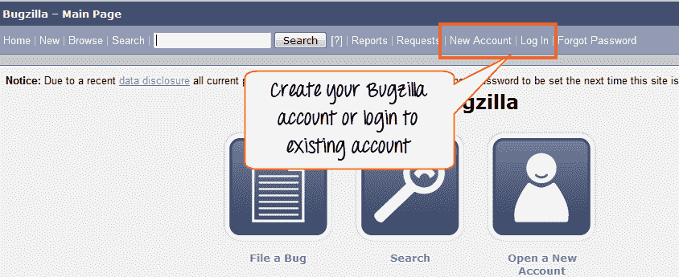

**步骤 2）**现在，输入您的个人详细信息以登录 Bugzilla

1.  用户身份
2.  密码
3.  然后单击**“登录”**

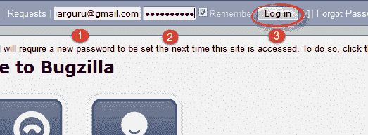

**步骤 3）**您已成功登录 Bugzilla 系统

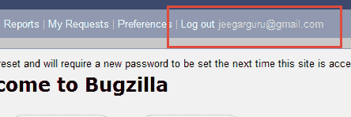

### 在 Bugzilla 中创建错误报告

**步骤 1）**要在 Bugzilla 中创建新错误，请访问 Bugzilla 的主页，然后从主菜单中单击**新增**标签

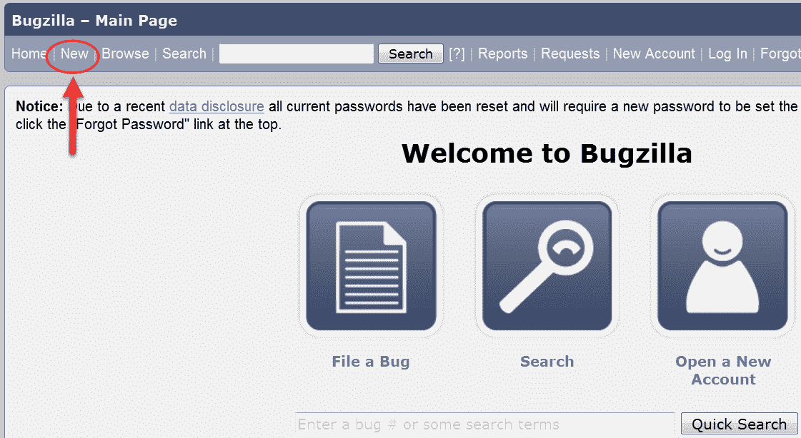

**步骤 2）**在下一个窗口中

1.  输入产品
2.  输入组件
3.  提供组件说明
4.  选择版本，
5.  选择严重性
6.  选择硬件
7.  选择操作系统
8.  输入摘要
9.  输入说明
10.  附加附件
11.  提交

**注意：**上述字段将根据您对 Bugzilla 的自定义而有所不同

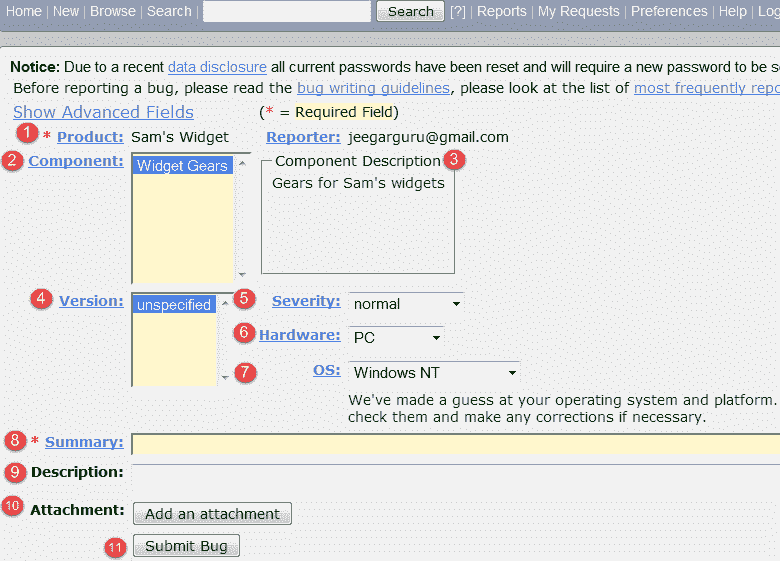

**注意：**必填字段标有*。

在我们的案例中

*   摘要
*   描述

是必须的

如果您不填写这些内容，则会显示如下屏幕

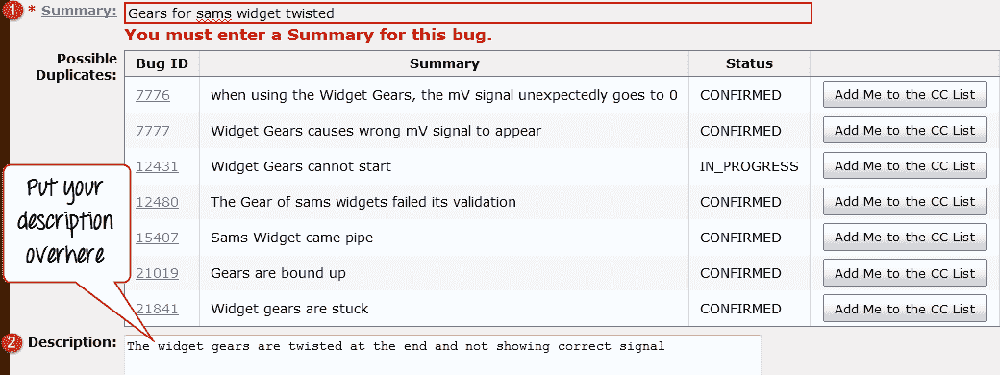

**步骤 4）已创建错误**已将 ID＃26320 分配给我们的错误。 您还可以将其他信息添加到已分配的错误，例如 URL，关键字，白板，标签等。此额外信息有助于提供有关已创建的错误的更多详细信息。

1.  大文字框
2.  网址
3.  白板
4.  关键词
5.  标签
6.  依赖于取决于
7.  积木
8.  Attachments 

    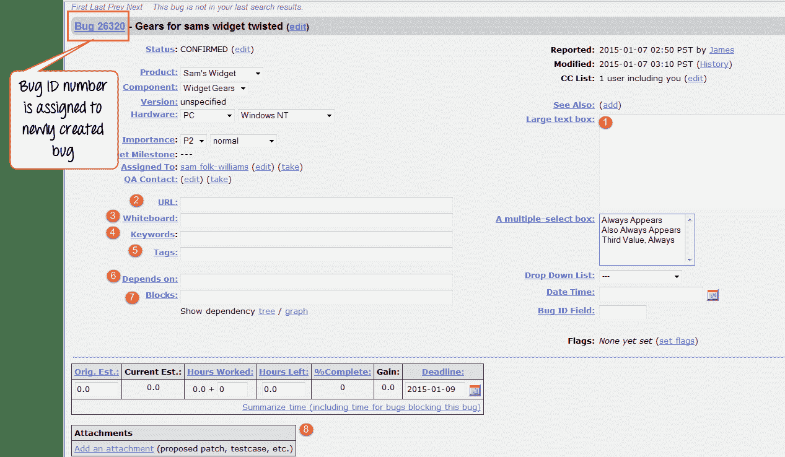

**步骤 5）**如果您向下滚动，则在同一窗口中。 您可以选择截止日期和错误状态。 **Bugzilla 的最后期限通常给出了在给定时间范围内解决该错误的时间限制。**

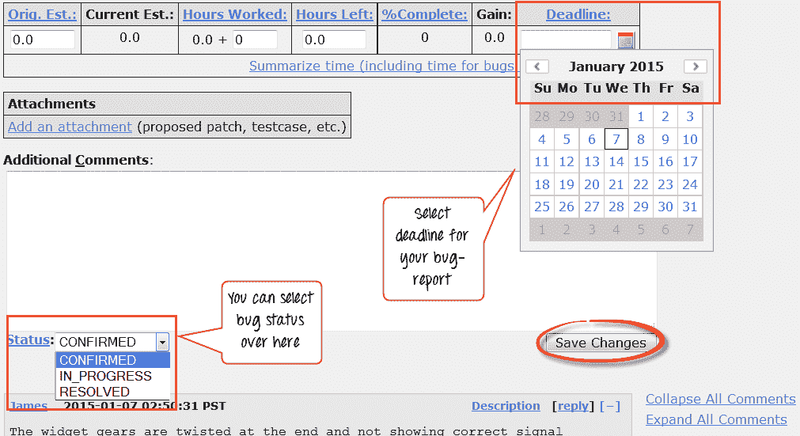

### 创建图形报告

图形报告是查看错误数据库当前状态的一种方法。 您可以通过 HTML 表或基于基于行/饼图/条形图的图形表来运行报告。 Bugzilla 中图形报告的背后思想是使用标准搜索界面定义一组错误，然后选择该错误的某些方面在水平和垂直轴上进行绘制。 您还可以通过选择“多页”选项来获得三维报告。

报告在许多方面都很有帮助，例如，如果您想知道哪个组件报告的错误错误数量最多。 为了在图中表示出来，您可以在 X 轴上选择严重性，在 Y 轴上选择组件，然后单击“生成报告”。 它将生成包含重要信息的报告。

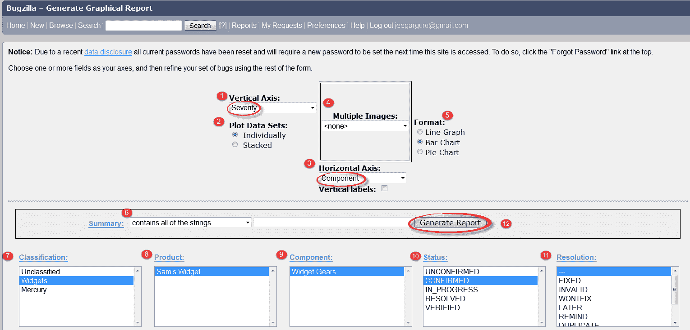

下图显示了组件**“小部件齿轮”中 Bug 严重性的条形图表示。** 在下图中，组件中最严重的错误或阻止程序是 88，而正常严重性的错误在顶部是 667 个。

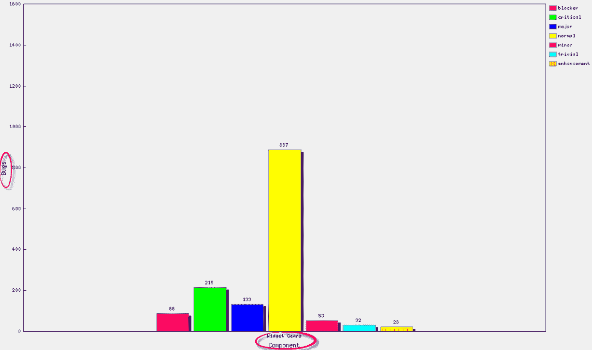

同样，我们还将看到**％完整 Vs 截止日期**的折线图

**步骤 1）**要以图形方式查看报告，

*   点击主菜单中的报告
*   单击给定选项中的图形报告

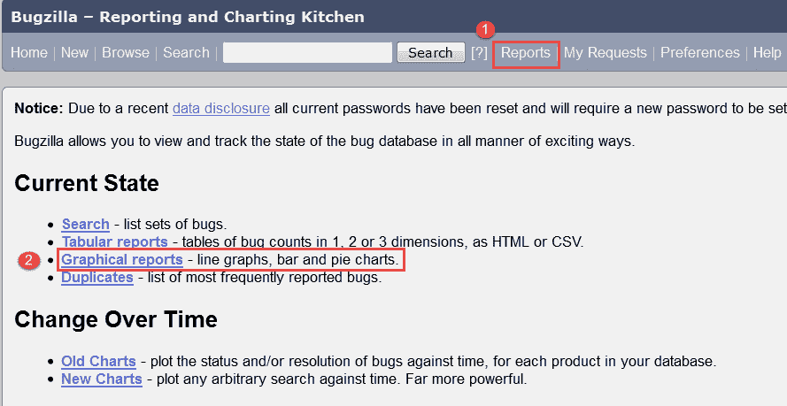

**第 2 步）**让我们创建一个**％完成时间与截止日期**的图表

在垂直轴上，我们选择**完成百分比**，在水平轴上，我们选择**截止日期**。 这将给出完成工作量相对于设定期限的图表。

现在，设置各种选项以图形方式显示报告

1.  垂直轴
2.  横轴
3.  多张图片
4.  格式-折线图，条形图或饼图
5.  绘图数据集
6.  分类您的错误
7.  分类您的产品
8.  分类您的组件
9.  分类错误状态
10.  选择分辨率
11.  点击生成报告

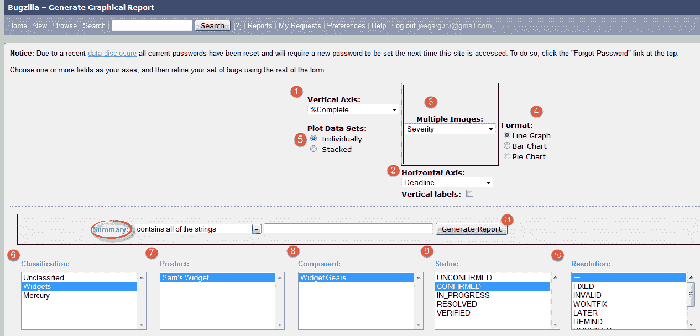

图的图像将看起来像这样

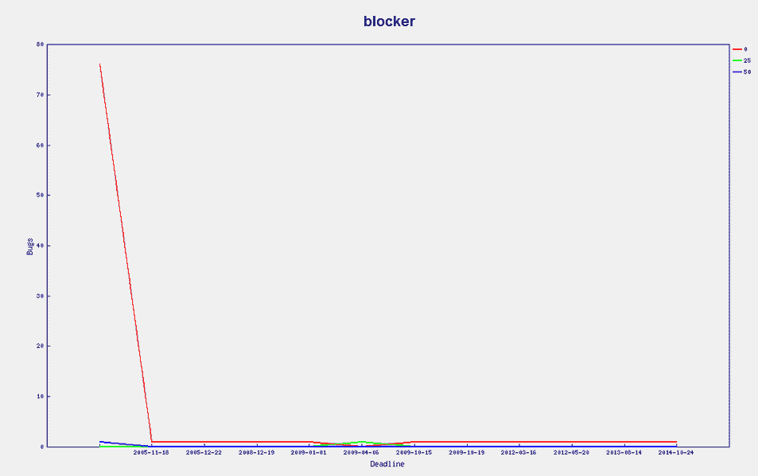

### 浏览功能

**步骤 1）**要使用浏览功能查找错误，请从主菜单中单击**浏览**按钮。

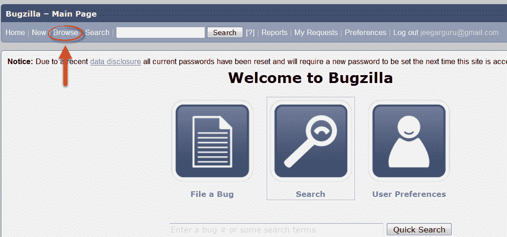

**步骤 2）**单击浏览按钮后，将打开一个窗口，显示**“选择要浏览的产品类别”** ，如下所示，我们将根据类别浏览错误。

*   单击浏览按钮后
*   选择产品“ Sam's Widget”，这样您就在其中创建了一个错误

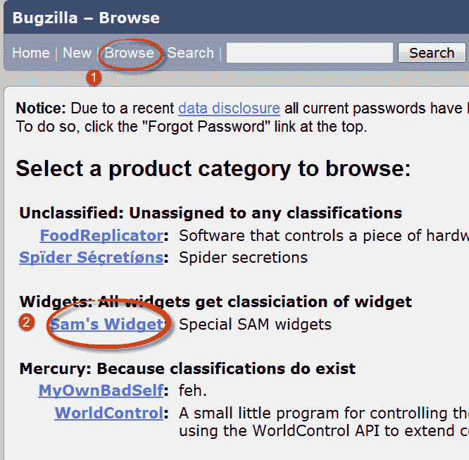

**步骤 3）**打开另一个窗口，单击组件**“小部件”** 。 Bugzilla 组件是产品的小节。 例如，如果我们的产品是 **SAM'S WIDGET** ，其组件是 **WIDGET GEARS** 。

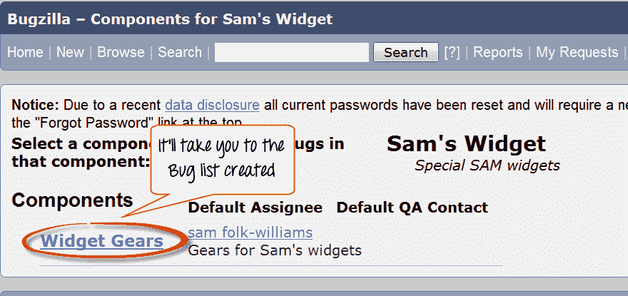

**步骤 4）**当您单击组件时，它将打开另一个窗口。 在特定类别下创建的所有错误将在此处列出。 从该错误列表中，选择您的错误编号，以查看有关该错误的更多详细信息。

它将打开另一个窗口，您可以在其中详细了解有关错误的信息。 在同一窗口中，您还可以更改受让人，质量检查联系人或抄送列表。

### 如何在 Bugzilla 中使用简单搜索选项

Bugzilla 提供了两种搜索错误的方法，它们是**简单搜索**和**高级搜索**方法。

**步骤 1）**我们将首先学习**“简单搜索”** 方法。 从主菜单中单击搜索按钮，然后按照以下步骤

1.  点击“简单搜索”按钮
2.  选择错误的状态–如果您正在寻找处于“打开”状态的错误，并选择“关闭”以获取处于关闭状态的错误，请选择“打开”
3.  选择类别和组件，还可以放置与错误相关的关键字
4.  点击搜索

**步骤 2）**在这里我们将搜索选项**打开**和**关闭**状态，首先我们选择了 bug 的关闭状态并单击搜索按钮。

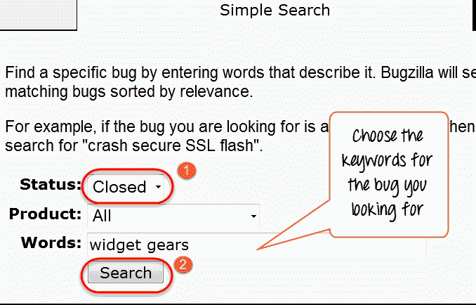

对于关闭状态，它捕获了 12 个错误。

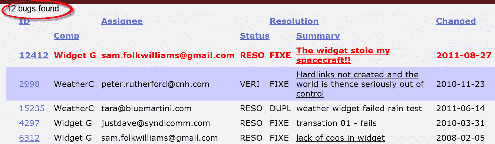

**步骤 3）**同样，我们也搜索了“打开”状态，并获取了 37 个与查询相关的错误。

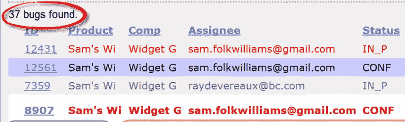

另外，在屏幕底部，您可以使用各种选项，例如，如何查看错误- **XML 格式，长格式或仅是时间摘要**。 除此之外，您还可以使用其他选项，例如**发送邮件给错误受让人，一次更改多个错误或更改屏幕的列，**等。

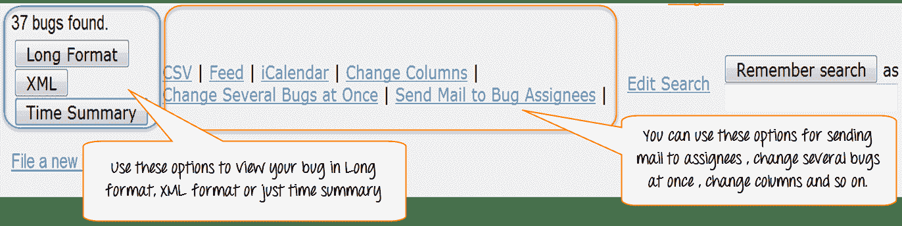

在下一步中，我们将演示屏幕的此功能**更改列之一，通过该功能，我们将学习如何在现有列中添加或删除列。**

### 如何在默认搜索屏幕上添加或删除列

**步骤 1）**单击**更改列**，如上图所示。 它将打开一个新窗口，您必须在其中执行以下步骤。

*   从要显示在主屏幕中的列中选择任何给定的选项-在这里我们选择了**完成百分比**
*   单击**箭头按钮**，它将完成百分比列从à **可用列**移至**选定列**

这些步骤将从左到右移动选定的列。

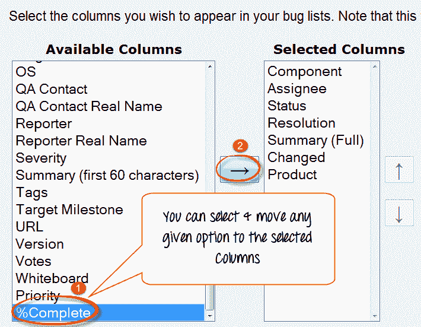

完成百分比从左向右移动，如下所示，一旦我们单击**更改列**，它将显示在主屏幕中

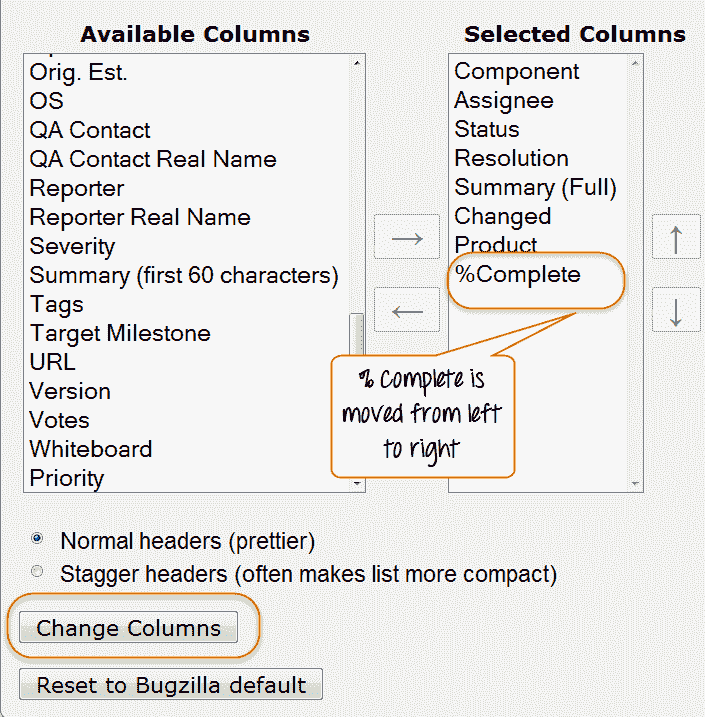

**之前-**使用“更改列”选项之前的搜索结果屏幕-

*   如下所示，搜索屏幕结果中没有％完成列

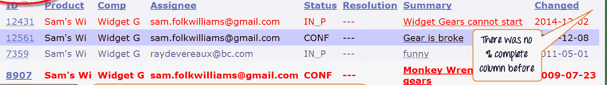

**之后-**使用“更改列”选项后的搜索结果屏幕

*   您可以在主屏幕的现有列中看到**完成百分比**列添加到最右端，而不是以前的列。

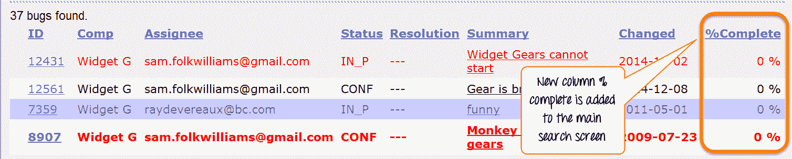

**注意：**同样，您可以删除或添加所需的任何列。

### 如何在 Bugzilla 中使用高级搜索

**步骤 1）**简单搜索后，我们将进入**高级搜索**选项，您必须遵循以下步骤。

1.  点击高级搜索选项
2.  选择摘要选项，如何搜索
3.  输入您的错误的关键字-例如**扭曲的小工具齿轮**
4.  选择分类下您的错误的类别，在这里我们选择了小部件
5.  选择创建 Bug 的产品-Sam's Widget
6.  组件-小部件齿轮
7.  状态-已确认
8.  解析度

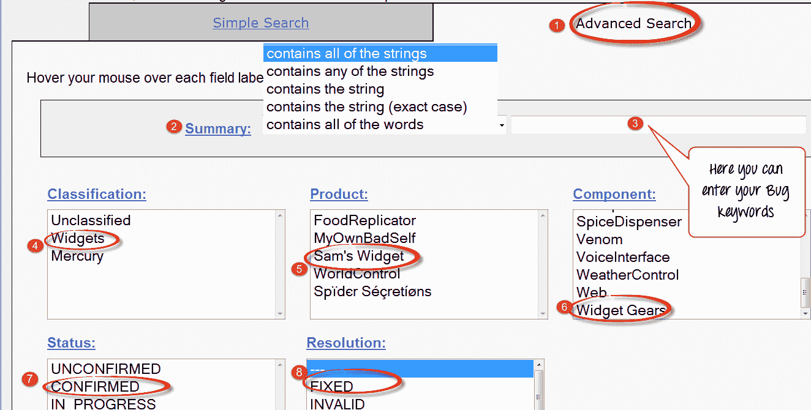

**步骤 2）**选择所有选项后，单击搜索按钮。 它将检测您创建的错误

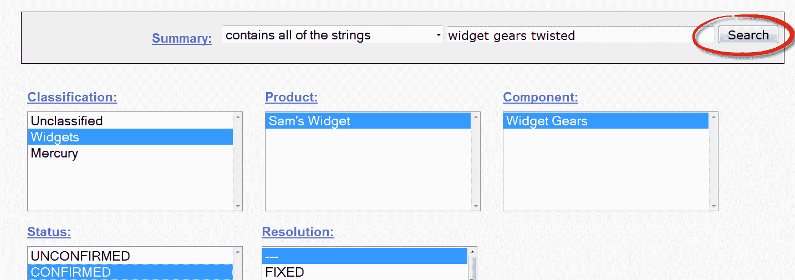

高级搜索将找到您的错误，并且它将出现在这样的屏幕上

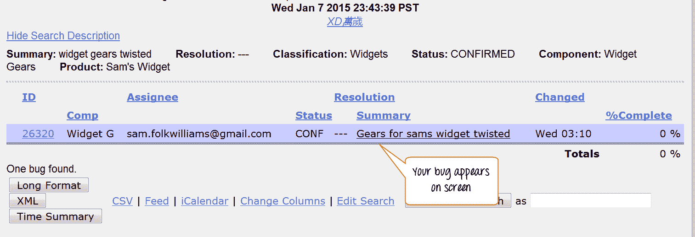

### 如何在 BugZilla 中使用首选项

Bugzilla 中的首选项用于根据我们的要求来自定义 Bugzilla 的默认设置。 主要有五个首选项

*   一般首选项
*   电子邮件首选项
*   保存的搜索
*   帐户信息
*   权限

**常规首选项**

对于**常规首选项**，您可以使用多种选项，例如**更改 Bugzilla 常规外观，附加注释框的位置，自动将我添加到抄送，**等。在这里，我们将介绍如何更改 Bugzilla 的一般外观。

您可以做很多更改，这些更改是不言自明的，您可以根据需要选择选项。

**步骤 1）**

*   设置 Bugzilla 的背景外观
*   转到 Bugzilla 一般偏好设置（皮肤）
*   选择您要作为更改查看的选项并提交更改（“黄昏à经典”）
*   提交更改后，窗口上将显示一条消息，指出更改已保存。

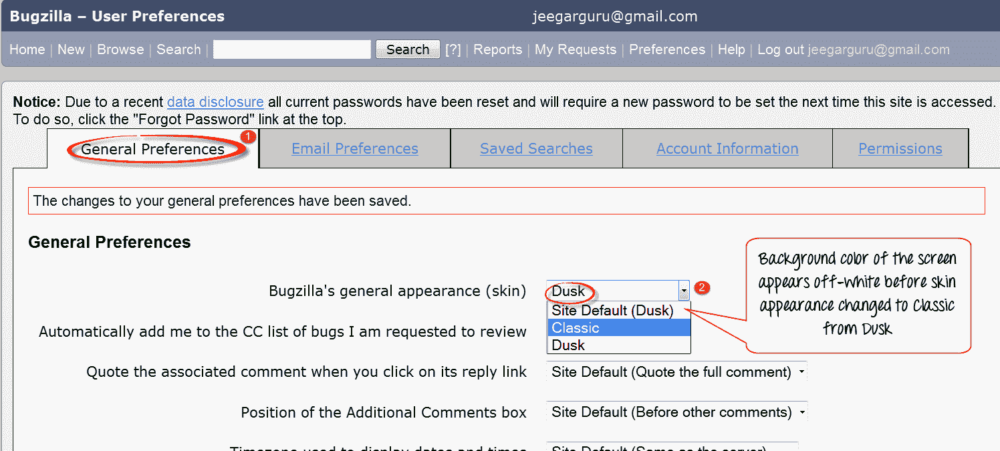

将皮肤首选项从“黄昏”更改为“经典”后，屏幕的背景颜色显示为白色

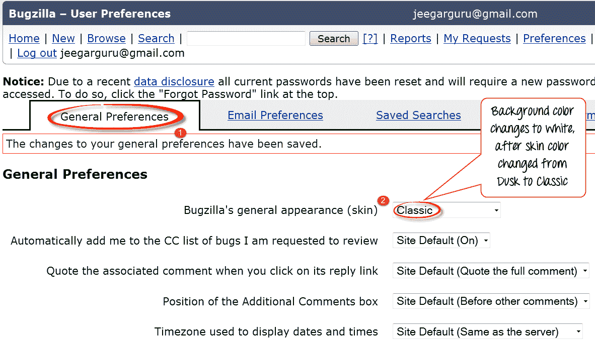

同样，对于其他默认设置，也可以进行更改。

**电子邮件首选项**

电子邮件首选项使您可以决定如何接收消息以及从谁那里接收消息。

**步骤 1）**设置电子邮件首选项

1.  点击电子邮件服务
2.  启用或禁用邮件，以避免收到有关错误更改的通知
3.  当有人要求设置标志或有人要求设置标志时接收邮件
4.  您想在何时何地接收邮件以及在什么情况下。 最后标记您的选项后，提交更改。

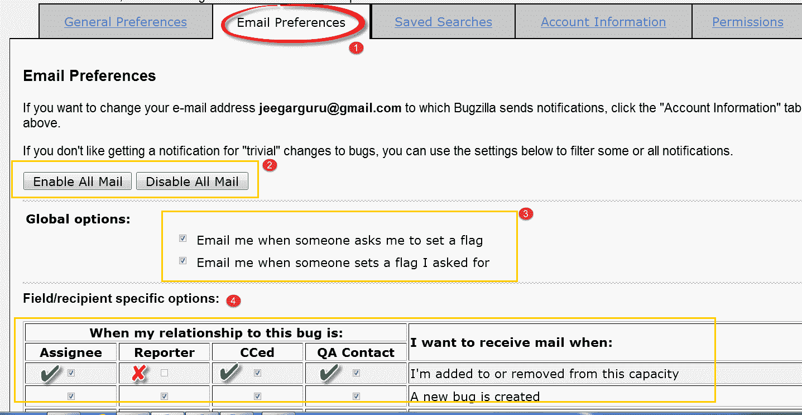

**保存的搜索首选项**

保存的搜索首选项使您可以自由决定是否共享错误。

**步骤 1）**单击保存的搜索，它将打开带有**编辑错误，不共享，可以确认等选项的窗口。**根据需要选择选项。

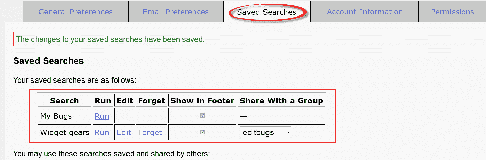

**步骤 2）**我们可以从**“保存的搜索”中运行错误。**

*   在首选项下转到“保存的搜索”
*   点击**“运行”** 按钮

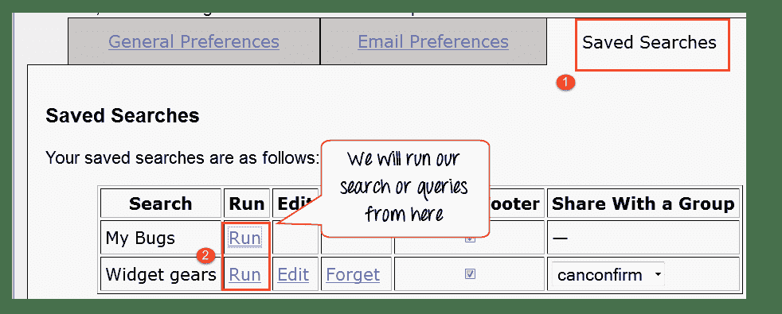

只要您从“保存的搜索”中运行搜索，就会打开您的错误，如下所示

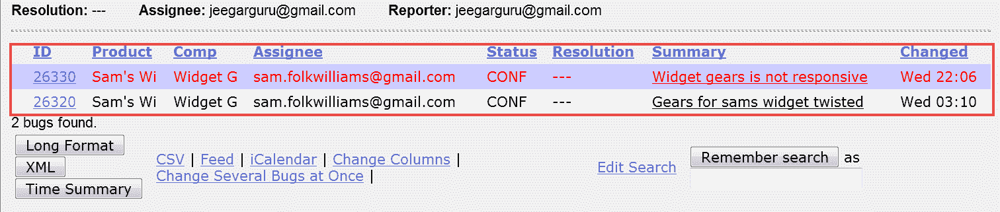

**步骤 3）**在同一窗口中，我们还可以通过标记或取消标记用户复选框来选择要与之共享搜索的特定用户

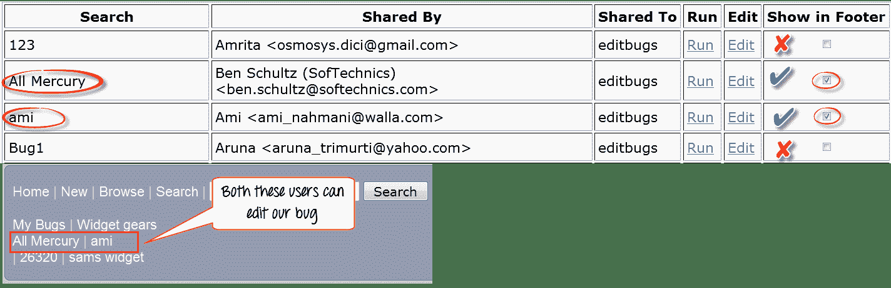

BugZilla 就这些了！