# JIRA 教程：初学者完整指南

> 原文： [https://www.guru99.com/jira-tutorial-a-complete-guide-for-beginners.html](https://www.guru99.com/jira-tutorial-a-complete-guide-for-beginners.html)

### 什么是 JIRA？

JIRA 是由澳大利亚 Atlassian 公司开发的工具。 它用于**错误跟踪，问题跟踪，**和**项目管理**。 名称“ JIRA”实际上是从日语单词“ Gojira”继承而来的，意思是“哥斯拉”。

此工具的基本用途是跟踪与您的软件和[移动](/mobile-testing.html)应用相关的问题和错误。 它也用于项目管理。 JIRA 仪表板包含许多有用的功能，使处理问题变得容易。 下面列出了一些关键功能。 让我们通过此培训课程学习 JIRA [缺陷](/defect-management-process.html)和项目跟踪软件。

在本教程中，您将学习-

1.  [JIRA 计划](#1)
2.  [JIRA 问题和问题类型](#2)

*   [什么是 JIRA 问题？](#21)
*   [问题类型](#22)

*   [JIRA 组件](#3)*   [JIRA 屏幕](#4)*   [问题属性](#5)*   [发行安全方案](#6)

*   [系统管理](#61)

*   [如何在 JIRA 中创建问题](#7)

*   [子任务](#71)
*   [工作流程](#72)
*   JIRA 中的[插件](#73)
*   [JIRA Agile](#74)
*   [在敏捷](#75)中创建问题
*   [如何在敏捷](#76)中创建史诗
*   [在 JIRA 中使用克隆和链接](#77)

*   [JIRA 中的报告](#8)

*   [看板董事会和管理问题](#81)
*   [JIRA Scrum 与 JIRA 看板](#82)

## JIRA 计划

在 JIRA 方案中，所有内容都可以配置，并且包括

*   **工作流程**
*   **问题类型**
*   **自定义字段**
*   **屏幕**
*   **字段配置**
*   **通知**
*   **权限**

## JIRA 问题和问题类型

本节将指导您完成 JIRA Issue 及其类型。

### 什么是 JIRA 问题？

JIRA 问题将跟踪作为项目基础的错误或问题。 导入项目后，就可以创建问题。

在问题下，您会发现其他有用的功能，例如

*   发行类型
*   工作流程
*   屏风
*   领域
*   问题属性

让我们详细看看 JIRA Issue

### 问题类型

问题类型显示可以通过 JIRA 创建和跟踪的所有类型的项目。 JIRA 问题按屏幕快照中所示的各种形式分类，例如新功能，子任务，错误等。

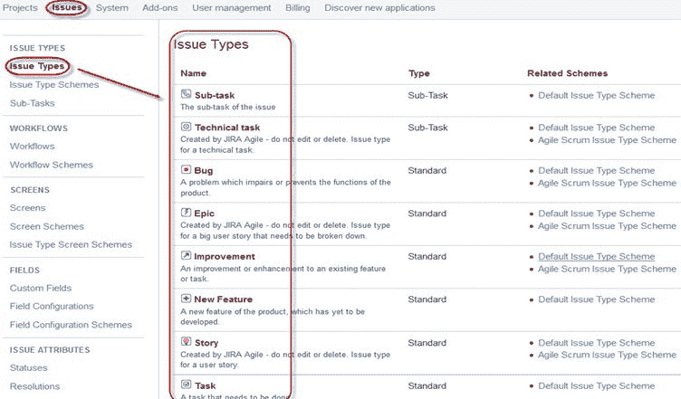

JIRA 中有两种发行类型方案，一种是

*   **默认问题类型方案：**在默认问题类型方案中，所有新创建的问题将自动添加到该方案中
*   **敏捷 Scrum 问题类型方案：**与敏捷 Scrum 相关的问题和项目将使用此方案

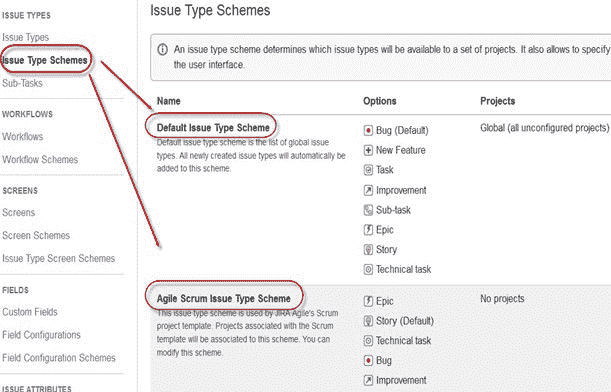

除了这两个问题类型方案，您还可以根据需要手动添加方案，例如我们创建了 **IT &支持**方案，为此我们将**拖放** 从**可用的发行类型**到**的发行类型，当前方案**的发行类型，如以下屏幕快照所示

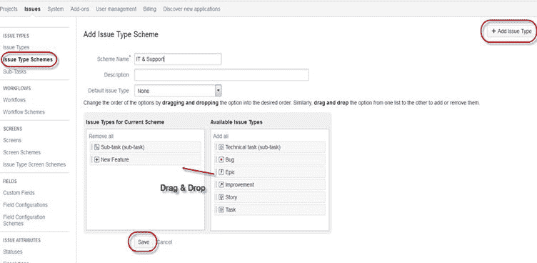

## JIRA 组件

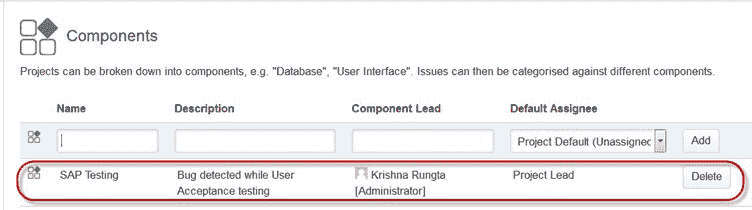

组件是项目的子部分。 它们用于将项目中的问题分为较小的部分。 组件为项目添加了一些结构，将其分解为功能，团队，模块，子项目等。 使用组件，您可以生成报告，收集统计信息并将其显示在仪表板上，等等。

要添加新组件，如以上屏幕所示，您可以添加**名称，说明，组件负责人和默认受让人。**

## JIRA 屏幕

当在 JIRA 中创建问题时，它将被排列并表示在不同的字段中，JIRA 中此字段的显示称为屏幕。 该字段可以通过工作流进行转换和编辑。 对于每个问题，您都可以按照屏幕截图所示分配屏幕类型。 要将发布操作与屏幕添加或关联，您必须进入主菜单，然后单击**问题**，然后单击屏幕**方案**，然后单击**“将发布操作相关联 屏幕**，然后根据需要添加屏幕。

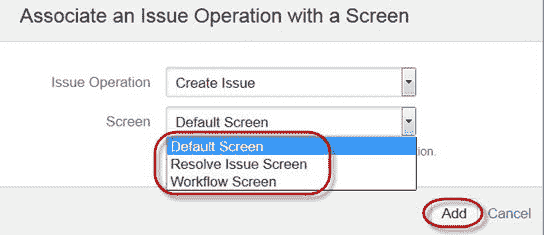

## 问题属性

问题属性包括

*   状态
*   决议案
*   优先事项

状态：不同的状态用于指示项目的进度，例如**待执行，进行中，打开，关闭，重新打开和解决。** 同样，您有解决方案和优先级，在解决方案中，它再次告知问题的进度，例如**已修复，无法修复，重复，不完整，无法复制，完成**，您还可以设置 问题是否是**严重，重大，次要，阻止者和琐碎问题。**

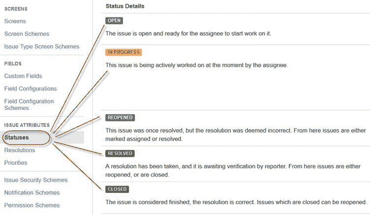

## 发行安全方案

JIRA 中的此功能使您可以控制谁可以查看问题。 它由多个安全级别组成，这些安全级别可以分配有用户或组。 您可以在创建或编辑问题时指定问题的安全级别。

同样，有一个**默认权限方案**，任何创建的新项目都将分配给该方案。 权限方案允许您创建一组权限，并将此组权限应用于任何项目。

### 系统管理

JIRA 管理员为用户提供的一些有用功能包括：

*   **Audit Log**

    在“审核日志”下，您可以查看有关所创建问题的所有详细信息以及问题中所做的更改。

*   **Issue Linking**

    这将显示您的问题是否与项目中已经存在或已创建的任何其他问题链接，也可以从面板本身取消激活“问题链接”

*   **Mail in JIRA**

    在 admin 中使用 Mail system，您可以将问题邮寄到 POP 或 IMAP 邮件服务器上的帐户，也可以将邮件写入由外部邮件服务生成的文件系统中。

*   **Events**

    事件描述了状态，默认模板以及事件的通知方案和工作流过渡后功能关联。 这些事件分为系统事件（JIRA 定义的事件）和自定义事件（用户定义的事件）两种。

*   **Watch list**

    JIRA 允许您观看特定的问题，它告诉您有关该问题的任何更新的通知。 要观看问题，请在问题窗口中单击“监视”一词，如果要查看谁在监视您的问题，则必须单击括号中的数字。

*   **Issue Collectors**

    通过 JIRA 问题的形式，问题收集器使您可以在任何网站上收集反馈。 在管理中，如果单击“问题收集器”，则会打开一个选项，询问**添加问题收集器。** 配置了问题收集器的外观后，请将生成的 [JavaScript](/interactive-javascript-tutorials.html) 嵌入任何网站中以获取反馈。

*   **Development Tools**

    您也可以使用此管理功能将软件开发工具连接到 JIRA。 您必须输入应用程序的 URL 才能连接 JIRA。

## 如何在 JIRA 中创建问题

输入用户名和密码后，JIRA 仪表板将打开。 在 JIRA 仪表板下，您会找到**项目，**选项，单击后会打开一个窗口，其中列出了**简单问题跟踪，项目管理，敏捷看板，Jira Classic** 和 如下图所示。

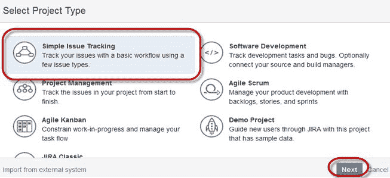

当您单击选项**简单问题跟踪时，**将打开另一个窗口，您可以在其中提及有关该问题的所有详细信息，并将该问题分配给负责人。

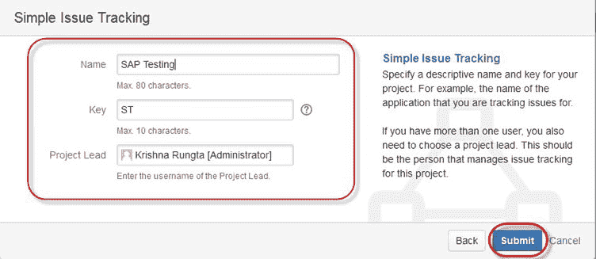

当您单击“提交”按钮时，将打开一个窗口，您可以在其中执行诸如创建问题，分配问题，检查已解决，进行中或已关闭等问题状态的工作列表。

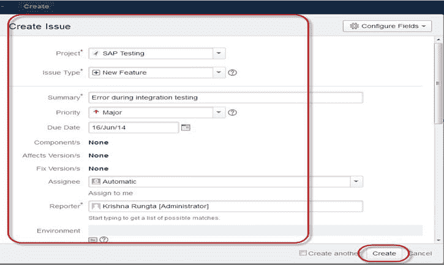

创建问题后，屏幕上将显示一个弹出窗口，说明您的问题已成功创建，如以下屏幕截图所示：

现在，如果您要编辑问题或要将问题导出到 XML 或 Word 文档，则可以将鼠标悬停在主面板上，然后单击**问题**。 在**问题**选项下，单击**搜索问题**，这将打开一个窗口，您可以从中找到问题并执行多种功能。

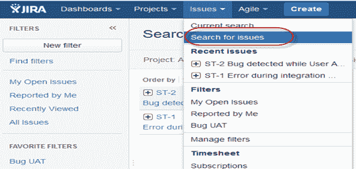

当在**问题下选择**“搜索问题”** 时，**将会出现一个窗口，如屏幕截图所示

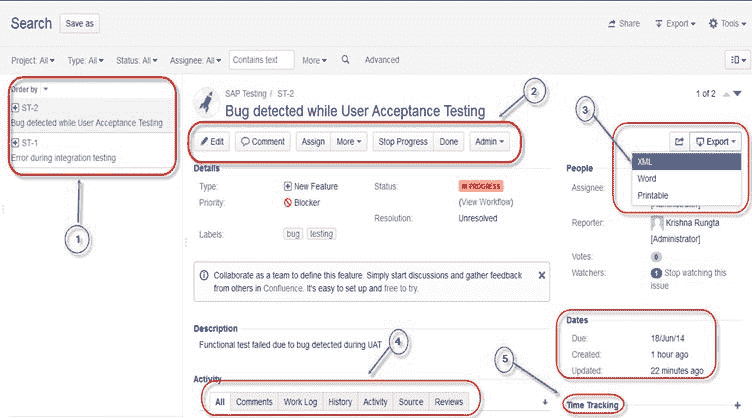

1.  **搜索问题**选项将带您到一个窗口，您可以在其中看到由您创建的问题，就像这里我们有问题 ST1 和 ST2
2.  在此屏幕快照中，您可以看到问题**“在用户接受测试时检测到错误”** 以及与此有关的所有详细信息。 在这里，您可以执行多个任务，例如**可以停止问题的进度，编辑问题，对问题进行评论，分配问题**等
3.  甚至您也可以将问题详细信息导出到 XML 或 Word 文档。
4.  此外，您可以查看有关该问题的活动，该问题的审阅，工作日志，该问题的历史记录等。
5.  在时间跟踪选项下，您甚至可以查看解决问题的估计时间

在同一窗口中，您可以为该问题设置一个过滤器，并将其保存在**最喜欢的过滤器**下，因此，当您要搜索或查看特定问题时，可以使用该过滤器进行查找。

要查看问题的摘要，可以单击选项**摘要，**，这将打开一个窗口，该窗口将在此图表上显示项目的所有详细信息和进度。 在摘要窗口的右侧，有一个**活动流**，其中提供有关问题的详细信息以及受让人对问题的评论。

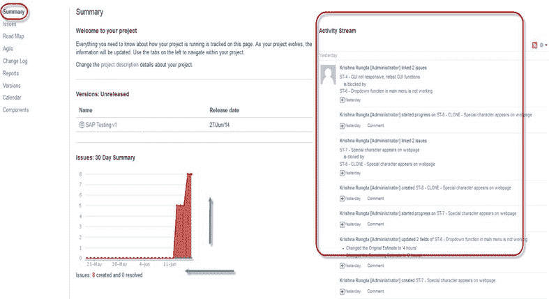

### 子任务

子任务问题对于将父问题分解为多个可以单独分配和跟踪的较小任务很有用。 它可以更全面地解决问题，并将任务分解为较小的任务。

**如何创建子任务**

子任务可以通过两种方式创建

*   在父问题下创建子任务
*   将问题创建到子任务中

要在 JIRA 中创建子任务，您必须选择要分配子任务的问题。 在问题窗口下，单击**分配更多**选项，然后单击**创建子任务**，如下面的屏幕快照所示。 您也可以在同一选项卡下选择**转换为子任务**，以将父发行转换为子任务。

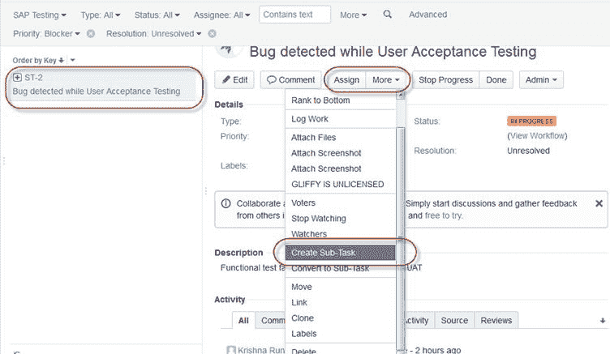

单击**创建子任务**后，将弹出一个窗口以添加子任务问题。 填写有关子任务的详细信息，然后单击**创建**，如以下屏幕截图所示，，这将为父发行创建子任务。

[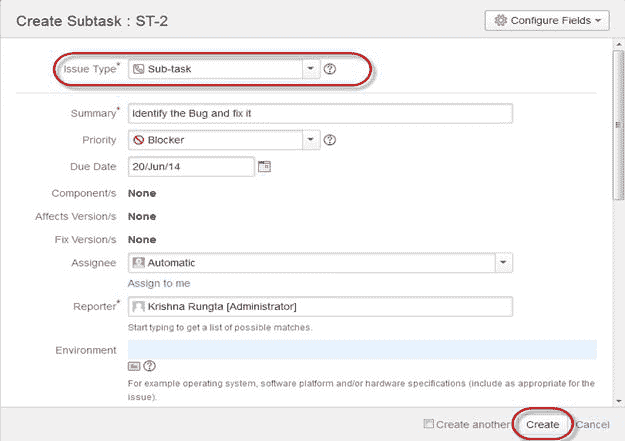 ](/images/jira/111014_0555_JIRA15.jpg) 

它将在父问题下创建一个子任务，并在问题类型页面上显示有关何时完成任务的详细信息，如下面的屏幕快照所示。 如果要添加更多子任务，可以单击子任务面板角上的加号（+）。 同样，如果您想记下当前任务所花费的时间，请单击（+）加号并在时间跟踪的角落添加符号，然后将详细信息放在日志表中。

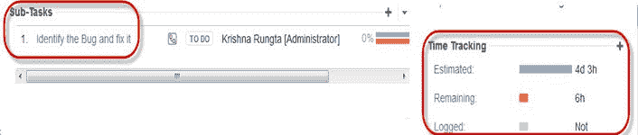

创建子任务时要记住的一些重要点

*   您可以在“问题”下根据需要拥有任意数量的子任务
*   您不能有子任务的子任务
*   在父项下创建子任务后，父项将无法转换为子任务
*   但是，子任务可以转换为父任务
*   您可以处理子任务，而不必离开父级问题

### 工作流程

JIRA 工作流是问题在其生命周期中经历的一组状态和过渡。 问题创建后，JIRA 工作流程包括五个主要阶段。

*   公开发行
*   解决的问题
*   进展中的问题
*   重新发行
*   结束期

 ](/images/jira/111014_0555_JIRA17.png)   [ 

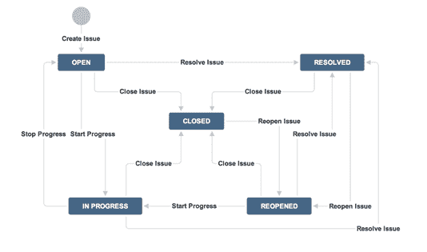

JIRA 中的工作流程由**状态，受让人，解决方案，条件，验证器，后功能和属性组成**

*   **状态：**它代表工作流程中问题的位置
*   **过渡：**过渡是状态之间的桥梁，特定问题从一种状态转移到另一种状态的方式
*   **受让人：**受让人指定任何给定问题的责任方，并确定任务的执行方式
*   **解决方案：**它解释了为什么问题从打开状态转换为关闭状态
*   **条件：**条件控制谁可以执行过渡
*   **验证程序：**它可以确保在给定问题状态的情况下可以进行过渡
*   **属性：** JIRA 识别过渡时的某些属性

您可以从窗口本身分配问题的状态，当单击 **IN Progress** status 的复选框时，如下面的屏幕快照所示，它将在问题面板中以黄色突出显示。

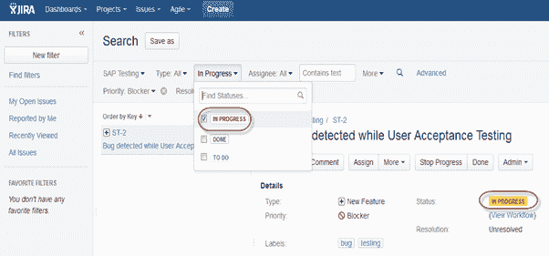

对于我们创建的问题，JIRA 将提供一个工作流，以映射项目的进度。 如屏幕截图所示，无论我们在“问题”面板中设置的状态如何，它都会反映在“工作流”图表中。在这里，我们已将问题状态设置为“进行中”，并且在工作流中更新了相同状态，并以黄色突出显示。 工作流可以快速概述正在处理的工作。

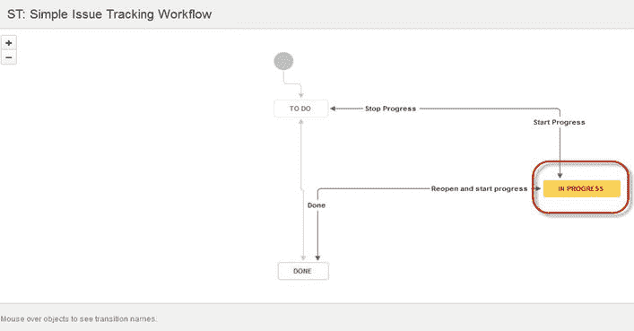

### JIRA 中的插件

JIRA 有一些插件可以使它们更有效地工作，其中一些插件是 Zendesk，Salesforce，GitHub，Gitbucket 等。 其中一些功能使支持团队可以直接向 JIRA 报告问题，创建具有功能齐全的问题和测试管理支持的无限私人存储库等。

### JIRA Agile

开发团队通常使用敏捷或 Scrum 方法，他们遵循其产品即将推出的版本的计划功能路线图。 敏捷遵循与其他 JIRA 方法相同的路线图来跟踪其问题。**完成-> 进行中-> 完成，** 屏幕截图如下，我们在**中有一个问题要做**，在**中有第二个问题正在进行中。** 解决了**处理中的**中的问题后，它将移至**已完成**状态，并且以相同的方式执行**中的问题将**移至 下一阶段**正在进行中。**

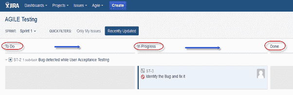

### 在敏捷中创建问题

要创建敏捷问题，请转到**敏捷**标签下的主菜单，单击**“使用入门”** ，当您单击它时，它将要求为 **Scrum** 或**看板**。 您可以根据需要选择选项，这里我们选择了 Scrum 方法。

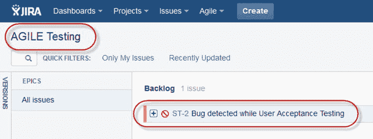

### 如何在敏捷中创建史诗

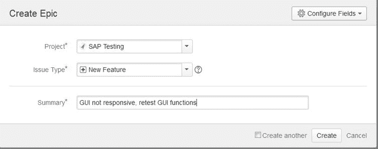

在 JIRA Agile 中，史诗只是一种问题类型。 这部史诗作品占据了大量作品。 它是一个大型用户故事，可以分解为许多小故事。 要完成一部史诗，可能需要数次冲刺。 您既可以敏捷地创建新的史诗，也可以使用在普通 JIRA 板上创建的问题。 同样，您也可以为敏捷 Scrum 创建故事。

敏捷中的**计划模式：**

计划模式显示为项目创建的所有用户素材。 您可以使用左侧菜单来确定需要显示问题的基础。 在右侧菜单上单击问题时，您可以创建子任务，日志工作等。

敏捷中的**工作模式**

它将显示活动的冲刺信息。 所有问题或用户故事将显示为三个类别，如**要做的屏幕截图所示，“进行中”和“完成”** 将显示项目或问题的进度。

### 在 JIRA 中使用克隆和链接

在 JIRA 中，您还可以克隆问题，克隆问题的一个优点是，不同的团队可以分别处理该问题并快速解决该问题。

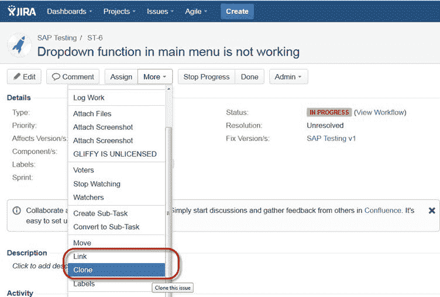

另一个有用的功能是 JIRA **链接**。问题链接使您可以在相同或不同 JIRA 服务器上的两个现有问题之间创建关联。 如屏幕快照所示，我们将当前问题**“ ST-6 下拉菜单不起作用”** 与另一个问题**“ ST-4 GUI 没有响应-重新测试 GUI 功能”链接在一起[** 。

[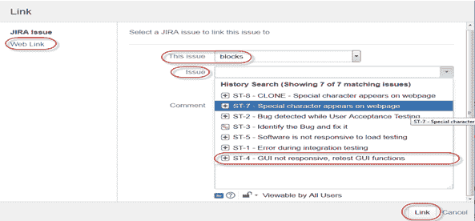 ](/images/jira/111014_0555_JIRA28.png) 

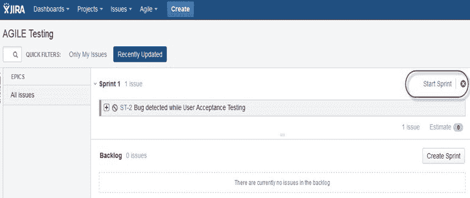

像这里一样，我们将 sprint 设置为 1 天，它将在特定时间段内运行 sprint，如下面的屏幕快照所示。 如果您正在使用 Scrum，并且想优先考虑问题或对问题进行排名，则只需将问题拖放到**积压中即可。**

除此之外，您还可以执行多个任务，例如，如果单击窗口的右上角，将弹出一个功能列表，您可以根据需要使用它。

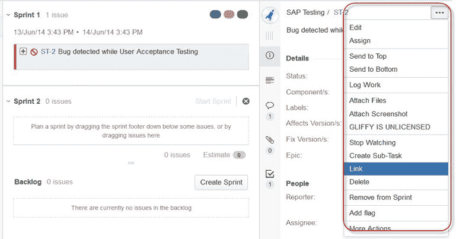

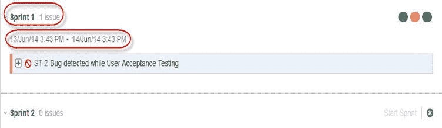

## JIRA 中的报告

为了跟踪敏捷的进度，**燃尽图**显示了在 sprint 中要完成的实际和估计的工作量。 一个典型的燃尽图将看起来像这样，其中红线表示剩余的实际任务，而蓝线表示在 Scrum 周期内剩余的理想任务。

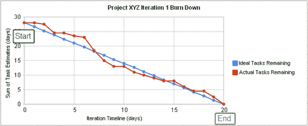

除了 Burn down 图表外，JIRA 中还提供其他选项，例如 **Sprint 报告，Epic 报告，版本报告，Velocity 图表，控制图，累积流程图**。 您还可以使用其他图表选项来表示项目进度。

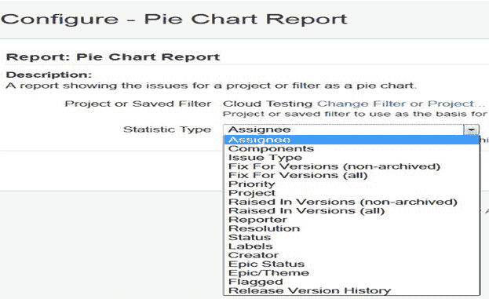

像上面的屏幕截图中的此处一样，我们为问题的优先级选择了一个饼图。 它将生成一个饼图，以百分比形式表示整个项目的优先级和严重性，如下所示。 您可以从不同的角度查看饼图，例如**受让人，组件，问题类型，优先级，解决方案和状态**等。

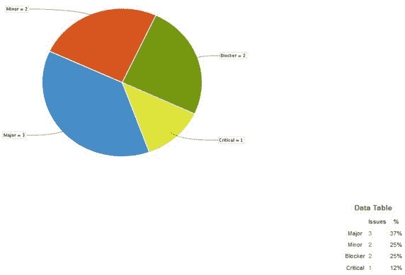

您还可以配置如何查看 Scrum 板。 Scrum 板提供了各种选项，您可以通过这些选项来更改板的外观。 您可以使用 Scrum 配置的各种功能包括“列”，“泳道”，“快速过滤器”，“卡片颜色”等等。 在这里，我们选择了列管理，并选择了“问题计数”选项，它将显示正在进行中，要做或完成的问题的总数。 在列管理中，我们可以根据需要添加其他列，同样，您可以在板上配置不同的功能。

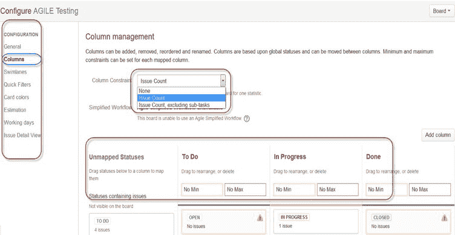

**过滤器**

您还可以设置默认过滤器以外的其他过滤器来过滤问题。 您可以使用的过滤器是**日期，成分，优先级，分辨率等。**

### 看板董事会和管理问题

像敏捷 Scrum 板一样，我们也可以创建看板板，在这里我们创建了一个项目名称 Cloud Testing。 看板董事会对于管理和约束正在进行的工作的团队很有用。 看板在工作模式下可见，但在计划模式下不可见。

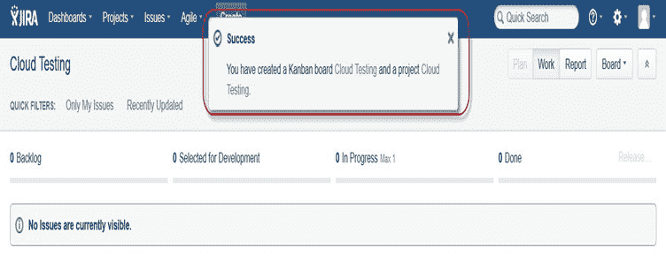

在这里，我们在看板中创建了一个问题**“在负载测试时检测到错误”** 和**“检查与云服务器相关的问题”** ，如下面的屏幕快照所示，其状态也显示为 用红色突出显示。

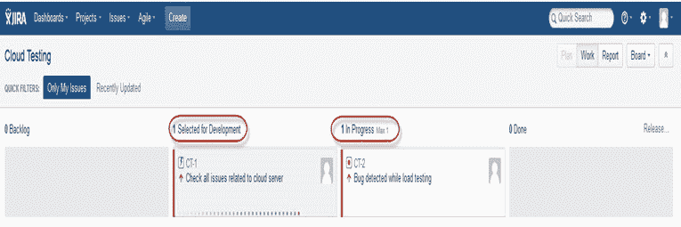

看板被认为是错误修复和维护发布的最佳方法，在该方法中，对传入的任务进行优先级排序，然后进行相应的工作。 很少有措施可以使看板更加高效。

1.  可视化您的工作流程
2.  限制正在进行的工作
3.  处理问题
4.  测量周期时间

### JIRA Scrum 与 JIRA 看板

| Scrum | Kanban |
| **报告**燃尽图：该图显示在 sprint 仍处于启用状态时的所有更改和范围更改，其他图表包括 Sprint 报告，Velocity 图表，Epic 报告等。 | **Reports**控制图：它允许您测量问题的周期时间，显示完成问题所花费的平均时间和实际时间 |
| **敏捷板**它使团队可以查看 sprint 的进度。 这是工作模式，您可以在其中看到电路板本身分解为不同的状态。 | **约束**团队可以决定是增加还是减少每种状态下应显示的问题数量。 |
| **待办事项**在这里，团队将计划冲刺并估算每个冲刺中的故事 | **工作流程**您可以将列映射到工作流的状态。 只需添加或删除列，即可在需要时更改工作流程。 |