# MANTIS Bug Tracker 入门教程

> 原文： [https://www.guru99.com/mantis-bug-tracker-tutorial.html](https://www.guru99.com/mantis-bug-tracker-tutorial.html)

## 什么是螳螂错误追踪器？

**MANTIS** 是一个开源的错误跟踪软件，可用于跟踪各种软件项目的软件缺陷。 您可以轻松下载并安装 Mantis 以供使用。 Mantisbt 现在还提供了该软件的托管版本。 您可以轻松地自定义 Mantis 以映射您的软件开发工作流程。

螳螂 Bt 的一些突出特征是

*   电子邮件通知：它将更新，评论，解决方案的电子邮件发送给相关的利益相关者。
*   访问控制：您可以在项目级别控制用户访问
*   自定义：您可以根据需要轻松自定义螳螂。
*   移动支持：螳螂支持 iPhone，Android 和 Windows Phone 平台。
*   插件：一个不断扩展的插件库，用于向 Mantis Issue Tracker 添加自定义功能。

在本教程中，您将学习-

*   [如何举报问题](#1)
*   [如何添加项目](#2)
*   [如何创建用户](#3)
*   [如何创建自定义字段](#4)

### 如何报告问题

无需下载螳螂，您可以使用在线[演示](https://www.mantisbt.org/demo.php)

**步骤 1）**登录到螳螂

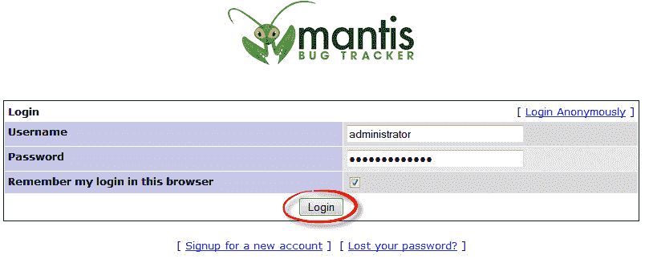

**步骤 2）**登录到螳螂后，您的用户名将显示在螳螂主屏幕的顶部，现在您可以通过单击选项**“报告问题”将问题报告给螳螂。 “** 如下所示。

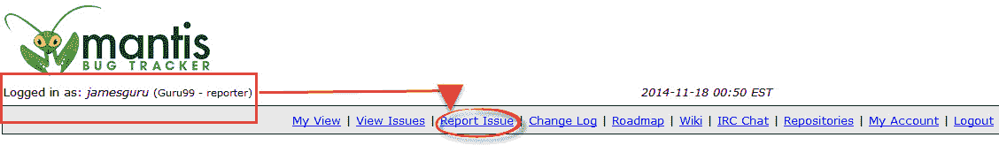

**步骤 3）**在下一个屏幕中

1.  输入错误类别
2.  输入可重复性
3.  输入严重性
4.  输入优先级
5.  输入平台详细信息
6.  输入错误报告摘要
7.  输入说明
8.  输入步骤以重现错误
9.  点击提交报告

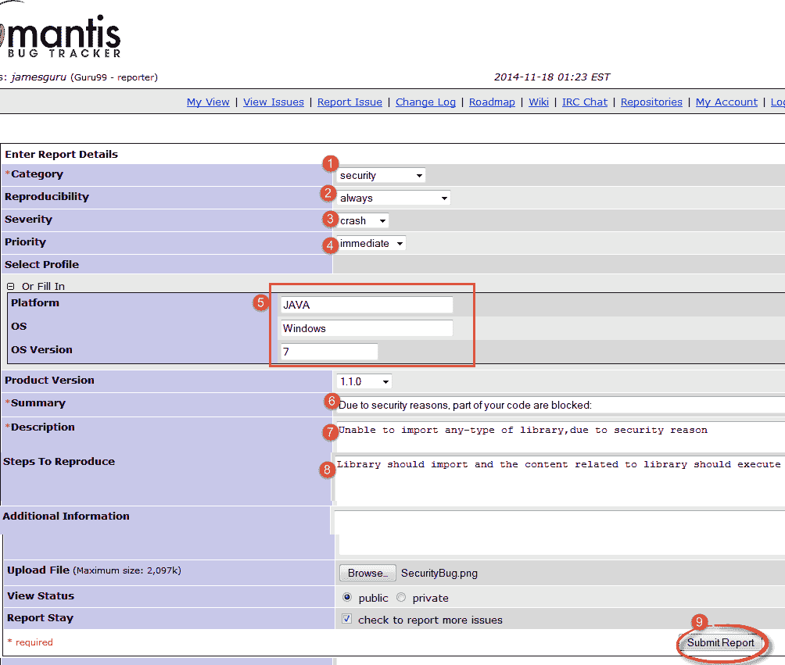

**注意**：您在螳螂版本中看到的字段将延迟。 有关相同内容，请参阅我们的[自定义字段](#4)部分。

**步骤 4）**在报告窗口中输入所有详细信息之后，我们将提交报告，并且很快我们的报告将显示在主窗口中。 如下图所示，当您单击查看问题时，该问题也会显示在屏幕上，其 ID 为**“ 0017896”** ，并且显示的状态为新，并且显示的日期为 创建。

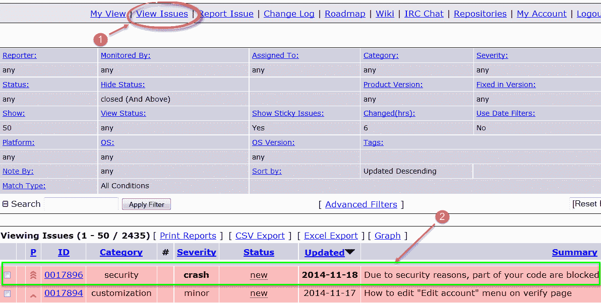

Mantis 工具中的问题会根据问题的状态突出显示。 例如，此处的问题处于已确认状态，因此以浅橙色突出显示。

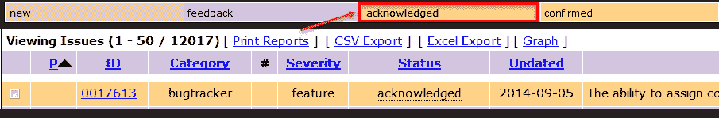

对于不同的状态，将分配不同的颜色。

**步骤 5）**单击您的问题#id **0017896** 时，它将更详细地显示该问题，例如项目报告者，其状态，提交日期和最新更新。

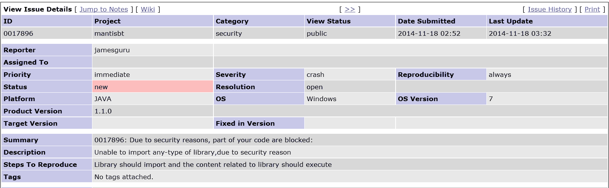

**步骤 6）**除此之外，您还可以向错误中添加文件，文档，图像，如下所示–

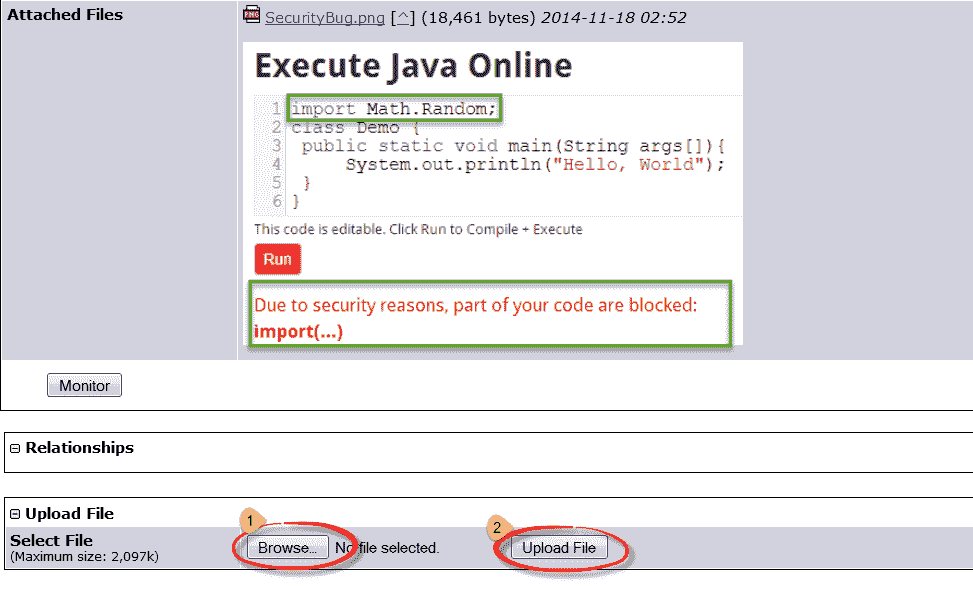

**步骤 7）**您还可以添加注释来解决您的问题，如下图所示。

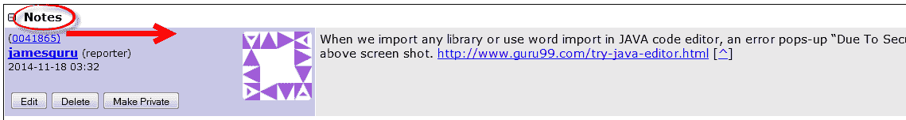

**步骤 8）**您可以单击“问题报告”顶部的历史记录，以查看问题历史记录。 该问题历史记录具有详细信息，例如何时创建问题，何时将文件添加到问题或是否有任何注释添加到问题。

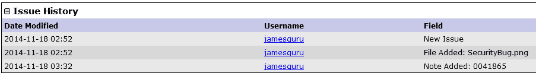

**步骤 9）**一旦提交问题，开发人员就会收到一封电子邮件。

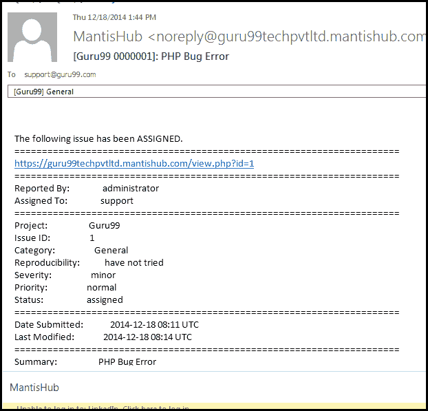

### 如何添加项目

**步骤 1）**在“管理”选项卡下，转到“管理项目”

1.  输入项目名称
2.  选择状态
3.  输入说明
4.  单击添加项目

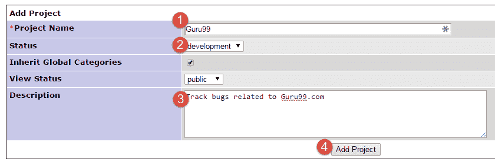

**步骤 2）**项目已创建。

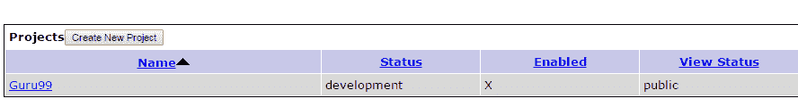

### 如何创建用户

**步骤 1）**转到管理>管理用户。 点击“创建新帐户”

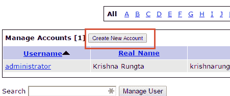

**步骤 2）**

1.  输入
2.  用户名
3.  真正的名字
4.  电子邮件
5.  访问权限
6.  点击创建用户

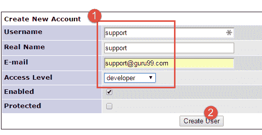

**步骤 3）**在下一个屏幕中，将用户分配到所需的项目。

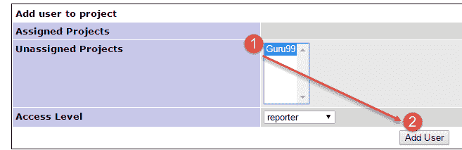

**步骤 3）**根据需要更新电子邮件和其他帐户首选项

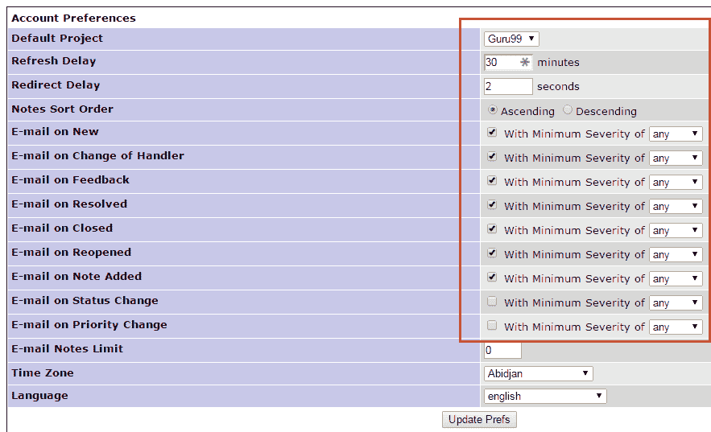

**步骤 4）**登录凭据通过电子邮件发送给用户。

## 如何创建自定义字段

**步骤 1）**

1.  转到管理自定义字段
2.  输入字段名称
3.  单击按钮“新自定义字段”

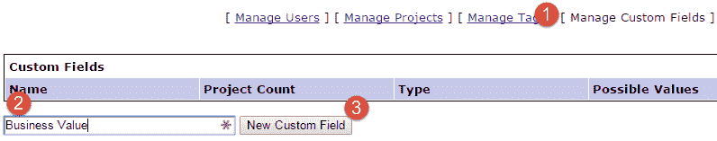

**Step 2)**

1.  选择字段类型
2.  输入字段特定数据
3.  点击更新自定义字段

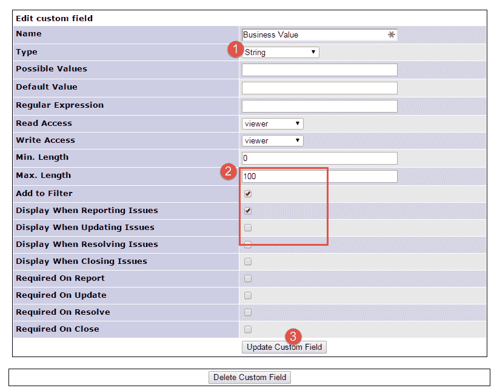

**步骤 4）**自定义字段已创建

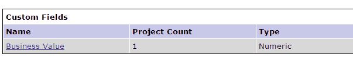

**步骤 5）**再次单击“自定义字段”并将“自定义字段”链接到您的项目

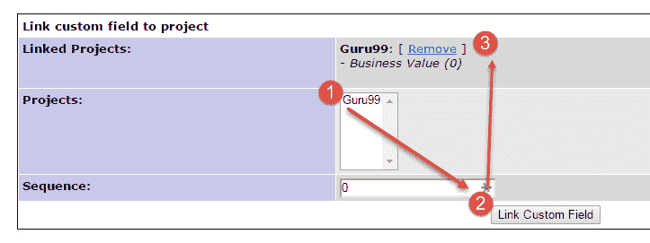

**步骤 6）**在“报告发布”部分中，反映了新的自定义字段

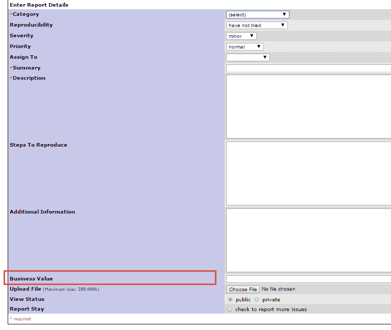

*   [下一个](/jira-tutorial-a-complete-guide-for-beginners.html)