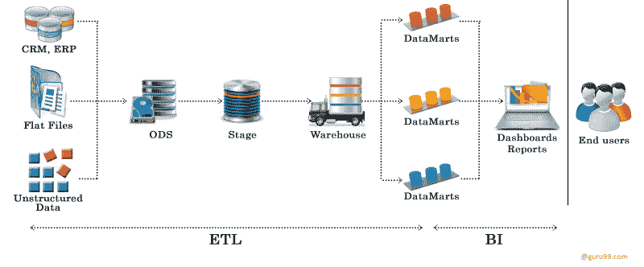
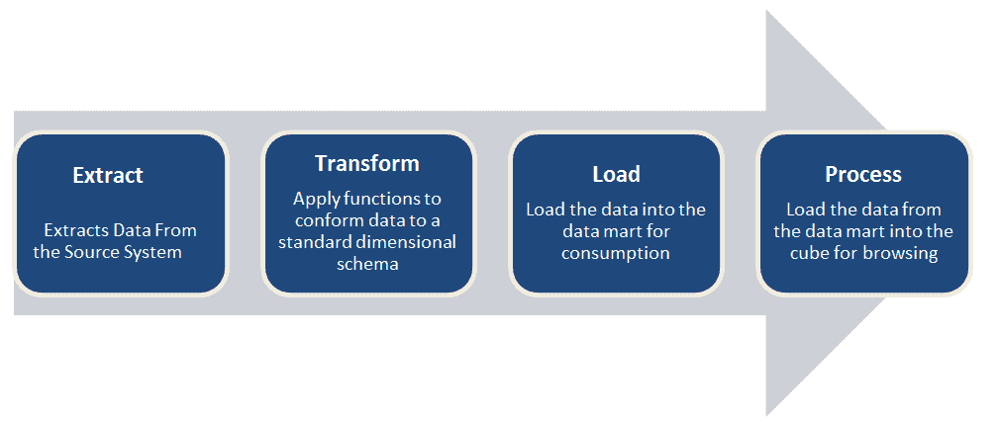
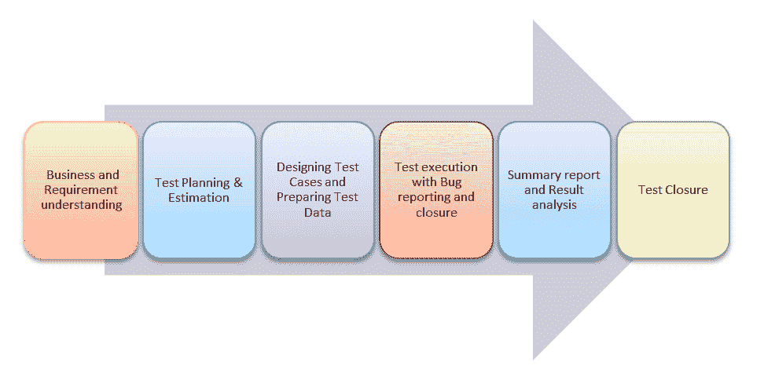
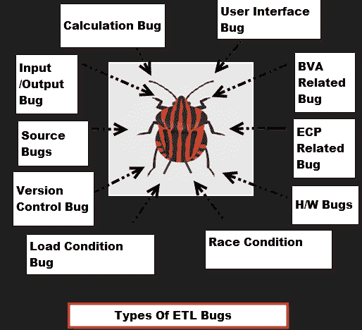

# ETL 测试或数据仓库测试教程

> 原文： [https://www.guru99.com/utlimate-guide-etl-datawarehouse-testing.html](https://www.guru99.com/utlimate-guide-etl-datawarehouse-testing.html)

在我们了解有关 ETL 测试的任何知识之前，了解 ETL 测试对了解商业智能和数据软件很重要。 让我们开始吧 -

## 什么是 BI？

商业智能是收集原始数据或业务数据并将其转变为有用且更有意义的信息的过程。 原始数据是组织日常交易的记录，例如与客户的交互，财务管理和员工管理等。 这些数据将用于“报告，分析，数据挖掘，数据质量和解释，预测分析”。

## 什么是数据仓库？

数据仓库是设计用于查询和分析而不是用于事务处理的数据库。 数据仓库是通过集成来自多个异构源的数据而构建的，它使公司或组织可以合并来自多个源的数据并将分析工作负载与事务工作负载分开。 数据被转换成高质量的信息，以满足所有级别用户的所有企业报告要求。

## 什么是 ETL？

ETL 代表 Extract-Transform-Load，它是如何将数据从源系统加载到数据仓库的过程。 从 OLTP 数据库中提取数据，进行转换以匹配数据仓库架构，然后将其加载到数据仓库数据库中。 许多数据仓库还合并了来自非 OLTP 系统的数据，例如文本文件，旧系统和电子表格。

让我们看看它是如何工作的

例如，有一间零售商店，其销售，市场，物流等部门各不相同。每个部门都独立处理客户信息，并且存储数据的方式也大不相同。 销售部门按客户名称存储，而营销部门按客户 ID 存储。

现在，如果他们想查看客户的历史记录，并想知道他/她由于不同的营销活动而购买了哪些不同的产品； 这将非常乏味。

解决方案是使用数据仓库使用 ETL 以统一的结构存储来自不同来源的信息。 ETL 可以将不同的数据集转换为统一的结构。后来使用 BI 工具从这些数据中获取有意义的见解和报告。

下图为您提供了 ETL 流程的 ROAD MAP

1.  **提取**

*   提取相关数据

2.  **转换**

*   将数据转换为 DW（数据仓库）格式
*   构建密钥-密钥是一个或多个唯一标识实体的数据属性。 各种类型的键是主键，备用键，外键，复合键，替代键。 数据仓库拥有这些密钥，并且永远不允许任何其他实体分配它们。
*   数据清理：提取数据后，它将进入下一阶段，即清理和整理数据。 清除会遗漏数据，并识别并修复错误。 一致性意味着解决那些不兼容的数据之间的冲突，以便可以在企业数据仓库中使用它们。 除了这些之外，该系统还会创建用于诊断源系统问题并改善数据质量的元数据。

3.  **加载**

*   将数据加载到 DW（数据仓库）中
*   构建聚合-创建聚合是汇总和存储事实表中可用的数据，以提高最终用户查询的性能。

## 什么是 ETL 测试？

进行 ETL 测试以确保业务转换后从源加载到目标的数据是准确的。 它还涉及验证源和目标之间使用的各个中间阶段的数据。 ETL 代表 Extract-Transform-Load。

## ETL 测试流程

与其他测试过程类似，ETL 也经历不同的阶段。 ETL 测试过程的不同阶段如下

ETL 测试分为五个阶段

1.  识别数据源和需求
2.  数据采集
3.  实施业务逻辑和维度建模
4.  建立并填充数据
5.  建立报告

## ETL 测试的类型

| 测试类型 | 测试过程 |
| 生产验证测试 | 这种类型的 ETL 测试“表平衡”或“生产对帐”是在将数据移入生产系统时对其进行的。 为了支持您的业务决策，生产系统中的数据必须以正确的顺序排列。 [Informatica](/informatica-tutorials.html) 数据验证选件提供 ETL 测试自动化和管理功能，以确保生产系统不受数据损害。 |
| 源到目标测试（验证测试） | 进行这种类型的测试以验证转换后的数据值是否为预期数据值。 |
| 应用升级 | 这种类型的 ETL 测试可以自动生成，从而节省了大量的测试开发时间。 这种类型的测试检查从较旧的应用程序或存储库中提取的数据是否与存储库或新应用程序中的数据完全相同。 |
| 元数据测试 | 元数据测试包括数据类型检查，数据长度检查和索引/约束检查的测试。 |
| 数据完整性测试 | 为了验证所有预期数据都已从源加载到目标中，已完成数据完整性测试。 可以运行的一些测试是比较和验证具有简单转换或不转换的列的源和目标之间的计数，聚合和实际数据。 |
| 数据准确性测试 | 进行此测试是为了确保按预期正确加载和转换数据。 |
| 数据转换测试 | 测试数据转换是在许多情况下完成的，因为它无法通过编写一个源 [SQL](/sql.html) 查询并将输出与目标进行比较来实现。 可能需要为每行运行多个 SQL 查询以验证转换规则。 |
| 数据质量测试 | 数据质量测试包括语法和参考测试。 为了避免在业务流程中由于日期或订单号引起的任何错误，请执行数据质量测试。 语法测试：根据无效字符，字符模式，不正确的大小写顺序等，将报告脏数据。参考测试：将根据数据模型检查数据。 例如：客户 ID 数据质量测试包括数字检查，日期检查，精度检查，数据检查，空检查等。 |
| 增量 ETL 测试 | 进行此测试以检查新旧数据之间的旧数据和新数据的数据完整性。 增量测试验证在增量 ETL 过程中是否按预期处理了插入和更新。 |
| GUI /导航测试 | 完成此测试是为了检查前端报告的导航或 GUI 方面。 |

## 如何创建 ETL 测试用例

ETL 测试是一种概念，可以应用于信息管理行业中的不同工具和数据库。 **ETL 测试的目的是确保业务转换后从源加载到目标的数据是准确的。** 它还涉及在源和目标之间使用的各个中间阶段验证数据。

在执行 ETL 测试时，ETL 测试人员将始终使用的两个文档是

1.  **ETL 映射表：** ETL 映射表包含源表和目标表的所有信息，包括每一列以及它们在参考表中的查找。 ETL 测试人员需要熟悉 SQL 查询，因为 ETL 测试可能涉及编写带有多个联接的大型查询以在 ETL 的任何阶段验证数据。 ETL 映射表在编写用于数据验证的查询时提供了重要的帮助。
2.  源，目标的 **DB 模式：**应该方便检查映射表中的任何细节。

## ETL 测试场景和测试案例

| 测试场景 | 测试用例 |
| 映射文档验证 | 验证映射文档是否提供了相应的 ETL 信息。 更改日志应保留在每个映射文档中。 |
| 验证方式 | 

1.  根据相应的映射文档验证源和目标表结构。
2.  源数据类型和目标数据类型应相同
3.  源数据和目标中的数据类型长度应相等
4.  验证是否指定了数据字段类型和格式
5.  源数据类型长度应不小于目标数据类型长度
6.  根据映射文档验证表中的列名称。

 |
| 约束验证 | 确保按预期为特定表定义了约束 |
| 数据一致性问题 | 

1.  尽管语义定义相同，但特定属性的数据类型和长度在文件或表中可能会有所不同。
2.  滥用完整性约束

 |
| 完整性问题 | 

1.  确保将所有预期数据加载到目标表中。
2.  比较源和目标之间的记录计数。
3.  检查任何拒绝的记录
4.  检查数据不应在目标表的列中被截断
5.  检查边界值分析
6.  比较键的唯一值 加载到 WH 的数据和源数据之间的字段

 |
| 正确性问题 | 

1.  拼写错误或记录不正确的数据
2.  空，非唯一或超出范围的数据

 |
| 转型 | Transformation |
| 资料品质 | 

1.  编号检查：需要进行编号检查并进行验证
2.  日期检查：它们必须遵循日期格式，并且在所有记录中都应相同
3.  精确检查
4.  数据检查
5.  空检查

 |
| 空验证 | 验证空值，其中为特定列指定“ Not Null”。 |
| 重复检查 | 

1.  需要验证唯一键，主键和其他任何列，因为根据业务需求，它们应该具有唯一的重复行
2.  检查要提取的任何列中是否存在任何重复值 从源中的多列合并到一列中
3.  根据客户要求，需要确保仅目标中的多列组合中没有重复项

 |
| 日期验证 | 日期值正在

1.  的 ETL 开发中使用许多领域•要知道行创建日期
2.  根据 ETL 开发的观点来识别活动记录
3.  根据业务来识别活动记录 需求透视图
4.  有时根据日期值生成更新和插入。

 |
| 完整的数据验证 | 

1.  要验证源表和目标表中的完整数据集，以最佳解决方案减去查询
2.  我们需要提供负目标和目标负源
3.  如果负查询返回 任何应视为不匹配行的值
4.  需要使用 intersect 语句
5.  在源和目标之间匹配行[intersect]返回的计数应与源表和目标表的单个计数匹配
6.  如果行的负查询返回和计数相交小于源计数或目标表，则可以考虑存在重复的行。

 |
| 数据清理 | 在加载到暂存区之前，应删除不必要的列。 |

## ETL 错误的类型

| 

**错误的类型**

 | 

**说明**

 |
| 用户界面错误/外观错误 | 

*   与应用程序的 GUI
*   有关。字体样式，字体大小，颜色，对齐方式，拼写错误，导航等

 |
| 边界值分析（BVA）相关的错误 | 

*   最小值和最大值

 |
| 等价类分区（ECP）相关的错误 | 

*   无效类型

 |
| 输入/输出错误 | 

*   无效的值不被接受
*   无效的值被接受

 |
| 计算错误 | 

*   数学错误
*   最终输出错误

 |
| 加载条件错误 | 

*   不允许多个用户
*   不允许客户预期的负载

 |
| 竞赛条件错误 | 

*   系统崩溃 & 挂起
*   系统无法运行客户端平台

 |
| 版本控制错误 | 

*   没有徽标匹配
*   没有可用的版本信息
*   这通常在 [回归测试](/regression-testing.html)

中发生 |
| 硬件错误 | 

*   设备未响应应用程序

 |
| 帮助源错误 | 

*   帮助文档中的错误

 |

## 数据库测试和 ETL 测试之间的区别

| ETL 测试 | 数据库测试 |
| 验证数据是否按预期移动 | 主要目标是检查数据是否遵循数据模型中定义的规则/标准 |
| 验证源和目标中的计数是否匹配验证转换后的数据是否符合预期 | 验证没有孤儿记录，并且保持外-主键关系 |
| 验证在 ETL 期间保留了外键主键关系 | 验证没有冗余表，并且数据库已最佳标准化 |
| 验证加载数据中的重复项 | 验证所需的列中是否缺少数据 |

## ETL 测试人员的职责

ETL 测试人员的主要职责分为三类

*   登台/ SFS 或 MFS
*   应用业务转换逻辑
*   应用转换后，从阶段文件或表中加载目标表。

ETL 测试人员的某些职责是 [

*   测试 ETL 软件
*   ETL 数据仓库的测试组件
*   执行后端数据驱动的测试
*   创建，设计和执行测试用例，测试计划和测试工具
*   找出问题并为潜在问题提供解决方案
*   批准要求和设计规范
*   数据传输和测试平面文件
*   针对各种情况（例如计数测试）编写 SQL 查询 3

## ETL 性能测试和调整

ETL [性能测试](/performance-testing.html)是一项确认测试，旨在确保 ETL 系统可以处理多个用户和事务的负载。 性能调整的目标是通过消除性能瓶颈来优化会话性能。 要调整或改善会话的性能，您必须确定性能瓶颈并消除它。 性能瓶颈可以在源数据库和目标数据库，映射，会话和系统中找到。 用于性能测试的最佳工具之一是 Informatica。

## ETL 测试自动化

ETL 测试的一般方法是使用 SQL 脚本或对数据进行“眼球处理”。这些 ETL 测试方法耗时，容易出错并且很少提供完整的测试范围。 要在生产和开发环境中加速，改善覆盖范围，降低成本，提高[缺陷](/defect-management-process.html) ETL 测试的检测率，自动化是当务之急。 这样的工具之一就是 Informatica。

## ETL 测试的最佳做法

1.  确保数据正确转换
2.  在没有任何数据丢失和截断的情况下，应将预计的数据加载到数据仓库中
3.  确保 ETL 应用程序适当拒绝并替换为默认值并报告无效数据
4.  需要确保在规定和预期的时间范围内将数据加载到数据仓库中，以确认可伸缩性和性能
5.  无论可见度如何，所有方法均应具有适当的单元测试
6.  为了衡量其有效性，所有单元测试都应使用适当的覆盖技术
7.  为每个测试用例争取一个断言
8.  创建针对异常的单元测试

结帐- [ETL 测试面试问题&答案](/etl-testing-interview-questions.html)