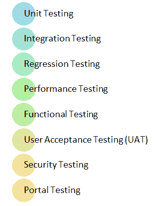
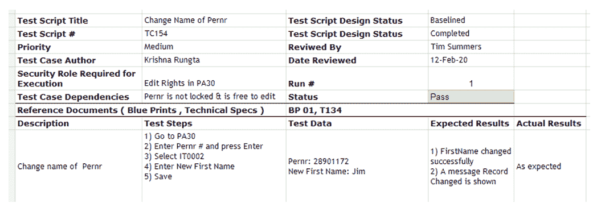
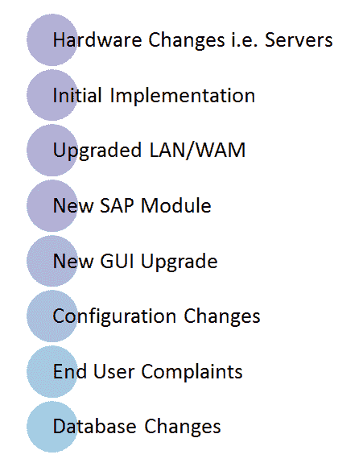

# 学习 SAP 测试：创建您的第一个 SAP 测试用例

> 原文： [https://www.guru99.com/learn-sap-testing-create-your-first-sap-test-case.html](https://www.guru99.com/learn-sap-testing-create-your-first-sap-test-case.html)

**SAP 简介**

引入 SAP（**系统应用程序和产品**）的基本思想是为客户提供与通用公司数据库进行交互以实现广泛应用程序的能力。 SAP 是集成的 ERP（企业资源计划），可以使业务流程高效地工作。

以下视频将解释企业中诸如 SAP 的 ERP 软件的需求

SAP 套件包含不同的[模块](/sap-modules.html)，例如 SAP FICO，SD，MM，HR 等。

在本教程中，您将学习-

*   [SAP 测试顾问-职业选择](#1)
*   [SAP 实施意味着什么？](#2)
*   [什么是 SAP 定制？](#3)
*   [什么是 SAP 软件维护？](#4)
*   [SAP 端到端生命周期和相应的测试阶段](#5)
*   [适用于 SAP 应用程序的测试类型](#6)
*   [如何创建 SAP 测试用例](#7)
*   [SAP 应用程序的自动化测试](#8)
*   [SAP 应用程序](#9)的性能测试

## 什么是 SAP 测试？

SAP [测试](/software-testing.html)与软件应用程序测试相同，但是此处的应用程序是 SAP ERP。 无论您在 SAP 软件中进行任何更改，都需要创建测试用例以检查新功能。 SAP 测试还可能涉及– [性能测试](/performance-testing.html)。 （以检查 SAP 应用程序的速度）& Web 测试（用于 SAP Web 门户）。

## SAP 测试顾问-职业选择

| **技能组** | 要成为 SAP 测试员，您需要掌握以下技能

1.  测试知识
2.  被测模块的功能知识。

 |
| **典型工作日** | 在任何典型的工作日中，您将忙于了解需求文档，创建测试用例，执行测试用例，报告和重新测试错误，参加审查会议以及其他团队建设活动。 |
| **职业发展** | 在典型的 CMMI 5 级公司中，您作为软件测试员（QA Analyst）的职业发展将遵循以下步骤，但因公司而异**质量检查分析师**（（*新鲜*）= > **高级质量检查分析师**（[ *2-3 年的经验*）= > **质量检查** **团队协调员**（ *5-6 年的经验* > = > **测试经理**（（ *8-11 经验*）= >。**高级测试管理** r（ *14+经验*） |

**SAP Testing 如何比其他测试项目更有利可图？**

在测试任何 AUT 时，

1.  您掌握了 AUT 的**的深层次功能知识。 没有足够的 AUT 知识就很难测试**
2.  磨练您的**测试技能**

与任何 IT 公司一样，您会在适当的时间从一个项目转移到另一个项目。 在新项目中，您为了解 AUT 的功能所做的所有努力都已过时。 如果您要跨多个领域（例如电信到医疗保健）切换项目，通常情况就是这样。

对于 SAP，您获得的功能知识是可移植的，可以在其他项目中使用。 假设您要切换作业。 在您以前的公司中，您正在测试 Vodafone 的计费软件。 在您的新公司中可以使用同一项目的可能性是多少？ 接近零。

现在考虑这种情况。 您正在从 SAP 测试项目切换到新公司中的另一个 SAP 测试项目。 您会立即认识到 GUI，事务代码，原始业务工作流，这是一个巨大的优势。 您将需要学习客户端进行的自定义，但仍然需要对软件有深入的了解。

**SAP Tester 的最大优点是，由于您掌握了丰富的功能知识，因此您可以轻松地成为 SAP 功能顾问**！ SAP 顾问的需求量巨大&，他们几乎总是供不应求，并要求支付高薪。

## SAP 实施意味着什么？

考虑这种情况。 公司 A 提供 12 片年假。 公司 B 提供 20 片年假。 对于分别使用 A 公司& B 的第 13 年或 st 年假的任何雇员，必须扣除工资。 必须将这些信息**配置为**到 SAP 系统**中，这仅仅是 SAP 的实现和配置。**

SAP vanilla 版本功能强大，但在按照公司的业务政策，法律规定和&技术要求进行自定义和配置之前，并没有太大用处。 此过程称为 SAP 实施。 通常可能需要几个月甚至几年的时间。

## 什么是 SAP 定制？

到目前为止，SAP 具有最高的业务流程集合。 但是，有时您的内部公司使用现有的 SAP 业务交易无法准确地处理许多事务。

在这种情况下，将使用 ABAP 创建自定义代码。 **它涉及代码更改以创建通过配置**无法使用的功能。 这不过是定制。 还可以进行 SAP 定制以生成定制报告，程序或增强功能。

## 什么是 SAP 软件维护？

**一旦配置，定制，部署并启用了 SAP 系统，对 SAP 系统所做的任何更改都称为维护。 其中可能包括**

*   SAP 系统的新增功能
*   Bug 修复
*   [SAP 内核更新](/sap-kernel.html)
*   [支持包&堆栈更新](/support-package-stack-updates.html)
*   [OSS 注释实现](/how-to-trace-if-an-oss-note-is-deployed-in-your-landscape.html)

## SAP 端到端生命周期和相应的测试阶段

有许多方法可用于 SAP 实施

*   ASAP 实施（用于 SAP 系统的初始实施以及从旧系统的移植）
*   维护生命周期
*   升级生命周期
*   定制开发生命周期

无论您处于何种生命周期，都将涉及三个主要的测试阶段

**1）测试准备**

**2）测试执行阶段**

**3）测试评估阶段**

*   ## 测试准备阶段

1.  识别要测试的业务流程
2.  手动和自动[测试用例](/test-case.html)开发
3.  创建测试套件并进行审查
4.  建立测试系统
5.  创建测试数据

*   ## 测试执行阶段

1.  手动或使用测试工具执行测试
2.  测试状态报告和[缺陷](/defect-management-process.html)处理

*   ## 测试评估阶段

1.  详细评估所有测试计划
2.  缺陷分析
3.  测试过程的文档

## 适用于 SAP 应用程序的测试类型

对于 SAP 应用程序，执行的常见测试是：

1.  **单元测试**：这部分测试大部分由开发人员根据组织定义的[单元测试](/unit-testing-guide.html)规则进行。 有时这是由熟练的白盒测试人员完成的。 测试在开发框中完成。 这是对主要使用 [ABAP](/abap-tutorial.html) 代码开发的界面，转换，增强，报告，工作流程和表单（RICEWF）的测试。 开发对象的测试包括安全授权，数据传输规则，对帐和批处理计划作业的测试。 BW（业务仓库）测试也是开发测试的一部分。
2.  **集成测试**：这是对 SAP 应用程序的组合组件的测试，以确定它们是否可以一起正常运行。 它通常在质量检查环境中完成，并使用实际的测试数据。
3.  **回归测试**：[回归测试](/regression-testing.html)的执行是为了确保实现的新更改不会对现有工作代码产生不利影响。 SAP R / 3 是紧密集成的系统。 单个堆栈更新，OSS 注释，传输，配置更改，新的开发界面可能会产生级联效应，并产生严重影响。 回归测试通常由测试团队使用自动化工具执行。
4.  **性能测试**：它正在测试 SAP 应用程序，以确保它们在预期的工作负载下表现良好。 性能测试包括负载，容量& [压力测试](/stress-testing-tutorial.html)，以确定系统瓶颈。 该测试的目的是增强 SAP 应用程序的健壮性，并帮助部署可以维持高负荷预测且生产后性能问题为零的系统。 测试包括检查由于高交易量或批次数量而可能引起压力的业务流程。 它通常使用自动化工具&执行，涉及基础，数据库，基础架构和测试团队的协作以监视测试结果。
5.  **功能测试**：[功能测试](/functional-testing.html)确保您的 SAP 实施满足您的业务需求。 SAP 是高度可配置的系统，可以轻松地与内部应用程序或第三方工具集成。 考虑到这种多样化的配置和复杂性，必须进行功能测试。 功能测试消除了业务用例的不确定性并带来了质量。 它包括设计文档的审查和创建测试工件，包括测试需求，[测试场景](/test-scenario.html)和测试用例。 功能测试通常由测试团队在特定背景下（尤其是要测试的 SAP 模块）进行。
6.  **用户接受测试（UAT）**：功能，系统和回归测试完成后，将执行 UAT（用户接受测试）。 它确保 SAP 系统可供系统的最终用户使用。 最终用户独立执行用户验收测试用例，其中包括测试业务流程，功能，文档（操作手册，备忘单）等。借助 UAT，用户可以适应新的业务环境并完全拥有系统所有权。
7.  **安全测试**：为了确保 SAP 应用程序的安全，执行了[安全测试](/what-is-security-testing.html)。 测试了高风险领域，如门户安全性，网络安全性，操作安全性，产品安全性，访问控制和安全性源代码审核。 这通常涉及基础，数据库，基础结构，开发和测试团队。
8.  **门户测试**：这些技术涉及在不同的浏览器上测试 SAP 门户并检查业务流程

## 如何创建 SAP 测试用例

让我们设计一个测试用例，以更改 SAP 系统中员工的姓名

要创建有效的测试用例，您必须

*   确定执行测试用例所需的 SAP 角色
*   确定测试用例需要执行的 SAP 事务
*   测试数据需要执行测试用例。 确定是否需要创建数据，或者是否需要其他测试人员使用该数据，或者该数据是否已锁定&，无法修改。
*   任何先决条件
*   同行评审测试案例
*   创造正面和负面情景
*   创建详细的测试步骤。
*   测试覆盖范围应稳健
*   发现缺陷后应及时记录下来。

请参考此视频，以获取有关如何更改 SAP 信息类型的指南

为此设计的测试用例如下：

**重要说明**

SAP 是一个无休止的变化巨大的系统。 在 SAP 系统中检查所有可能的变化和测试参数输入的组合既不可行也不具有成本效益。

如上例所示，测试人员可以验证姓氏，出生日期，地址，PIN 码，城市，州，国家/地区，永久性，临时性，工作地址等方面的更改。

测试人员需要采取一些策略，以减少测试用例的数量而不牺牲覆盖范围。 此类策略的示例包括边界值分析，等价分割&正交数组。

## SAP 应用程序的自动化测试

对于像 SAP 这样的庞大系统而言，测试是一项巨大的挑战。 根据 ASUG 的最新研究，超过 86％的客户担心由于缺乏全面测试而带来的风险。

自动化对 SAP 应用程序具有以下好处

1.  主要且最有价值的好处是提高测试覆盖率
2.  更好的产品质量，因此减少了生产中断。 SAP 生产环境中的中断可能会使公司损失数百万美元！
3.  每个发布周期工作量都会减少

**自动化工具**

方法论和方法比所选的测试工具更为重要。 当您考虑测试 SAP 应用程序时，自然会想到一些工具，例如 SAP TAO，eCATT， [QTP](/quick-test-professional-qtp-tutorial.html) 等。

### ECATT（扩展计算机辅助测试工具）

ECATT 用于为 SAP 创建和执行功能测试。 ECATT 是与 SAP 捆绑在一起的内置工具，其主要目的是自动测试 SAP 业务流程。

**ECATT 有用的功能**

1.  测试交易，报告和方案
2.  调用 BAPI 和功能模块
3.  测试远程系统
4.  检查授权（用户配置文件）
5.  测试更新
6.  测试更改自定义设置的效果
7.  检查系统消息

## QTP（快速测试专业工具）

HP 的 QuickTest 是关键字驱动的自动化工具。 它支持许多环境，包括 SAP。 该工具功能强大，功能丰富且用户友好。 其在自动化工具领域的市场领导者占据着主要的市场份额。 这是一种具有出色供应商支持的商业工具。 它是 SAP 自动化的首选工具。

## SAP TAO

SAP 与 Focus Frame（现已被 Hexaware 收购）合作发布了自动化工具 SAP TAO。

SAP TAO 封装了 QTP 和 QC，其中 QTP 充当执行引擎，并且创建了测试方案并通过业务组件从 QC 驱动了测试方案。 SAP TAO 自动生成端到端方案的测试组件。 与其他测试工具相比，SAP TAO 和 HPQC 设置确实具有一些优势。公司对 HP 和 SAP 软件产品均提供了巨大的支持。

SAP TAO 客户端应用程序执行三个功能：**检查来自 SAP 服务器的事务，将事务导出到 HP Quality Center 以及合并来自 HP Quality Center 的组件或脚本。**

## SAP 应用程序的性能测试

SAP 应用程序的性能测试已完成，以检查其**速度，可伸缩性和稳定性**。 性能测试 SAP 可以帮助

*   符合服务级别协议（SLA）。
*   优化软件配置设置。
*   减少硬件超支
*   证明该系统在季节性高负载期间不会崩溃或发生故障，并有助于避免相应的财务损失。

***触发性能测试的事件***

SAP 性能测试工具的选择取决于要测试的基础 SAP 应用程序。 以下是 SAP 性能测试工具及其应用领域的列表

1.  开源/免费

*   Jmeter-（性能测试 SAP 业务阻碍了 BI 平台）
*   开放式 STA（性能测试 SAP 门户）

2.  商业广告

*   负载运行程序（在其他 SAP 应用程序中进行性能测试 SAP ECC）– SAP 推荐的
*   IBM Rational Robot（可以测试各种 SAP 应用程序）

## 结论

SAP 测试为质量检查爱好者提供了巨大的职业机会。 这是进入备受赞誉的 SAP Consultant 领域的相对容易的方法。

结帐- [SAP 测试面试问题&答案](/sap-testing-interview-questions.html)