# 如何下载&安装 HP ALM（质量中心）

> 原文： [https://www.guru99.com/hp-alm-install.html](https://www.guru99.com/hp-alm-install.html)

在安装 ALM 12.55 之前，您必须了解系统要求。 我们将介绍如何在 Windows 环境中执行独立安装。 用户应满足以下所有成功安装 ALM 的先决条件。

| **操作系统** | **数据库** | **浏览器** | **MSOffice** |
| 用户应在以下 Windows Server 版本的操作系统之一上安装 ALM。

*   Microsoft Windows Server 2008 R2 企业 SP1 64 位

Microsoft Windows Server 2012 标准 64 位。 | 在继续安装 ALM 之前，应已安装以下数据库之一。

*   甲骨文 10.2.0.5
*   甲骨文 11.2.0.3
*   Microsoft [SQL](https://www.guru99.com/sql.html) Server 2008 R2 SP2

Microsoft SQL Server 2012 SP1 | 安装后，用户应使用以下浏览器之一访问 ALM。

*   Microsoft Internet Explorer 8 32 位
*   Microsoft Internet Explorer 9 32 位
*   Microsoft Internet Explorer 10 32 位

 | 为了允许将数据从 Excel / Word 导入到 ALM，用户应预先安装以下 MS Office Suite 之一。

*   Microsoft Office 2010 SP2 32 位

Microsoft Office 2013 32 位 |

这是安装过程的工作流程

### 第 1 部分）下载

**步骤 1）**转到 [https://software.microfocus.com/signup](https://software.microfocus.com/signup) 。

输入数据并单击注册

**步骤 2）**在下一个屏幕中，您将看到消息注册成功。

**步骤 3）**检查您的收件箱并确认您的电子邮件。

**步骤 4）**进入登录页面- [https://login.software.microfocus.com/msg/actions/showLogin](https://login.software.microfocus.com/msg/actions/showLogin)

1.  输入你的电子邮箱
2.  点击继续

**步骤 5）**在下一个屏幕中，

1.  输入密码
2.  点击“登录”按钮。

**步骤 6）**您将被带到仪表板。

1.  单击探索菜单。
2.  单击 ALM。

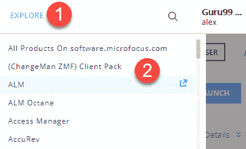

**步骤 7）**单击“立即开始”。

**步骤 8）**单击立即下载按钮。

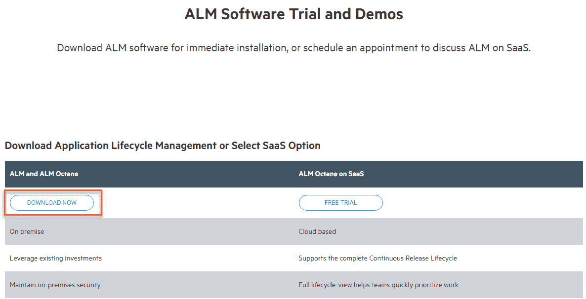

**步骤 9）**单击 ALM_12.55_windows_english.zip

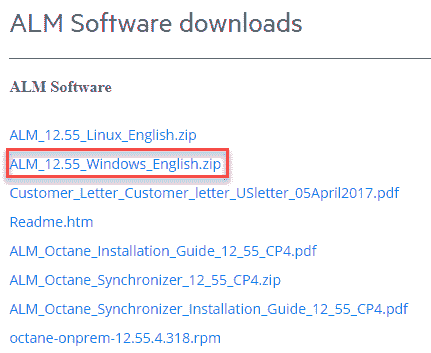

**步骤 10）** ALM 下载开始

### 第 2 部分）安装 ALM

**步骤 1）**提取下载的文件。

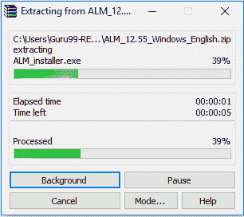

**步骤 2）**展开解压缩并单击 ALM_installer.exe

**步骤 3）**安装过程开始

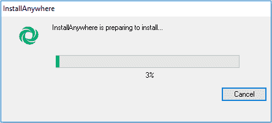

**步骤 4）**单击下一步

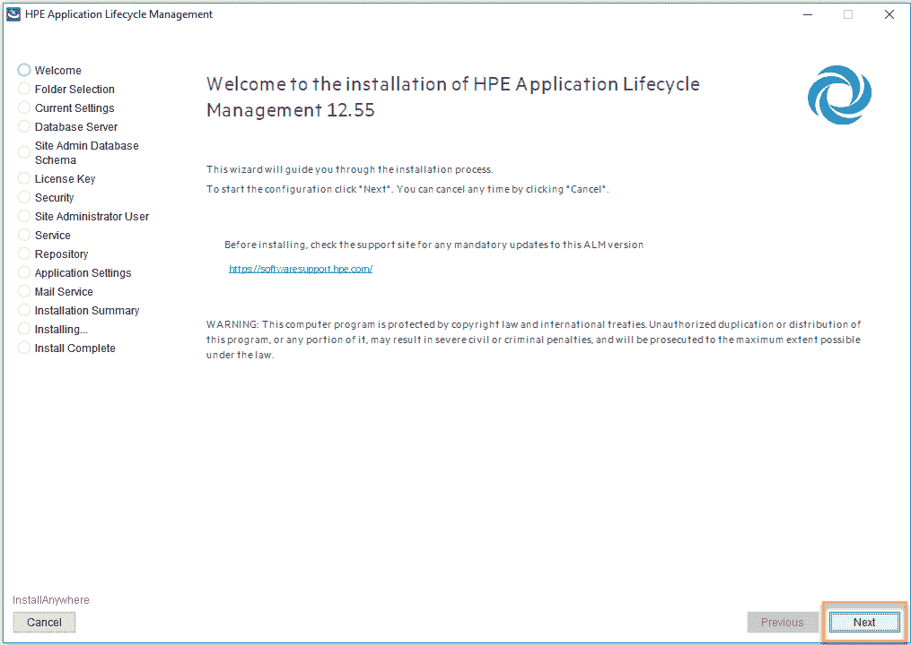

**步骤 5）**在下一个屏幕中，

1.  选择复选框
2.  点击下一步按钮

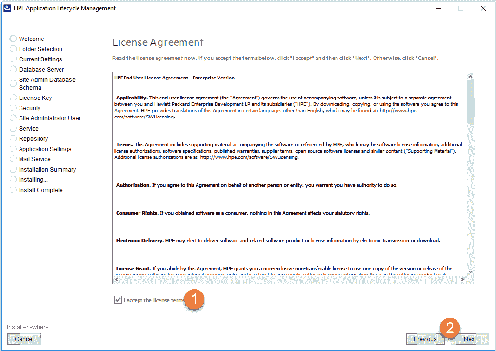

**步骤 6）**单击下一步

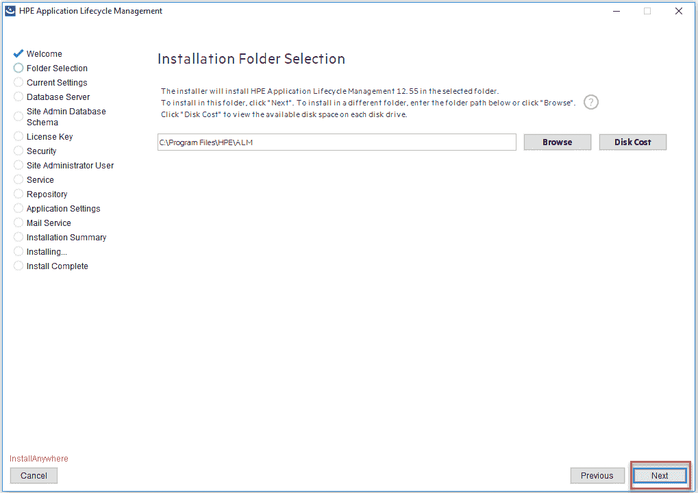

### C 部分）配置

到目前为止，我们已经为 ALM 安装/复制了必要的安装文件。 成功安装后，安装程序将继续执行服务器配置向导

**步骤 1** ）使用“评估密钥”并选择“应用程序生命周期管理”，然后单击“下一步”。

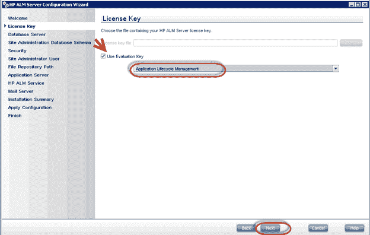

**步骤 2）**输入服务器详细信息。 您应该已经预装了 oracle / MS SQL Server。 选择适当的数据库凭据，然后单击“下一步”。

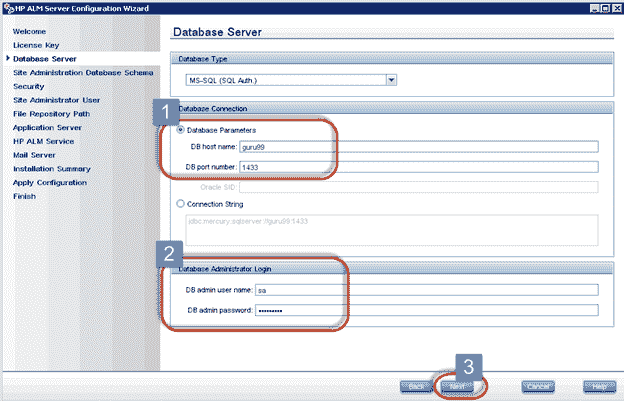

提示：使用 MS-SQL（SQL Auth）是因为 ALM 易于通过此选项安装，而 MS-SQL（Win Auth）由于操作系统注册表和 UAC 设置而更容易出错

**故障排除**

如果尽管输入有效数据库参数而收到错误“无法验证数据库参数”，请执行以下操作

1.在命令提示符下，检查端口 1433 正在监听。 使用命令 netstat -an

2.在 SQL Server 配置管理器>中，MSSQLSERVER 的 SQL Server 网络配置>协议>启用 TCP / IP 协议。 重新启动 SQLServer。

3.在“您的实例的协议”中双击 TCP / IP，然后转到 IP 地址选项卡。 在“ IPAll”下拉列表中，将端口设置为 1433。单击“应用”，然后单击“确定”并重新启动服务器，这也应该能够解决此问题。

**步骤 3）**输入站点管理数据库架构名称和密码。 输入详细信息后，单击“下一步”。

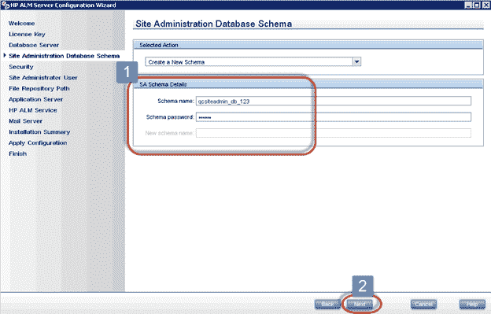

**步骤 4）**服务器配置向导中的“安全性”页面打开。 您可以选中“使用默认值”，然后单击“下一步”。

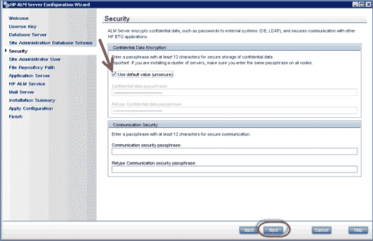

**步骤 5）**输入“站点管理员”的用户 ID 和密码。 不要忘记这些凭据，因为要成功登录 ALM，需要这些详细信息。

**步骤 6）**选择将存储所有 ALM 数据的文件存储库路径。

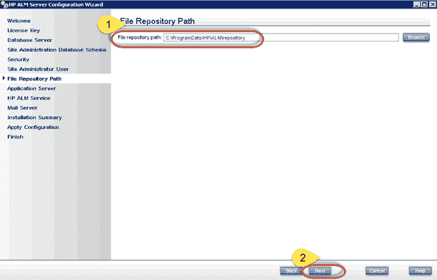

**步骤 7）**用户还可以选择他们想要安装的端口。 在这种情况下，它是 8181（默认值是 8080，可以覆盖），然后单击“下一步”。

**注意：**其他应用程序可能会使用默认端口 8080，因此最好选择其他端口号。

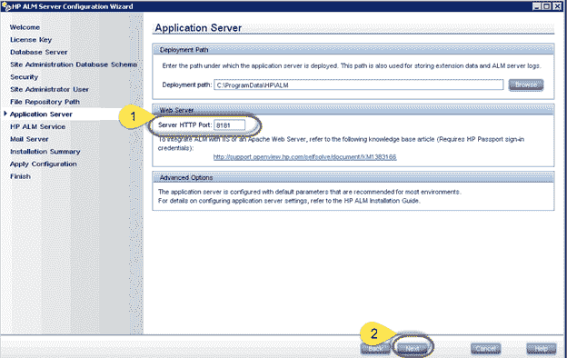

**步骤 8）**保留 HP ALM 服务为空，因为默认情况下将使用 Windows 登录凭据。 点击“下一步”继续。

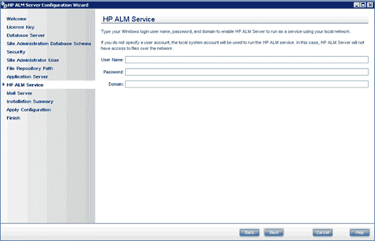

**步骤 9）**输入服务器详细信息以设置 HP ALM 的邮件服务器。 这用于使用 ALM 发送电子邮件。 如果您不想指定，请单击无，然后继续

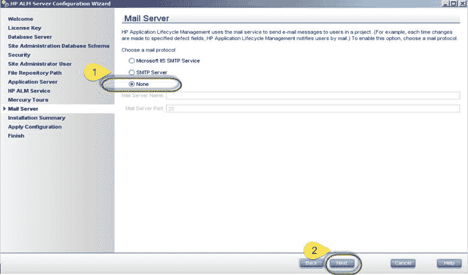

**步骤 10）**在继续之前显示配置摘要。 点击下一步

**步骤 11）**进行配置

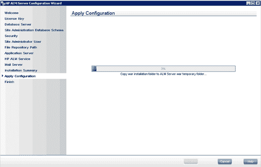

**步骤 12）**如果成功应用配置，则将适当显示状态消息。 单击“完成”，如果已选中“启动 ALM 服务器”，则 ALM 服务将启动。

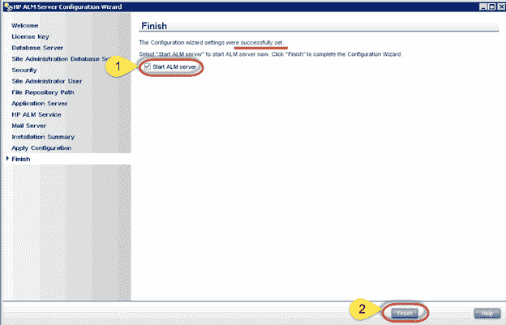

**步骤 13）**现在我们可以使用 URL 启动质量中心： [http：// localhost：8181 / qcbin /](http://localhost:8181/qcbin/) 。 ALM 12.0 将如下所示启动。

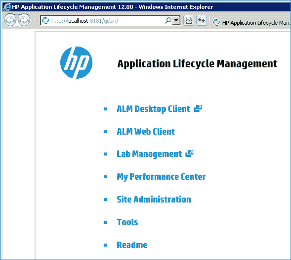