# HP ALM 管理：创建域，项目&用户

> 原文： [https://www.guru99.com/hp-alm-create-domain-project-user.html](https://www.guru99.com/hp-alm-create-domain-project-user.html)

为了使用 ALM，您需要

*   [创建域](#1)
*   [创建项目](#2)
*   [创建用户](#3)

实际上，这些将由 ALM 站点管理员创建，因为最终用户将无权访问“站点管理员”页面。

## 如何创建域

步骤 1）启动 ALM，然后从主页中单击“站点管理”。 将会弹出用户输入凭据。 输入我们在安装过程中创建的凭据。

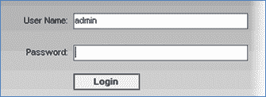

步骤 2）显示管理仪表盘。 点击创建域

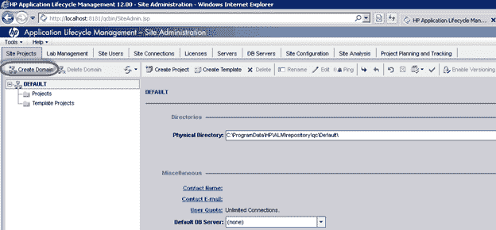

步骤 3）在弹出窗口中输入域名（在我们的示例中为“银行”），然后单击“确定”。

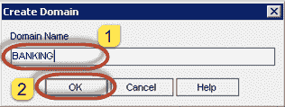

步骤 4）将如下所示创建域。

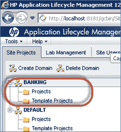

## 如何创建项目

步骤 1）选择要在其下创建项目的域。 在这种情况下，它是“银行”域，然后单击“创建项目”，如下所示

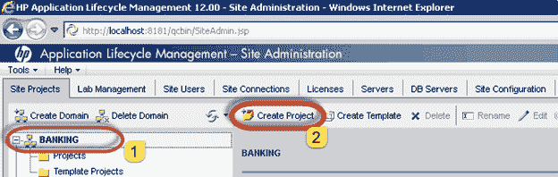

步骤 2）“创建项目”向导打开。 从列表中选择“创建并清空项目”，然后单击“下一步”按钮。

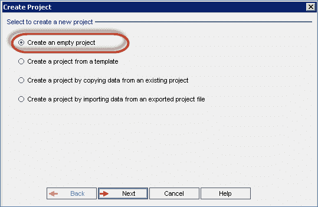

步骤 3）输入项目名称，然后单击“下一步”，如下所示。

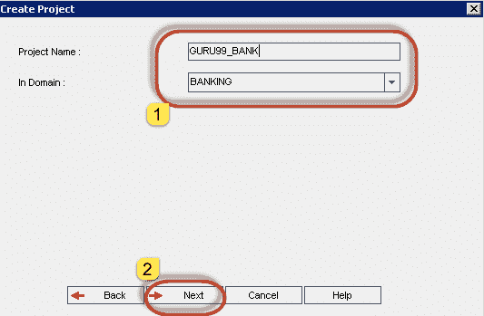

步骤 4）选择适当的数据库类型并输入以下内容。 在这种情况下，我们选择了“ MS-SQL”，因为我们已经安装了以 MS-SQL 为后端的 Hp-ALM。 如果您已将 ALM 与 Oracle 一起安装为数据库服务器，请选择'oracle'。

（1）数据库服务器名称

（2）数据库管理员用户名

（3）数据库管理员密码，然后单击“下一步”。

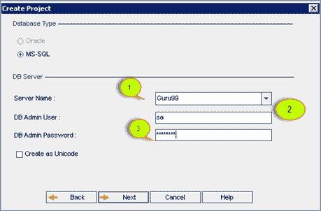

步骤 5）选择“管理员”用户，然后单击“下一步”。 由于我们尚未在 ALM 中创建任何用户，因此不会显示其他用户。

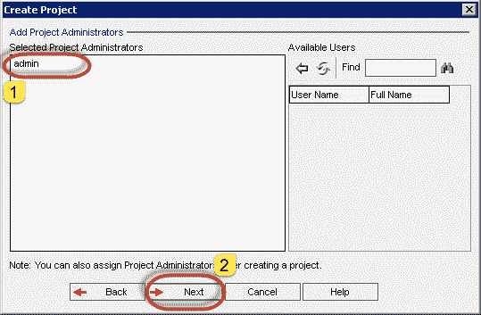

步骤 6）显示摘要对话框，然后单击“创建”按钮。 您还将注意到该窗口中有两个复选框。

1.  激活项目–如果未选中，则仍将创建项目，但用户将无法访问该项目区域。

2.  启用版本控制–这将启用版本控制功能，该功能限制用户同时编辑同一工作项（需求，测试），以避免覆盖一个用户所做的更改。

    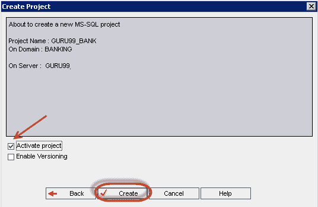

步骤 7）项目创建状态将显示如下。

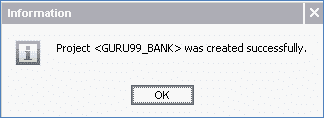

步骤 8）如下所示，已在“银行”域下成功创建项目“ GURU99_BANK”。

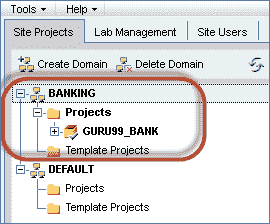

## 如何创建用户

步骤 1）为了访问 HP ALM，需要创建一个用户配置文件。 为了创建用户，站点管理员必须单击“站点用户”选项卡。

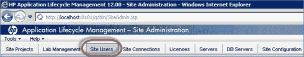

步骤 2）从“站点用户”选项卡中单击“添加用户”图标，如下所示。

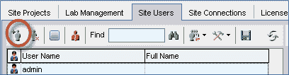

步骤 3）“添加用户”对话框打开。 输入所有必要的详细信息，然后单击“确定”。

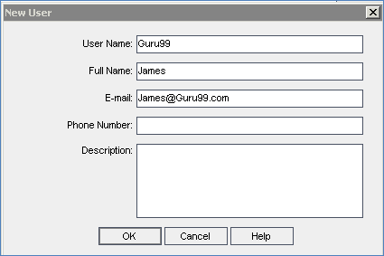

步骤 3）添加的用户将与其他现有用户一起显示在“用户列表”中，如下面突出显示的那样。

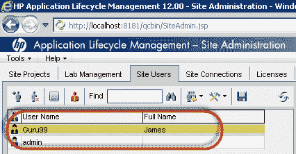

步骤 4）现在，我们将需要将用户映射到项目区域，因为新创建的用户将无权访问任何项目。 只需创建一个用户就可以访问多个项目区域就足够了。

在这种情况下，我们已将用户“ Guru99”添加到“银行”域下的“ GURU99_BANK”项目区域。

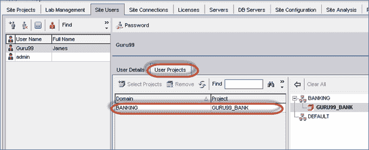