# 管理选项卡：在 HP ALM（质量中心）中创建版本&周期

> 原文： [https://www.guru99.com/hp-alm-release-specifications.html](https://www.guru99.com/hp-alm-release-specifications.html)

*   “管理”选项卡可帮助用户组织和跟踪发布和周期。
*   发行版具有确定的开始日期和结束日期，该日期对应于将在该时间间隔内部署到最终用户的一组更改
*   一个发行版中的一个周期具有一组开发和[测试](/software-testing.html)的工作，以实现一个共同的目标。
*   ALM 用户可以通过分析发布树以确保其与发布目标匹配来实时跟踪项目的进度。
*   它还使用户能够快速了解​​该发行版的质量，从而显示出突出的[缺陷](/defect-management-process.html)和缺陷打开率。

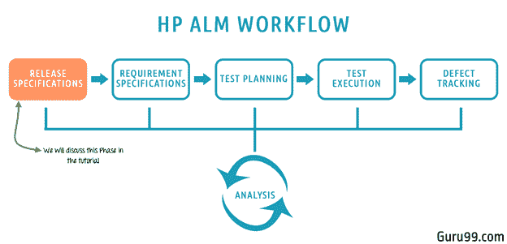

## 为什么我们需要 ALM 中的发布和周期管理？

实际上，当产品开发发生时，特定产品会有各种版本

*   每个发行版分为多个周期。 假设我们有 2 个版本，每个版本都有 2 个针对 Guru99 银行应用程序的开发和测试周期。
*   每个发行版还具有与之关联的预定义范围和里程碑。
*   对于每个循环，都有特定数量的要求。
*   每个需求都有许多与之相关的测试用例。
*   执行测试后，将缺陷记录并映射到相应的测试，然后我们可以跟踪需求和缺陷。

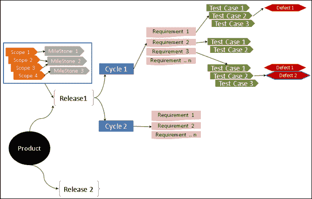

## 管理标签

此模块帮助我们创建和管理发布和周期，这是继续创建任何工作项（如需求/测试/缺陷）之前的第一步。 它还可以帮助我们进行项目计划和跟踪。 在此选项卡中，以下功能至关重要。

*   [创建发行版](#1)
*   [创建周期](#2)
*   [创建发布范围](#3)
*   [创建里程碑](#4)

注意：在开始练习之前，请参考此交互式教程以学习如何在 ALM 中登录

## 如何创建发行版

创建发行版是 ALM 中的第一步，所有其他工作项（例如需求，测试用例和缺陷）均基于发行版/周期进行跟踪。

如工作流程中所述，我们今年将针对 Guru99 银行业务应用发布两个版本，并具有以下时间表。

<colgroup><col> <col> <col></colgroup> 
| **发行名称** | **开始日期** | **结束日期** |
| 2017 R1 | 01/01/2017 | 21/06/2017 |
| 2017 R2 | 01/07/2017 | 31/12/2017 |

步骤 1）第一步是导航到“管理”选项卡，然后单击“ **Releases** ”选项卡。 登陆页面如下所示：

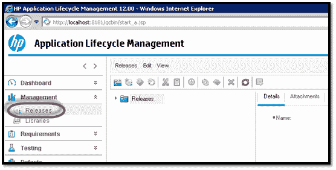

步骤 2）在创建发布之前，我们可以通过在发布模块中单击“ **New Folder** ”图标来创建容器/文件夹，如下所示。 赋予文件夹名称 2017

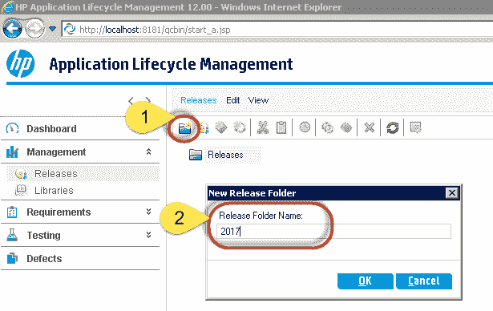

步骤 3）下一步是创建新版本。 要创建新版本，请单击“ **新版本”** 按钮，“新版本”对话框打开。 输入以下必填详细信息

1.  发布名称
2.  发布的开始日期
3.  发布结束日期
4.  有关发行版的简要说明（可选）

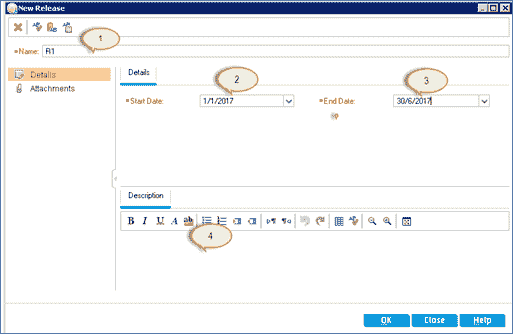

步骤 4）输入以上详细信息后，单击“确定”。 发行版将如下所示创建。

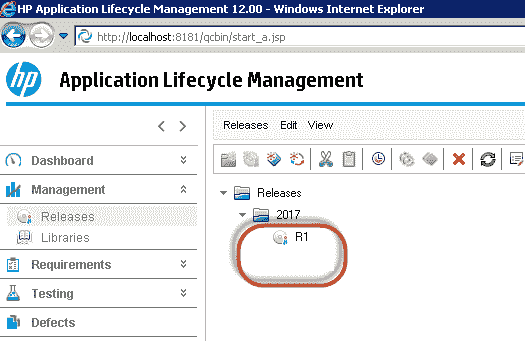

同样，您可以创建其他 Release R2

步骤 5）选择特定版本后，可以看到与版本相关的标签。

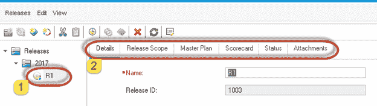

步骤 6）现在，让我们了解“发布”模块下可用的重要选项卡。 选择“详细信息”选项卡以检索有关在创建发行版期间提供的发行版详细信息的信息。

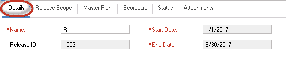

步骤 7）选择**版本范围**选项卡，其中提供了有关该版本范围的详细信息。 我们尚未为此发行版创建范围； 因此，作用域列表为空。 里程碑和范围的创建将在单独的模块中详细介绍。

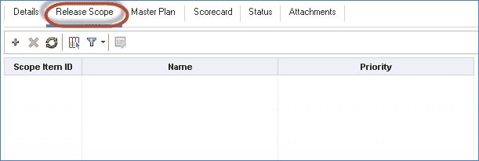

步骤 8）总体规划提供时间表的图形表示。 如果创建了周期，则总体计划还将包括该版本的周期时间表。

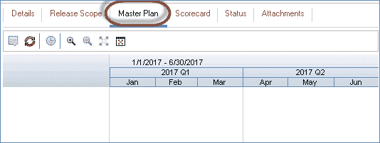

步骤 9）“状态”选项卡显示有关该版本总体进度的版本详细信息。

*   When the release is created afresh without any work item such as requirements/tests/defects added to it, the status would be displayed as shown below.

    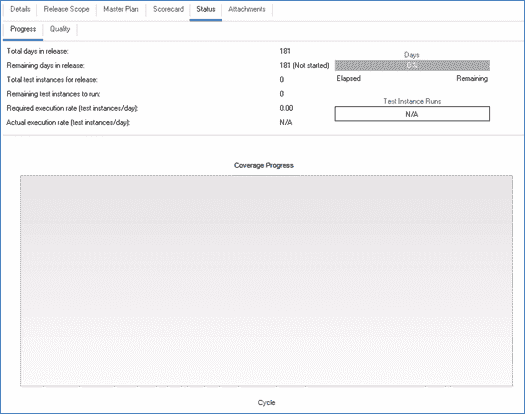

*   当用户根据发布映射工作项目（例如需求/测试/缺陷）时，状态将显示如下所示。

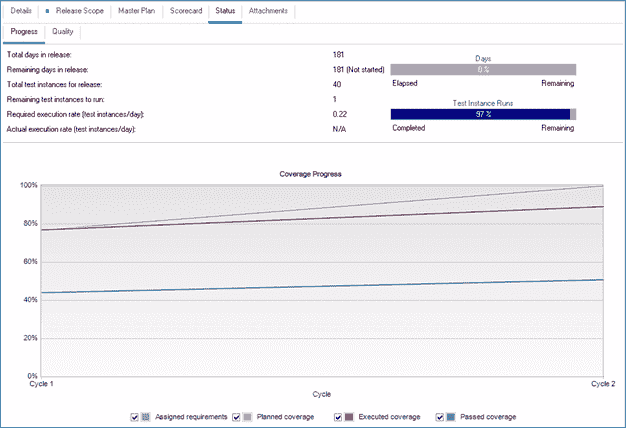

## 如何创建循环

实际上，每个发行版都进一步细分为多个周期，让我们了解如何在 ALM 中创建周期。 让我们说在我们的情况下，发布中有两个周期。

<colgroup><col> <col> <col> <col></colgroup> 
| **版本** | **循环名称** | **周期开始日期** | **周期结束日期** |
| 版本 R1 | 周期 1 | 01/01/2017 | 31/03/2017 |
| 周期 2 | 01/04/2017 | 30/06/2017 |
| 版本 R2 | Cycle 1 | 01/07/2017 | 30/09/2017 |
| Cycle 2 | 01/10/2017 | 31/12/2017 |

步骤 1）选择要在其下创建周期的发布，然后单击“ **New Cycles** ”按钮，随即打开新周期对话框，在该对话框中预填充了发布时间表，因为在所选版本下创建了此周期 。 用户必须在“新周期”窗口中输入以下必填详细信息：

*   周期名称
*   周期的开始日期
*   周期的结束日期。
*   说明（可选）

步骤 2）一旦创建了所有周期，用户就可以在创建的 Release 中访问相同的对象，如下所示。

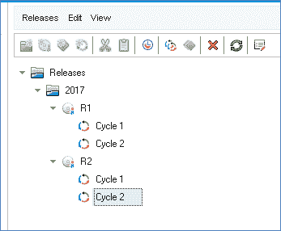

步骤 3）选择一个特定的循环以访问该循环的详细信息。

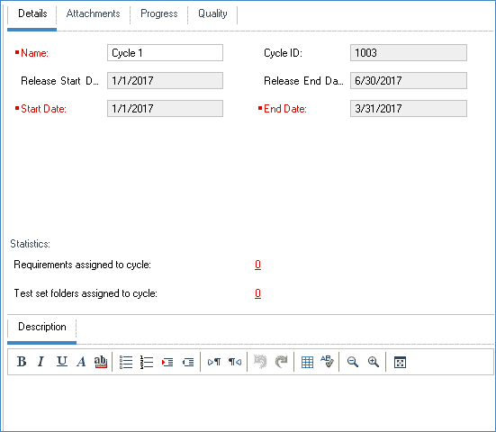

步骤 4）现在，让我们了解“周期”下显示的所有其他重要标签。 用户可以在“附件”标签下附加任何附件。 “ **进度选项卡”** 给出所选发行版下该循环的状态。

*   当用户创建周期而未映射任何工作项（要求/测试/缺陷）时，进度将如下所示显示。

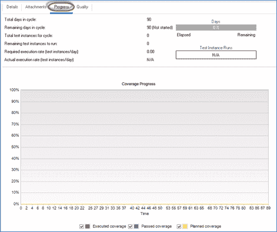

*   用户将工作项（需求/测试/缺陷）映射到周期后，进度将如下所示显示。

步骤 5）“质量”选项卡提供诸如缺陷开口率和未解决缺陷数之类的信息，这是有关当前循环质量的初步信息。

*   用户创建循环后，将显示“质量”选项卡，如下图所示，因为没有工作项映射到该选项卡。

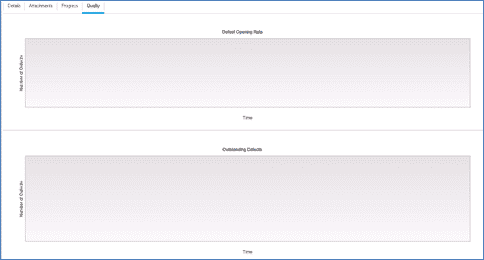

*   一旦用户根据该版本映射了工作项，“质量”选项卡将如下所示显示。

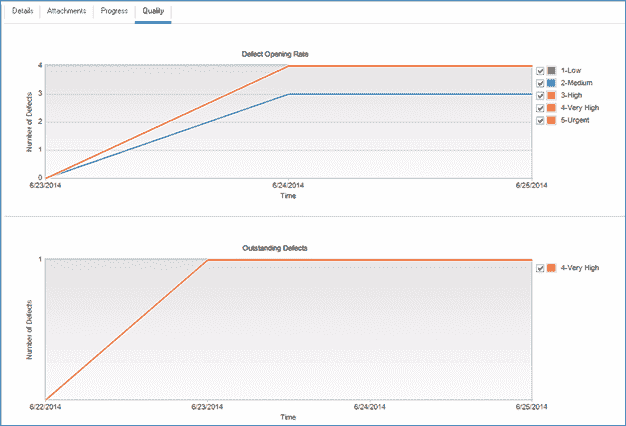

## 如何创建发布范围

每个发行版都有一个与其相关联的范围和里程碑，可以在“发行版”下的“ **发行范围**”选项卡下添加该发行版。

步骤 1）在发布模块的发布范围选项卡上单击“ +”图标，将打开**新作用域**对话框。

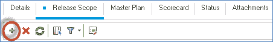

输入以下详细信息。

1.  范围的名称，这是唯一的必填字段
2.  范围项的优先级
3.  范围的所有者。
4.  关于范围的描述。

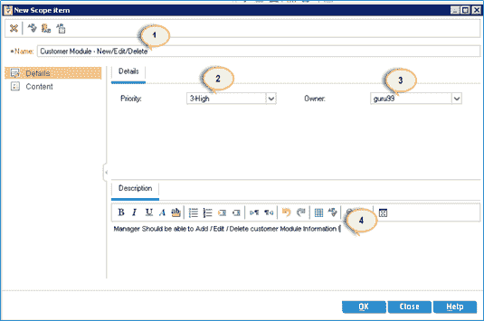

步骤 2）单击**“ OK”** 按钮后，所有添加的范围显示在“ **Release Scope** ”选项卡中，如下所示。

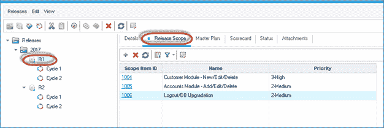

## 如何创建 MileStone

步骤 1）只能在发布下使用“新里程碑”图标创建新里程碑，如下所示。

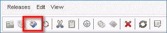

步骤 2）在创建里程碑时，必须填写以下字段。

1.  里程碑名称
2.  开始追踪日期
3.  结束跟踪日期。
4.  描述

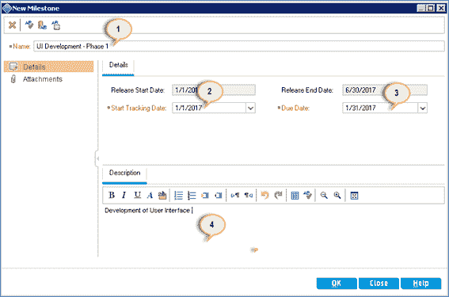

步骤 3）创建的里程碑如下所示。

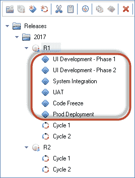

步骤 4）现在，用户可以将里程碑范围映射到创建的项目范围。 要执行相同的操作，请选择里程碑并导航至 Milestone Scope，然后选择相应的范围并进行映射。

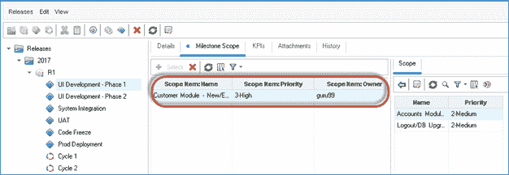