# HP ALM（质量中心）教程中的需求模块

> 原文： [https://www.guru99.com/hp-alm-requirements-specifications.html](https://www.guru99.com/hp-alm-requirements-specifications.html)

*   定义需求是软件开发生命周期的初步阶段之一。
*   定义需求是指在该特定版本结束时必须交付给客户端的内容。
*   预先简洁，明确地建立需求，将使开发完成后的返工最少。
*   ALM 中的该模块使用户可以定义，管理和跟踪需求。

我们将使用示例应用程序（GURU99 Banking）来更好地理解它。

在本教程中，我们将学习

*   [如何创建需求](#1)
*   [如何使用 Microsoft Excel](#2) 上传要求
*   [如何执行覆盖率分析（需求可追溯性）](#3)

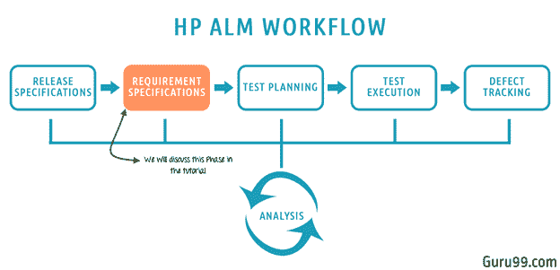

## 如何创建需求

**步骤 1）**Â在``需求''模块中单击``需求''。

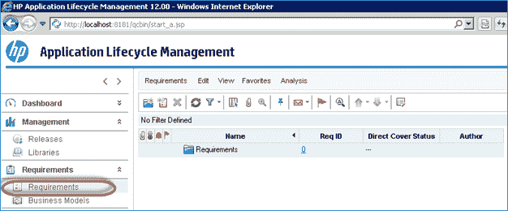

**步骤 2）**让我们在特定文件夹中维护此版本（2017 R1）的所有要求，以便我们轻松访问。 除此之外，我们还想通过将“功能”和“非功能”需求放在不同的文件夹中来区分它们。

1.  单击需求模块下的“新建文件夹”图标
2.  将文件夹的名称输入为“ **2017 R1** ”，以轻松确定此发行版的要求。

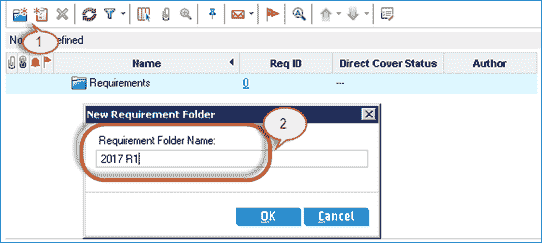

**步骤 3）**创建的文件夹如下所示。

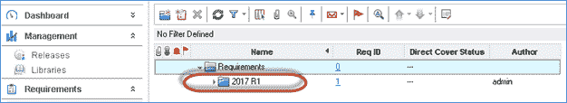

**步骤 4）**现在让我们为“ **Functional”** 创建一个文件夹，其中保留了所有功能需求文档/工作项。

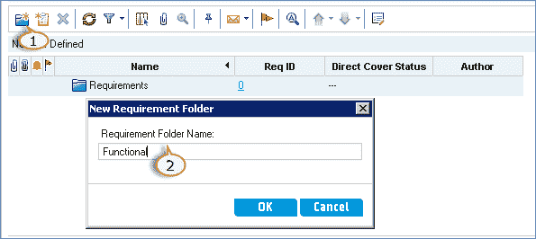

**步骤 5）**``创建的文件夹将显示在'**要求'**模块中，如下所示。

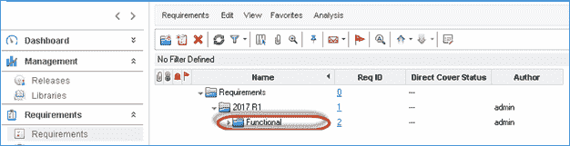

**步骤 6）**相似地创建``非功能性''文件夹。 创建功能文件夹和非功能文件夹后，我们将具有如下所示的文件夹结构。

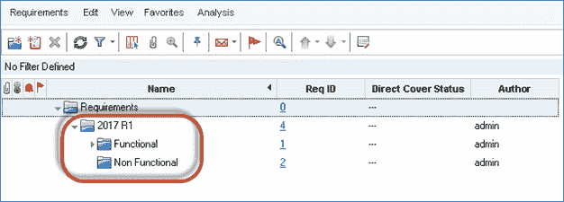

**步骤 7）**如下图所示，在需求页面中单击``新需求''图标。

“新要求”对话框打开，用户必须输入以下必填字段。

1.  输入需求名称
2.  选择需求类型

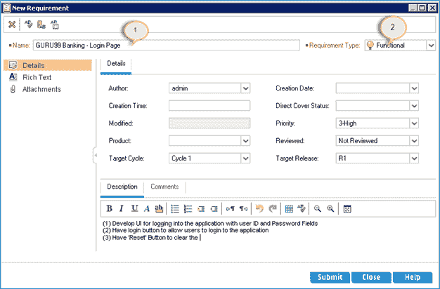

**步骤 8）**用户还可以输入以下非必填字段。

1.  作者
2.  优先
3.  已审核
4.  目标释放
5.  目标周期
6.  说明和注释。

**步骤 9）**需求还允许用户直接以' **Rich Text** '格式输入需求，如下所示。

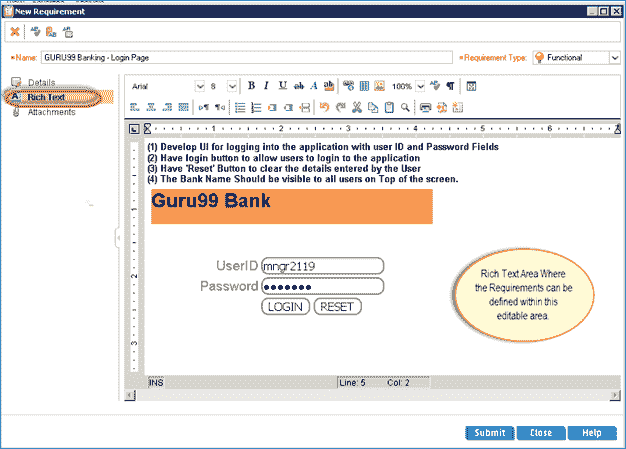

**步骤 10）**通常，需求是在 Word 文档中捕获的。 它们将在“附件”选项卡下上传，如下所示。 ALM 还支持所有其他文件类型，例如.xls，.jpg 等。上传后，单击 Submit 按钮。

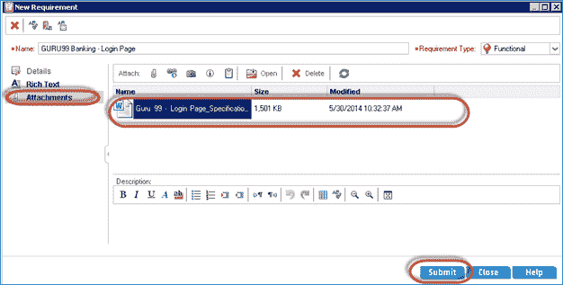

**步骤 11）**需求将显示给用户，如下所示：

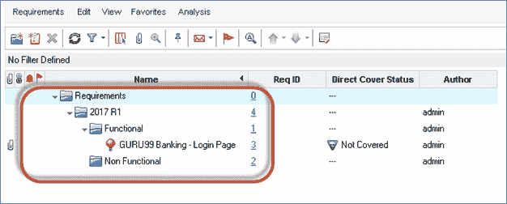

## 如何使用 Microsoft Excel 上传要求

有时，用户不会手动创建需求。 批量上传所有需求很容易，而不是一个个地创建每个需求，这很耗时。 为了便于上载到 ALM，HP 提供了一个 Addin，用户可以使用该 Addin 直接从 MS excel / MS Word 上传。 让我们了解将需求从 Excel 上传到质量控制的分步过程。

要上传需求，我们需要了解工作流程：

## A 部分-下载：

**步骤 1）**导航到 ALM 主页。 [http：// localhost：8181 / qcbin](http://localhost:8181/qcbin) ，然后从链接列表中单击“工具”。

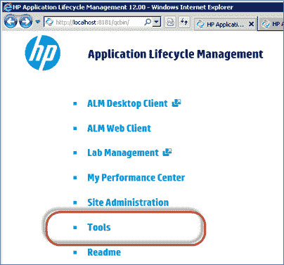

**步骤 2：**从加载项页面上单击“更多 HP ALM 加载项”链接，如下所示。

步骤 3）选择“ Microsoft 应用程序的加载项”，然后从链接中选择“ Microsoft Excel”，因为我们将使用 MS Excel 加载项将数据上传到 HP-ALM。

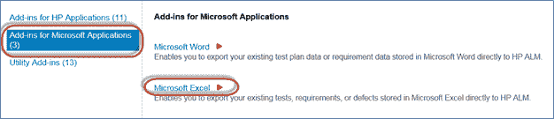

**步骤 3）**选择“ ALM 12.00 的 HP-ALM Microsoft Excel 加载项链接”。

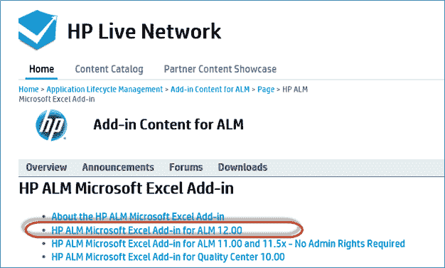

**步骤 4）**选择“ ALM 12.00 的 HP-ALM Microsoft Excel 加载项”链接。 用户还可以参考“自述文件”指南和“加载项”指南。 单击链接后，加载项设置文件将下载到默认位置/用户选择的位置。

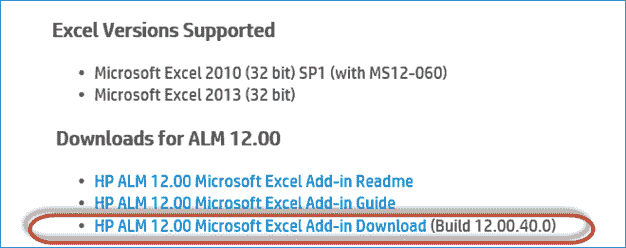

## B 部分–安装：

**步骤 1）**选择下载的加载项，然后右键单击下载的文件。 选择“以管理员身份运行”。

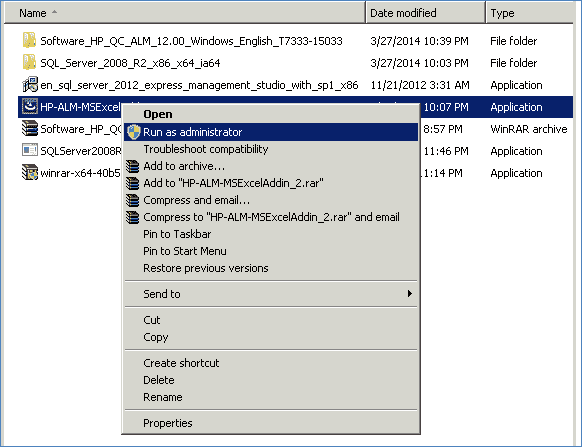

**步骤 2）**选择下载的加载项，然后右键单击下载的文件。 选择“以管理员身份运行”，以便我们可以安装加载项。

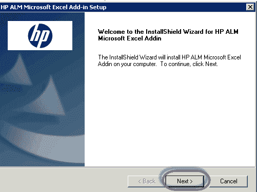

**步骤 3）**选择安装类型。 在这里，我们选择了“对于所有用户”，这是默认设置。 如果您只想为当前用户安装，请选择“仅对当前用户”，然后单击“下一步”。

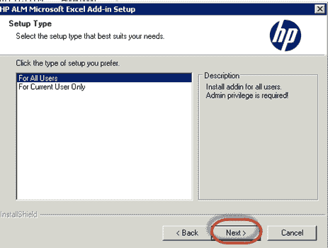

**步骤 4）**安装完成后，用户将收到状态消息。 点击“完成”按钮。

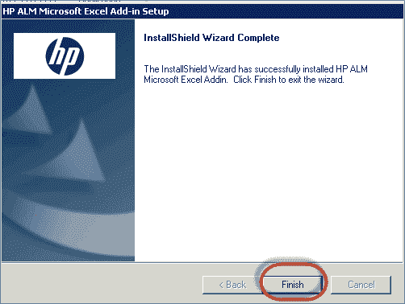

**步骤 5）**要验证加载项是否已成功安装，请打开 Excel 并导航至“加载项”选项卡。 您会找到“导出到 HP ALM”选项，这意味着已成功安装“加载项”。

## C 部分–将要求上载到 ALM 中：

**步骤 1）**从 excel 上载需求之前，我们需要准备 Excel 以使其可以上载。

1.  选择要上载到 ALM 的字段，并在 Excel 中为这些字段创建标题。
2.  在这些字段的每个字段中输入有效数据，如下所示。

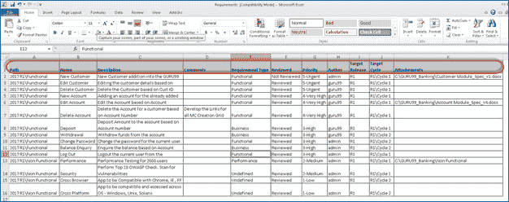

**步骤 2）**选择要上传的数据后，从“插件”中单击“导出到 HP ALM”。

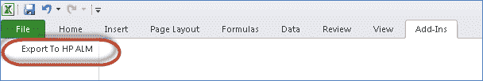

**步骤 3）**将打开 ALM 导出向导。 输入 HP ALM 服务器 URL，然后单击“下一步”。

输入用于身份验证的用户名和密码，然后单击“下一步”。

**步骤 3）**选择我们要上传要求的域，项目名称，然后单击“下一步”。

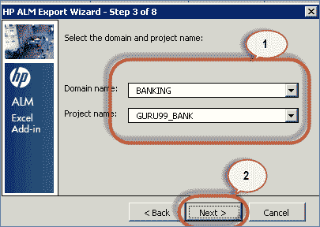

**步骤 4）**选择我们要上传的数据类型。 在这种情况下，这就是要求。 我们还可以上传测试/缺陷，稍后我们将对其进行处理。

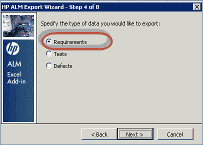

**步骤 5）**输入新地图名称。 第一个选项“选择地图”被禁用，因为到目前为止我们还没有创建地图。 因此，我们应该创建新的地图名称，然后单击“下一步”。 我们尚未选择“创建临时地图”，因为我们希望每次都重复使用它来上传“需求”。

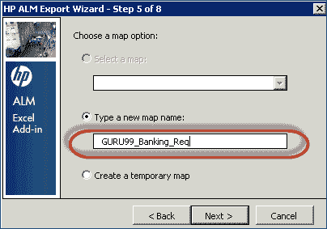

**步骤 5b）**在此对话框中，用户必须选择需求类型行为。 如果我们仅上传一种类型的需求，则应选择“单一需求类型”。

我们正在上传不同的需求类型。 因此，我们必须针对 excel 中的相应列进行映射。 根据我们的模板，列“ E”带有需求类型。

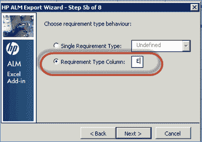

**步骤 6）**单击“下一步”后，映射对话框如下所示打开。

1.  列出的左窗格网格项目对应于可在 HP ALM 中上载的字段。 **请注意，标记为“红色”的字段应进行映射，因为它们是必填字段。**
2.  右窗格网格项目引用已映射的字段，以便 Excel 中的值将流入 ALM 的相应字段中。

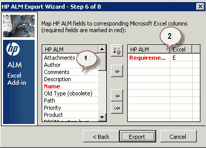

现在，让我们了解如何针对 ALM 中的字段映射 Excel 中的字段。

选择用户要映射的字段，然后单击箭头按钮，如下所示。

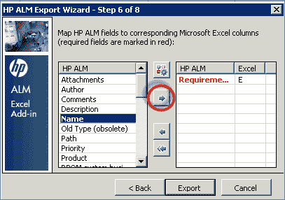

在 Excel 中输入与 HP ALM 中适当的列名称相对应的列名称。

Map all the required columns in excel against the appropriate fields in HP ALM. After mapping all the required fields, click 'Export'.

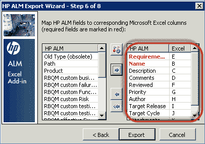

**步骤 8）**成功上传后，ALM 会显示如下消息。 如果出现错误，请解决此问题，然后尝试重新上传。

步骤 11）现在，让我们在“需求”标签下进行验证。 包括附件在内的所有需求明细均按如下所示上载。

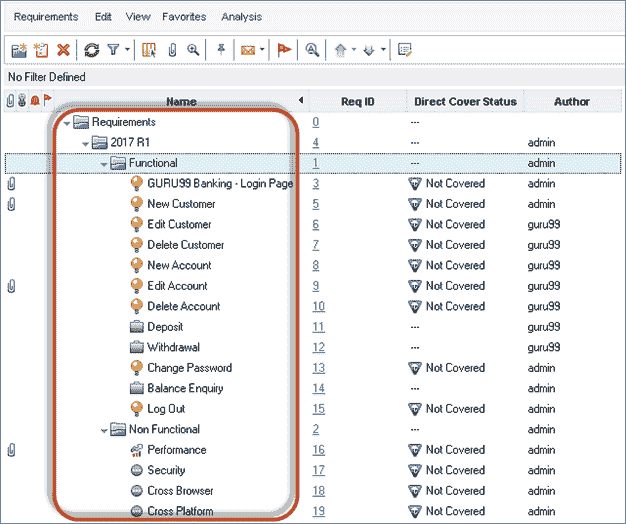

## 如何进行覆盖率分析（需求可追溯性）

一旦用户按照每一章中的说明绘制了所有需求，测试和缺陷，我们将能够生成覆盖率分析和可追溯性矩阵。

覆盖率分析有助于我们根据特定要求了解[测试覆盖率](/test-coverage-in-software-testing.html)，以及有关通过/失败/未执行的测试数量的详细信息。

**步骤 1）**导航到需求模块，然后单击“查看”菜单并选择“覆盖率分析”。

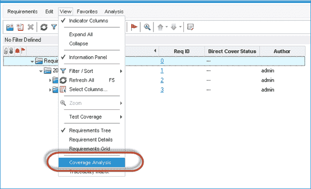

**步骤 2）**将针对在“需求选项卡”下放置的每个需求（在文件夹级别具有合并状态）生成覆盖率分析。

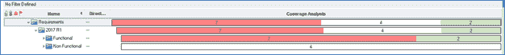

**步骤 3）**展开文件夹后，将显示覆盖率分析，如下所示。

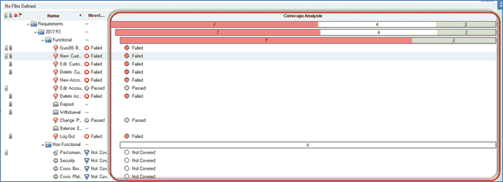

**步骤 4）**单击这些覆盖率分析状态中的每一个，以获取向下钻取报告。

1.  单击特定需求的状态。 将显示覆盖率分析以及失败数量。
2.  单击“显示测试范围”，将显示附加到所选要求的详细测试状态。

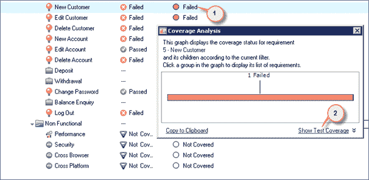

**步骤 5）**单击“显示测试覆盖率”后，将显示针对所选要求的测试执行状态。

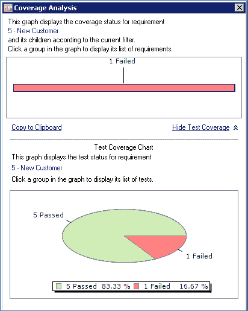

**追溯矩阵：**

*   [可追踪性矩阵](/traceability-matrix.html)使用户能够确定需求与其他需求（或需求与测试之间）之间的关系程度。
*   可追溯性矩阵列出了源需求及其相关的需求和测试。 矩阵显示每个源需求的关系总数。

**步骤 1）**第一步是导航到“查看”菜单，然后选择“跟踪矩阵”。

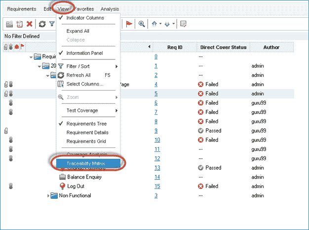

**步骤 2）。**可追溯性矩阵页面打开，如下所示。

*   点击“配置可追溯性矩阵”
*   “配置可追踪性矩阵”对话框打开。

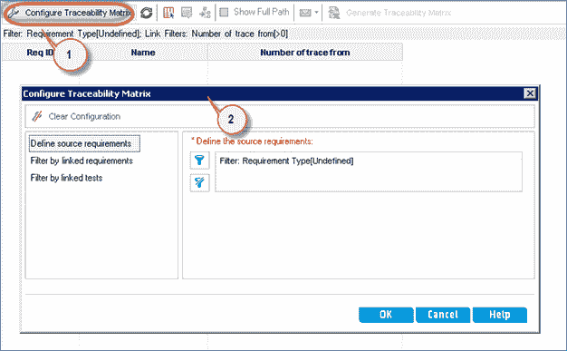

**步骤 3）**生成跟踪矩阵的标准如下所示。

*   点击“定义来源要求”下的“过滤器”
*   “过滤器要求”对话框打开。 单击过滤条件按钮。
*   选择过滤条件对话框打开。 从列表中选择“功能性”
*   点击“确定”。

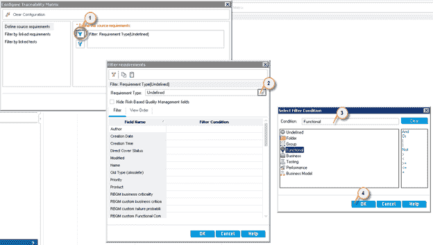

**步骤 4）**过滤条件对话框显示用户选择的过滤条件。 点击“确定”。

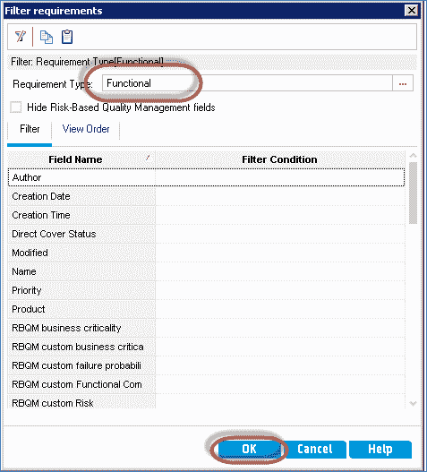

**步骤 5）。**显示“配置跟踪性”对话框

1.  使用选定的“需求类型”
2.  点击“按链接的测试过滤”链接。

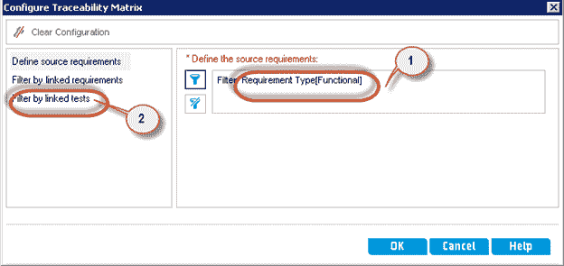

**步骤 6）**让我们生成需求和测试之间的可追溯性矩阵。 因此，在单击“按链接的测试过滤”时，将向用户显示以下对话框。

1.  启用“按链接的测试过滤”。
2.  选择“链接到”以下测试。
3.  让我们为那些经过 5 项以上测试的需求生成可追溯性矩阵。 因此，将过滤条件选择为“大于”
4.  输入一个值。 在这种情况下，它是“ 5”
5.  点击“确定”

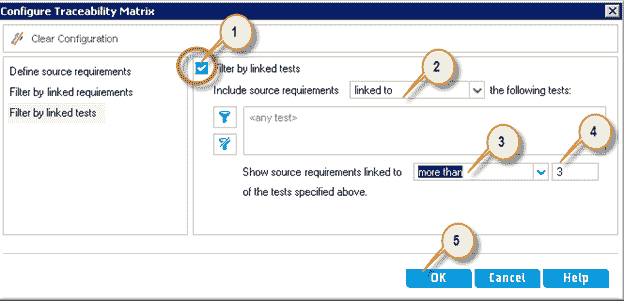

**步骤 7）**如果满足指定的可追溯性矩阵标准，则会向用户显示以下屏幕，其中包含所有要求及其相应的测试。

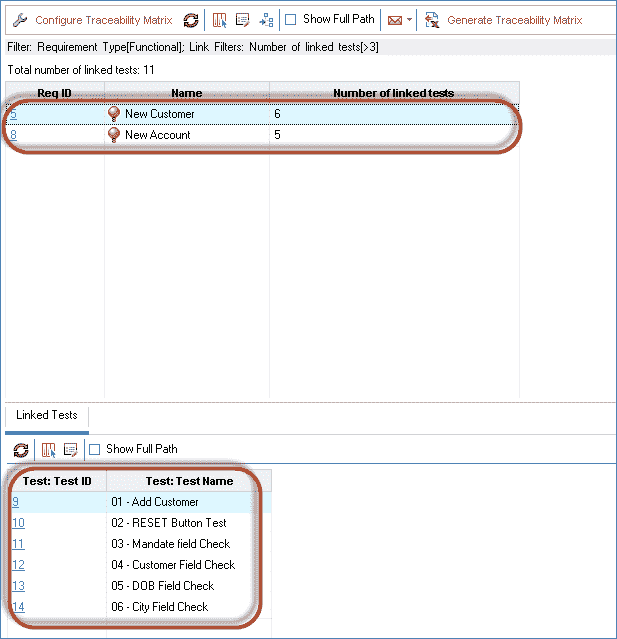

**步骤 8）**用户还可以单击“生成可追踪性矩阵”，该矩阵可以导出到 excel。

1.  选择必须为其生成追溯矩阵的详细信息。
2.  点击“生成追溯矩阵”。

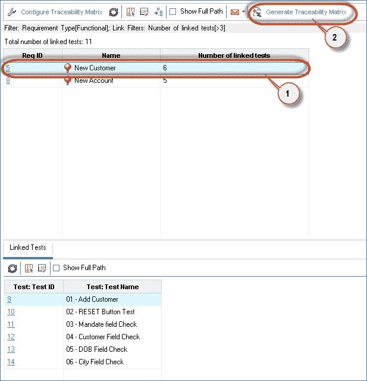

**步骤 9）。**向用户显示“文件保存”对话框。

1.  选择需要保存追溯矩阵的位置。
2.  输入文件名
3.  点击“保存”。

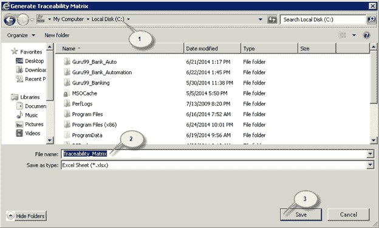

**步骤 10）**单击“保存”按钮后，将向用户生成可追溯性矩阵。

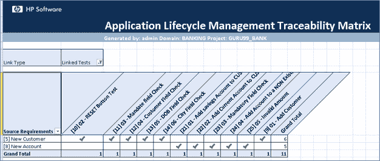

这是视频点播模块

**关键点：-**

*   QualityCenter 中的需求模块用于存储测试需求。在这些存储的需求的基础上，您将构建测试用例。
*   父母要求可能有孩子要求。
*   每个需求都分配了一个唯一的 ID 进行标识。