# HP ALM（质量中心）中的测试实验室

> 原文： [https://www.guru99.com/hp-alm-test-lab.html](https://www.guru99.com/hp-alm-test-lab.html)

*   一旦测试设计完成，将在“测试实验室”模块的帮助下执行测试执行。
*   在测试实验室的“测试集”模块中，您会在 HP ALM 中遇到一个常见术语。 如果您的想法触发了某种形式的集合或集合的图像，那么您是正确的。 测试集实际上是我们打算执行的测试用例的集合。
*   来自[测试计划](/what-everybody-ought-to-know-about-test-planing.html)模块的测试用例被称为“测试实验室”模块。
*   对“测试实验室”模块中的测试用例所做的更改不会影响“测试计划”模块中的父测试用例。 您可以自由尝试。 因此，名称为 Test Lab！

*   最好给测试集名称与模块名称相同，以便模块内的所有测试都包含在同一测试集中，这将易于执行和跟踪。
*   每个测试集文件夹都分配给一个特定的周期。 这使用户可以将要在特定周期中执行的测试分组在一起。
*   该模块还帮助用户在执行测试时跟踪周期的进度。
*   测试实验室模块包含以下功能，让我们详细了解其中的每个功能。

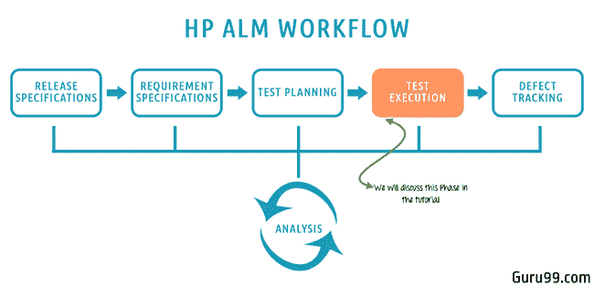

在本教程中，我们将学习-

*   [如何创建测试集](#1)
*   [如何执行测试](#2)
*   [如何创建测试运行时间表](#3)
*   [如何分析测试结果](#4)

## 如何创建测试集

**步骤 1** ）第一步是创建一个根文件夹作为包含测试集的容器。 我们可以根据发布和周期来命名它，以便于跟踪。

1.  转到“测试”标签下的“测试实验室”模块
2.  通过单击“新文件夹”图标创建一个新文件夹。
3.  “新测试集文件夹”对话框打开。 输入文件夹名称为“ 2017 R1 – Cycle 1”。
4.  点击“确定”

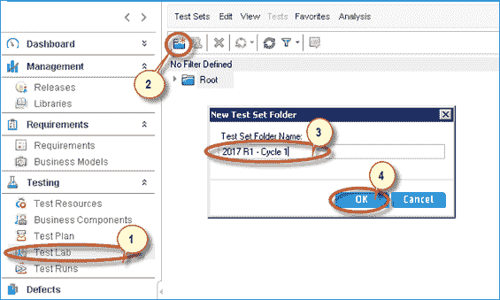

**步骤 2）**将创建测试运行文件夹，如下所示。

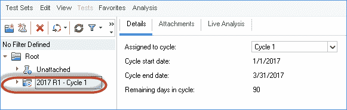

**步骤 3）**选择创建的文件夹并为其分配“ Cycle”，这意味着应为 Cycle 1 执行整个测试集。

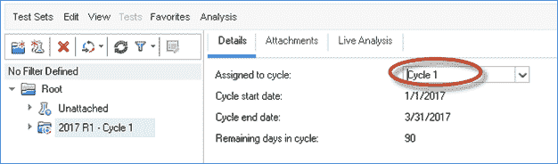

**步骤 4）。**输入测试集的名称，然后单击“确定”。

*注意：由于在文件夹级别（2017 R1 –循环 1）选择了目标循环，因此“目标循环”字段被禁用。*

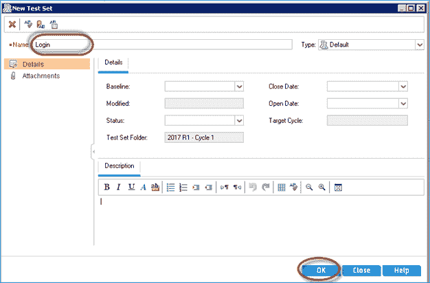

**步骤 5）**创建测试集后，我们需要选择测试并将其添加到测试集中。

1.  选择测试集。
2.  导航到“执行网格”。
3.  点击“选择测试”按钮。 将打开“测试计划树”。
4.  选择要为此循环执行的测试。
5.  点击“ < =”按钮。 这会将测试用例从测试计划移至测试实验室。

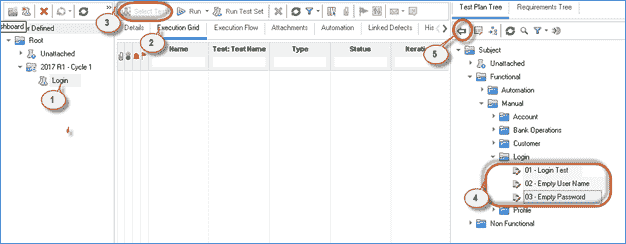

**步骤 6）**在从测试计划树中添加测试后，会将所选测试的所有配置参数显示给用户。 用户可以在将配置添加到测试实验室之前对其进行编辑。

***注意：用户无法控制测试实验室中的测试配置选择。 因此，默认情况下，整个配置将添加到测试集中。 如果所选配置之一不是周期的一部分，则在添加测试后，从测试实验室*** 中删除。

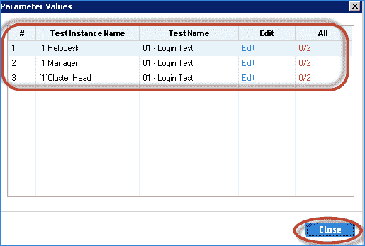

**步骤 7）** selecting 选择配置后，将所选测试添加到测试集中。 在这种情况下，我们选择了所有三种配置。 因此，我们可以找到“ 01 登录测试”的三个实例。

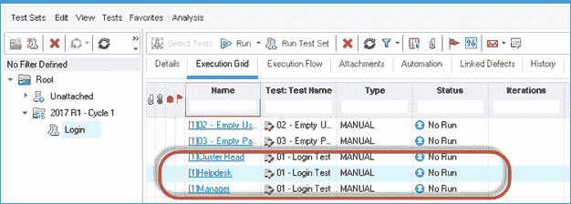

**步骤 8）**重复上述步骤以创建更多测试集，并选择为此周期计划的所有相关测试。 创建完所有测试集后，测试集的结构将如下所示：

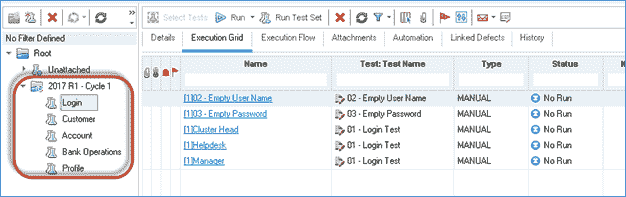

**步骤 9）**我们需要了解的另一个重要标签是“执行流程”。 选择“执行流程选项卡”，该选项卡显示测试在执行过程中的显示顺序。 用户还可以使用此选项卡更改执行顺序，该选项卡将在此模块的单独部分中处理。

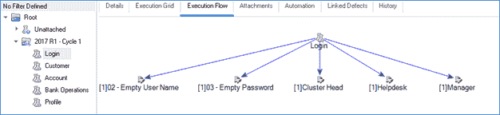

## 如何执行测试

**步骤 1）**现在可以执行创建的测试集了。 可以使用两个选项执行测试。

*   **运行测试集** －此选项允许用户执行所选测试集中的所有测试。
*   **运行**-此选项可帮助用户仅执行所选的测试。

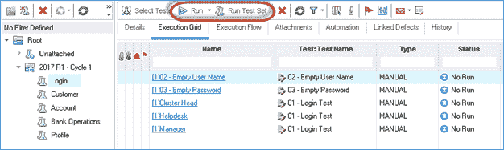

**步骤 2）**。让我们通过选择“运行测试集”选项来执行登录模块的整个测试套件。 单击“运行测试集”后，它将为用户显示两个选项。

1.  **Manual Runner** （默认）–执行期间显示的测试顺序将与测试集网格中显示的顺序相同。
2.  **自动运行程序**-执行期间显示的测试顺序将显示为在执行流程选项卡中设置的顺序。

让我们继续使用默认选项。

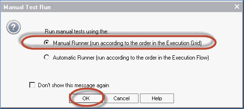

**步骤 3）。**手动测试运行器显示给用户。 在此对话框中，让我们了解重要功能。

1.  **Begin Run** －帮助启动执行
2.  **结束运行**-终止当前执行并关闭手动流道。
3.  **取消运行** －取消当前测试的执行。
4.  **附件** －帮助我们附加屏幕截图/与此测试执行相关的任何其他信息
5.  **新缺陷** －单击它后，将打开新缺陷对话框，可在其中发布[缺陷](/defect-management-process.html)。
6.  **OS 信息**-提供有关在其中执行测试的操作系统的信息。
7.  **运行名称**-唯一的时间戳记，通过它可以在以后的时间点分析测试结果。

点击“开始运行”。

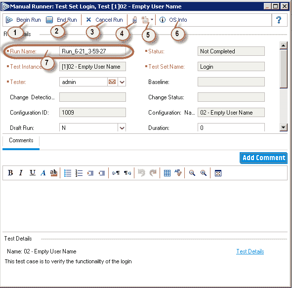

**步骤 4）**带有测试控件和步骤的手动测试运行器将显示给用户。 让我们了解此“测试运行器”对话框中可用的功能。

<colgroup><col> <col></colgroup> 
|  | 在测试执行期间添加一个步骤。 |
|  | 在测试执行期间删除一个步骤。 |
|  | 通过选择 |
|  | 选择失败 |
|  | 显示所选测试步骤的参数 |
|  | 允许用户在运行时捕获屏幕截图并添加附件。 |
|  | 允许用户在运行时添加缺陷。 |
|  | 向用户展示测试跑步者的紧凑视图 |
|  | 结束执行 |

1.  在测试设计阶段创建的步骤编号
2.  所选步骤的描述。
3.  Expected Result of the selected step.

    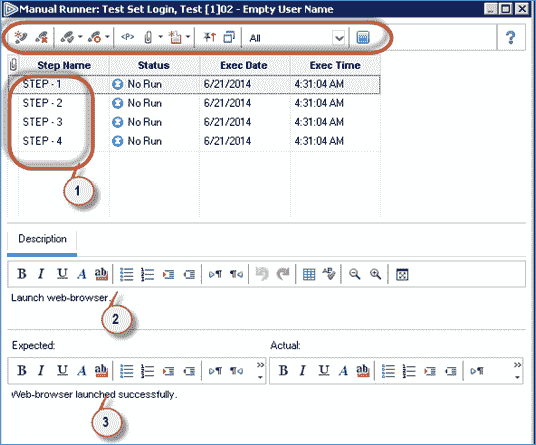

**步骤 5）**然后将向用户显示测试集中的下一个测试。 重复步骤 3 和步骤 4 以执行测试并相应地标记状态。

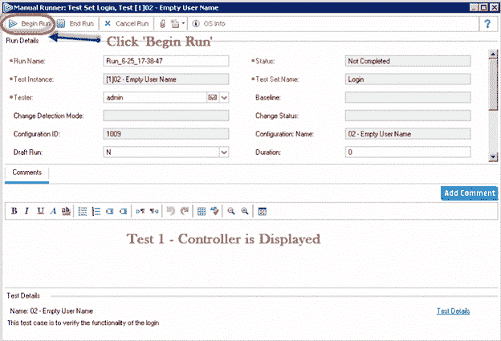

## 如何创建测试运行时间表

测试人员可以借助“执行流程”选项卡来控制测试的执行。 测试人员还可以指定执行特定测试实例的日期和时间。 我们还可以根据执行流程中另一个指定测试实例的结果来安排测试时间。

现在，让我们了解如何在 HP-ALM 中安排测试流程。

**步骤 1）**从“测试实验室”模块中选择“执行流”选项卡。

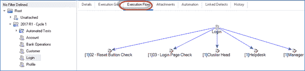

**步骤 2）**双击需要针对其设置时间表的特定测试。 将显示“测试运行时间表”，如下所示。 我们可以注意到，没有默认设置的执行条件。

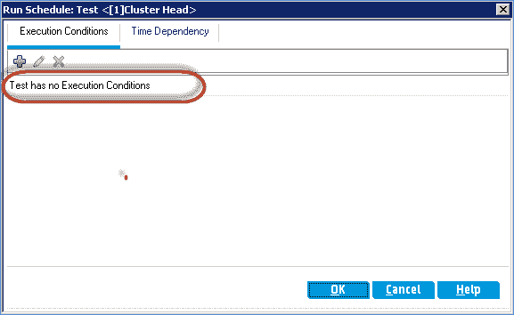

**步骤 3）**要添加执行条件，请单击“ +”图标，如下所示。

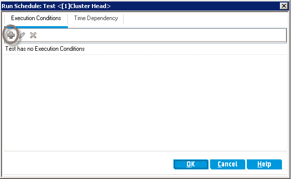

**步骤 4）。**将打开“新执行条件”对话框。

1.  从测试下拉列表中选择测试。 将显示测试集中的所有测试
2.  选择条件。 它可以是“通过”或“完成”。
3.  Click 'OK'.

    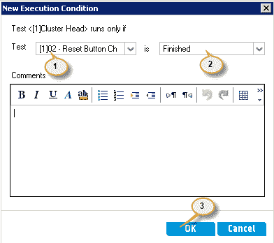

**步骤 5）**显示测试运行时间表以及执行条件。

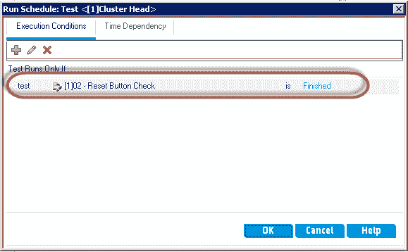

**步骤 6）**执行流自动重新排列，如下所示。 根据以下显示的流程，仅在完成“ 02 –重置按钮检查”后才执行测试“簇头”。

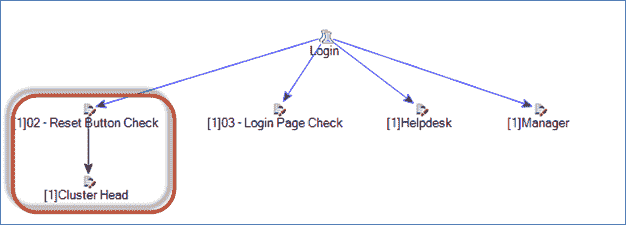

**步骤 7）**现在，我们了解测试人员如何为执行特定测试的执行流程指定日期和时间。 当测试人员了解特定功能的准备情况或安排自动测试时，它会更有帮助。

让我们说，经理登录配置文件只有在特定日期之后才能准备就绪。 因此，测试人员可以通过在“执行流程”中指定条件来执行相同的操作。

双击需要设置执行流程标准的测试。

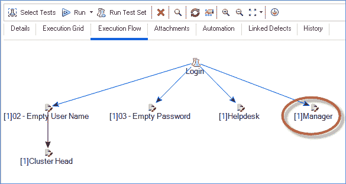

**步骤 8）。**现在，

1.  导航到“时间依赖”模块
2.  选择“在指定时间运行”
3.  输入您要执行的日期
4.  输入您想要执行测试的时间
5.  点击“确定”。

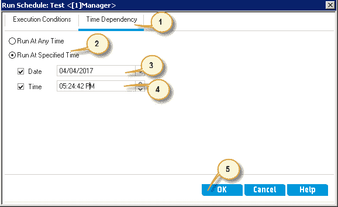

**步骤 9）**执行流程选项卡将如下所示重新对齐。 这种安排对于遵循相同步骤的自动化测试非常有帮助。

**注意：**如果计划的日期和时间已到，则 ALM 将自动启动测试。 它适合自动测试，因为无需任何人工干预即可执行测试。 自动触发测试的前提条件是主机应准备就绪（不应断电或锁定），并且应处于触发测试的状态。 如果是手动测试，则不会有任何效果。

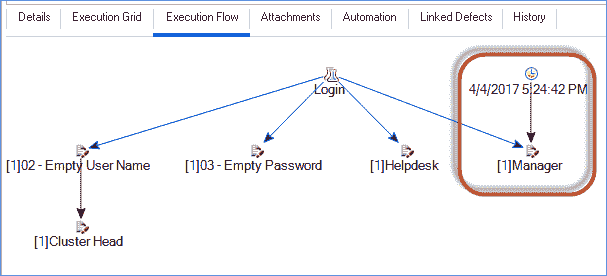

## 如何分析测试结果

**步骤 1）**完成测试执行后，测试人员可以在“测试运行”模块中查看结果。 它包含测试实例运行和测试集运行的结果。

1.  在“测试”选项卡中转到“测试运行”，窗口打开，如下所示：
2.  “运行名称”是为每个测试执行中的每一个生成的唯一值。
3.  “状态”显示测试执行的最终状态。

通过单击“运行 ID”可以查看详细的结果。

**步骤 2）。**将打开“运行详细信息”对话框，用户将可以查看详细结果。

1.  转到“运行详细信息”窗口的“报告”选项卡。
2.  测试人员可以检查其中每个测试步骤的状态。
3.  单击“确定”关闭对话框。

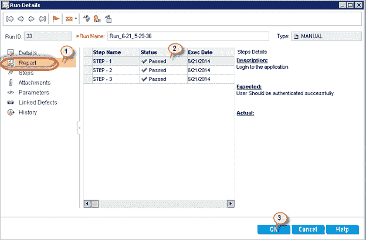

测试实验室视频

**指向要记住的**：

*   您将使用 QualityCenter 中的**测试实验室**模块执行测试用例
*   在开始执行之前，您需要创建一个“测试集树”
*   要创建测试集树，您需要首先创建一个``测试集文件夹''
*   接下来，您将在测试计划模块中创建的``测试''添加到您的测试集文件夹中。
*   测试集文件夹和添加的测试一起称为“测试集树”（因为它看起来像树形结构。）
*   测试集可以包括手动和自动测试。
*   您可以将同一测试包含在不同的测试集中，也可以将一个测试的多个实例添加到同一测试集中。
*   Quality Center 还提供了计划安排，您可以在其中指定执行测试集的日期和时间。