# 仪表板，报告 HP ALM（Quality Center）中的&分析

> 原文： [https://www.guru99.com/hp-alm-dashboard.html](https://www.guru99.com/hp-alm-dashboard.html)

*   ALM 允许用户在软件开发过程中随时生成报告和图形。
*   ALM 中的项目报告使用户能够通过访问项目信息来设计和生成自定义报告，这将帮助利益相关者做出明智的决策。
*   用户可以在“分析视图”模块中创建图形或项目报告。 他们还可以将图形和报告保存在“分析视图”模块中，以备将来参考。

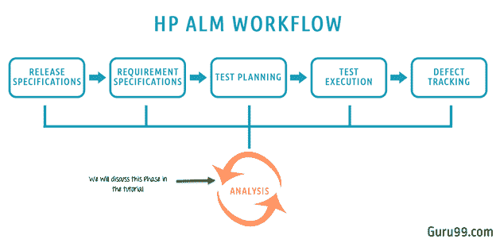

在本教程中，我们将学习–

*   [分析视图](#1)
*   [业务视图图](#2)
*   [快速实体图生成](#3)
*   [生成 Excel 报告](#4)
*   [生成项目报告](#5)
*   [信息中心](#6)

## 分析视图

分析视图模块使用户可以创建，管理和查看分析项目，例如图形，项目报告和 Excel 报告。

**实体图：** ALM 使用户能够根据某些实体类型（例如需求，测试，测试实例，测试运行或缺陷）生成图。 对于每个实体，下面列出了不同的图形类型。

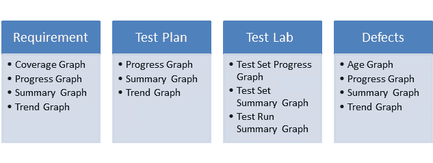

最常用的图形是

*   需求覆盖图
*   需求摘要图
*   测试集摘要图
*   缺陷进度图
*   缺陷摘要图
*   缺陷年龄图。

现在，让我们基于“缺陷摘要”条件生成一个实体图。

**步骤 1）**导航到“仪表板”选项卡。

1.  选择分析视图
2.  点击“新建”。
3.  选择“图形向导”

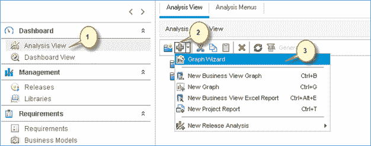

**步骤 2）**让我们生成“实体图”。 我们还可以生成业务视图图，然后单击“下一步>”。

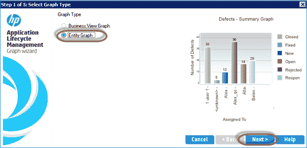

**步骤 3）。**向用户显示“选择实体类型”对话框。

1.  选择要为其显示图的实体
2.  选择图类型。
3.  单击“下一步”。

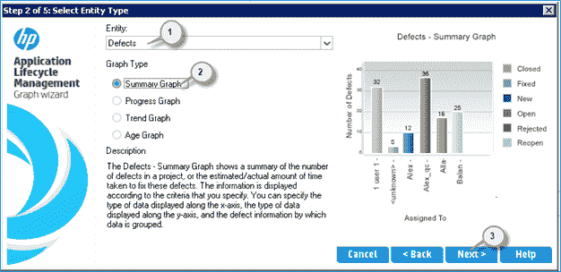

**步骤 4）**向导还允许您选择项目。 用户具有跨项目添加相同图形配置的功能。

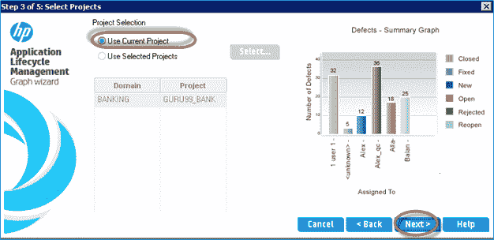

**步骤 5）**向导还允许您输入过滤条件。 如果未应用任何过滤器，则通过考虑缺陷模块中的所有可用数据来生成图形。

**注意：可以针对特定发行版/周期应用过滤器。 如果设置了“不过滤器”，则图形向导将拾取所有发布的缺陷，直到考虑在内。**

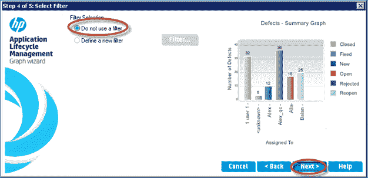

**步骤 6）**向导允许用户在特定字段中选择 X 轴和分组，然后单击“完成”。

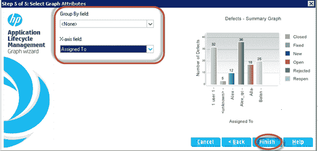

**步骤 7）**根据用户在“图形向导”中设置的标准生成图形。 我们可以将其“添加到分析树”中，这样​​我们就可以刷新图表以获取当前状态。

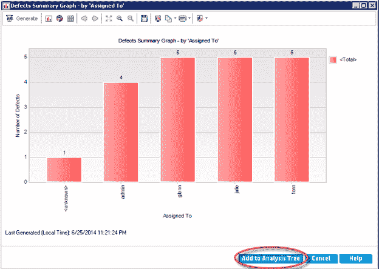

**步骤 8）**单击“添加到分析树”后，将打开保存对话框。

1.  输入图的名称
2.  选择用户想要保存图表的文件夹
    1.  **私有**-根据当前用户配置文件保存图形。 其他人将无法访问相同的内容
    2.  **公开** –生成的图将对所有项目用户可见。
3.  单击“保存”。

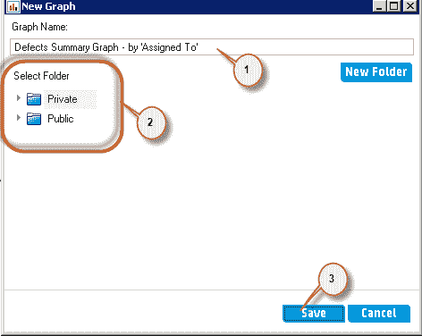

**步骤 9）**该图将添加到“分析”树中，如下所示。

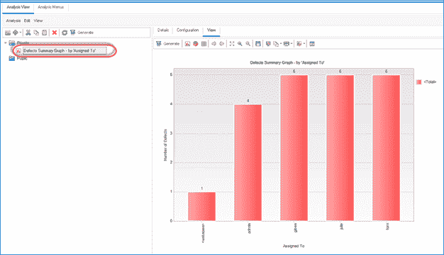

## 业务视图图

业务视图图仅涉及那些表示从业务角度来看有用的信息的项目实体字段。

业务视图可以基于单个实体（例如，需求或缺陷），也可以基于实体之间更复杂的关系，例如，具有链接的需求的缺陷/具有链接的测试的缺陷。

虽然从较高的角度看，业务视图图和实体图是相同的，但在这一点上，让我们了解了实体图和业务视图图之间的基本区别。

<colgroup><col> <col></colgroup> 
| 实体图 | 业务视图图 |
| 此图仅与 ALM 中的一种类型的实体（缺陷，需求或测试）严格关联 | 该图基于单个实体或基于[缺陷](/defect-management-process.html)与需求或缺陷和测试之间的关系 |
| 涉及的字段是该特定实体中包含的字段。 | 涉及的字段是从业务角度表示有用信息的字段。 |

**步骤 1）**单击'+'并选择'Graph Wizard'。

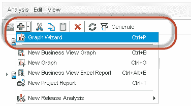

**步骤 2）。**选择业务视图图，然后单击“下一步>”

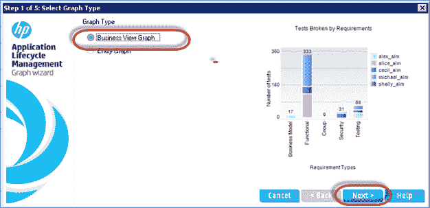

**步骤 3）**从筛选条件中选择缺陷，然后单击“下一步>”。

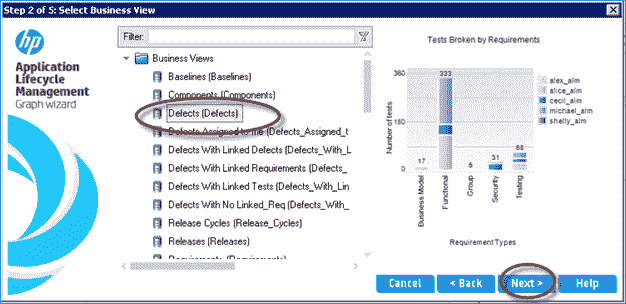

**步骤 4）**使用当前项目数据生成图形，然后单击“下一步>”继续。

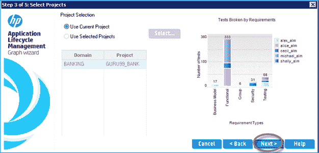

**步骤 5）。**让我们根据严重性进行过滤，然后点击“下一步>”

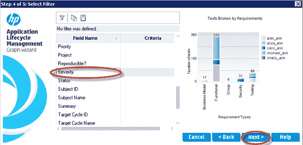

**步骤 6）。**输入“ X 轴”和“分组依据”字段的条件，然后单击“完成”

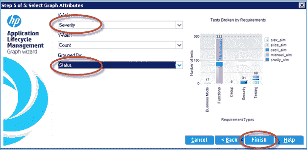

**步骤 7）**根据选择的条件生成图形。 单击“添加到分析树”。

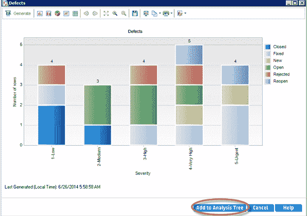

**步骤 8）。**出现保存对话框，供用户保存生成的图形。

1.  输入图的名称
2.  选择“私人”或“公共”
3.  点击“保存”。

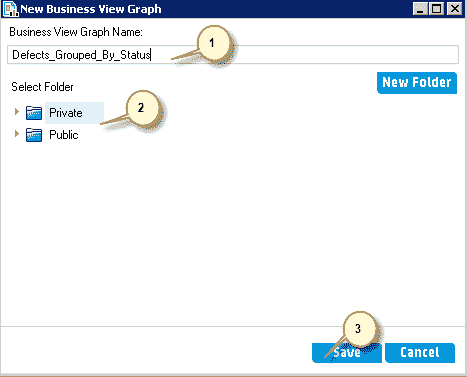

**步骤 9）**创建的图形保存在分析树中，如下所示。

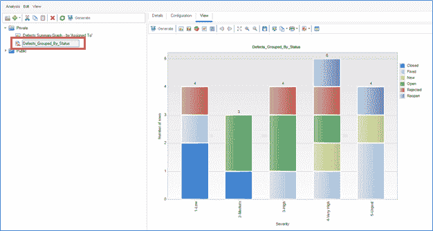

## 快速实体图生成

**步骤 1）**实体图也可以不通过图向导来生成。 通过单击“ +”图标单击“新图”可以生成快速图。

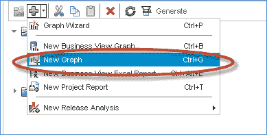

**步骤 2）**``将显示``新图''对话框。

*   选择实体
*   图形类型
*   图表名称
*   点击“确定”。

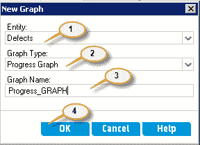

**步骤 3）**``创建的图使用户可以根据自己的要求对配置进行更改。 我们选择了 Y 轴上的缺陷计数并基于“状态”进行了分组。

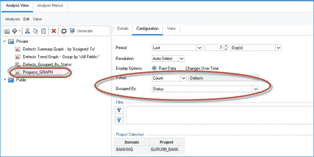

**步骤 4）**Â单击``查看''选项卡以生成指定条件的图形。

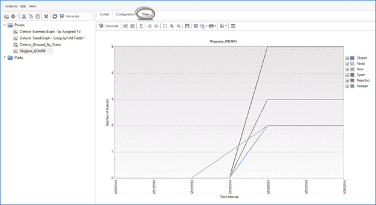

## 生成 Excel 报告

*   测试人员还可以基于业务视图生成 Excel 报告，这些业务视图仅反映从业务角度来看有用的那些项目实体字段。
*   在 Microsoft Excel 中创建和配置报告，然后将其上载到 Analysis View 模块。

**步骤 1）**单击“添加新”按钮，然后选择“新业务视图 Excel 报表”。

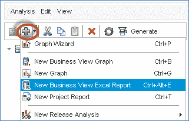

**步骤 2）。**输入报告名称，然后单击“确定”。

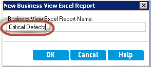

**步骤 3）**单击“安装插件”。

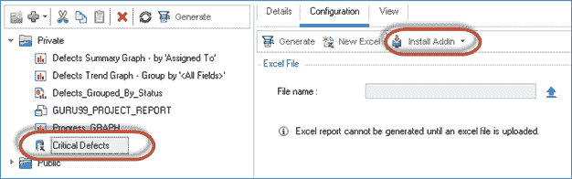

**步骤 4）。**安装状态显示给用户，如下所示。

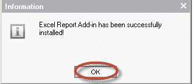

**步骤 5）** OpenMS Excel，然后将找到一个名为“ HP ALM”的新标签。 选择“ HP-ALM”，然后单击“登录”

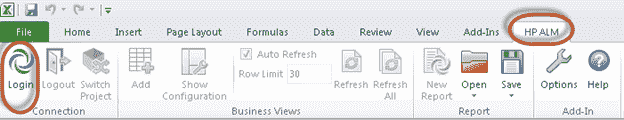

**步骤 6）。** ALM 登录对话框打开。

1.  输入登录名。
2.  输入密码。
3.  点击“验证”。
4.  选择域。
5.  选择项目。
6.  点击“登录”。

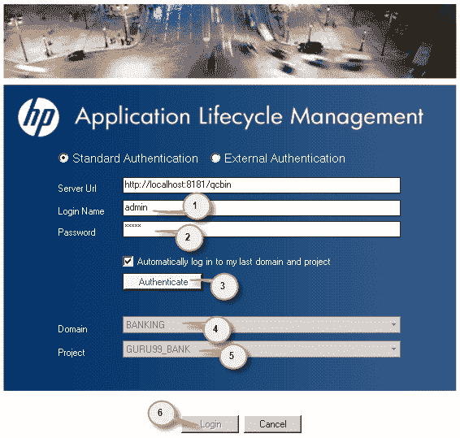

**步骤 7）。**现在，

1.  点击“添加”按钮。
2.  添加工作表对话框打开。 选择“缺陷”，因为我们要生成“高” /“非常高”和“严重”缺陷报告。
3.  点击“确定”

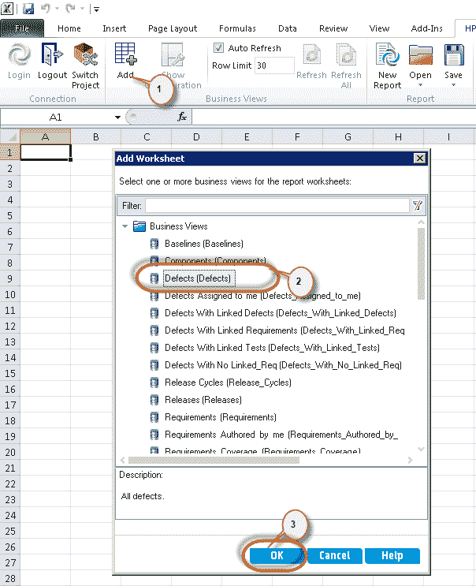

**步骤 7）**生成具有所有缺陷列表的 Excel 报告，用户可以对其进行配置。

1.  在工作表配置中，点击“过滤器”标签。
2.  点击“严重性”字段。

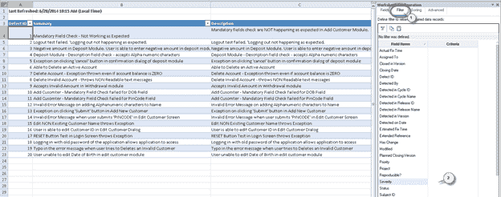

**步骤 8）。**打开“选择过滤条件”对话框。

1.  选择过滤条件
2.  点击“确定”

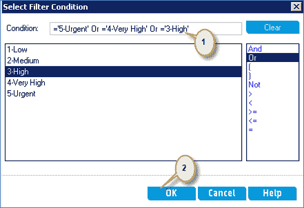

**步骤 8）**现在我们需要将其保存到我们创建的 Excel 报表中。

单击“ HP ALM”选项卡，然后单击“保存到 ALM”。

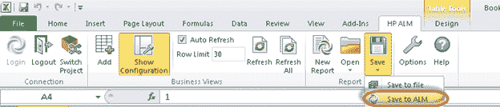

**步骤 9）。**打开“保存业务视图 Excel 报表”对话框。

1.  输入报告名称
2.  选择我们在步骤 2 中创建的同一报告。
3.  点击“保存”。

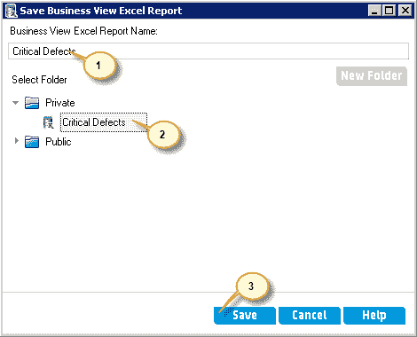

**步骤 10）。**确认保存对话框打开。 点击“是”继续。 当用户试图用已经创建的对话框覆盖时，该对话框弹出。

注意：由于我们选择了在步骤 2 中创建的相同报告名称，因此 ALM 要求覆盖现有 excel 报告。在步骤 2 中，未配置和加载该报告，但它只是该报告的占位符。 仅在执行此步骤后，excel 报告才可供用户生成并以 excel 格式保存。

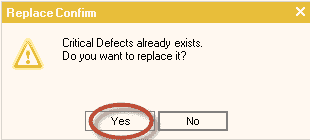

**步骤 11）**现在，用户可以从 ALM 生成报告。 点击“生成”。

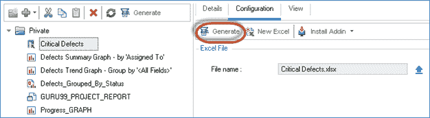

**步骤 11）**现在根据用户设置的条件显示报告。

*注意：如果存在缺陷的添加或删除或缺陷的严重性发生更改，则用户可以通过重新生成 excel 报告来获取更新的报告。*

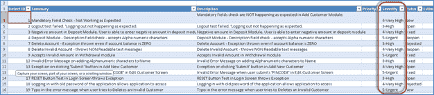

## 生成项目报告

*   项目报告使用户能够设计和生成包含特定项目信息的详细报告。
*   用户还可以定义每个列出指定 ALM 实体记录的部分和子部分。
*   用户可以为每个部分自定义布局和模板格式。
*   项目报告可以生成为 HTML，Microsoft Word 或 PDF 格式。

**步骤 1）**要创建新项目报告，请单击 Analysis Module 中的“ +”图标，然后选择“ New Project Report”。

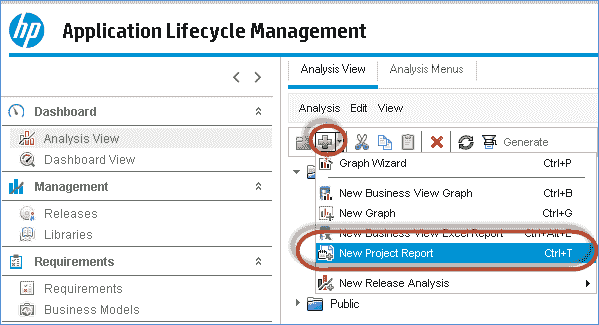

**步骤 2）**将打开新项目“报告”对话框。 输入项目名称，然后单击“确定”。

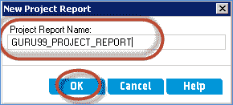

**步骤 3）。**更改反映在屏幕上，如下所示

1.  项目报告已创建。
2.  点击“添加报告部分按钮”。

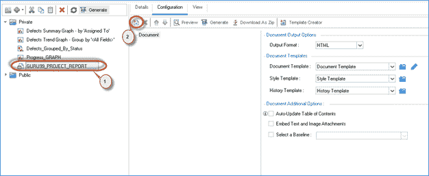

**步骤 4）**显示添加报告部分对话框。

1.  用户必须输入他们想要包括的部分的类型
2.  输入板块名称
3.  点击“确定”。

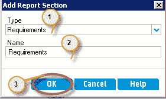

**步骤 5）**现在将“需求”部分添加到报告中。

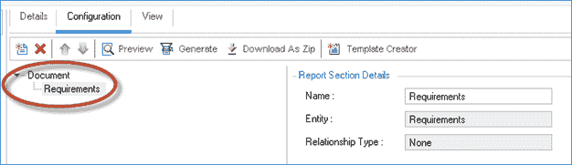

**步骤 6）**现在我们将添加测试报告部分。

1.  点击“添加报告部分”。
2.  从“添加报告部分”对话框中选择要插入的“报告类型”
3.  输入报告部分的名称。
4.  点击“确定”。

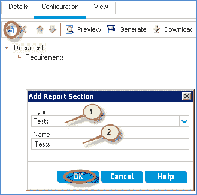

**步骤 7）**将添加名称为“ Tests”的报告部分，如下所示。

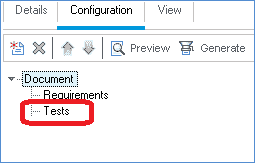

**步骤 8）**类似地，为缺陷创建一个区域，最终报告的布局将如下所示。 添加后，点击“生成”按钮。

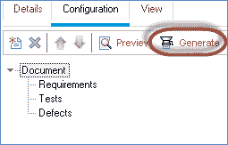

**步骤 9）**该报告将通过连接到服务器生成。

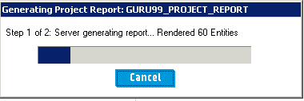

**步骤 10）**将根据用户指定生成项目报告。 用户可以从生成的窗口中保存项目报告。 如果生成的格式是 doc 或 docx，则可以从 MS Word 中保存。 如果所选文件格式为 HTML，请从相应的浏览器中保存它。 如果生成的报告为 PDF 格式，请从 PDF 阅读器中将其保存。

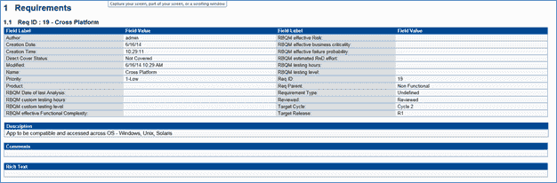

## 关于仪表板的全部

*   该模块通过根据需要在页面上选择和排列图形来帮助用户设计仪表板页面。
*   该模块对涉众/项目经理非常有用，可以快速获得有关项目状态的快照。

**步骤 1）**要创建仪表板页面，

1.  单击仪表盘视图
2.  点击“新仪表盘页面”图标
3.  “新建仪表板页面”对话框打开。 输入仪表板页面的名称。
4.  点击“确定”。

**步骤 2）**创建的仪表板显示如下。

1.  创建的仪表板页面
2.  点击“配置”。
3.  显示图树，用户可以从中选择所有图
4.  通过单击“ < =”按钮，将其添加到仪表板页面。

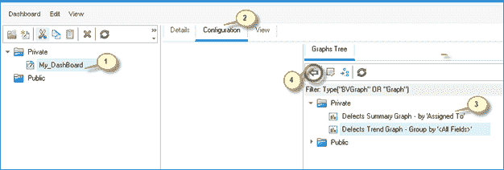

**步骤 3）**现在，配置应显示所选图形。

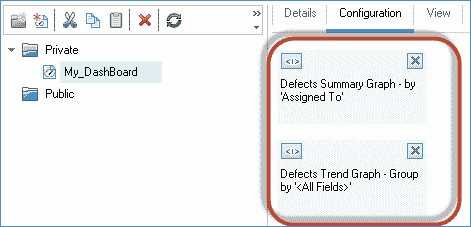

**步骤 4）**选择“查看”选项卡以显示所选图形。

**步骤 5）**让我们了解出现在每张图表右侧的图标。

1.  生成图–更改后生成/刷新图。
2.  转到图分析树–从仪表板，它将用户带到分析树。
3.  全屏查看图形–以全屏模式显示图形。

图形视频

**摘要**：

*   质量中心提供报告和图表，以帮助进行分析，测试监控并做出快速的测试控制决策。
*   所有模块均提供标准报告和图表，例如摘要，进度和趋势
*   Quality Center 允许您根据要求自定义报告。