# HP ALM：过滤条件，查找，替换，标志，历史记录&发送邮件

> 原文： [https://www.guru99.com/hp-alm-gui.html](https://www.guru99.com/hp-alm-gui.html)

ALM 中有很多通用功能，可跨模块使用。 现在，让我们看一下如何利用本节中的那些通用功能。

在本教程中，我们将学习

*   [如何使用过滤器](#1)
*   [如何使用查找](#2)
*   [如何更换](#3)
*   [如何使用标志](#4)
*   [关于历史的所有选项卡](#5)
*   [如何发送电子邮件](#6)
*   [如何使用列选择器](#7)
*   [如何设置默认值](#8)
*   [如何使用收藏夹](#9)

让我们一个一个地研究它们-

## 如何使用过滤器

“过滤器”对话框 ALM 用户可以根据定义的条件执行过滤器操作。 以下模块中提供了此选项。

*   要求
*   测试计划
*   测试实验室
*   瑕疵。

让我们在缺陷模块中执行过滤操作。

**步骤 1）。** Toperform 过滤器操作，

1.  首先检查是否存在任何预先存在的过滤器。 如果状态为“未定义过滤器”，则用户当前未看到过滤数据。
2.  点击“过滤器按钮”

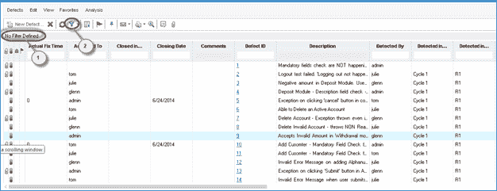

**步骤 2）。**将打开“过滤器”对话框。 现在，让我们基于“严重性”进行过滤。 单击“严重性”字段按钮，如下所示。

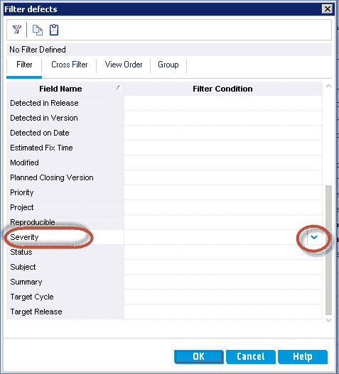

**步骤 3）**单击按钮后，将打开“选择过滤条件”对话框。

1.  根据要选择的条件选择条件。
2.  该条件将显示在条件字段中。
3.  点击“确定”

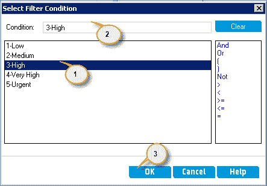

**步骤 4）。**将向用户显示“过滤器”对话框

1.  选择“过滤条件”，如下所示。
2.  点击“确定”。

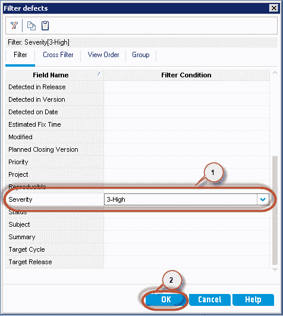

**步骤 5）。**向用户显示[缺陷](/defect-management-process.html)屏幕

1.  随着过滤的数据。
2.  应用于数据的筛选条件。

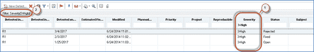

## 如何使用查找

通过此查找功能，ALM 用户可以根据特定字段，文件夹或子文件夹的值在树或网格中搜索特定记录。

以下模块中提供了此功能。

*   要求
*   测试计划
*   测试资源
*   测试实验室
*   缺陷。

**步骤 1）**可以通过按击“ ctrl + F”键或直接从“编辑”菜单访问“查找”功能来访问查找功能。 出于演示目的，让我们在“测试计划”模块上执行“搜索”。

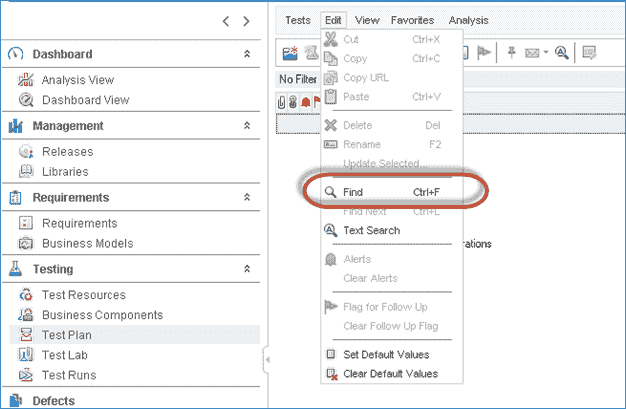

**步骤 2）。**查找对话框为用户打开，如下所示。

1.  它显示了必须进行搜索的“文件夹和字段”。
2.  需要找到的值。
3.  必须选择搜索区域。 它可以是文件夹名称或测试名称。
4.  可以指定搜索条件。
    1.  **完全匹配** －仅显示与输入字符串匹配的单词
    2.  **区分大小写**-将对输入的搜索字符串进行区分大小写的搜索。 假设输入的字符串是“帐户”。 当且仅当网格值与大小写匹配时，ALM 才会显示结果。 仅显示“帐户”的出现，而不显示“帐户”或“ aCcount”。
    3.  **使用通配符** －输入的字符串将与用户指定的通配符条件匹配。 如果用户不知道确切的搜索字符串，通配符将很有用。 唯一受支持的通配符是“ *”。 例如，如果我们想查看“帐户”的出现，可以使用通配符来匹配目标，方法是将字符串搜索为* acc *。
5.  点击“查找”

**步骤 3）**搜索结果将显示如下。

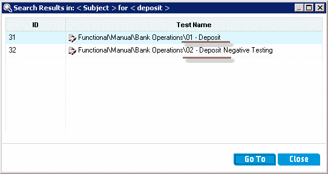

## 如何更换

ALM 中的替换功能使用户可以查找和替换树或网格中的特定字段值。 用户可以选择替换选定记录的字段值，也可以替换树或网格中的所有记录。

This feature is available in the following modules.

*   要求
*   测试运行
*   瑕疵

出于演示目的，让我们在“缺陷”模块中搜索并替换字符串。

**步骤 1）**假设我们想用“ A / c”代替单词“ Account”的出现。 在 3 种情况下，缺陷描述字段中将显示“帐户”文本，如下所示。

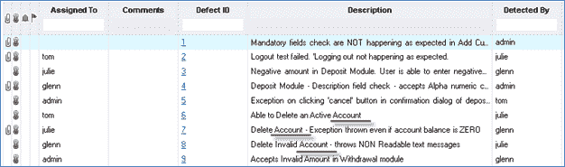

**步骤 2）**可以通过导航到“编辑”菜单来访问“替换功能”。

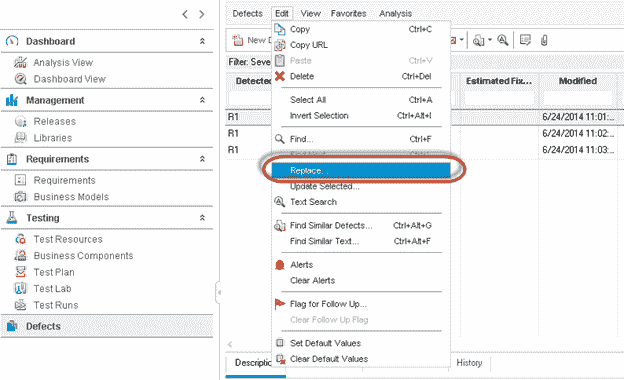

**步骤 3）。**向用户显示“替换”对话框。

1.  输入“搜索”字段名称
2.  输入需要找到的值。
3.  输入必须用搜索字符串值替换的值。
4.  单击“全部替换”以替换所有实例，或单击“替换”仅替换特定实例。

**注意**：用户可以通过单击“查找下一个”来替换特定的事件，以专注于适当的记录，然后可以通过单击“替换”按钮来替换它。

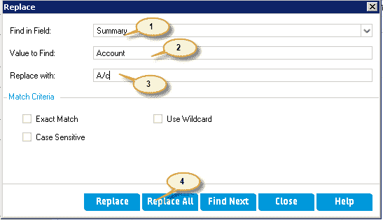

**步骤 4）**替换结果将显示给用户，其中包含替换的次数以及在整个模块中跳过搜索字符串的次数。

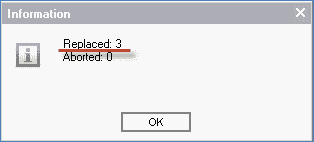

**步骤 5）**用户现在可以导航到缺陷模块，我们发现所有出现的“帐户”都被“ A / c”替换了。

## 如何使用标志

ALM 中的标志功能可通过针对特定工作项添加跟踪标志来帮助用户进行跟踪。

This feature is available in the following modules.

*   要求
*   测试计划
*   测试实验室
*   瑕疵

出于演示目的，通过在需求模块中标记一个工作项，让我们了解“后续标记”功能。

**步骤 1）**可以通过以下方式访问标志功能

1.  选择应遵循的标志要求。
2.  单击“标志”图标。

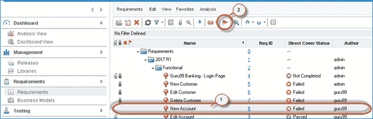

**步骤 2）**单击“标志”图标后，将向用户显示“标志用于跟踪”对话框。

1.  输入进行后续操作的日期。
2.  输入简短说明，说明为什么需要跟进。
3.  点击“确定”

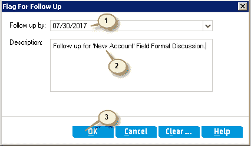

**步骤 3）**已创建“后续跟踪标志”，用户将可以看到该工作项上的标志图标，如下所示。

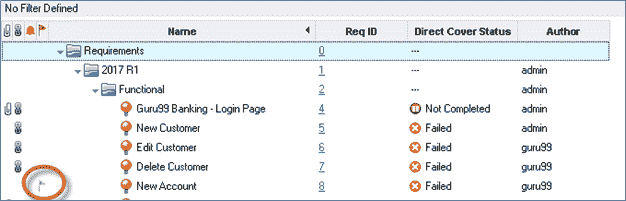

**步骤 4）**当跟踪日期与当前日期匹配时，跟踪标志将以红色显示，如下所示。

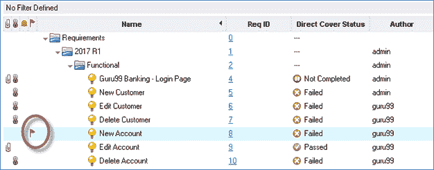

**步骤 5）**一旦跟踪完成，用户也可以清除该标志。 要执行相同的操作

1.  单击工作项上的“跟进”图标
2.  将打开“后续标记”对话框。 用户可以单击“清除”按钮，如下所示。

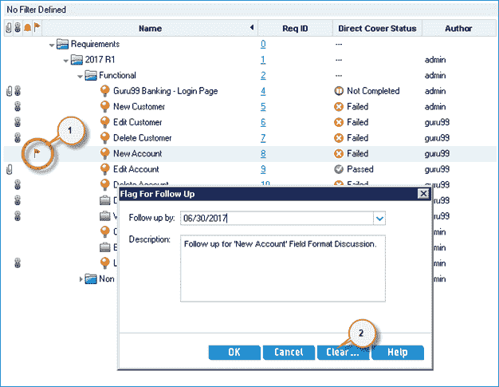

**步骤 6）。**单击“清除”按钮后，将向用户显示确认对话框。 用户可以单击“是”清除标记，以对该工作项进行后续操作。

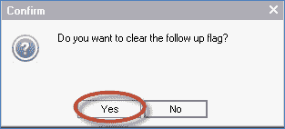

**步骤 7）**在确认对话框中单击“是”后，将根据该要求清除后续标记。

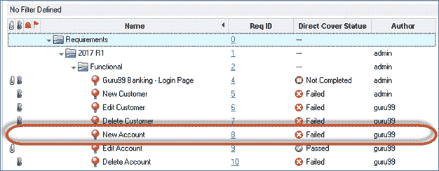

## 关于历史的所有标签

使用此历史记录选项卡，ALM 用户可以查看对所选工作项所做的所有更改。 历史记录包括该工作项的日期，时间，旧值和新值（更改后的值）。

This feature is available in the following modules.

*   要求
*   测试计划
*   测试实验室
*   测试资源
*   测试运行
*   瑕疵

出于演示目的，让我们查看选定缺陷的历史记录。

**步骤 1）**打开缺陷，并向用户显示缺陷详细信息对话框。

1.  导航到“历史记录”选项卡
2.  用户可以找到此缺陷的所有更改的列表。

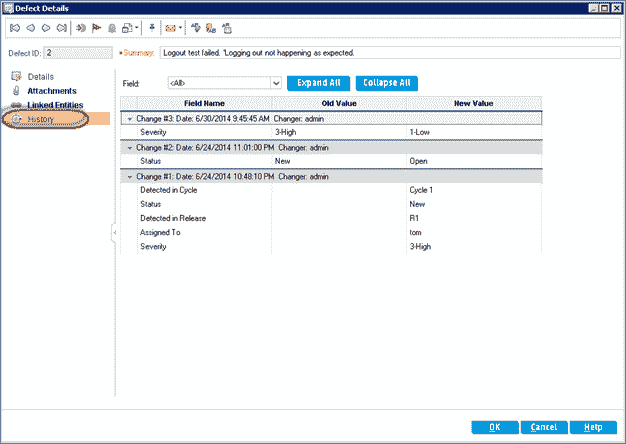

**步骤 2）**让我们了解所选缺陷的历史。

1.  在 Change＃1 中，因为是第一次创建缺陷，所以只会填充新值列。
2.  在 Change＃2 中，字段“状态”从“新建”更改为“打开”
3.  In Change#3 the Field 'Severity' is changed from 'High' to 'Low'

    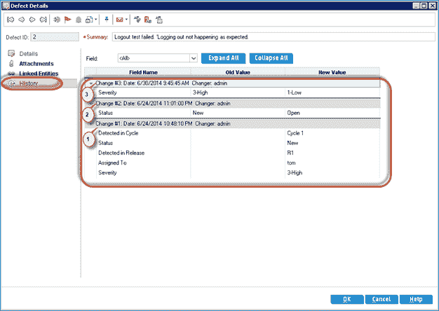

## 如何发送电子邮件

ALM 中的“发送邮件功能”，允许用户向其他用户发送有关实体详细信息的电子邮件。 用户可以选择在发送电子邮件时包括附件和历史记录。

This feature is available in the following modules.

*   要求
*   测试计划
*   测试资源
*   测试运行
*   瑕疵

**步骤 1）**可以通过直接单击“通过电子邮件发送”图标来访问“发送邮件”功能，如下所示。

**步骤 2）。**向用户显示“发送电子邮件”对话框。

1.  添加需要在“收件人”列表中的用户。
2.  在“抄送”列表中添加需要接收邮件的用户。
3.  主题已预先填充，但是用户可以在发送电子邮件之前编辑主题。
4.  用户也可以包含“附件”。 此选项对应于工作项目的附件。 因此，在使用以下对话框发送电子邮件时，用户无法从其硬盘驱动器添加任何其他附件。
5.  如果选中了“历史记录”复选框，则工作项的历史记录也将包含在邮件中。
6.  点击“发送”。

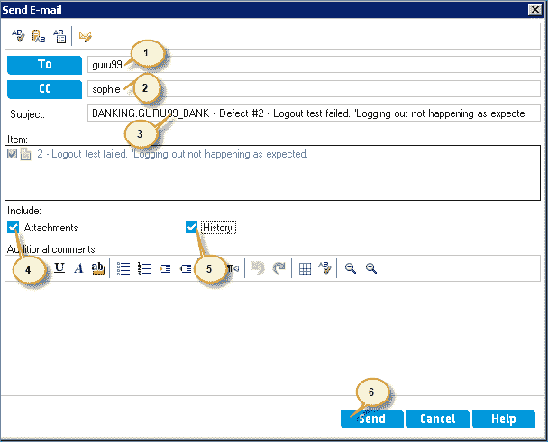

**注意：**

*   我们也可以通过直接在“收件人”或“抄送”列表中输入他们的电子邮件地址，将电子邮件发送给不在 ALM 数据库中的其他用户。
*   还应该理解，只有在 ALM 数据库中更新了用户的电子邮件 ID 时，我们才能添加 ALM 用户。
*   发送电子邮件选项将发送所有详细信息，例如测试数据，步骤，这些步骤中每个步骤的状态。
*   用户还可以选择在发送电子邮件时包括该特定工作项目的附件和历史记录（您无法从本地硬盘驱动器添加附件）。

**步骤 3）**单击“发送”按钮后，将向用户显示电子邮件的状态。

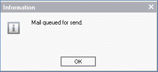

## 如何使用列选择器

ALM 中的“列选择器”选项允许用户选择用户希望针对每个工作项看到的列。 用户未选择的列将从用户视图中隐藏。

This feature is available in the following modules.

*   要求
*   测试计划
*   测试运行
*   瑕疵

出于演示目的，我们将通过仅选择缺陷模块中的相关列来了解列选择器选项。

**步骤 1）**如下所示，单击``列选择器''图标。

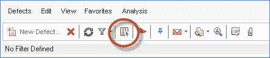

**步骤 2）**``列选择器对话框显示给用户。

1.  在“可见列”部分下选择要从视图中隐藏它的字段
2.  单击“ <”按钮将选定的列推到“可用列”列表中
3.  将所有不必要的列从“可见列”列表推送到“可用列”列表后，单击“确定”。
4.  可以通过“可见列”窗格下的“向上”和“向下”箭头来控制列的顺序。

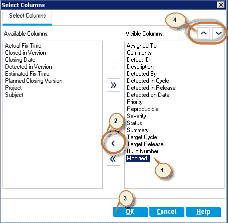

注意：缺陷模块中显示的列顺序将与“可见列”部分中指定的顺序相同。

**步骤 3）**现在，仅向用户显示选定的列，如下所示。

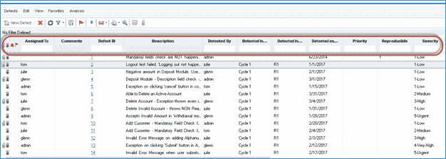

## 如何设置默认值

通过设置默认值，ALM 用户可以为某些字段设置默认值，当用户创建该类型的新工作项时，这些字段将预先填充。

This feature is available in the following modules.

*   测试。
*   瑕疵。

出于演示目的，让我们了解如何为“缺陷”模块中的字段列表设置默认值。

**步骤 1）**可以通过导航到“编辑”菜单来访问“设置默认值”选项，如下所示。

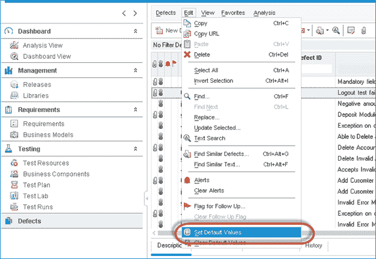

**步骤 2）。**向用户显示“设置默认值”对话框。

1.  选择您想要具有默认值的字段名称。
2.  输入每次都必须默认的字段名称的值。
3.  点击“添加”

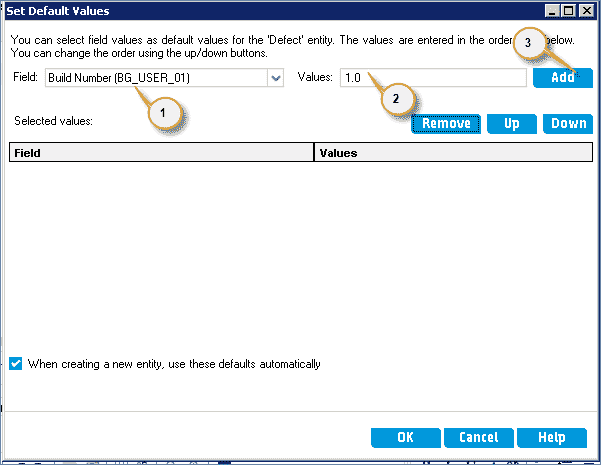

同样，我们将为其他字段添加默认值

**步骤 3）**添加所有默认值后，“设置默认值”对话框如下所示。

1.  将列出所有字段的列表及其默认值。
2.  启用“在创建实体时自动使用这些值”，以便每当用户单击缺陷模块中的“新缺陷”图标时，这些字段将默认为预设值。
3.  点击“确定”

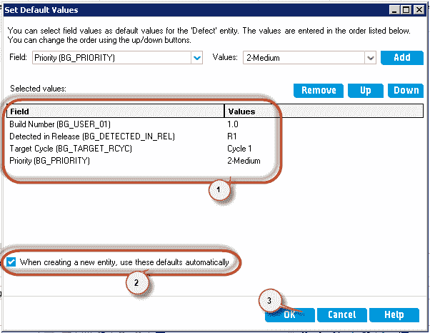

**步骤 4）**现在，单击缺陷模块中的“新建缺陷”按钮。 如下图所示，将在“设置默认值”对话框下添加的那些字段中填充默认值。

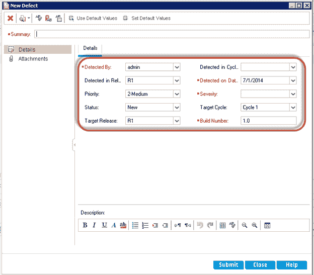

## 如何使用收藏夹

ALM 中的收藏夹的行为与 Web 浏览器上“书签”的行为相同。 收藏夹允许用户单击一下即可导航到特定页面。

收藏夹可以保存为私人或公共。

*   私人–添加的收藏夹仅适用于当前用户。
*   公开–添加的收藏夹可在所有项目用户中使用。

通常在 ALM 中，收藏夹会添加到过滤的页面上。 让我们说，作为一名测试人员，我想访问根据我的姓名分配的中等严重性的开放缺陷。 为了达到相同的目的，我需要应用 3 个过滤器-一个用于过滤严重性，第二个用于过滤缺陷状态，第三个用于过滤名称。

但是，使用“收藏夹”，我们只需单击即可访问符合上述条件的缺陷。

This feature is available in the following modules.

*   要求。
*   测试计划。
*   测试实验室
*   瑕疵。

出于演示目的，让我们应用收藏夹来访问处于“打开”状态且严重性为“中等”的缺陷。

**步骤 1）**在添加收藏夹之前，让我们应用过滤器来显示中等严重性的开放缺陷。

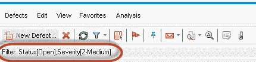

**步骤 2）**现在导航到“收藏夹”菜单，然后选择“添加到收藏夹”。

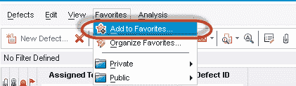

**步骤 3）。**“添加收藏夹”对话框打开。

1.  输入收藏夹的名称
2.  选择必须保存收藏夹的文件夹（私人或公共）。
3.  点击“确定”

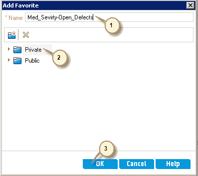

**步骤 4）**可以通过导航到“收藏夹”菜单并选择如下所示的内容来访问添加的收藏夹。

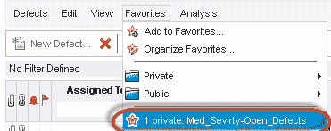

**步骤 5）**显示收藏夹页面。

1.  显示带有收藏夹名称和收藏夹类型（在这种情况下为私人）的状态，以及应用于数据的过滤器。
2.  我们可以看到中等严重程度的开放缺陷已显示给用户。

收藏视频

**指向注释**

*   您可以使用自己的自定义设置在 Quality Center 窗口中创建收藏夹视图。 例如，在缺陷网格中，您可能希望创建一个收藏夹视图，以仅显示您检测到或分配给您的缺陷。
*   收藏夹视图可以是公共的或私有的。
*   私人收藏夹仅对您可见。
*   所有“质量中心”用户都可以看到“公共收藏夹”。