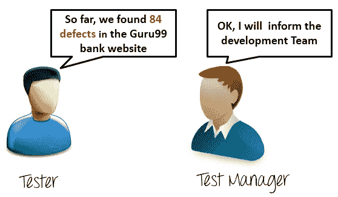
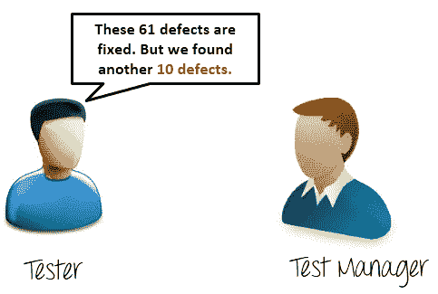
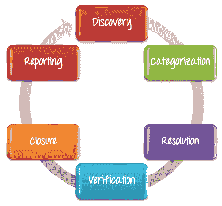
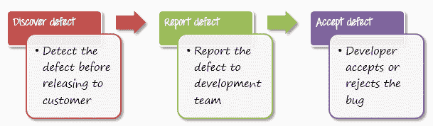
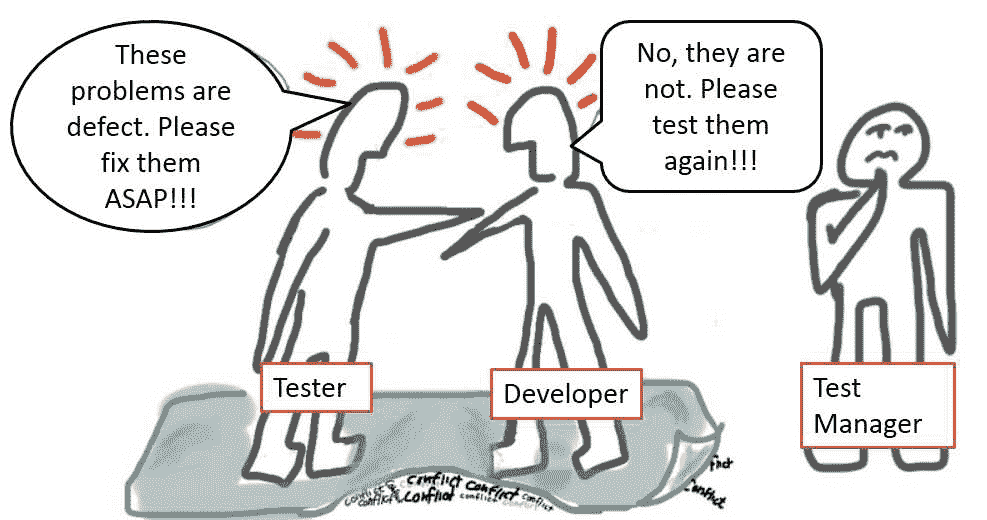
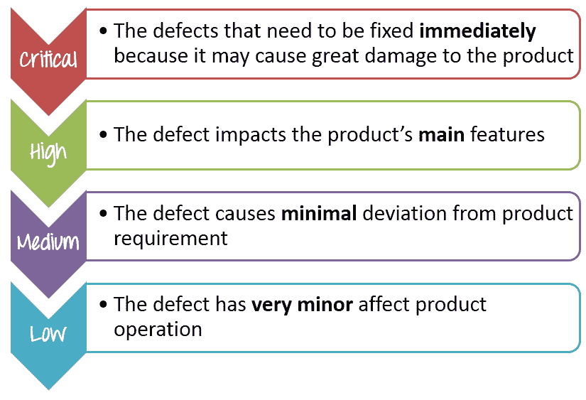
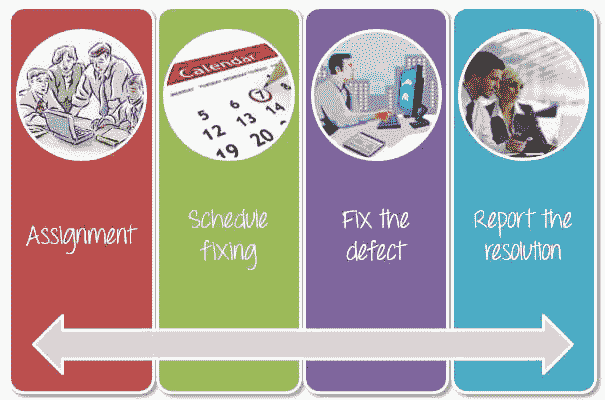
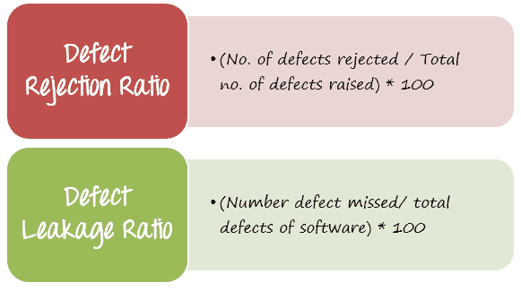
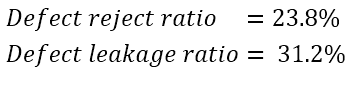

# 软件测试中的缺陷管理流程（错误报告模板）

> 原文： [https://www.guru99.com/defect-management-process.html](https://www.guru99.com/defect-management-process.html)

### 什么是 Bug？

错误是编码错误的结果/结果

## 什么是缺陷？

缺陷是与原始业务需求的变化或偏差

这两个术语之间的差异非常小。在行业中，这两个都是需要修复的故障，因此某些[测试](/software-testing.html)小组会互换使用。

当测试人员执行测试用例时，他可能会遇到与预期结果相矛盾的测试结果。 测试结果的这种变化称为**软件缺陷**。 这些缺陷或变化以不同的名称在不同的组织中引用，例如**问题，问题，错误或事件**。

在本教程中，您将学习-

*   [错误报告](#2)
*   [缺陷管理流程](#3)

*   [发现](#4)
*   [分类](#5)
*   [分辨率](#6)
*   [验证](#7)
*   [关闭](#8)
*   [报表](#9)

*   [重要缺陷指标](#10)

## 错误报告

向开发人员报告错误时，您的错误报告应包含以下信息

*   **Defect_ID** -缺陷的唯一标识号。
*   **缺陷描述**-缺陷的详细描述，包括有关在其中找到缺陷的模块的信息。
*   **版本**-在其中发现缺陷的应用程序版本。
*   **步骤**-详细的步骤以及屏幕截图，开发人员可以使用这些截图重现缺陷。
*   **提起日期**-提起缺陷的日期
*   **参考**-在其中提供对诸如此类文档的参考。 需求，设计，架构甚至是错误的屏幕截图，以帮助理解缺陷
*   检测到的**-提出缺陷的测试人员的姓名/ ID**
*   **状态**-缺陷的状态，稍后会详细介绍
*   修复的**-修复它的开发人员的名称/ ID**
*   **关闭日期**-缺陷关闭的日期
*   **严重性**，它描述缺陷对应用程序的影响
*   **优先级**与缺陷修复的紧迫性有关。 严重性优先级可以是高/中/低，具体取决于应分别修复缺陷的紧急程度

资源资源

[下载示例缺陷报告模板](https://drive.google.com/uc?export=download&id=0B_vqvT0ovzHcZllqY2Q0TVpwaDQ)

## 考虑以下作为测试经理

您的团队在测试 Guru99 Banking 项目时发现了错误。

一周后，开发人员回应-

下星期测试员回应

与上述情况一样，如果以口头形式进行缺陷沟通，很快情况就会变得非常复杂。 要控制和有效管理错误，您需要一个缺陷生命周期。

## 什么是缺陷管理流程？

缺陷管理是识别和修复错误的系统过程。 缺陷管理周期包括以下阶段 1）发现缺陷，2）缺陷分类 3）开发人员修复缺陷 4）测试人员进行验证，5）缺陷关闭 6）项目结束时的缺陷报告

本主题将指导您如何将缺陷管理过程应用于项目 Guru99 Bank 网站。 您可以按照以下步骤管理缺陷。

## 发现

在发现阶段，项目团队必须在最终客户发现之前尽可能多地发现**，**作为**缺陷。 当开发人员确认并接受缺陷后，就可以发现缺陷并将其更改为**接受状态****

在上述情况下，测试人员在 Guru99 网站中发现了 84 个缺陷。

让我们看一下以下情况； 您的测试团队在 Guru99 Bank 网站上发现了一些问题。 他们将其视为缺陷并报告给开发团队，但存在冲突-

**In such case, as a Test Manager, what will you do?**
<input class="eb" name="eb" type="checkbox" value="11"> A) Agree With the test team that its a defect

<input class="ebno2" name="ebno2" type="checkbox" value="1"> B) Test Manager takes the role of judge to decide whether the problem is defect or not

<input class="ebno" name="ebno" type="checkbox" value="111"> C) Agree with the development team that is not a defect
**Correct****InCorrect**

在这种情况下，应采用解决方案来解决冲突，您将充当法官的角色来决定网站问题是否是缺陷。

## 分类

缺陷分类可帮助软件开发人员确定其任务的优先级。 这意味着这种优先级可以帮助开发人员首先修复那些至关重要的缺陷。

缺陷通常由测试经理进行分类–

让我们做一个小练习，如下所示**拖动&将缺陷优先级降低到**以下

*   [严重](#)
*   [高](#)
*   [中](#)
*   [低](#)

| 1）网站性能太慢 |  |
| 2）网站的登录功能无法正常使用 |  |
| 3）网站的 GUI 在[移动](/mobile-testing.html)设备上无法正确显示 |  |
| 4）网站不记得用户登录会话 |  |
| 5）某些链接无效 |  |

<input id="text1" name="text1" type="text">

这是推荐的答案

| **否** | **说明** | **优先级** | **解释** |
| 1 | 网站性能太慢 | 高 | 性能错误会给用户带来极大的不便。 |
| 2 | 网站的登录功能无法正常使用 | 危急 | 如果此功能不起作用，则登录是银行网站的主要功能之一，这是严重的错误 |
| 3 | 网站的 GUI 在移动设备上无法正确显示 | 中 | 该缺陷会影响使用智能手机查看网站的用户。 |
| 4 | 该网站不记得用户登录会话 | High | 这是一个严重的问题，因为用户将能够登录但无法执行任何进一步的交易 |
| 5 | 某些链接无效 | 低 | 对于开发人员来说，这是一个简单的解决方法，用户无需这些链接仍然可以访问该网站 |

## 分辨率

缺陷被接受并分类后，您可以按照以下步骤修复缺陷。

*   **分配**：分配给开发人员或其他技术人员进行修复，并将状态更改为**响应**。
*   **日程安排**：在此阶段，显影方负责。 他们将根据缺陷优先级创建修复这些缺陷的计划。
*   **修复缺陷**：在开发团队修复缺陷的同时，测试经理将跟踪修复缺陷的过程与上述时间表进行比较。
*   **报告解决方案**：修复缺陷后，开发人员将提供解决方案报告。

## 验证

在开发团队**修复**和**报告**缺陷之后，测试团队**验证**该缺陷已得到实际解决。

例如，在上述情况下，当开发团队报告他们已经修复了 61 个缺陷时，您的团队将再次进行测试以验证这些缺陷是否已得到实际修复。

## 关闭

解决并验证缺陷后，将更改状态为**关闭**。 如果没有，您已经向开发人员发送了通知，以再次检查缺陷。

## 报表

管理委员会有权知道缺陷状态。 他们必须了解缺陷管理过程以在此项目中为您提供支持。 因此，必须向他们报告当前的缺陷情况，以获得他们的反馈。

## 重要缺陷指标

返回上述情况。 开发人员和测试团队已审查了报告的缺陷。 这是讨论的结果

**如何衡量和评估测试执行的质量？**

每个测试经理都想知道这个问题。 您可以考虑以下 2 个参数

在上述情况下，您可以计算**缺陷拒绝率**（DRR）为 **20/84 = 0.238（23.8％）。**

再举一个例子，假设 Guru99 银行网站总共有 **64** 个缺陷，但是您的测试团队仅检测到 **44** 缺陷，即他们错过了 **20** 缺陷。 因此，可以计算出缺陷泄漏率（DLR）为 20/64 = **0.312** （31.2％）。

结论，通过以下两个参数评估测试执行的质量

DRR 和 DLR 的值越小，测试执行的质量越好。 **可接受的**比率范围是多少？ 该范围可以在项目目标中定义和接受，也可以参考类似项目的指标。

在本项目中，可接受比例的推荐值为 **5〜10％。** 表示测试执行的质量低。 您应该找到降低这些比例的对策，例如

*   **提高**成员的测试技能。
*   **花更多时间**进行测试执行，尤其是检查测试执行结果。