# 如何在 HP ALM（质量中心）中自定义项目

> 原文： [https://www.guru99.com/hp-alm-customize-project.html](https://www.guru99.com/hp-alm-customize-project.html)

*   通过项目自定义，项目管理员可以通过定义可以访问项目的用户来控制对项目的访问，还可以自定义每个用户可以执行的任务类型。
*   也可以自定义项目以满足组织的特定要求。
*   它还有助于添加/编辑新的自定义用户字段，这些字段可以添加到 ALM 中的每个模块。

在本教程中，我们将学习以下（通用）项目自定义

*   [更改用户属性](#1)
*   [专案使用者](#2)
*   [组和权限](#3)
*   [模块访问](#4)
*   [项目实体](#5)
*   [项目列表](#6)
*   [自动邮件](#7)
*   [警报规则](#8)
*   [工作流程](#9)
*   [脚本编辑器](#10)

让我们一一调查

## 用户属性

当前登录的用户将能够编辑其个人资料详细信息，并允许用户更改其密码。

**注意**：即使用户的类型为“ Project Admin”，也只能更改当前登录的用户密码。

**步骤 1）**单击“工具”链接，然后选择“自定义”，如下所示。

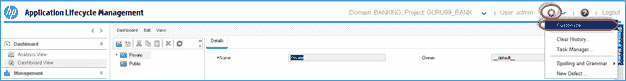

**步骤 2）**项目定制对话框如下所示。

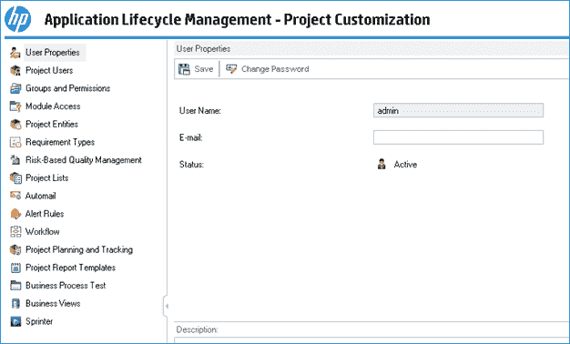

**步骤 3）**要更改当前用户的密码，请在“用户属性”选项卡中单击“更改密码”。

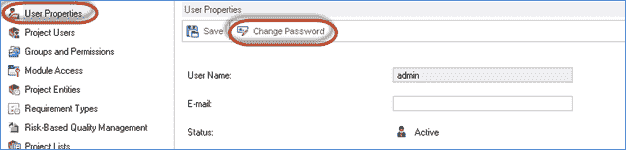

**步骤 4）。**更改密码对话框打开。

1.  输入旧密码
2.  输入新密码
3.  输入确认密码
4.  点击“确定”

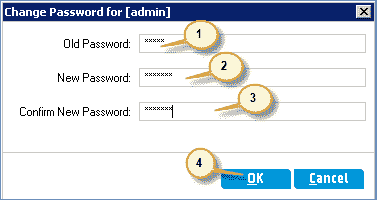

**步骤 5）**将显示用户状态消息。

**步骤 6）。**用户还可以编辑以下配置文件详细信息。

1.  电子邮件 ID
2.  全名
3.  电话号码
4.  点击“保存”

**注意：**即使用户的类型为“项目管理员”，用户也将无法编辑其用户名。

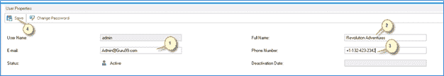

**步骤 7）**状态显示给用户，如下所示。

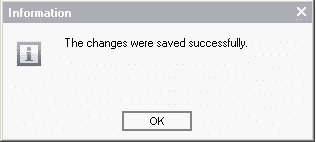

## 专案使用者

该模块使用户可以添加和删除当前 ALM 项目的用户。 也可以将用户分配给用户组以限制用户访问权限。

**步骤 1）**现在，让我们将用户添加到项目区域。

1.  导航到项目用户
2.  单击添加用户下拉列表。

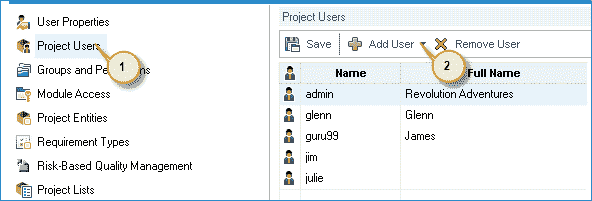

**步骤 2** ）单击“添加用户”下拉菜单时，向用户显示以下方法，如下所示。

1.  **按名称添加用户**-Project Admin 可以通过提供其用户名来将 ALM 的现有用户添加到该项目中。 （对步骤 1 & 2 进行了同样的操作）
2.  **将新用户添加到站点中**-通过输入所有详细信息将新用户添加到站点中，就像我们从“站点管理员”中添加用户一样。
3.  **从站点添加用户**-通过基于用户的名称或 ID 进行搜索来添加新用户。

让我们看看其中的每个功能。

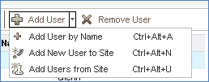

**步骤 3）**让我们添加一个基于名称的用户。 确保此用户已经存在于 ALM Admin 数据库中（使用“站点管理”模块创建的用户）

1.  从项目“自定义”窗口中选择“项目用户”。
2.  点击“添加用户”
3.  输入用户名
4.  点击“确定”

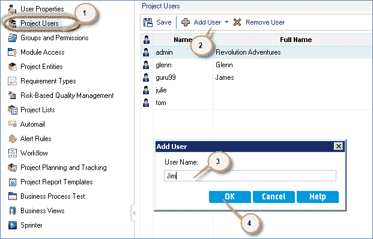

**步骤 4）**已添加的用户如下所示。

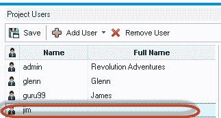

**步骤 5）**现在，我们使用选项“将新用户添加到”站点”添加用户。

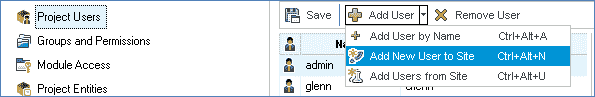

**步骤 6** ）单击“添加用户”中的“向站点添加新用户”后，将显示以下对话框。

1.  输入用户名
2.  输入电子邮件
3.  输入全名
4.  输入电话号码
5.  点击“确定”

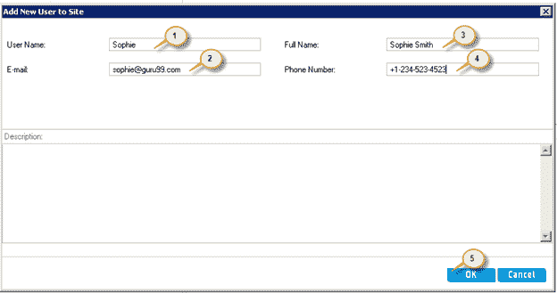

**步骤 7）**现在将用户添加到当前项目中。 如下所示，将用户添加到“项目用户”中。

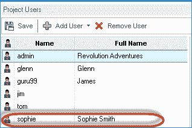

**步骤 7）**现在，我们使用“从站点添加用户”选项添加项目用户。

确保用户已经在 ALM 管理数据库中。

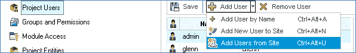

**步骤 8）。**显示以下对话框。

1.  输入用户名，然后单击搜索图标
2.  显示用户名
3.  点击“确定”

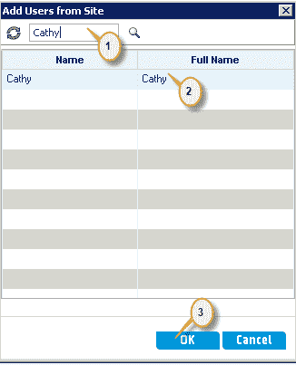

**步骤 9）**用户已添加到项目中，并显示如下。

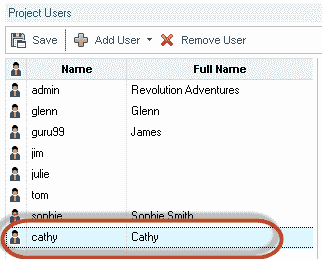

**步骤 10）** Project Admin 也可以从项目用户模块中删除用户。

1.  选择用户
2.  Click 'Remove User;

    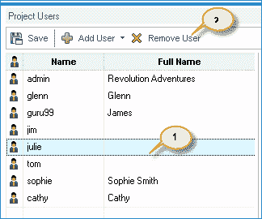

**步骤 11）**确认对话框出现。 点击“是”。

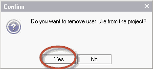

**步骤 12）**单击``是''后，该用户将从项目用户列表中删除。

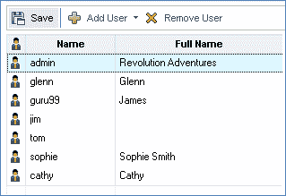

**步骤 13）**“项目用户”中的每个用户都有与之关联的成员资格。

注意：默认情况下，任何添加的用户仅具有“查看”权限。

1.  选择用户名
2.  选择“会员”标签
3.  将显示所选用户的成员资格。 新添加的用户“ Cathy”具有“查看者”权限

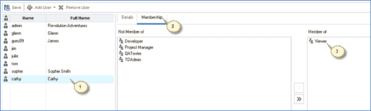

## 群组和权限：

该模块使项目管理员可以通过指定权限为用户组分配权限。

ALM 中有 5 个预定义的组，并且这些用户组中的每个用户组具有不同的许可级别。

1.  开发者
2.  专案经理
3.  质量检查人员
4.  TD 管理员
5.  观看者

注意：默认情况下，任何添加到项目区域的用户都仅具有“查看”权限。

**步骤 1）**让我们看到“ TDAdmin”组中的用户列表。

1.  选择“ TDAdmin”
2.  在“成员资格”选项卡下，您将注意到用户不在组中
3.  在“组内”部分下，您会注意到组内的用户列表。 在这种情况下，仅显示“管理员”。

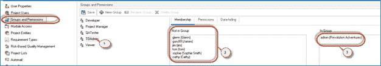

**步骤 2）**无法编辑预定义的组权限。

1.  选择“ TDAdmin”
2.  导航到权限选项卡
3.  选择任何模块（在这种情况下为缺陷）
4.  即使当前用户是项目管理员，也无法编辑权限。

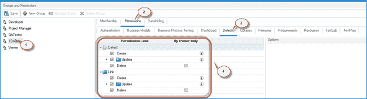

**步骤 3）**无法重命名或删除预定义的组。

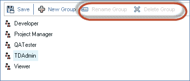

**步骤 4）**为了更改组权限，项目管理员必须添加一个新组。 假设我们需要创建一个新的用户组，以使这些用户具有缺陷模块的“编辑权限”和其他用户的“查看”权限。 这意味着所有许可必须与“查看”用户的许可相同，除了用户应该能够“更新”缺陷的事实。 要做同样的事情

1.  点击“新组”
2.  确认对话框显示给用户。 点击“是”。

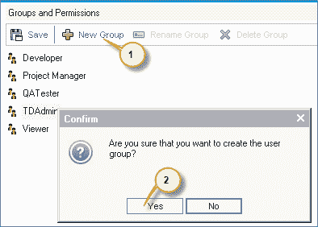

**步骤 5）**单击“是”后，将显示“新建组”对话框

1.  输入组名
2.  输入个人资料

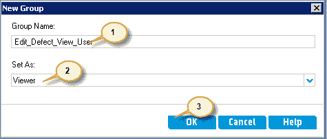

**步骤 6）**如下所示创建用户组。 您还可以注意到，我们可以重命名/删除该组，因为它是由我们创建的。 无法编辑或删除 ALM 中的预定义组。

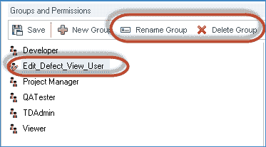

**步骤 7）**更改权限

1.  导航到“权限”标签
2.  单击“缺陷”选项卡
3.  为缺陷启用“更新”标志
4.  为链接启用“更新”标志

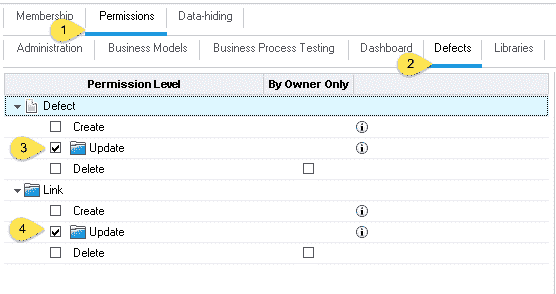

## 模块访问：

该模块使项目管理员可以控制每个用户组可以访问的模块。 这将防止用户访问受限制的模块。

让我们说，开发人员与测试用例无关，因此可以防止他们访问测试计划，测试实验室模块。

**步骤 1）**默认模块访问如下所示。 默认情况下，所有类型的用户组都可以访问所有模块。

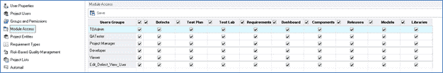

**步骤 2）**为了演示，让我们除去对 VIEW 用户类型的所有模块访问权限，但缺陷模块除外。

如下所示，取消对 View 用户（除 Defects 模块）以外的所有模块访问权限。

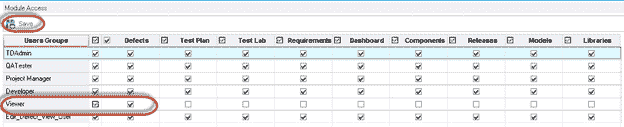

**步骤 3）**现在，让我们使用“查看”用户 ID 之一登录，以检查更改是否已正确应用。 从下面的快照中可以很明显地看出，已根据我们的输入应用了设置，因为它仅对视图用户“ Jim”显示“缺陷”模块。

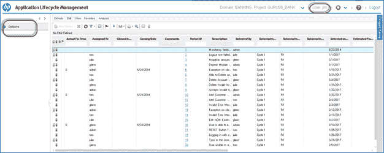

## 项目实体：

*   项目实体使项目管理员可以修改 ALM 系统字段的行为或定义用户定义的字段。
*   例如，如果我们正在各种构建上执行测试，并且想在“添加缺陷模块”中添加字段“构建版本”，则可以使用项目实体模块执行相同的操作。

**步骤 1）**不能在只读的系统字段下添加用户定义的字段。

1.  选择“项目实体”
2.  选择“缺陷”，然后选择子文件夹“系统字段”。
3.  我们注意到，由于系统字段是只读的，因此我们将无法添加或删除“新字段”。

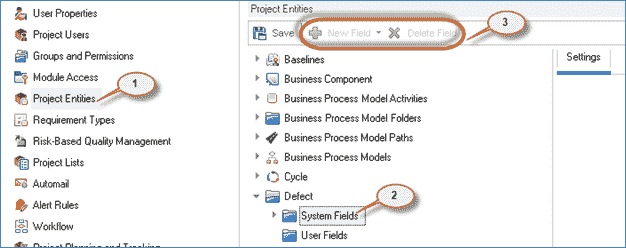

**步骤 2）**要添加用户定义的字段，

1.  在“缺陷”模块下选择“用户字段”子文件夹。
2.  点击“新字段”
3.  字段详细信息如下所示，可以进行编辑。

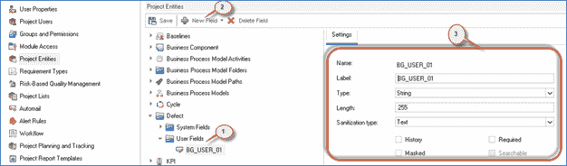

**步骤 3）**字段详细信息也可以如下所示进行编辑。

1.  将标签重命名为“内部编号”。
2.  选中“必填”，这意味着该字段将是发布新缺陷的必填字段。
3.  点击保存

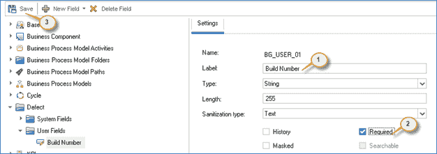

**步骤 4）**现在我们可以见证缺陷模块中所做的更改。 导航到缺陷模块，用户将能够看到新创建的字段“内部版本号”，该字段将是“新缺陷”模块的一部分。

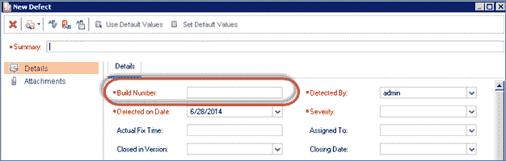

## 项目列表

*   项目列表使项目管理员可以将自定义列表添加到项目。 列表包含用户可以在系统/用户定义的字段中输入的值。
*   例如，“错误状态”列表具有六个预定义的状态，即“新建”，“打开”，“固定”，“重新打开”，“关闭”，“已拒绝”。 如果我们要添加一个状态，可以说重复，我们可以使用此模块来添加状态。

**步骤 1）**要在预定义列表下添加项目，

1.  点击“项目列表”
2.  选择“错误状态”
3.  点击“新建项目”。 “新建项目”对话框打开。
4.  输入项目名称。
5.  点击“确定”

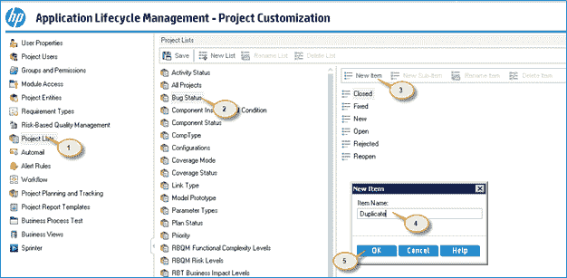

**步骤 2）**单击“确定”后，如下所示创建新项目。

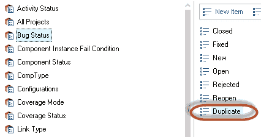

**步骤 3）**现在我们需要保存更改。

1.  点击“保存”按钮。
2.  显示一个弹出窗口。 点击“确定”。

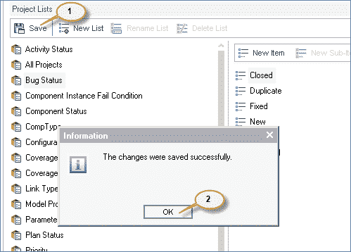

**步骤 4）**现在导航到缺陷模块，并验证状态是否在列表中具有新添加的项目。

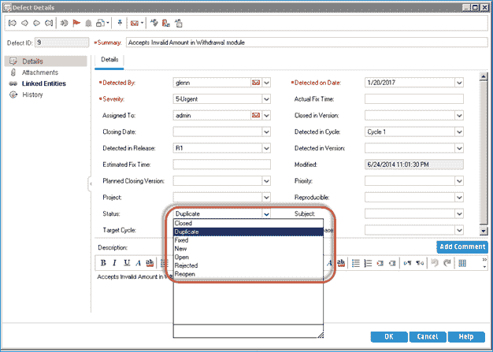

## 自动邮寄：

该模块使项目管理员可以设置自动邮件通知规则，以通过电子邮件向用户通知对特定缺陷所做的更改。 此自动邮件功能仅适用于缺陷模块。

**步骤 1）**要激活自动邮件通知，请执行以下步骤。

1.  导航到“自动邮件”链接。
2.  用户可以通过在列表中选择任意数量的可用字段来触发电子邮件。
3.  此网格显示用户已选择发送有关更改的邮件的字段列表。
4.  Project Admin 还可以针对每个可用用户选择电子邮件设置。
5.  点击“保存”。

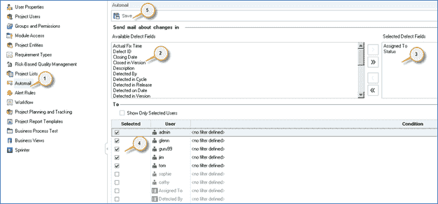

**步骤 2）。**显示弹出窗口。 点击确定

## 警报规则：

该模块使项目管理员可以激活当前项目的警报规则。 当项目中发生更改时，此功能将创建警报并发送电子邮件。 该模块适用于需求，相关测试和缺陷。

步骤 1）要激活警报规则，

1.  导航“警报规则”。
2.  启用“与...关联的警报”复选框
3.  启用“发送电子邮件至” &，添加相应的测试人员/设计人员。
4.  点击“保存”

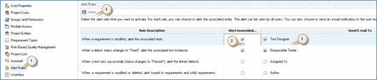

*   第一个警报：修改需求时将向 Test Designer 发出警报，以便可以修改关联的测试
*   第二个警报：当[缺陷](/defect-management-process.html)的状态更改为“已修复”时，将向测试仪发出警报，以便负责的测试仪可以再次进行重新测试。

## 工作流程：

*   该模块使项目管理员可以生成脚本，以帮助

自定义“缺陷”模块（添加缺陷对话框或“查看缺陷”对话框）。

*   借助此模块，项目管理员还可以编写脚本以自定义其他模块中的对话框，并控制用户可以执行的操作。

现在，让我们为“ TDAdmin”组用户类型自定义“添加缺陷”对话框。

**步骤 1）**在项目自定义下，

1.  点击“工作流程”。
2.  选择“脚本生成器–添加缺陷字段自定义”链接

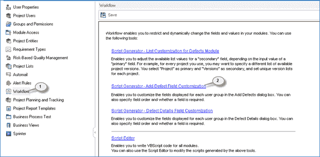

**步骤 2）。**将打开“添加缺陷”字段自定义对话框。

1.  选择用户组。
2.  选择用户不想在“添加缺陷”对话框中显示的字段。
3.  单击“ <”链接将字段从可见字段列表中推出。

***注意：不能将强制字段移出可见字段列表。***

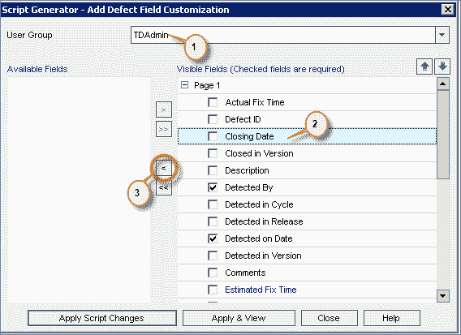

**步骤 3）**将所有不相关的字段从可见字段列表中推出后，将显示自定义字段对话框，如下所示。

1.  从可见字段推出的字段列表。
2.  将作为“添加缺陷”对话框的一部分的字段。
3.  应用脚本更改。

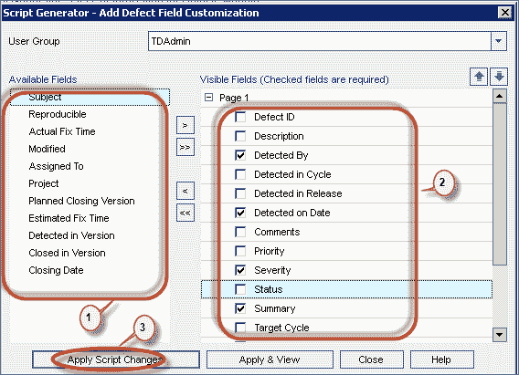 
***注意：尽管我们使用此用户界面进行了自定义，但是更改是通过在后端生成脚本来完成的。 我们还将在本节后面的示例中处理脚本编辑。***

**步骤 4）** ??现在以'TDAdmin'类型的用户身份登录，然后从缺陷模块中单击'New Defect'。 用户选择的可见字段显示在“新缺陷”窗口中。

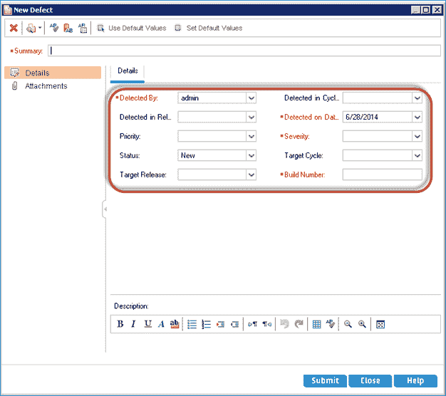

## 脚本编辑器：

脚本编辑器功能可帮助用户编写脚本以自定义各个模块的对话框，并控制用户可在每个模块中执行的操作。

让我们借助脚本编辑器来更改“查看缺陷”对话框向用户显示的方式。

**步骤 1）。**要访问脚本编辑器-

1.  导航到工作流程选项卡
2.  点击“脚本编辑器”。

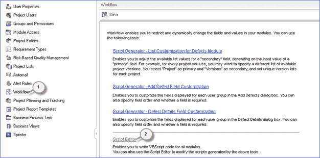

**步骤 2）**脚本编辑器向用户显示，如下所示。

1.  选择“缺陷模块脚本”
2.  注释显示-这是我们需要进行更改的区域，因为它明确显示“缺陷详细信息字段自定义”。
3.  为每个用户组编写了脚本。 我们看到的那个对应于'Developer'用户组。 我们需要对“ TDAdmin”用户组进行更改。

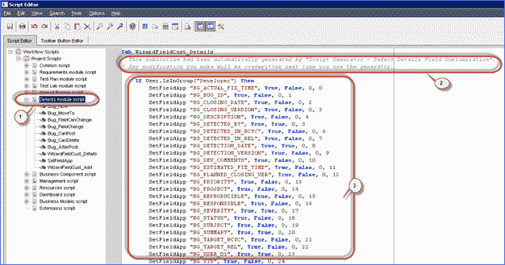

**步骤 3）**现在向下滚动到我们需要进行更改的“ TDAdmin”用户组。 显示“ TDAdmin”的当前设置，如下所示。

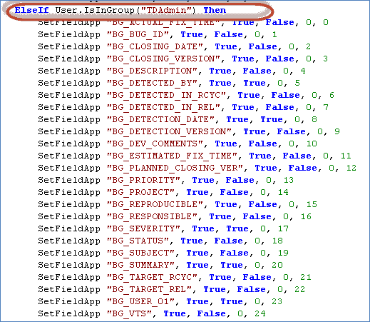

**步骤 4）**让我们了解脚本。

让我们考虑脚本中的以下代码行

**SetFieldApp“ BG_ACTUAL_FIX_TIME”，是，否，0、0**

这是详细信息-

<colgroup><col> <col></colgroup> 
| SetFieldApp | 是否使用 5 个参数进行函数调用 |
| 栏位名称 | BG_ACTUAL_FIX_Time-字段名称。 我们将更改此字段名称的设置 |
| 可见旗 | 对应可见标志。 如果为 true，则将可见。 |
| 必填标志 | 检查该字段是否为必填项。 如果为 true，则此字段为必填字段。 |
| PageNo 标志 | 以 0 开头。如果有更多字段，则用户可以配置它们以页面方式显示。 |
| 查看订单 | 用户还可以使用此标志来安排字段的顺序。 以 0 开头，以 1 递增。基于此顺序设置字段 |

**步骤 5）**让我们对第一个字段“ BG_ACTUAL_FIX_TIME”字段进行更改。

脚本编辑器中字段“ BG_ACTUAL_FIX_TIME”的脚本如下所示。

**SetFieldApp "BG_ACTUAL_FIX_TIME", True, False, 0, 0**

按照上面的脚本，缺陷详细信息对话框会显示给用户，如下所示。

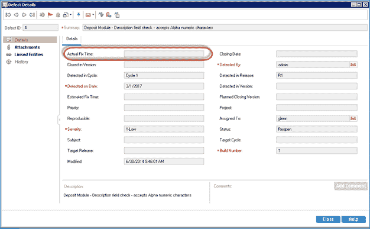

编辑该行代码，如下所示。

**SetFieldApp“ BG_ACTUAL_FIX_TIME”，错误，错误，0、16**

脚本输出已反映在“缺陷详细信息”对话框中，如下所示。

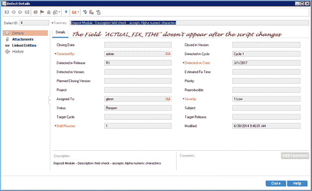

**步骤 6）**让我们对所有可用字段进行更改。

1.  对于每个字段，请按照上一步中的说明更改函数调用的参数，如下所示。
2.  点击“保存”。

**步骤 7）**现在以“ TDAdmin”类型的用户之一登录并访问其中一个缺陷，从而打开“查看缺陷详细信息”对话框。 现在将显示“缺陷详细信息”对话框，如下所示。

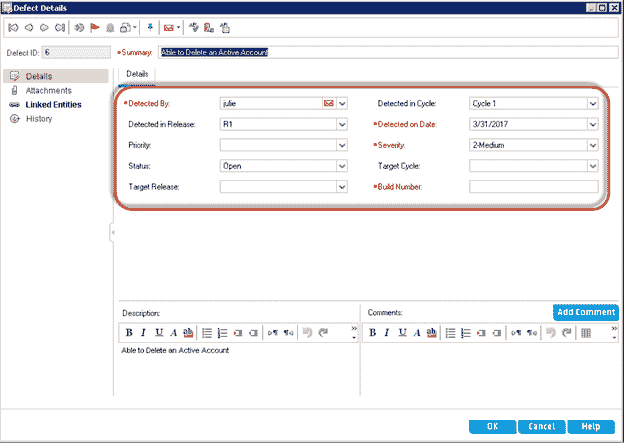