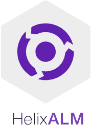

# 30 个最佳 ALM 工具[2020 年 7 月列表]

> 原文： [https://www.guru99.com/alm-tools.html](https://www.guru99.com/alm-tools.html)

⚡**什么是 ALM？**

应用程序生命周期管理（Application Lifecycle Management）简称为 ALM，可帮助开发人员&项目经理管理和跟踪应用程序开发过程。 有很多工具可用于此目的。

❓**为什么使用 ALM 工具？**

AML 工具可帮助组织管理项目管理，需求管理，开发，测试，质量保证（QA），客户支持，IT 服务交付。

以下是具有关键功能的顶级 ALM 软件列表，以及免费试用的下载链接。

### 1）[访问](https://bit.ly/2TngXZa)

[Visure](https://bit.ly/2TngXZa) Solutions，Inc.是提供全面协作 ALM 平台的需求管理套件的领先提供商。 Visure 的价值主张不亚于针对关键安全系统和关键业务系统的工程要求在关键功能，系统性能，标准合规性和解决方案经济学方面的整体创新技术。

**功能：**

*   Visure 提供专门的创新 Requirement ALM 平台，以实施高效的需求生命周期管理，旨在保证我们客户系统和服务的开发中的最高质量。
*   支持各种标准模板，例如 ISO26262，IEC62304，IEC61508，CENELEC50128，DO178 / C，FMEA，SPICE，CMMI 等
*   无与伦比的系统经济性保证了最高的质量，并大大降低了整个生命周期的成本。
*   配置管理，基准，历史记录跟踪，需求版本控制（比较需求版本并将其回滚）
*   报表管理：仪表板和报表自定义，
*   用户可以利用现代最佳技术与其他工具（例如 DOORS，Jama，Siemens Polarion，PTC，Perforce，JIRA，Enterprise Architect，HP ALM，Microfocus ALM，PTC，TFS，Word，Excel，Test RT， RTRT，VectorCAST，LDRA 等工具

* * *

### 2） [Jama 软件](https://bit.ly/33I5LYZ)

[Jama 软件](https://bit.ly/33I5LYZ)为需求，风险和测试管理提供了领先的平台。 借助 Jama Connect 和以行业为中心的服务，构建复杂产品，系统和软件的团队可以缩短周期，提高质量，减少返工并最大程度地减少证明合规性的工作。

**Features:**

*   在整个开发过程中准确地捕获和传达需求，目标，进度和相互依存关系
*   人员，数据和流程的端到端实时跟踪
*   实时影响分析，显示与上游和下游需求相关的变更的影响
*   与 ALM，PLM，QA，MBSE 集成
*   定义，组织和执行基于需求的测试计划和测试用例
*   重用经过验证的需求，以快速跨产品复制功能

* * *

### 3）CodeBeamer：

[CodeBeamer](https://intland.com/codebeamer/application-lifecycle-management/) 是强大的 ALM 工具。 它可以与源代码，任务，错误，测试，发布和所有其他工件相关联。 它在整个生命周期中提供了无缝的可追溯性。

**Features:**

*   使用 REST API 与 MS Office，JIRA，IBM DOORS，Enterprise Architect 集成
*   高级需求工作流程&流程执行
*   使用文档管理功能进行高效协作
*   敏捷计划委员会使发布的计划和管理变得方便
*   发布和 Devops 支持。
*   端到端需求管理和合规支持

**下载链接：** [https://intland.com/codebeamer/download/](https://intland.com/codebeamer/download/)

* * *

### 4）Kovair ALM Studio：

[Kovair ALM Studio](https://www.kovair.com/alm-studio/) 是最全面的应用程序生命周期管理产品。 它可以处理从需求到发布的端到端开发生命周期阶段。

**Features:**

*   采用无客户端软件的 100％基于 Web 的解决方案，以减轻支持负担
*   练习瀑布式，敏捷式或混合式的任何开发方法
*   实施基于可配置任务的工作流引擎，以提高效率和生产率
*   在每个可行阶段获取实时通知
*   全面覆盖开发的每个步骤，以确保符合标准。
*   允许实时查看工件状态，从而增加透明度并释放可预测性。

**下载链接：** [https://www.kovair.com/alm-studio/](https://www.kovair.com/alm-studio/)

* * *

### 5）SwiftALM：

[SwiftALM](https://www.digite.com/swiftalm/) 是一种 ALM 工具，用于在全球交付模型中管理 IT 和软件项目。 它提供了独特的功能来管理传统项目和敏捷项目。

**Features:**

*   设置资源，流程和项目，控制对计划和报告的访问
*   集成的流程治理支持，敏捷，瀑布式和许多其他流程
*   高度可配置和灵活的应用程序体系结构，可支持数千个用户
*   先进的搜索和分析技术可提高生产率，质量和交付绩效。

**下载链接：** [https://www.digite.com/free-demo-request/](https://www.digite.com/free-demo-request/)

* * *

### 6）VersionOne：

[VersionOne](https://www.versionone.com/) 通过易于进行的积压管理简化了产品规划。 它是为 DevOps 构建的，可提供端到端的连续交付。 它具有拖放界面。

**Features:**

*   它允许用户使用拖放功能确定故事和缺陷的优先​​级。
*   使用投资组合项目管理业务计划
*   允许按主题分组项目
*   根据业务目标提供结果
*   一处捕获所有功能请求
*   帮助用户确保公司目标与产品交付物之间的一致性
*   它提供了一个论坛，可以与其他客户互动，向同行学习。
*   为管理人员提供见解和端到端可见性。

**下载链接：** [http://info.versionone.com/v1-trial-free.html](http://info.versionone.com/v1-trial-free.html)

* * *

### 7）奥尔顿：

[Rocket Aldon](http://www.rocketsoftware.com/products/rocket-aldon) 是一种 ALM 软件，可简化和自动化软件交付过程的各个方面。 它还确保更改过程是可预测的，可伸缩的和可重复的。

**Features:**

*   自动化 IT 和 DevOps 工作流程
*   帮助减少软件错误并避免生产中断
*   简化的规模变更管理
*   允许远程解决部署问题
*   在任何版本控制应用程序上的简单构建集成
*   允许单击代码升级
*   自动生成和包装清单
*   基于角色和个人权限的定义
*   通过单个控制台控制和管理所有服务器

**下载链接：** [http://www.rocketsoftware.com/products/rocket-aldon/alm-software](http://www.rocketsoftware.com/products/rocket-aldon/alm-software)

* * *

### 8）Helix ALM：

[Helix ALM](https://www.perforce.com/products/helix-alm) 解决方案可帮助公司管理任何类型的复杂 ALM 流程。 它还允许用户集中和管理需求，测试用例和问题。

**Features:**

*   限制产品开发的风险
*   提高项目健康的可见性
*   通过允许团队和部门之间的协作来降低产品开发风险
*   简化开发和质量检查流程
*   它允许跨所有工作项和数据进行追溯
*   与源代码控制系统的深度集成。

**下载链接：** [https://www.perforce.com/try-perforce-free](https://www.perforce.com/try-perforce-free)

* * *

### 9）ConnectALL：

[ConnectALL](https://www.connectall.com/integration/) 连接应用程序生命周期管理（ALM）工具。 它可以自动同步数据，工作流和需求。

**Features:**

*   统一团队，流程和企业级解决方案，以加速软件开发和协作
*   实时同步可帮助所有团队成员查看相同的数据
*   其他 ALM 工具之间可自定义的一对多和多对多字段映射

**下载链接：** [https://www.connectall.com/integration/](https://www.connectall.com/integration/)

* * *

### 10）Devsuite：

[DevSuite](https://www.techexcel.com/products/devsuite/) 是完全集成的 ALM 解决方案。 它允许开发人员和 QA 管理人员监视和控制应用程序生命周期管理的所有过程。

**Features:**

*   通过全面跟踪每个需求，提高产品的整体质量
*   工作流程自动化&标准化
*   管理测试用例，计划测试范围并控制测试执行
*   无与伦比的可扩展性和性能
*   它提供个性化的用户体验
*   借助集中视图简化产品计划
*   直接从手机或平板电脑获取实时项目更新，管理任务

**下载链接：** [https://www.techexcel.com/eval-devsuite/](https://www.techexcel.com/eval-devsuite/)

* * *

### 11）Silkroad Alm：

[Silkroad](http://www.silkroadalm.com/main.do) 是高可靠性的 ALM。 它具有用于各种旧式管理系统的互连路由。 它是一款多功能软件，可以充当需求和测试管理工具。

**Features:**

*   提供对版本控制&需求文档比较的支持
*   需求影响分析
*   任务，问题和测试系统之间的数据集成
*   管理需求，包括图像，表格&公式
*   上游或下游可追溯性管理
*   变更记录管理
*   在关键任务航空航天和国防行业中广泛使用 ALM。

**下载链接：** [http://www.silkroadalm.com/main.do](http://www.silkroadalm.com/main.do)

* * *

### 12）极化：

[Polarion](https://polarion.plm.automation.siemens.com/) 是一个集成的 ALM 平台。 它使组织能够自动化和优化各个项目的开发流程。 它在项目生命周期中收集，批准和管理复杂系统的需求。

**Features:**

*   所有需求都显示给所有其他利益相关者，以供审核，批准或开发
*   借助基于规则的导入向导轻松导入现有资产
*   支持离线协作，以便可以无缝导入 Polarion 之外进行的更改
*   邀请利益相关者签署经过电子审核或批准的特定文件
*   它支持跨各种开发操作（如敏捷，瀑布和混合）的开发流程。
*   Polarion 支持分布式团队的创新问题解决技术。
*   与需求并行构建测试用例的统一解决方案

**下载链接：** [https://polarion.plm.automation.siemens.com/try-polarion-alm-qa-requirements](https://polarion.plm.automation.siemens.com/try-polarion-alm-qa-requirements)

* * *

### 13）ALM 完成：

[ALM Complete](http://www.testmanagement.com/almcomplete.html) 管理需求，跟踪项目任务并列出问题/缺陷。 它有助于管理开发生命周期的各个方面。 它还允许在测试执行期间定义需求，创建测试用例并跟踪缺陷。

**Features:**

*   提供项目计划和开发状态的实时更新。
*   将需求链接到其他用例，并将相关文档存储在同一位置。
*   测试用例管理功能按组，文件夹和自定义字段组织测试用例。
*   与自动和手动测试用例集成以提供测试覆盖率报告。
*   与常见的源代码控制工具轻松集成
*   创建自定义列表以跟踪用例，任务，测试环境。
*   支持升级规则和报告触发器

**下载链接：** [http://www.testmanagement.com/download/download_alm.html](http://www.testmanagement.com/download/download_alm.html)

* * *

### 14）MicroFocus ALM：

[Microfocus ALM](https://software.microfocus.com/en-us/software/app-dev-test-delivery) 是精益，敏捷和 DevOps 的软件和解决方案，可帮助组织更快地发布软件。 该工具使各种规模的团队都能更快地交付高质量的应用程序。 该工具最初由 Mercury 开发，后来被 HP 收购，并最终由 MicroFocus 接管。

**Features:**

*   以速度，质量和规模交付应用
*   它允许利益相关者进行互动和协调，以实现项目目标。
*   它提供强大的跟踪&报告，并无缝集成各种项目相关任务
*   它允许进行详细的项目分析和有效的管理。
*   ALM 可以连接到电子邮件系统，并向所有期望的团队成员发送有关任何更改的电子邮件

**下载链接：** [https://software.microfocus.com/zh-cn/select/free-trial](https://software.microfocus.com/en-us/select/free-trial)

* * *

### 15）合理的解决方案：

用于带有 Scrum 的敏捷 ALM 的 [IBM Rational 解决方案](https://jazz.net/downloads/sse/)使得采用和自动化 Scrum 变得容易。 该单个工具可用于审查端到端方案，因此对整个团队均有效。

**Features:**

*   计划&跟踪资源管理工作。
*   制定，执行和报告测试计划
*   更好的测试执行和计划
*   它使团队成员可以更好地了解这些工件之间的关系
*   它允许可靠的集成
*   轻松监控和管理
*   与需求和自动化工具轻松集成
*   可定制的仪表板，减少了状态会议
*   它可以轻松地与各种测试自动化工具集成

**下载链接：** [https://jazz.net/downloads/sse/](https://jazz.net/downloads/sse/)

* * *

### 16）Atlassian Jira：

[JIRA](https://www.atlassian.com/software/jira) 是一种敏捷应用程序管理工具。 它可以帮助每个业务人员计划，跟踪和创建其工作报告。

**Features:**

*   任务管理有助于跟踪简单任务
*   每个人都可以一目了然地查看项目状态，而无需通过电子邮件或召开会议
*   项目管理功能允许组织公司网站设计或员工培训计划
*   它允许以不同的方式测量性能，以实现快速概览和预定义的报告
*   使用现成的模板或根据特定业务需求自定义它们

**下载链接：** [https://www.atlassian.com/try](https://www.atlassian.com/try)

* * *

### 17）TeamForge：

[TeamForge](https://www.collab.net/products/teamforge-alm) 是用于协作软件开发的 ALM 平台。 它有助于开发人员加快软件交付速度。 它维护治理，合规性和 IP 安全性的所有标准。

**Features:**

*   它为整个组织的敏捷过程和开发提供可见性和可追溯性
*   它允许开发团队扩展其敏捷流程，并鼓励更紧密的协作
*   它可以轻松集成其他 3 个和第三方工具灵活，集中的文档管理
*   基于角色的集中式访问控制
*   通过任务板可视化进度
*   使用计划模板快速跟踪
*   Scrum /看板支持。

**下载链接：** [https://www.collab.net/products/teamforge/free-trial](https://www.collab.net/products/teamforge/free-trial)

* * *

### 18）曲目+：

[Track +](https://www.trackplus.com/en/) 是模块化工程生命周期管理软件。 它可以加速软件产品的开发。 Track + ALM 工具在文件夹，文档和文档部分中组织需求和测试。 它还允许使用 Word 或其他文字处理软件编写文档。

**Features:**

*   分层组织完整的需求，例如系统需求，硬件需求和软件需求
*   测试用例的需求，反之亦然
*   允许使用自定义 Word 文档模板来创建完善的需求和测试规范
*   它为各种软件开发过程提供了一个单一的直观界面
*   它允许在开发生命周期中进行追溯
*   它支持 Scrum，看板和传统方法

**下载链接：** [https://www.trackplus.com/en/](https://www.trackplus.com/en/)

* * *

### 19）奥尔坎斯

[Orcanos ALM](http://www.orcanos.com/orcanos_alm_home/) 提供端到端的产品交付解决方案。 它允许协作任务管理，需求和测试，ISO 14971 集成风险管理，质量控制&自动警报以及许多其他功能。

**Features:**

*   完整的可追溯性和覆盖率矩阵
*   管理相关任务，缺陷，会议，代码和测试执行结果
*   立即查看任何要求或缺陷的直接影响
*   计划，分析和估算项目所需的总工作量
*   只需单击一下即可创建一组新的更新的文档套件

**下载链接：** [http://www.orcanos.com/signup](http://www.orcanos.com/signup)

* * *

### 20）OneOps：

[OneOps](http://oneops.com/) 是应用程序生命周期管理平台。 它允许开发人员对产品进行一次编码，然后在混合，多云环境中运行它们。

**Features:**

*   它允许快速创新而无障碍
*   它将对云环境的控制权交还给开发人员和 IT 运营团队
*   开箱即用，具有多个公共和私有云基础架构
*   它允许在所有环境中重复部署
*   面向未来的自动化，可与基础架构完美融合
*   灵活的部署以及取消功能
*   开箱即用，可支持各种 ISV 产品
*   它与 Maven / Jenkins 集成以提供具有持续交付功能的软件开发
*   混合和匹配技术以完全定义符合 IaaS 的基础架构

**下载链接：** [http://oneops.com/](http://oneops.com/)

* * *

### 21）评论：

[解决方案](https://www.relution.io/en/)是一种 ALM 工具，用于管理和保护整个移动应用程序的生命周期。 它通过 iOS，Android 和 Windows 的应用商店分发应用程序。 它是用于 ALM 管理的易于使用且节省时间的解决方案。

**Features:**

*   通过私人应用商店分发应用
*   适用于 iOS，Android & Windows Phone 的本机应用程序
*   来自 Google Play，Apple App Store 或 Windows Store 等公共商店的应用
*   它通过企业应用商店分发应用。
*   最高的应用程序审批质量
*   帮助实现更高的生产率并防止任何类型的意外应用访问
*   节省时间并减轻支持压力
*   在内部部署或在云中部署

**下载链接：** [https://www.relution.io/en/](https://www.relution.io/en/)

* * *

### 22）AccelQ：

[AccleQ](http://accelq.com/product.html) ALM 工具提供了应用程序的可视化蓝图。 它使用路径分析来跟踪质量保证，从而实现测试设计自动化。 它是用于功能& API 测试的基于云的连续测试平台。

**Features:**

*   无代码自然语言功能，API 自动化
*   没有 IDE，完全基于浏览器的易于使用的应用程序
*   使用 accelQ Universe 可视化并提高质量
*   设计/自动化/维护测试速度提高 3 倍
*   允许在 Smart View Analyzer 的帮助下跨多个应用程序版本管理测试资产
*   它允许根据变更影响建立测试范围。 通过为元数据和各种测试中的标签提供广泛的支持
*   借助 OAuth 2.0 协议进行身份验证和授权的企业级访问安全性

**下载链接：** [http://www.accelq.com/product.html](http://www.accelq.com/product.html)

* * *

### 23）Apprenda：

[Apprenda](https://apprenda.com/) 是有用的 ALM 工具。 它使用版本控制过程管理 Web 和 SOA 以及微服务应用程序部署。 它提供了易于使用的修补程序引擎，可将修补程序应用于小型升级和错误修复。

**Features:**

*   通过 Apprenda 的补丁引擎上传补丁
*   测试沙箱中的并行版本以及按钮单击生产阶段和升级
*   与现有的构建系统集成，并使用 Apprenda 的 API 进行持续集成。
*   检查 SOAP 和 REST 依赖性
*   自动将请求延迟绑定到目标服务
*   检查生产与生产边界的版本感知呼叫编排

**下载链接：** [https://apprenda.com/platform/features/application-lifecycle-management/](https://apprenda.com/platform/features/application-lifecycle-management/)

* * *

### 24）QAcube：

[QACube](http://www.qacube.com/) 是 QA 测试 ALM 工具，它可以 360 度查看 QA 的各种活动。 它使测试团队可以利用领先的视觉分析来查看瓶颈。 它还可以帮助他们做出重要的资源决策。

**Features:**

*   它审查了各个团队的敏捷测试计划的绩效
*   优先进行基于风险的测试以获得最大的测试覆盖率
*   根据角色向主要利益相关者提供他们所需的视图
*   它为管理人员提供动态仪表板
*   在 ALM /软件测试项目中实现可见性&透明性
*   将关键信息收集到一个直观的仪表板中。
*   在一个平台上查看来自任何来源的所有数据，以做出更快，更明智的决策。
*   具有动态信息的自动更新的可行指标

**下载链接：** [http://www.qacube.com/product/request_demo](http://www.qacube.com/product/request_demo)

* * *

### 25）McCabe CM：

[McCabe CM](http://www.mccabe.com/cm.htm) 通过生产管理和跟踪整个 ALM 请求。 它允许开发，测试和发布团队的成员选择和迁移更改。 在不同版本中，它可以是向前，向后或侧向。

**Features:**

*   它管理和跟踪从请求到生产的整个应用程序生命周期。
*   它使用高级软件指标来识别，客观地衡量和报告复杂性
*   它还允许项目的发布管理

**下载链接：** [http://www.mccabe.com/cm.htm](http://www.mccabe.com/cm.htm)

* * *

### 26）NexaStack：

[NexaStack](https://www.nexastack.com/) 是一个应用程序管理工具。 它为企业提供了高度可定制的解决方案。 它为企业应用程序提供了灵活性和稳定性。 它还提供大数据基础架构，以在本地或公共云中进行部署。

**Features:**

*   从一开始就确保应用程序生命周期的安全
*   全面了解系统中正在发生的事情
*   全面分析使用情况，日志和申请流程
*   自动部署&
*   支持所有类型的微服务架构
*   允许本地部署

**下载**： [https://www.nexastack.com/](https://www.nexastack.com/)

* * *

### 27）PTC：

[完整性生命周期管理器](https://www.ptc.com/en/application-lifecycle-management/integrity/lifecycle-manager)由 PTC 开发的 ALM 工具。 它连接包括需求在内的系统和软件，以开发综合应用程序。 它允许管理产品和系统要求，以进行闭环产品验证。

**Features:**

*   在需求，测试用例，缺陷等之间易于追踪
*   强大的查询，图表和报告功能
*   历史报告和可疑链接标记和报告
*   它具有端到端生命周期可追溯性和基于任务的变更管理，从而提供了更高的可见性
*   通过在整个生命周期中执行一致的开发流程来增强可听性
*   使用同一平台管理敏捷，迭代和传统方法
*   基于任务的变更管理的实时生命周期可视性
*   它提供集中的计划，测量和报告
*   明确支持软件开发最佳实践

**下载链接：** [https://www.ptc.com/en/application-lifecycle-management/integrity/lifecycle-manager](https://www.ptc.com/en/application-lifecycle-management/integrity/lifecycle-manager)

* * *

### 28）西风：

[Zephyr](https://www.getzephyr.com/products/zephyr-enterprise) 是一个强大的 ALM 工具。 它管理测试生命周期的所有方面。 这款敏捷的 ALM 测试工具适合并增强各种类型的测试方法，例如瀑布，敏捷，混合或 V 模型。

**Features:**

*   跟踪质量指标
*   链接到故事，任务，需求等。
*   创建，查看，编辑和克隆测试
*   创建自定义仪表板
*   允许使用 ZQL 执行高级搜索
*   计划测试执行周期
*   记录良好的 REST API，用于自定义集成

与 JIRA，Selenium，Bamboo，Jenkins，Confluence 等工具集成

**下载链接：** [https://www.getzephyr.com/products/zephyr-enterprise](https://www.getzephyr.com/products/zephyr-enterprise)

* * *

### 29）qTest;

[Qtest](https://www.qasymphony.com/) 是完整的需求管理和 ALM 工具。 它使用快速，易于使用的界面跟踪，组织和报告所有测试活动。 它提供了强大且易于使用的测试管理。

**Features:**

*   可以轻松地与 JIRA 实时集成的解决方案
*   通过 Bamboo 和 Jenkins 等工具与 CI / CD 流程集成
*   允许利用 TestNG，JUnit 和 Cucumber 进行 JAVA 的自动化测试
*   丰富的 API 允许 qTest 与其他三十种测试工具之间的轻松集成
*   可以克隆或复制测试项目以进行设置
*   它与 LDAP 和 SSO 选项集成在一起
*   在站点和项目级别控制用户配置文件
*   捕获完整的测试运行记录
*   生成特定于测试运行的配置和参数

**下载链接：** [https://www.qasymphony.com/qtest-trial-qascom/](https://www.qasymphony.com/qtest-trial-qascom/)

#### 以下是我们的十大精选 ALM 工具

1.  地籍
2.  现代要求
3.  实践测试
4.  CodeBeamer
5.  Kovair ALM 工作室
6.  迅捷 ALM
7.  版本一
8.  火箭奥尔顿
9.  螺旋 ALM
10.  连接全部

⚡ **What is ALM?**

Application Lifecycle Management is shortly known as ALM, helps developers & project managers to manage and track Application development process. There are plenty of tools are available for this purpose.

Application Lifecycle Management is shortly known as ALM, helps developers & project managers to manage and track Application development process. There are plenty of tools are available for this purpose.

Application Lifecycle Management is shortly known as ALM, helps developers & project managers to manage and track Application development process. There are plenty of tools are available for this purpose.

❓ **Why use ALM Tools?**

AML tools helps organizations to manage Project management, Requirements management, Development, Testing, Quality assurance (QA), Customer support, IT service delivery.

AML tools helps organizations to manage Project management, Requirements management, Development, Testing, Quality assurance (QA), Customer support, IT service delivery.

AML tools helps organizations to manage Project management, Requirements management, Development, Testing, Quality assurance (QA), Customer support, IT service delivery.