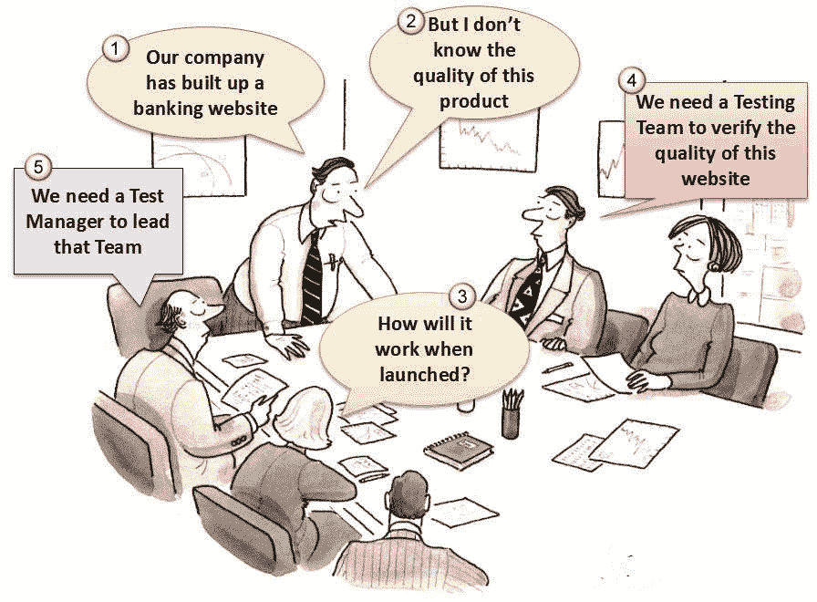
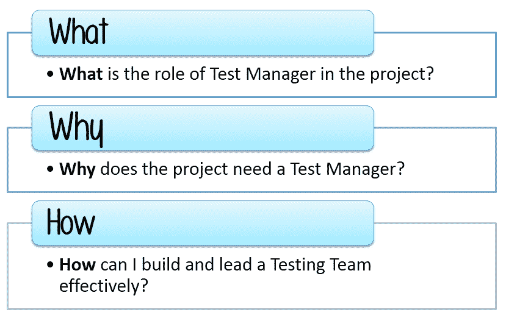
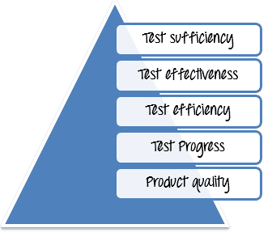

# 角色&测试经理/测试负责人的职责

> 原文： [https://www.guru99.com/introduction-to-test-management-for-curious-manager.html](https://www.guru99.com/introduction-to-test-management-for-curious-manager.html)

您的公司（一家金融公司）建立了一个银行网站。 这是您公司&中最大的软件项目，您的老板想要**最优质的**产品。

开发团队非常努力地制作了网站。 现在，该网站已在服务器上设置。 [http://demo.guru99.com/](http://demo.guru99.com/)

但是，他们不确定**在**实际业务**环境中启动时，**的工作效率如何。

您的老板将您分配为项目的**测试经理**。 您的任务是在将网站 Guru99 Bank 交付给客户之前，对其进行验证和评估。

如果这是您第一次担任测试经理，您可能会问以下一些问题

本教程系列将帮助您回答上述问题。 您将有机会成为真实项目 Guru99 Bank 的测试经理。

在开始项目之前，您应该了解测试管理的基本概念，并回答以下一系列问题：

## 什么是测试管理？

软件质量的重要部分是**测试**和**验证**软件的过程。

测试管理是实践

*   **组织**和**控制**的[测试](/software-testing.html)过程。
*   **确保测试过程的可见性**，**可追溯性**和**控制**以交付高质量的软件。

## 为什么我们需要测试经理？

## 测试在软件开发生命周期中的作用

下图显示了测试在开发过程中的位置

在上述瀑布模型中，软件测试是软件开发生命周期（SDLC）的阶段之一。 测试阶段在 SDLC 中起着重要的作用，并且是关键因素，有助于提高软件系统的**质量**，**可靠性** & **性能**。

让我们看一下软件开发生命周期中软件测试的优势：

*   提高系统的**质量**，**可靠性** & **性能**。
*   在竞争激烈的市场中生产**优质**产品。

我们不能否认测试管理是关键角色，因为它的结果会影响项目的成功。 因此，要创建有效的**测试流程，我们需要一个好的**测试管理器****

## 测试经理的角色和责任是什么？

软件测试经理的角色是**来领导**测试团队。 测试经理在团队中扮演**的核心角色**。

测试经理对项目的成功承担**的全部责任**。 该角色涉及质量&测试倡导，资源规划&管理以及解决阻碍测试工作的问题。

测试负责人/经理负责：

*   **建立**，**领导**测试小组，使项目成功
*   **在每次发布/交付的上下文中定义**的测试范围
*   **部署**和**管理**资源以进行测试
*   **在产品和测试团队中应用**适当的测试度量和指标
*   **规划**，**部署**和**管理**任何指定参与的测试工作。

测试经理必须了解测试如何适合组织结构，换句话说，必须明确定义其在组织中的角色。

## 测试管理面临哪些挑战？

现在，让我们回答以下问题

## 您是否曾经领导过一个测试项目？

<input class="obadd" type="checkbox" value="2"> Yes

<input class="obadd" type="checkbox" value="22"> No
 **It's ok. These tutorials will help you to effectively manage your project** **Sound Good! You have some experience of Project Management** 

## 您认为测试管理是一项非常具有挑战性的任务吗？

<input class="obadd1" type="checkbox" value="3"> Yes

<input class="obadd1" type="checkbox" value="33"> No

**You should think again! Under-estimating management activity may cause the project to fail**
 **Good answer! Even if you used to be a Test Manager, Test management is always a difficult task** 

作为测试经理，您必须**保证**所有以下要求：

领导一个项目时，您将面临许多困难和挑战。 以下是一些典型问题：

*   没有足够的**时间**来测试
*   没有足够的**资源**进行测试
*   项目**的预算**较低，**的进度表**过于紧张
*   测试**团队**并不总是在一个地方
*   **要求**太复杂，无法检查和验证

您已经知道测试管理中的一些典型困难，让我们从一个实际的例子开始

假设您现在是该项目的测试经理：在将其启动给客户之前，请先**验证**和**评估**网站的质量 [http://demo.guru99.com](http://demo.guru99.com/) 。

您的老板想与您讨论有关项目计划，测试充分性，预算和进度的问题。 你准备好了吗？ 让我们参与讨论

上面的示例只是您在 Task 中可能遇到的许多困难之一。 接下来的教程将帮助您克服这些困难而获得成功。