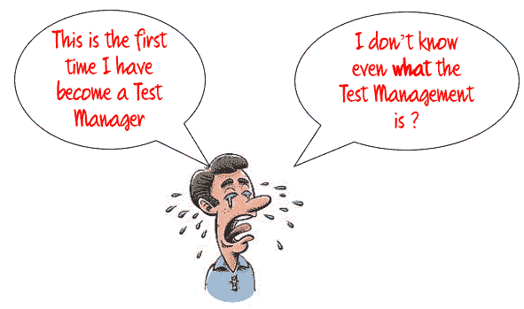
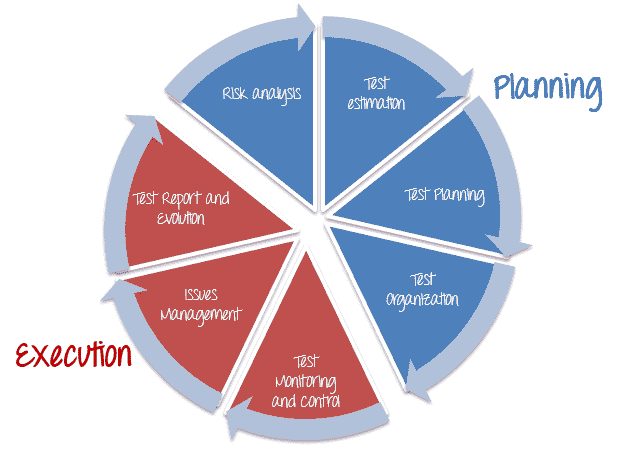
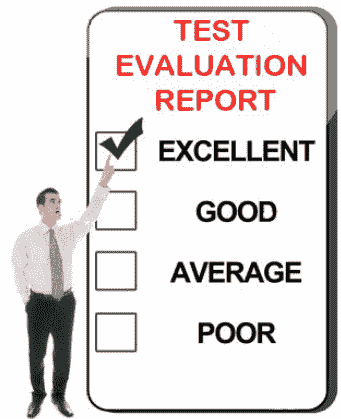

# 测试管理过程：测试项目的完整指南

> 原文： [https://www.guru99.com/test-management-phases-a-complete-guide-for-testing-project.html](https://www.guru99.com/test-management-phases-a-complete-guide-for-testing-project.html)

您将成为公司最重要项目的测试经理。 该项目的任务是测试受人尊敬的“ Guru99 银行”的网上银行功能

一切似乎都很棒。 你的老板信任你。 他指望你。 您有很好的机会证明自己的任务。 但事实是：

测试管理不仅仅是一项活动。 它包括一系列活动

## 测试管理阶段

本主题**简要介绍了**，介绍了测试管理流程，并向您展示了测试管理阶段的**概述**。 您将在下一篇文章中了解有关每个测试管理阶段的更多详细信息。

### 测试管理流程

测试管理过程有两个主要部分：-

*   规划
    1.  风险分析
    2.  测试估计
    3.  测试计划
    4.  测试组织
*   执行
    1.  测试监控
    2.  问题管理
    3.  测试报告和评估

## 规划

### 风险分析与解决方案

**风险**是由给定操作或活动导致的潜在损失（不良后果，但不一定如此）。

风险分析是测试经理在开始任何项目之前应考虑的第一步。 由于所有项目都可能包含风险，因此早期风险检测和解决方案的确定将有助于测试经理**避免将来&的潜在损失&节省项目成本。**

您将在中了解有关风险分析和解决方案的更多详细信息。

### 测试估计

估计是预测或预测。 [测试估计](/an-expert-view-on-test-estimation.html)大致确定**一项任务需要多长时间**才能完成。 评估测试的工作量是测试管理中**主要**和**重要**任务之一。

正确估算的好处：

1.  准确的测试估计可以在测试经理的注意下更好地计划，执行和监视任务。
2.  允许更准确的计划，并帮助您更自信地实现结果。

您可以在中的[中了解有关测试估算和指标的更多详细信息。](/an-expert-view-on-test-estimation.html)

### 测试计划

可以将[测试计划](/what-everybody-ought-to-know-about-test-planing.html)定义为描述**范围**，**方法**，**资源**和**计划表**的文档 预期的[测试](/software-testing.html)活动。

没有完整的测试计划，项目可能会**失败**。 测试计划在大型软件系统开发中尤其重要。

在软件测试中，测试计划为**提供了有关即将进行的测试工作的详细**测试信息，包括：

*   测试策略
*   测试目标
*   退出/暂停条件
*   资源规划
*   测试成果

您可以在[文章](/what-everybody-ought-to-know-about-test-planing.html)中了解有关测试计划的更多详细信息。

### 测试组织

现在您有了一个计划，但是您将如何坚持执行计划呢？ 要回答该问题，您具有**测试组织**阶段。

一般来说，您需要组织一支有效的测试团队。 您必须组建一支熟练的团队，才能有效地运行不断增长的测试引擎。

您是否需要了解有关测试组织的更多信息？ 为什么自组织团队如此重要？ 单击此处的[了解详细信息。](/how-to-organize-a-test-team.html)

## 执行

### 测试监控

如果您的项目在资源或**中运行的**超出时间表的时间，该怎么办？ 您需要监视和控制测试活动以使其按计划恢复。****

测试监视和控制是监督所有必要指标的过程，以确保项目按计划正常运行，并且预算不会超出预算。

### 监控方式

监视是**收集**，**记录**和**报告**有关项目经理和利益相关者需要了解的项目活动信息的过程。

为了进行监视，测试管理器执行以下活动

*   **定义**项目目标或项目绩效标准
*   **观察**项目绩效，并比较实际绩效与计划绩效
*   **记录**和**报告**项目中发现的任何问题

### 控制性

项目控制是使用监视活动中的数据将实际绩效提高到计划绩效的过程。

在此步骤中，测试经理将采取措施纠正与计划的偏差。 在某些情况下，必须根据项目情况对计划进行**调整**。

### 问题管理

如本主题开头所述，所有项目都可能具有**潜在**风险。 当风险发生时，它成为**问题**。

在任何项目的生命周期中，总会出现**意外的**问题和问题。 例如：

*   公司削减您的项目预算
*   您的项目团队缺乏完成项目的技能
*   项目进度太紧，您的团队无法按时完成项目。

测试时应避免的风险：

*   **缺少**截止日期
*   **超过了**项目预算
*   **失去**客户的信任

当出现这些问题时，您必须准备好应对它们-否则它们可能会影响项目的结果。

您如何处理这些问题？ 什么是问题管理？ 在这篇[文章](/issue-management-in-your-testing-project.html)中找到答案

### 测试报告&评估

该项目已经完成。 现在该回顾您的工作了。

测试评估报告的目的是：

“测试评估报告”以[测试覆盖率](/test-coverage-in-software-testing.html)和退出标准来描述测试结果。 测试评估中使用的数据基于测试结果数据和测试结果摘要。