# 测试管理中的项目风险分析&解决方案

> 原文： [https://www.guru99.com/how-precaution-becomes-cure-risk-analysis-and-solutions-in-test-management.html](https://www.guru99.com/how-precaution-becomes-cure-risk-analysis-and-solutions-in-test-management.html)

### 什么是风险分析？

风险是发生不良事件的概率。

风险分析是分析与[测试](/software-testing.html)项目相关的风险的过程。

为使项目成功，应在项目开始之前确定风险并确定相应的解决方案。

在本教程中，我们将通过案例研究发现测试管理过程的第一步：风险分析和解决方案。

在本主题中，我们将在案例研究的帮助下发现测试管理过程的第一步：风险分析和解决方案。

被测试的应用程序是 [demo.guru99.com](http://demo.guru99.com/V4/) ，您可以在此处参阅软件需求规范[。](https://docs.google.com/document/d/1PZQZKt7hqS417QjYRMppPnTwfj8V54XUA7nZUnYvumE/edit)

Guru99 银行将扮演两个角色

*   经理
*   顾客

以下功能/模块可用于这两个不同的角色

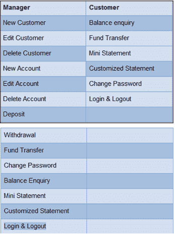

这是该网站的一些游览

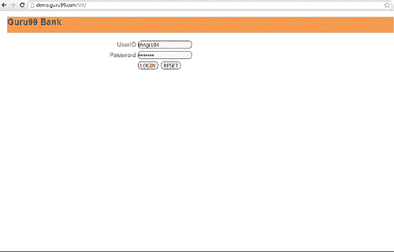

阅读需求文档后，您可能已经意识到该网站具有太多的**功能**和**复杂**方案。

这是情况-

1.  Guru99 银行网站已经完成开发阶段。 现在开始测试阶段。 不幸的是，您没有在需求阶段的早期就参与其中
2.  您的老板需要您以有限的预算在**中完成一个月的测试**，但希望**的质量很高。**
3.  一个经验丰富的工程师的团队成员告诉您

4.  在这种情况下，您应该怎么办？

<input class="obadd" type="checkbox" value="2"> A) It seems to be a big problem. We need to deal with ASAP!!!

<input class="obadd" type="checkbox" value="22"> B) I don't care. We need to start working right now.

If you choose the action B, here are the results after one month

*   该项目一团糟，占用了您所有的资源和时间。 员工的工作量急剧增加&，他们感到压力和超负荷

*   -您的项目被延迟，因此您无法按承诺向老板承诺在规定的期限内发布产品。 正如您的团队成员所说，与当前资源分配相比，该项目的时间表太紧了。

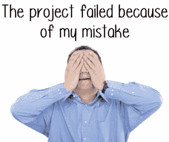

If you choose the action A, here are the results after one month

上面的示例说明了测试管理中风险分析的**重要性**。

风险管理可以帮助您–

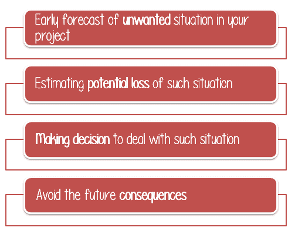

上例中提到的风险只是项目中可能发生的许多潜在风险之一。 您应该识别它们并决定尽快处理它们！！！ 因此，该示例中的正确操作是**操作 A** 。

因此，风险分析很重要

## 如何进行风险分析？

这是一个三步过程

1.  识别风险
2.  分析每个已识别风险的影响
3.  对已确定的&分析风险采取对策

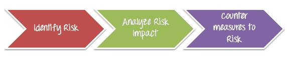

## 步骤 1）识别风险

可以识别风险并将其分为软件产品的 2 种类型

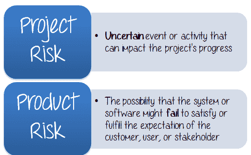

## 项目风险

项目风险可以定义为可能影响项目进度的**不确定**事件或活动。 该影响对实现项目目标的前景具有**正面**或**负面**效果。

主要有 3 类项目风险

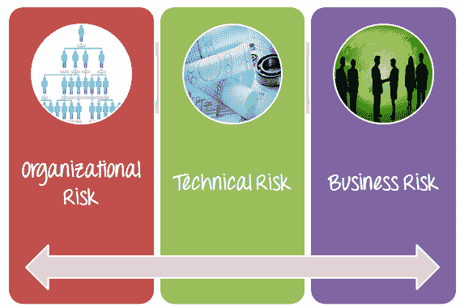

*   **组织风险**

这与您的**人力资源**或您的测试团队有关。 例如，在您的项目中，缺乏技术熟练的成员是一种风险。 没有足够的人力按时完成项目是另一个风险。

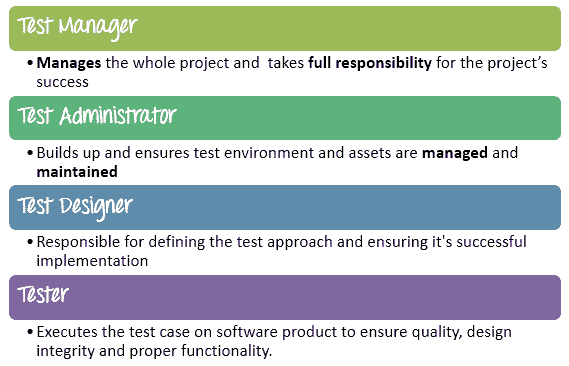

为了确定组织风险，您应该列出一些问题并以自我锻炼的方式回答。 以下是一些建议的问题。

**1\. Is this a well-organized Team?**

<input class="eb" name="eb" type="checkbox" value="1">A) Yes

<input class="ebno" name="ebno" type="checkbox" value="11">B) No

**Your project doesn't have any organization risk****Create stronger team and foster an environment of co-operation**

**2\. Does each team member has the skill to do his/her job??**

<input class="eb" name="eb" type="checkbox" value="1">A) Yes

<input class="ebno" name="ebno" type="checkbox" value="11">B) No

**Your project doesn't have any organization risk****Build the training course to skill up members**

**3\. Compare to project size and schedule, do we have enough human resource to finish this project at the deadline?**

<input class="eb" name="eb" type="checkbox" value="1"> A) Yes

<input class="ebno" name="ebno" type="checkbox" value="11"> B) No

**Your project doesn't have any organization risk****Ask the project board to get more human resource**

如果您回答以上所有问题，则可以轻松确定可能会影响您的项目的潜在风险。

*   **技术风险**

技术风险是指在执行未经测试的工程，错误的测试程序等技术流程过程中造成损失的可能性。 这是技术风险的一个例子

*   您在此项目中的任务是测试银行网站。 您必须设置适当的测试环境以反映真实的业务环境。 如果未正确设置[测试环境](/test-environment-software-testing.html)，则将无法正确测试**产品，而无法正确检测**缺陷**。**

*   **商业风险**

风险涉及**外部**实体。 这可能来自您的公司，您的客户，但不是您项目中的**，而不是**。

下图显示了业务风险的示例。

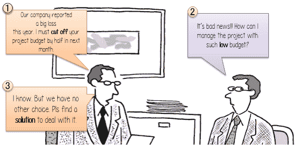

在这种情况下，测试经理必须找出应对风险的解决方案，例如：

*   在测试阶段设置**优先级**，着重测试网站的主要功能
*   **利用**测试工具来提高测试效率
*   应用**流程改进**以减少管理工作。

## 产品风险

**产品风险**是系统或软件可能无法满足或满足客户，用户或利益相关者期望的可能性。 此风险与产品的**功能**有关，例如性能问题，安全问题，崩溃情况等。

以下是一些产品风险的示例-

*   该软件跳过了客户在用户要求中指定的某些**键**功能
*   该软件是**不可靠的**，并且经常**无法使**工作。
*   软件发生故障的方式会对使用该软件的用户或公司造成财务或其他损失。
*   该软件具有与特定质量特征相关的问题，例如安全性，可靠性，可用性，可维护性或性能。

现在回到您的项目，Guru 99 Bank 网站上是否存在产品风险？ 要回答这个问题，您应该遵循以下步骤

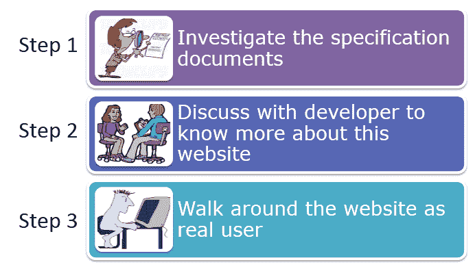

完成上述 3 个步骤后，请执行以下小测验以识别产品风险

1\. Can the Guru99 bank website **secure** the customer account and his data?
<input class="eb" name="eb" type="checkbox" value="1">A) Yes

<input class="ebno" name="ebno" type="checkbox" value="11">B) No

<input class="ebno1" name="ebno1" type="checkbox" value="111">C) I am not sure

Incorrect

Correct

2\. Is the website **usable** for customer?
<input class="eb" name="eb" type="checkbox" value="1">A) Yes

<input class="ebno" name="ebno" type="checkbox" value="11">B) No

Correct

Incorrect

3\. Which other functions, website should have?
<input class="ebno" name="ebno" type="checkbox" value="1"> A) Secure Fund transfer

<input class="ebno1" name="ebno1" type="checkbox" value="111"> B) User can register new account

<input class="eb" name="eb" type="checkbox" value="11"> C) No need more functions

IncorrectCorrect

## 步骤 2）分析发生风险的影响

在上一个主题中，我们已经确定了可能会妨碍您的项目的风险。 以下是确定的风险列表：

*   您可能没有足够的**人力资源**在截止日期之前完成项目
*   测试**环境**可能无法像真实业务环境一样正确设置。
*   由于业务情况，您的项目**预算**可能会减少一半
*   该网站可能**缺少**安全功能

接下来，您应该分析这些风险。

应根据以下两个参数对每种风险进行分类

*   **出现的概率**
*   **对项目的影响**

使用下面的矩阵，您可以**将风险分为**高，中，**和**低或值为 3,2，1** 四类。**

| 

可能性

 |
| 高（3） | 发生的可能性很高，可能会影响到整个项目 |
| 中（2） | 50％发生的机会 |
| 低（1） | 发生几率低 |

| 

影响力

 |
| High (3) | 如果尚未立即解决，则无法继续进行项目活动 |
| 中（2） | 如果未解决，则无法继续项目活动 |
| Low (1) | 需要解决它，但有可能暂时采取替代解决方案 |

考虑以下风险

| 

风险

 | 

Probability

 | 

Impact

 | 

优先级=概率*影响

 |
| 项目截止日期未达到 | 3 | 3 | 9 |
| 停电 | 1 | 2 | 2 |

基于以上优先事项，您可以采取下表中提到的对策

| 

优先

 | 

风险管理方法

 |
| 高 | 6 -9 | *立即采取缓解措施，并每天监控风险，直到其状态关闭。* |
| 中间 | 3-5 | *每周在内部进度会议上监视风险* |
| 低 | 1-2 | *接受风险并按里程碑监视风险。* |

现在该练习了，在 Guru99 Banking 项目中我们确定了 4 种风险。 自己分类

| 风险 | 高 | 中 | 低 | 状态 |

| 

1.  您可能没有足够的 **人力资源** 在截止日期之前完成项目。

 | 

1.  [ ] 

 | 

1.  [ ] 

 | 

1.  [ ] 

 | 正确。不正确。 |
| 

1.  测试 **环境** 可能无法像真实业务环境

那样正确设置 | 

1.  [ ] 

 | 

1.  [ ] 

 | 

1.  [ ] 

 | 正确。不正确的 |
| 

1.  由于业务情况，您的项目 **预算** 可能减少一半

 | 

1.  [ ] 

 | 

1.  [ ] 

 | 

1.  [ ] 

 | 正确。不正确的 |
| 

1.  该网站可能 **缺少** 安全功能

 | 

1.  [ ] 

 | 

1.  [ ] 

 | 

1.  [ ] 

 | 正确。不正确。 |

## 步骤 3）采取对策以减轻风险

这项活动分为 3 个部分

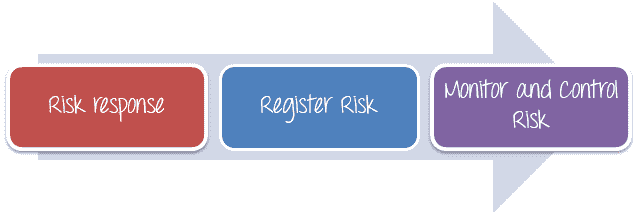

## 风险应对

项目经理需要选择能够将风险降至最低的策略。 项目经理可以选择以下四种风险应对策略

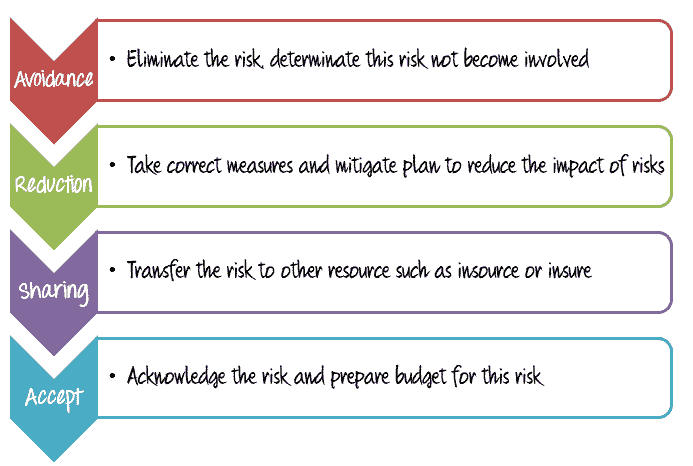

回到前面确定的 4 种风险中，我们必须找到**对策**以避免或消除它们。

A) You may not have enough **human resources** to finish project at deadline

<input id="a" name="a" placeholder="Type Your Answer" style="background-color:white;margin-left:18px;" type="text" value="">

B) The Testing **environment** may not be setup properly like real business environment

<input id="b" name="b" placeholder="Type Your Answer" style="background-color:white;margin-left:18px;" type="text" value="">

C) Your project **budget** may cut by half because of business situation

<input id="c" name="c" placeholder="Type Your Answer" style="background-color:white;margin-left:18px;" type="text" value="">

D) This website may **lack** security features

<input id="d" name="d" placeholder="Type Your Answer" style="background-color:white;margin-left:18px;" type="text" value="">

<input id="submit" type="button" value="Submit">

**A. You may not have enough human resource to finish the project at the dead line**
This risk cannot be avoided because of company’s situation; you cannot request more human resource for the project. In such case, you can reduce the impact of risks by choosing some options below

*   选择有才华和经验丰富的成员加入项目团队
*   创建培训课程以提高成员技能，帮助他们提高生产力

**B. The testing environment may not be setup properly like real business environment**
This risk could be avoided if you do the following activities

*   向开发团队寻求帮助，以建立测试环境
*   准备设置环境所需的所有设备或材料（服务器，数据库，PC ..）

**C. Your project may cut by half because of business situation**
This risk is a critical; it may prevent the whole project from proceeding. In that case, you should do

*   重新定义项目范围，确定将要测试的内容以及在这种情况下将忽略的内容
*   与客户协商适合项目预算的项目期限
*   提高每个项目阶段（例如测试，制定测试规范）的生产率……如果可以节省时间，则可以节省成本

**D. This website may lack security features**
This risk is considered as Medium priority, because it doesn’t affect to the whole project and could be avoided. You can request the development team to check and add these functions to the website.

## 注册风险

所有风险都必须由项目经理，利益相关者和项目成员进行记录，记录和确认。 项目团队的所有成员都应该可以免费访问风险登记簿。

记录风险很有用，例如 [Redmine](http://www.redmine.org/) ， [MITER](http://www.mitre.org/publications/systems-engineering-guide/acquisition-systems-engineering/risk-management/risk-management-tools) 等。

## 监控风险

可以连续监控风险，以检查是否进行了任何更改。 通过不断的监测和评估机制，可以发现新的风险。

为了更好地进行风险管理，您可以参考本文中包含的[风险管理](/images/TestManagement/RiskManagement_Template.xls)模板