# 软件测试评估技术：分步指南

> 原文： [https://www.guru99.com/an-expert-view-on-test-estimation.html](https://www.guru99.com/an-expert-view-on-test-estimation.html)

### 什么是软件测试估计？

测试估算是一项管理活动，它近似于**任务需要多长时间**才能完成。 评估测试的工作量是测试管理中**主要**和**重要**任务之一。

## 为什么要测试估计？

在讨论潜在的测试项目时，您可以从客户那里想到两个问题：

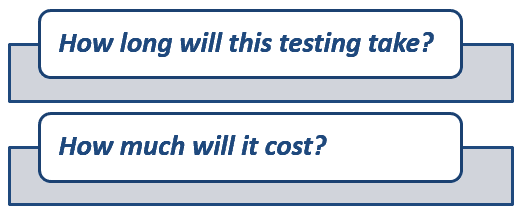

对于小型项目，这些问题相对容易回答。 但是对于像 [Testing](/software-testing.html) Guru99 Bank 网站这样的大型项目，您必须认真思考才能回答这些问题。

在本教程中，您将学习-

*   [什么是软件测试估计？](#1)
*   [为什么要测试估计？](#2)
*   [估计些什么？](#3)
*   [如何估算？](#4)

*   [步骤 1）将整个项目任务分为子任务](#5)
*   [步骤 2）将每个任务分配给团队成员](#6)
*   [步骤 3）任务的工作量估算](#7)

*   [方法 1）功能点方法](#8)
*   [方法 2）三点估计](#9)

*   [步骤 4）验证估算值](#10)

*   [测试估算最佳做法](#11)
*   [其他技术](#12)

## 要估算什么？

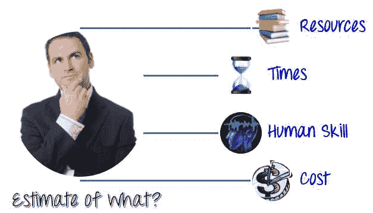

*   **资源：**资源需要**执行**任何项目任务。 他们可以是人员，设备，设施，资金或其他能够定义项目活动完成所需的条件。
*   **时间：**时间是项目中最有价值的资源。 每个项目都有一个交付期限。
*   **人类技能：**人类技能是指团队成员的**知识**和**经验**。 它们会影响您的估计。 例如，一个团队的成员具有较低的测试技能，比具有较高测试技能的团队需要更多的时间来完成项目。
*   **费用：**费用是项目**预算**。 一般而言，这意味着**完成该项目需要多少** **资金**。

## 如何估算？

软件测试评估技术列表

*   工作分解结构
*   三点软件测试评估技术
*   宽带德尔菲技术
*   功能点/测试点分析
*   使用–案例点方法
*   百分比分布
*   临时方法

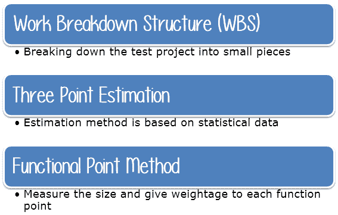

以下是得出估算值的 4 个步骤

您将学习如何结合使用这些技术来找到 Guru99 Bank 案例研究的估算值。

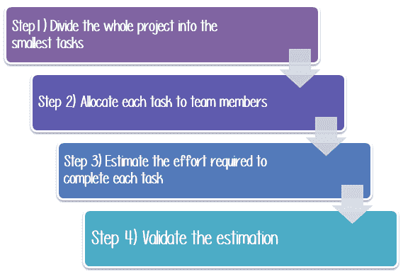

### 步骤 1）将整个项目任务划分为子任务

任务是已经交给某人的一件工作。 为此，您可以使用**工作分解结构**技术。

在这种技术中，将复杂的项目分为模块。 这些模块分为子模块。 每个子模块进一步分为功能。 这意味着将整个项目任务划分为**最小的**任务。

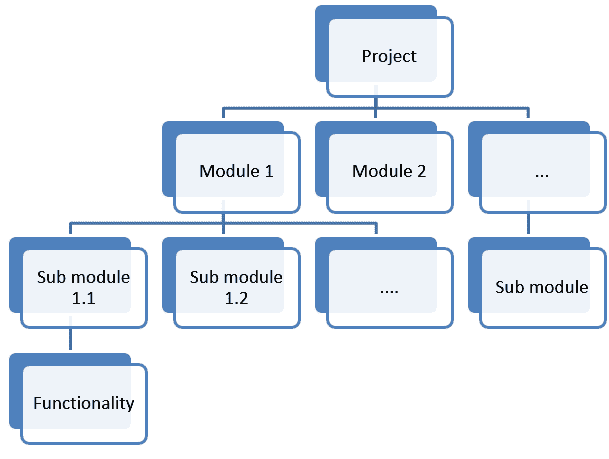

使用“工作分解”结构将 Guru99 Bank 项目分解为 5 个较小的任务，

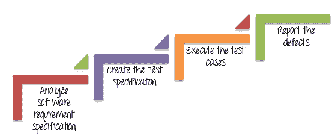

之后，您可以将每个任务分解为**子任务。** 此活动的目的是创建任务，如**，详细的**，**和**。

| **任务** | **子任务** |
| 分析软件需求规范 | 研究软需求规范 |
| 与开发人员&其他利益相关者的访谈，以了解有关该网站的更多信息 |
| 创建测试规范 | 设计测试方案 |
| 创建测试用例 |
| 审查和修订测试用例 |
| 执行测试用例 | 建立测试环境 |
| 执行测试用例 |
| 查看测试执行结果 |
| 报告缺陷 |
| 创建[缺陷](/defect-management-process.html)报告 |
| 报告缺陷 |

### 步骤 2）将每个任务分配给团队成员

在此步骤中，将每个任务分配给项目团队中的**适当的**成员。 您可以如下分配任务

| **任务** | **成员** |
| 分析软件需求规范 | 所有成员 |
| 创建测试规范 | 测试员/测试分析师 |
| 建立测试环境 | 测试管理员 |
| 执行测试用例 | 测试员，测试管理员 |
| 报告缺陷 | 测试仪 |

### 步骤 3）任务的工作量估算

您可以应用 2 种技术来估算任务的工作量

1.  **功能点方法**
2.  **三点估计**

### 方法 1）功能点方法

在这种方法中，测试经理估算任务的大小，持续时间和成本

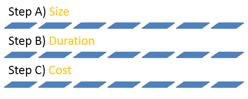

**步骤 A）估算任务**的大小

在[步骤 1](#Step1) 中，您已经使用 WBS 方法将整个项目任务分解为小任务。 现在，您估计这些任务的大小。 让我们练习一个特定的任务“ **创建测试规范**”

此任务的大小取决于被测系统的功能大小。 功能大小反映了与用户相关的功能的**数量**。 功能**越多**，则**复杂的**系统就越多。

在开始实际的估计任务工作之前，将功能点分为三组，例如**复杂**，**中** **简单**，如下所示：

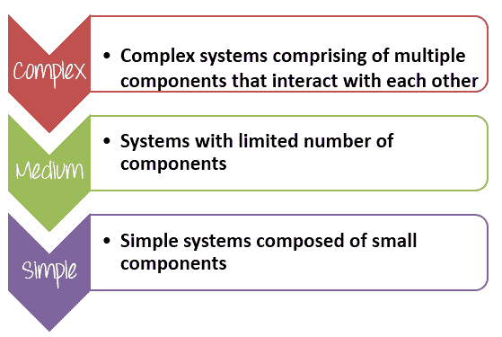

基于复杂的软件功能，测试管理器必须为每个功能点赋予足够的**权重**。 例如

| **组** | **重量** |
| 复杂 | 5 |
| 中 | 3 |
| 简单 | 1 |

让我们通过一个简单的示例练习来弄清楚：

在上查看上的网站 Guru99 Bank 的软件规格，软件工程师已经详细描述了软件模块，可以通过给出权重来确定网站功能的**复杂度**。 每个模块？

功能点越复杂，测试的精力就越多。 该网站分为 **12 个功能**点，您可以如下确定每个功能点的**复杂度**-

| **否** | **模块名称** | **适用** **角色** | **说明** | **重量** |
| 1.       | 余额查询 | 经理
客户 | **客户：**一个客户可以有多个银行帐户。 他只能查看其帐户的余额
**经理：**经理可以查看受其监管的所有客户的余额 | 3 |
| 2.       | 资金转账 | Manager
Customer | **客户：**客户可以将资金从其“自有”帐户转移到任何目标帐户。
**经理：**经理可以将资金从任何源银行帐户转移到目标帐户 | 5 |
| 3.       | 迷你声明 | Manager
Customer | 迷你语句将显示帐户的最后 5 笔交易
**客户：**客户只能看到其“自己”帐户的迷你声明
**经理：**经理可以 查看任何账户的迷你声明 | 3 |
| 4.       | 定制声明 | Manager
Customer | 定制的对帐单允许您根据日期，交易值
**客户：**筛选和显示帐户中的交易。客户只能看到“他的”自有账户的定制对帐单
**管理员：**管理员可以查看任何帐户的自定义状态 | 5 |
| 5.       | 更改密码 | Manager
Customer | **客户：**客户只能更改其帐户的密码。
**管理员：**管理员只能更改其帐户的密码。 他无法更改客户密码 | 1 |
| 6.       | 新客户 | 经理 | **管理员：**管理员可以添加新客户。
**管理员：**管理员可以编辑客户的地址，电子邮件，电话等详细信息。 | 3 |
| 7.       | 新账户 | Manager | 当前系统提供两种类型的帐户

*   储蓄
*   当前

客户可以有多个储蓄帐户（一个在他的名字，另一个在一个联合的名字，等等） 。
他可以为自己拥有的不同公司拥有多个经常账户。
或者他可以拥有多个活期和储蓄帐户。
**管理员：**管理员可以为现有客户添加新帐户。 | 5 |
| 8.       | 编辑帐户 | Manager | **管理员：**管理员可以为现有帐户添加编辑帐户详细信息 | 1 |
| 9.       | 删除帐户 | Manager | **管理员：**管理员可以为客户添加删除帐户。 | 1 |
| 10.    | 删除客户 | Manager | 仅当客户没有有效的活期帐户或储蓄帐户时，才能删除该客户。
**管理员：**管理员可以删除客户。 | 1 |
| 11.    | 存款 | Manager | **经理：**经理可以将钱存入任何帐户。 通常在现金存入银行分行时完成。 | 3 |
| 12.    | 退出 | Manager | **经理：**经理可以从任何帐户提取资金。 通常是在银行分行提取现金时完成的。 | 3 |

***步骤 B）估算任务*** 的持续时间

在对功能点的**复杂度**进行分类后，您必须估算**持续时间**进行测试。 持续时间是指**需要多少时间才能完成任务。**

*   **全力以赴**：完全测试网站所有功能的努力
*   **总功能点**：网站的总模块
*   **每个功能点定义的估计值**：完成一个功能点的平均工作量。 该值取决于负责此任务的成员的**生产率**。

假设您的项目团队已估计每个功能点 **5 小时/点**的定义。 您可以按以下方式估算测试 Guru99 Bank 网站所有功能的总投入：

|   | **Weightage** | **功能点数** | **总计** |
| 复杂 | 5 | 3 | 15 |
| 中 | 3 | 5 | 15 |
| 简单 | 1 | 4 | 4 |
| **功能总分** | **34** |
| **每个点的估算值定义** | **5** |
| **总估算工作量（人时）** | **170** |

因此，完成 Guru99 Bank“创建测试规范”任务的总精力约为 170 个工时

一旦了解了所需的工作量，就可以分配资源以确定任务将花费多长时间（持续时间），然后可以估算人工和非人工成本。

上面的示例还显示了团队中成员的重要性。 如果您具有**和**和**有经验的**成员，则可以在**较小的**时间内完成分配的任务，并且您的项目将在截止日期或更早时完成。

**，步骤 C）估算任务的成本**

此步骤可帮助您回答客户的最后一个问题“ ***多少钱？”***

假设您的团队平均每小时工资为$ 5。 “创建测试规格”任务所需的时间为 170 小时。 因此，任务成本为 5 * 170 = 850 美元。 现在，您可以计算 WBS 中其他活动的预算，并得出该项目的总预算。

作为项目经理，您必须决定如何为公司的投资获得最大收益**。 您估算的项目成本**越准确**，则**越好**使您能够管理项目的预算。**

### 方法 2）三点估计

三点估计是可用于估计任务的技术之一。 三点估算的简单性使其成为想要估算的项目经理非常有用的工具。

在三点估计中，基于**先前经验**或**最佳猜测**，首先为每个任务生成**三个**值

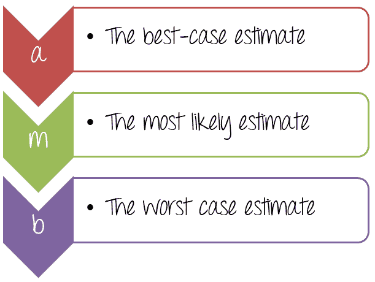

在估计任务时，测试管理器需要提供三个值，如上所述。 确定的三个值估计在**最佳状态**中会发生什么，**最有可能**是什么，或者我们认为这是**最坏情况**的情况。

在下面的示例中，让我们看看如何使用以上三个值

对于任务“ **创建测试规范**”，您可以估计测试工作量吗？ 请记住，您必须像[功能点方法](#8)一样，覆盖**覆盖 Guru99 Bank 网站的所有**模块。

您可以估算如下

*   完成此任务的**最佳情况**为 **120** 个工时（约 15 天）。 在这种情况下，您将拥有一支才华横溢的团队，他们可以在最短的时间内完成任务。
*   完成此任务的**案例最多为 **170** 个工时（约 21 天）。 这是正常情况，您有足够的资源和能力来完成任务**
*   完成任务的**最坏情况**为 **200** 个工时（约 25 天）。 您需要执行更多工作，因为您的团队成员没有经验。

现在，将值分配给每个参数，如下所示

可以使用**双三角分布**公式来计算完成任务的工作量，如下所示：

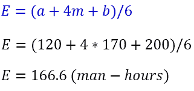

在上式中，参数 E 称为**加权**平均值。 它是对“创建测试规范”任务的估计。****

但是你老板可能会问你

在上述估算中，您只需要确定**可能的**而不是**某个**值，就必须知道估算正确的**概率**。 您可以使用其他公式：

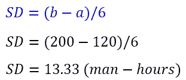

在上面的公式中，SD 表示标准偏差，此值可以为您提供有关估计正确的**概率**的信息。

现在，您可以得出任务“创建测试规范”的估计值

要完成 Guru99 Bank 网站的“创建测试规范”任务，您需要 **166.6±13.33** 工时（153.33 至 179.99 工时）

### 步骤 4）验证估算值

一旦为 WBS 中提到的所有任务创建了总计估算，就需要将其转发给**管理委员会**，该委员会将由**审核**，**批准**。

管理委员会的成员可以包括首席执行官，项目经理&其他利益相关者。

管理委员会将与您一起审查并讨论您的估算计划。 您可以合理地向他们解释您的估算和，以便他们可以批准您的估算计划。

## 测试估算最佳做法

本主题介绍有关如何估计测试准确性的一般技巧。

*   **添加一些缓冲时间：**您的项目可能会发生很多不可预测的事情，例如，才华横溢的团队成员突然辞职，测试花费的时间比估计的要多……等等。这就是为什么您需要包含一些缓冲的原因 在您的估计中。 在估计中具有缓冲器使得能够应对可能发生的任何延迟。
*   **帐户资源计划估算：**如果团队中的某些成员休长假，应该怎么办？ 这可能会延迟项目。估算中的资源规划起着关键作用。 资源的可用性将有助于确保估计是现实的。 在这里，您必须考虑团队成员的休假，通常是长假。
*   **以过去的经验为参考：**过去的项目的经验在准备时间估算时起着至关重要的作用。 由于某些项目可能有些相似之处，因此您可以重用过去的估计。 例如，如果您曾经做过像测试网站这样的项目，则可以从中汲取经验，并尽量避免在过去的项目中遇到的所有困难或问题。
*   **坚持您的估计：**估计只是估计，因为它可能会**错误**。在项目的早期，您应经常**重新检查测试估计并进行修改。[** 。 除非有重大更改，或者您必须与客户就重新估算进行协商，否则我们在修正后不应扩展估算。

### 软件测试评估模板

[下载软件测试评估 Excel（.xlsx）](https://drive.google.com/uc?export=download&id=1VIAzFdKXMWFckFB9CDKUHkappXAXQ3fi "Software Test Estimation Template")

## 其他技术

宽带 Delphi 技术，使用–案例点方法，百分比分布，自组织方法是软件工程中的其他估算技术。

录像笔录

*   让我们做一个练习-为航班预订应用程序准备一个
*   各种测试任务，例如-检查登录功能，检查新订单功能，检查传真功能以及其他类似功能，并估算测试这些功能所需的工作量
*   例如，登录功能可以在 2 小时内进行测试。 同样，准备所有任务和相应工作的清单。 暂停培训教程并完成练习。 希望您对所需的工作做出有根据的猜测
*   这是测试估计的自下而上策略。 该技术称为自下而上，因为您可以基于工作分解层次结构中最低级别的任务来估计持续时间，依赖项和资源。
*   在自下而上的策略中，估算不是由一个人而是由所有利益相关者，个人贡献者，专家和经验丰富的工作人员共同估算的。 这个想法是利用团队成员的协作智慧来得出准确的测试估算值
*   现在，由于您在航班预订系统方面拥有丰富的经验。 利用这些经验来评估网站的完整[功能测试](/functional-testing.html)所需的工作。 -http://newtours.demoaut.com/
*   该网站的功能与 Flight Reservation Application 相同，只是它基于 Web。 暂停教程并立即进行练习
*   希望根据您的经验，您对测试网站所需的工作做出了很好的估计

*   这是基于经验的自上而下的估算方法。
*   另一种技术是根据项目的大小和复杂程度对其进行分类，然后查看特定大小和复杂程度的项目过去花费了多长时间。
*   另一种方法是确定过去类似项目的每个[测试用例](/test-case.html)的平均工作量，然后使用当前项目的估计测试用例得出总工作量
*   更复杂的估计模型涉及复杂的数学模型。 实际上，大多数项目使用自上而下的方法进行估算。
*   测试评估可能会受到许多因素的影响，例如时间压力，人员因素，测试团队的地理分布等等。