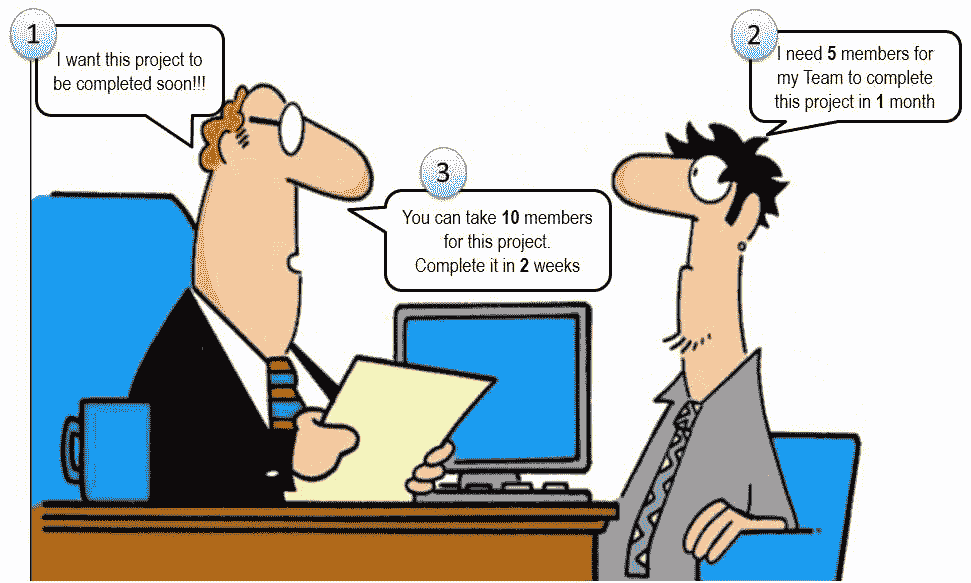
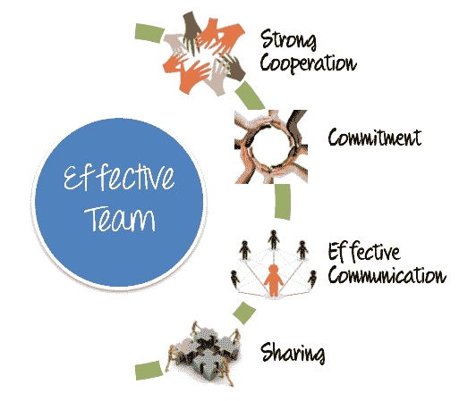
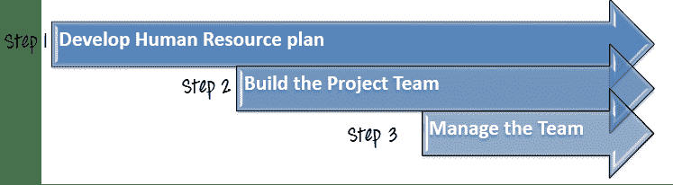
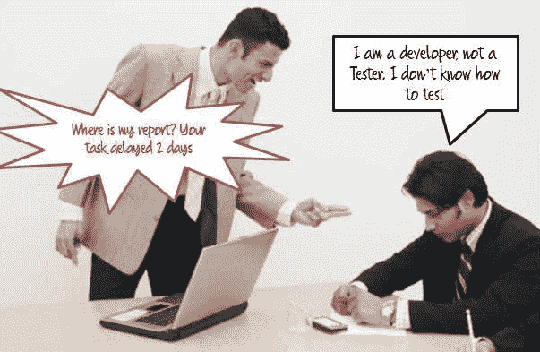
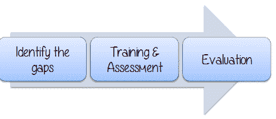
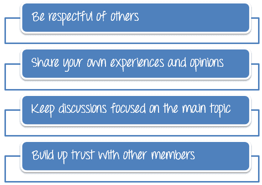
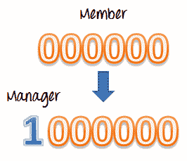
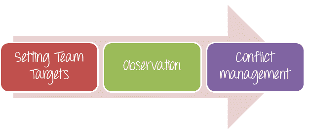

# 项目团队：开发，构建&管理：逐步过程

> 原文： [https://www.guru99.com/how-to-organize-a-test-team.html](https://www.guru99.com/how-to-organize-a-test-team.html)

在[测试估算](/an-expert-view-on-test-estimation.html)阶段，您估计 Guru99 Bank 项目将在一个月内完成。 假设您需要 **5 个**成员在个月内完成**的这个项目。 但是您的老板有不同的看法。**

1\. Is the boss's idea is correct?

<input class="eb" name="eb" type="checkbox" value="1">Yes

<input class="ebno" name="ebno" type="checkbox" value="11">No

**Incorrect**
**Correct

Because the Team cannot be scaled in that way.Too many member in a Team creates a problem in Team Organization & Administration**

在上述情况下，您不能像公式那样简单地扩展团队，因为：

*   管理**十人**团队与管理**五人**团队完全不同。 您可能需要花费更多的精力来管理和控制团队&，因此项目执行时间可能会增加。
*   如果团队中的成员数量增加，他们可以共享项目任务以减少执行时间。 但是与许多人共享任务（只能由一个人完成）会影响生产率。

团队组织是“测试管理”中最复杂的任务之一。 测试团队在任何软件项目中都扮演着非常重要的角色。 所有成功的测试经理的一个关键特征是组织和管理一个为组织提供业务价值的高性能测试团队。

## 什么是“项目团队”？

项目团队是一群

他们共同努力以实现项目的总体目标。 测试经理是一个建立有效团队并带领他们取得成功的人。

## 如何建立一支高效的团队？

遵循以下特征对于组建高效团队至关重要

*   **强有力的合作**-合作是与他人合作并共同行动以完成工作的行为。 一个有才华的团队会找出解决人际关系问题和完成工作的方法。 他们愿意在工作中互相支持。
*   **承诺**-在一个强大的团队中，所有成员都对共同的项目目标做出承诺。 他们关心自己的工作以及团队的工作并承担责任。 每个成员都非常努力，其他成员也都一样。
*   **有效的沟通**-团队成功表现的关键因素是沟通。 成员大声疾呼，清楚，诚实，合乎逻辑地表达自己的想法，以便彼此了解。
*   **分享**-在团队中，每个成员都有自己的长处和短处。 在一个良好的团队中，成员愿意分享信息，知识和经验以相互促进。

## 如何建立和管理有效的团队？

本主题将为您提供逐步过程，以组织 Guru99 Bank 项目的项目团队。 要建立和管理一支有效的团队，您应该遵循以下三个步骤-

### 步骤 1）制定人力资源计划

人力资源计划是确定组织当前和未来人力资源需求的过程。 人力资源计划的目的是确保团队成员和项目&之间的最佳契合度，避免人力不足或冗余。 这个阶段分为以下 3 个阶段

**步骤 1.1）需求预测**

在此步骤中，测试经理根据不同的项目计划预测总体人力资源需求。

您可能有一个问题“ ***测试经理如何列出团队位置及其角色*** ？ ”

团队的组成和规模基于项目的**特性**和**功能**。 如果您了解所需的**团队类型**，您将知道如何列出团队位置及其角色。

由于项目 Guru99 Bank 的特征是**测试**，因此您应该创建一个**测试团队**来执行此项目。 团队的大小（项目团队中的成员数量）基于项目活动的**数量**和项目的**复杂度**。

## 测试团队结构

通常，[测试](/software-testing.html)小组由以下成员组成：

| 指定 | 职责范围 |
| 测试经理 | 管理整个项目

定义项目**的方向** |
| 测试仪 | 建立**测试用例**

生成测试套件

**执行**测试，**记录**结果，**报告[** 的缺陷 |
| 测试中的开发人员 | **创建要测试的程序** –开发人员创建的代码

创建测试自动化脚本 |
| 测试管理员 | 建立并确保[测试环境](/test-environment-software-testing.html)和资产由**管理**和**维护**

**支持**团队将测试环境用于 测试执行 |
| SQA 成员 | 负责质量保证 |

根据此人力资源计划，您的项目团队至少需要 5 名成员。 每个成员在项目团队中将扮演**不同的**角色，并且他们必须具有**能力** **与分配给他们的角色相对应的**。

如果项目很复杂且数量很大，则项目团队应将**的大小和**的规模**的大小增加以适应复杂性。 在这种情况下，一个以上的人可以扮演一个角色并履行自己的责任。**

**步骤 1.2）能力评估**

会员的**能力**是您在资源规划中应考虑的重要点。 您必须将具有不同**能力**的成员与**右**任务进行匹配。 这意味着要选择适合该工作的**人。**

考虑以下情形-

假设您为成员分配了一个开发人员作为项目团队中的**测试人员**。 他的任务是执行测试用例，并将缺陷报告给测试经理。 此任务必须在一周内完成。 但是结果是：

您已将他分配给**错误的**任务。 他是一名开发人员，他的技能是编程，而不是测试。 将成员与错误的技能匹配会导致任务失败，并延迟项目。

为了避免此错误，在将成员分配给任何任务之前，测试管理器必须考虑许多因素：

*   成员需要完成**技能**才能完成不同的项目任务。
*   必须对照项目任务和项目目标来衡量团队成员的技能和能力。 如果可用人员缺乏必要的能力，则测试经理应计划如何提高他们的技能。

**步骤 1.3）技能提升计划**

*   ***找出差距：*** 在某些情况下，成员的能力与项目技能要求之间存在**差距**。 测试经理有责任确定成员缺乏的技能，无法为他们制定合适的培训计划。 例如，在以前的场景中，团队成员缺乏测试技能，这是测试经理发现的空白。
*   ***培训&评估：*** 人力资源规划将考虑如何培训和发展现有成员以实现技能和所需能力。 确定差距后，应立即制定并实施培训计划。 在上面的示例中，该成员应接受**测试**技能的培训，以负责测试任务。
*   ***评估：*** 对培训计划进行**监控**，并经常评估以确保其有效。 如果需要，可以更改此程序。

例如，在上述情况下，经理需要评估开发人员的培训进度。 如果开发人员发现很难接受测试，则经理可以考虑采用其他培训方法或考虑更换他。

### 第 2 步：建立项目团队

在完成人力资源计划的制定之后，就该建立您的项目团队了。

我如何建立一个成功的团队？ 有 4 个项目对于帮助建立有效的团队很重要

**步骤 2.1）团队任务**

测试经理要做的第一件事是与其他成员共享**团队任务**。 创建任务声明需要团队成员思考，讨论并达成协议

例如，Guru99 银行项目的任务是测试受人尊敬的“ Guru99 银行”的**净银行业务工具**。 作为测试经理，您必须与团队成员共享此任务，并向他们展示任务在业务活动中的重要性。

**步骤 2.2）团队责任**

如果团队成员不知道自己的角色以及在项目中应该做什么，该怎么办？

在团队环境中，团队成员知道每个人期望的**是非常重要的。**

在项目 Guru99 Bank 中，您可以举行团队会议。 在会议中，您必须：

*   明确负责人以及您对团队的期望
*   确保每个人都清楚自己的角色和职责。 这些角色已在步骤 1.1 中定义

**步骤 2.3）团队规则**

团队规则是他们合作方式的准则。 团队不需要很多规则就可以很好地合作，但是团队中的每个人都应该同意这些规则并共同承担确保遵守规则的责任。

您可以参考以下团队规则示例

**步骤 2.4）团队动机**

没有动力的团队合作看起来就像没有灵魂的身体。 作为 Guru99 项目的测试经理，您有责任每天持续激励您的团队。

如果您有一支积极进取的团队，它将提高您的项目质量和生产率。 您将创建一个良好的工作环境，使您的成员拥有能力。

如果您想知道如何激励您的团队，请阅读[人员技能](/how-not-knowing-people-skills-blocks-your-success-as-test-manager.html)文章。

### 第三步：管理项目团队

管理团队对于测试经理来说是一项非常艰巨的任务。 您将要处理不同的个性和工作风格。 优秀经理的主要目标是使每个人都集中精力，确保每个人都保持沟通并保持项目进度。

下图显示了测试管理器的重要作用。 假设团队成员为零，但没有领导者，他们仍然为零。 但是有了经理，他们可以合并并成为大量。

管理团队的方法有以下三种：

**设定小组目标**

测试经理必须让成员知道他们正在做什么。 您必须定义所有成员都应该了解并同意的团队目标。 在 Guru99 银行项目中，团队目标是*“测试 Guru99 银行的净银行业务”*

应该设计团队目标并分解为指定任务。

**观察**

团队观察意味着：

*   **监视**团队成员的绩效
*   **了解**他们在做什么和工作结果。

观察有助于测试经理检查团队成员工作的**有效性**，项目**进度**和及早发现问题。

**冲突管理**

一个具有不同个性和不同工作风格的人一起工作的项目团队必然会发生冲突。 人们有不同的观点，在正确的情况下，这些差异会升级为冲突。 测试管理器的作用是处理该冲突。

让我们以一个例子来练习

在项目 Guru99 取得进度的过程中，您要求所有团队成员更新项目进度&，这是他们的回应。

**Team members are not cooperating, they want to do things as per their whims and fancies, and do not want to follow any rules. In that case, what will you do?**

<input class="eb" name="eb" type="checkbox" value="1">Ignore this conflict

<input class="ebno1" name="ebno1" type="checkbox" value="111">Blame someone for this issue

<input class="ebno" name="ebno" type="checkbox" value="11">Resolve the conflict as soon as possible

**Correct**

**InCorrect**

有一些建议的活动可供您参考，以解决此类冲突

*   召开团队**会议**，让成员确认项目情况
*   让成员**了解**项目合作的重要性
*   要求他们**合作**解决冲突

在整个解决过程中，最重要的事情是保持**通信对所有人开放。 有关人员需要谈论冲突并讨论他们的强烈感情。**

可以检测到冲突，并且可以直接，迅速地解决冲突。 通过尊重人与人之间的差异，能够在冲突发生时解决冲突并努力防止冲突，您将能够保持健康，富有创造力的团队氛围。