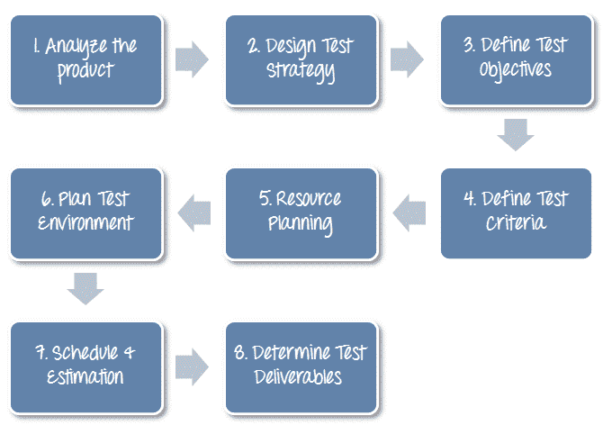
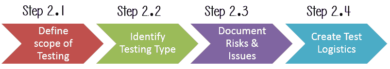
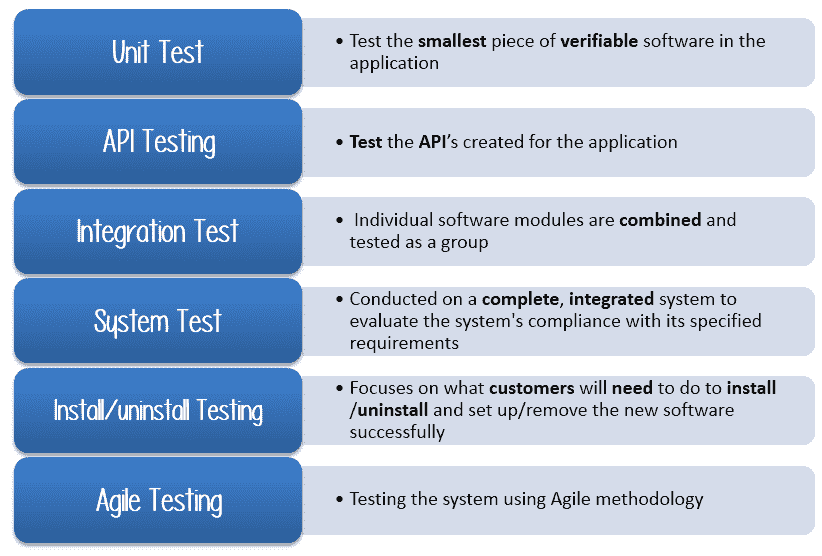
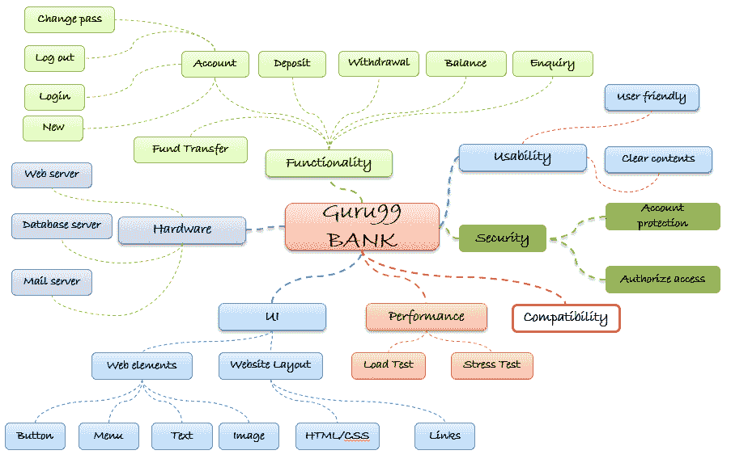
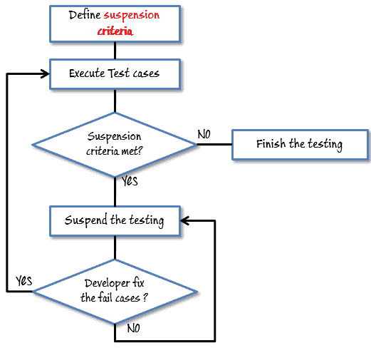
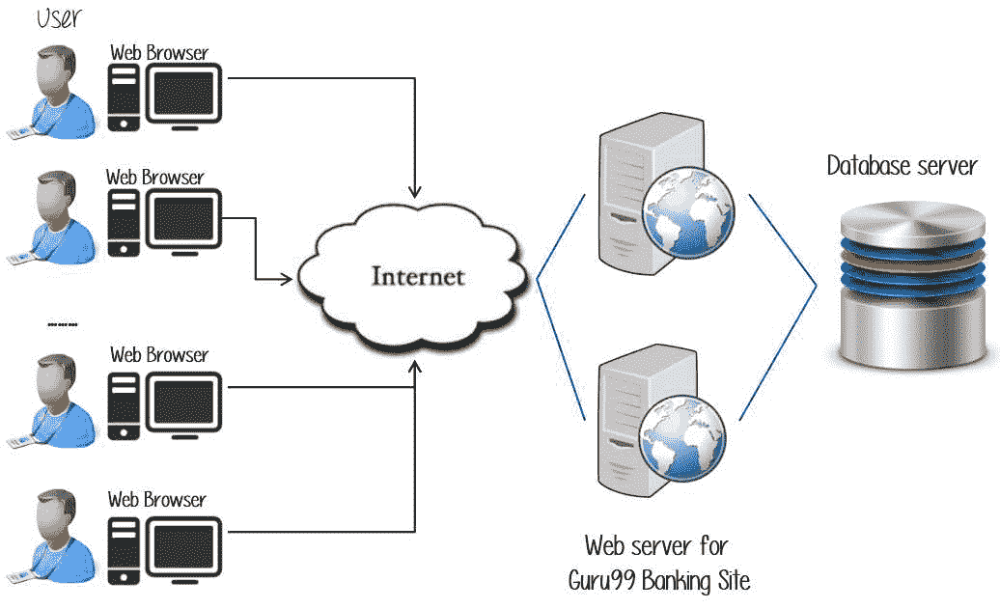
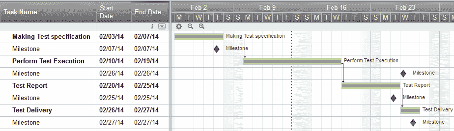

# 如何创建测试计划（带有示例）

> 原文： [https://www.guru99.com/what-everybody-ought-to-know-about-test-planing.html](https://www.guru99.com/what-everybody-ought-to-know-about-test-planing.html)

## 什么是测试计划？

**测试计划**是一份详细的文档，描述了测试策略，目标，时间表，估计和可交付成果以及测试所需的资源。 测试计划可帮助我们确定验证被测应用程序质量所需的工作。 测试计划作为进行软件测试活动的蓝图，作为定义的过程，由测试经理对其进行细致的监视和控制。

让我们从以下场景开始

在会议中，您想与团队成员讨论测试计划，但是他们不感兴趣-。

在这种情况下，您会怎么做？ 选择你的答案，如下图

<input class="ab" name="ab" type="checkbox" value="1"> A) I am Manager do everything as I said

<input class="abno" name="abno" type="checkbox" value="11"> B) OK, let's me explain why we need a Test Plan

**Incorrect

As a Test Manager, you must explain them the importance of Test Plan rather than force the team to do what you want.**
**Correct

As a Test Manager, you must explain them the importance of Test Plan rather than force the team to do what you want.**

## 测试计划的重要性

制定测试计划有很多好处

*   帮助测试团队以外的人员，例如开发人员，业务经理，客户**了解**测试的详细信息。
*   测试计划**指导**我们的思考。 这就像一本规则手册，需要遵循。
*   测试计划中记录了等重要方面，例如测试估算，测试范围，[测试策略](/how-to-create-test-strategy-document.html)，因此可以由管理团队进行审核，并重新用于其他项目。

## 如何编写测试计划

您已经知道制定**测试计划**是测试管理过程中最重要的任务。 按照以下七个步骤，按照 IEEE 829 创建测试计划

1.  分析产品
2.  设计测试策略
3.  定义测试目标
4.  定义测试标准
5.  资源规划
6.  计划测试环境
7.  时间表&估算
8.  确定测试交付物

### 步骤 1）分析产品

没有的任何信息，如何测试产品**？ 答案是**不可能。** 在测试产品之前，您必须彻底学习产品。**

被测产品是 Guru99 银行网站。 您应该研究客户和最终用户，以了解他们对应用程序的需求和期望

*   谁将使用该网站？
*   它是干什么用的？
*   如何运作？
*   产品使用什么软件/硬件？

您可以使用以下方法来分析站点

现在，将上述知识应用于真实产品：**分析**银行网站 [http://demo.guru99.com/V4](http://demo.guru99.com/V4) 。

您应该在网站上浏览一下**，还应该**查看** [产品文档](https://docs.google.com/document/d/1PZQZKt7hqS417QjYRMppPnTwfj8V54XUA7nZUnYvumE/edit?usp=sharing)。 查看产品文档可帮助您了解网站的所有功能以及如何使用它。 如果您不清楚任何项目，可以**采访**客户，开发人员，设计师，以获取更多信息。**

### 步骤 2）制定测试策略

测试策略是制定测试计划的**关键步骤**。 测试策略文档是高级文档，通常由测试管理器开发。 本文档定义：

*   项目的**测试目标**及其实现方法
*   确定测试**的工作量**和**的费用**

回到您的项目，您需要开发测试策略来测试该银行网站。 您应该按照以下步骤

### 步骤 2.1）定义测试范围

在开始任何测试活动之前，应该知道测试的范围。 您必须认真考虑。

*   将要测试的系统组件（硬件，软件，中间件等）定义为“ 范围内的**”**
*   还需要将未经测试的系统组件明确定义为“ **超出范围**”。

定义测试项目的范围对于所有利益相关者都非常重要。 精确的范围可以帮助您

*   给大家**信心&您正在执行的测试的准确信息**
*   所有项目成员都将对**和**有清楚的了解

***您如何确定项目范围？***

要确定范围，您必须–

*   精确的客户要求
*   项目预算
*   产品规格书
*   测试团队的技能&天赋

现在应该清楚地定义“范围内”和“范围外”的测试。

*   作为软件要求[规范](https://docs.google.com/document/d/1rPW5DV82VJT6vtA1VDSrfxaCBuAduxW0zb1yfTh_VMk/edit?pli=1#heading=h.ftgetk7f23qj)，项目 Guru99 Bank 仅专注于测试所有**功能**和网站 **Guru99** Bank（范围 ]测试）
*   当前将不测试非功能性测试，例如**压力**，**性能**或**逻辑数据库**。 （范围之外的**）**

**问题方案**

客户希望您测试他的 API。 但是项目预算不允许这样做。 在这种情况下，您会怎么做？

好吧，在这种情况下，您需要使客户相信 [Api 测试](/api-testing.html)是额外的工作，并且会消耗大量资源。 给他提供支持您事实的数据。 告诉他如果范围内包括 Api Testing，则预算将增加 XYZ 数量。

客户同意，因此，超出范围的新范围是

*   范围内的项目：[功能测试](/functional-testing.html)，Api 测试
*   超出范围的项目：[数据库测试](/data-testing.html)，硬件&任何其他外部接口

### 步骤 2.2）识别测试类型

**测试类型**是提供预期测试结果的标准测试程序。

制定了每种测试类型，以标识特定类型的产品错误。 但是，所有测试类型均旨在实现一个共同目标：“ **在向客户发布产品之前尽早检测**所有缺陷”

下图描述了**常用的**测试类型。

<figure>

<figcaption style="display: table;">Commonly Used Testing Types</figcaption>

</figure>

有**吨用于测试软件产品的测试类型**。 您的团队**无法充分发挥**的能力来处理所有类型的测试。 作为测试管理员，您必须设置测试类型的**优先级**

*   Web 应用程序测试应以**为重点的**是哪种测试类型？
*   为节省成本，应忽略**哪些测试类型？**

**Now let's practice with your project. The product you want to test is a banking website.

Which Testing Types should you focus in this case?

Select All that Apply**<input class="eb" name="eb" type="checkbox" value="2"> A) Unit Testing

<input class="ebno" name="ebno" type="checkbox" value="1"> B) API Testing

<input class="ebno1" name="ebno1" type="checkbox" value="1"> C) Integration Testing

<input class="ebno2" name="ebno2" type="checkbox" value="1"> D) System Testing

<input class="ebno3" name="ebno3" type="checkbox" value="2"> E) Install/Uninstall Testing

<input class="ebno4" name="ebno4" type="checkbox" value="2"> F) Agile testing

<input id="submit" name="submit" type="button" value="Submit">

**We only select

B) API Testing

C) Integration Testing

D) System Testing

for Guru99 project**

### 步骤 2.3）文档风险&问题

风险是未来的**不确定事件**，发生**的可能性**和**潜在**的损失。 当实际发生风险时，便成为“ **问题”。**

在[风险分析和解决方案](/how-precaution-becomes-cure-risk-analysis-and-solutions-in-test-management.html)中，您已经详细了解了“风险”分析并确定了项目中的潜在风险。

在质量检查测试计划中，您将记录这些风险

| **风险** | **缓解措施** |
| 团队成员缺乏网站测试所需的技能。 | 计划**培训课程**以提高您的成员技能 |
| 项目进度太紧； 很难按时完成这个项目 | 为每个测试活动设置**测试优先级**。 |
| 测试经理的管理技能很差 | 为经理计划**领导力培训** |
| 缺乏合作会对员工的生产力产生负面影响 | **鼓励**每个团队成员执行任务**，并激励**他们做出更大的努力。 |
| 错误的预算估算和成本超支 | 在开始工作之前建立**范围**，非常注意项目计划并不断跟踪和衡量进度 |

### 步骤 2.4）创建测试物流

在测试物流中，测试经理应回答以下问题：

*   **谁会测试？**
*   **什么时候进行**测试？

**谁会测试？**

您可能不知道将进行测试的测试仪的确切名称，但是可以定义测试仪的**类型**。

要为特定任务选择合适的成员，您必须考虑其技能是否适合该任务，并估算项目预算。 为任务选择错误的成员可能会导致项目**失败**或**延迟**。

具有以下技能的人员最适合进行软件测试：

*   能够**了解**客户的观点
*   强烈的**对品质的渴望**
*   **注意**详细说明
*   良好的**合作**

在您的项目中，负责执行测试的成员是**测试人员。** 根据项目预算，您可以选择内部或外部成员作为测试人员。

**什么时候进行测试？**

测试活动必须与相关的开发活动相匹配。

当您具有**的所有必需项目**如下图所示时，您将开始测试

### 步骤 3）定义测试目标

测试目标是测试执行的总体目标和成就。 测试的目的是要找到尽可能多的软件缺陷。 在发布之前，请确保被测软件没有**错误**。

要定义测试目标，您应该执行以下两个步骤

1.  列出可能需要测试的所有软件功能（功能，性能，GUI 等）。
2.  根据上述特征定义测试的**目标**或**目标**

让我们按照以下步骤找到您的 Guru99 Bank 测试项目的测试目标

您可以选择“ **自上而下”** 方法来查找可能需要测试的网站功能。 在这种方法中，您将被测试的应用细分为**组件**和**子组件**。

在上一个主题中，您已经分析了需求规格并浏览了网站，因此可以创建**思维导图**来查找网站功能，如下所示

该图显示了 Guru99 网站可能具有的所有功能。

基于上述功能，您可以按以下方式定义项目 Guru99 的测试目标

*   检查网站 Guru99 **功能**（帐户，存款…）是否按预期工作，在实际业务环境中没有任何错误或错误
*   检查网站的外部界面，例如 **UI** 是否按预期工作，并且&满足客户需求
*   验证网站的**可用性**。 这些功能是否方便用户使用？

### 步骤 4）定义测试标准

测试标准是可以作为测试程序或测试判断依据的标准或规则。 有以下两种测试标准

### 暂停条件

指定测试的关键暂停条件。 如果在测试过程中满足了暂停标准，则将活动测试周期暂停，直到该标准被**解析**为止。

示例：如果您的团队成员报告 **40％的测试用例失败，则应**暂停**测试，直到开发团队修复所有失败的案例。**

### 退出条件

它指定了表示**成功完成测试阶段的**的标准。 退出标准是测试的目标结果，在进入下一开发阶段之前是必需的。 示例：**所有关键测试用例中的 95％**必须通过。

定义退出标准的一些方法是通过指定目标**运行速率**和**通过率**。

*   运行率是执行的**个测试用例/测试规范的总测试用例**之间的比率。 例如，测试规范总共有 120 个 TC，但测试人员仅执行了 100 TC，因此运行速率为 100/120 = 0.83（83％）
*   通过率是**编号** **测试用例/已执行测试用例**之间的比率。 例如，在执行的 100 多个 TC 中，有 80 TC 通过了，因此合格率为 80/100 = 0.8（80％）

可以在“测试指标”文档中检索此数据。

*   除非给出明确的原因，否则**运行**的速率必须为 **100％**。
*   **通过率**取决于项目范围，但是**实现高通过率**是目标。

**示例：**您的团队已经完成了测试执行。 他们向您报告测试结果，并希望您确认**退出标准。**

在上述情况下，强制运行率为 **100％，**，但测试团队仅完成了 90％的测试用例。 这意味着不满足运行率，因此请勿确认退出条件

### 步骤 5）资源计划

资源计划是完成项目任务所需的所有类型资源的详细摘要**。 资源可能是完成项目所需的人力，设备和材料**

资源计划是测试计划的重要因素，因为有助于**确定**项目所使用的资源（员工，设备…）的**数量**。 因此，测试经理可以为项目做出正确的进度表&估算。

本部分代表您的项目的推荐资源。

### 人力资源

下表代表了您的项目团队中的各个成员

| 

**否**

 | 

**成员**

 | 

**任务**

 |
| **1\.** | 测试经理 | **管理**整个项目定义项目**的方向**获取适当的资源 |
| **2\.** | 测试仪 | 识别并描述适当的测试技术/工具/自动化架构验证和评估测试方法**执行**测试，**记录**结果，**报告**缺陷。测试人员可以是内部成员，也可以是外部成员，具体取决于项目预算对于需要**低**技能的任务，我建议您选择**外包**成员到**，以节省**项目成本。 |
| **3\.** | 测试中的开发人员 | **实施**测试用例，测试程序，测试套件等。 |
| **4\.** | 测试管理员 | 建立并确保[测试环境](/test-environment-software-testing.html)和资产由**管理**，并维护**支持**测试员使用测试环境进行测试执行 |
| **5\.** | SQA 成员 | 负责质量保证检查以确认测试过程是否满足指定要求 |

### 系统资源

为了进行测试，对于 Web 应用程序，您应该按照下表计划资源：

| 

**否**

 | 

**资源**

 | 

**说明**

 |
| **1\.** | 服务器 | 安装要测试的 Web 应用程序这包括单独的 Web 服务器，数据库服务器和应用程序服务器（如果适用） |
| **2\.** | 测试工具 | 测试工具是自动化测试，模拟用户操作，生成测试结果您可以在该项目中使用大量测试工具，例如 Selenium，QTP 等。 |
| **3\.** | 网络 | 您需要一个包含 LAN 和 Internet 的网络来模拟真实的业务和用户环境 |
| **4\.** | 电脑 | 用户经常用来连接 Web 服务器的 PC |

### 步骤 6）计划测试环境

### 什么是测试环境

测试环境是测试团队将在其上执行测试用例的软硬件设置。 测试环境由**实际业务**和**用户**环境以及物理环境（例如服务器，前端运行环境）组成。

### 如何设置测试环境

返回您的项目，如何为该银行网站设置**测试环境**？

要完成此任务，您需要**测试团队和开发团队之间的强有力合作**

您应该向开发人员提出一些问题，以清楚地了解正在测试的 Web 应用程序**。 这里是一些建议的问题。 当然，您可以根据需要提出其他问题。**

*   该网站可以同时处理的最大用户连接数是多少？
*   安装此网站有什么硬件/软件要求？
*   用户的计算机是否需要任何特定设置才能浏览网站？

下图描述了银行网站[的测试环境，网址为 www.demo.guru99.com/V4](http://www.demo.guru99.com/V4)

### 步骤 7）安排&估算

在[测试估算](/an-expert-view-on-test-estimation.html)一文中，您已经使用了一些技术来估算完成项目的工作量。 现在，您应该包括该估计以及测试计划的时间表

在“测试估算”阶段，假设您将整个项目分解为多个小任务，并按如下所示添加每个任务的估算

| 

**任务**

 | 

**成员**

 | 

**估算工作量**

 |
| **创建测试规范** | 测试设计师 | 170 工时 |
| **执行测试执行** | 测试员，测试管理员 | 80 工时 |
| **测试报告** | Tester | 10 工时 |
| **测试交付** |  | 20 工时 |
| **总计** |  | **280 工时** |

然后，您创建**时间表**以完成这些任务。

制定时间表是项目管理中的常用术语。 通过在测试计划中创建可靠的时间表，测试管理器可以将其用作监视项目进度，控制成本超支的工具。

要创建项目进度表，测试管理器需要以下几种类型的输入：

*   **员工和项目期限**：工作日，项目期限，资源可用性是影响进度的因素
*   **项目估算**：根据估算，测试管理器知道完成项目需要多长时间。 这样他就可以制定适当的项目进度表
*   **项目风险**：了解风险有助于测试经理为项目时间表增加足够的额外时间来应对风险

让我们用一个例子来练习：

假设老板想在个月内完成**项目 Guru99，您已经在“测试估算”中估算了每个任务的工作量。 您可以如下创建时间表**

### 步骤 8）测试可交付成果

测试交付物是必须开发和维护以支持测试工作的所有文档，工具和其他组件的列表。

在软件开发生命周期的每个阶段，都有不同的测试交付物。

在测试阶段之前，会在**中提供测试交付物。**

*   测试计划文件。
*   测试案例文件
*   测试设计规范。

在测试期间，**提供了测试交付物**

*   测试脚本
*   模拟器。
*   测试数据
*   测试追踪矩阵
*   错误日志和执行日志。

在测试周期结束后，**提供了测试交付物。**

*   **测试结果/报告**
*   缺陷报告
*   安装/测试程序指南
*   **发行说明**

**资源**

[下载示例测试计划模板](https://drive.google.com/uc?export=download&id=0B_vqvT0ovzHcWW5vYUd1MXp6cDA)

[下载网站 Guru99 Bank](https://drive.google.com/uc?export=download&id=0B_vqvT0ovzHcVF93Umg1YXliYVk) 的示例系统测试计划