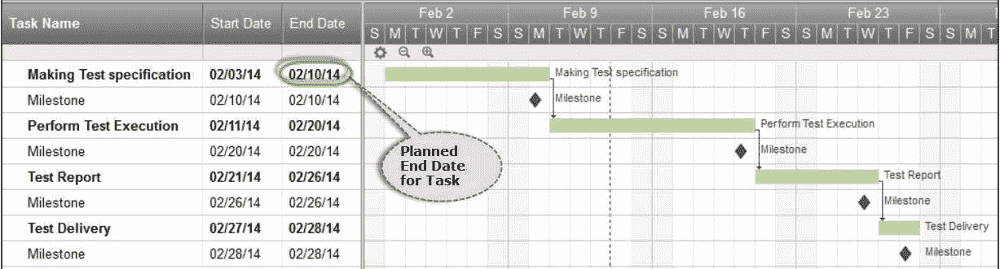
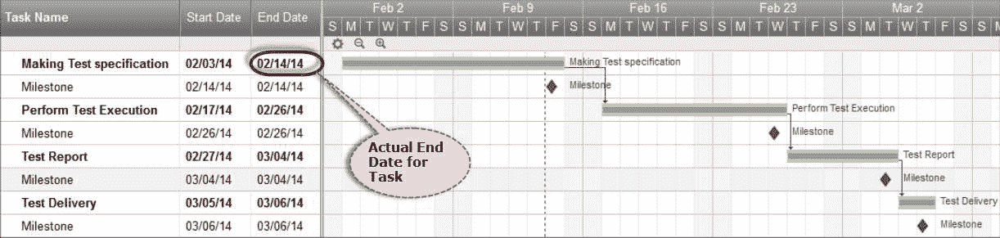
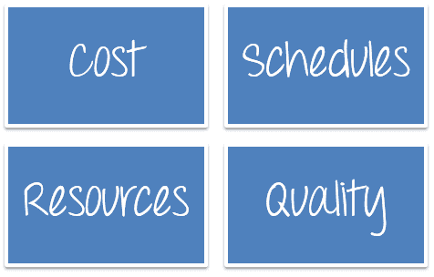
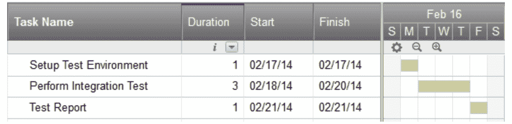
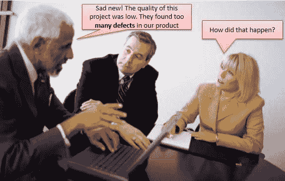
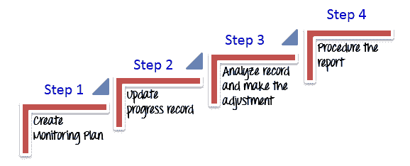
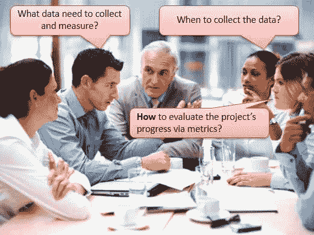
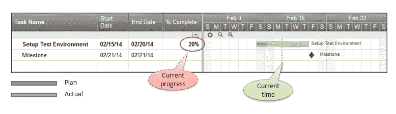
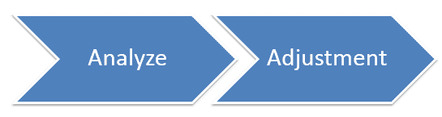

# 测试执行期间的测试监控&测试控制：完整教程

> 原文： [https://www.guru99.com/how-you-can-achieve-project-goals-through-test-monitoring-control.html](https://www.guru99.com/how-you-can-achieve-project-goals-through-test-monitoring-control.html)

恭喜你！ 现在，我们从**测试执行**阶段开始。 在您的团队处理分配的任务时，您需要监视和控制他们的工作活动。

在[测试管理阶段](/test-management-phases-a-complete-guide-for-testing-project.html)教程中，我们简要介绍了测试监视和控制。 在本教程中，您将详细学习它。

## 我们为什么要监视？

这个小例子向您展示了为什么我们需要监视和控制测试活动。

完成[测试评估](/an-expert-view-on-test-estimation.html)和测试计划后，管理委员会同意您的计划，并按照下图设置里程碑。

您已承诺按照上述里程碑完成并交付 Guru99 Bank [Testing](/software-testing.html) 项目的所有测试工件。 一切似乎都很棒，您的团队也很努力。

但是 4 个星期后，一切都没有按计划进行。 “进行测试规格”的任务延迟了**个工作日** **4** 个工作日。 它具有级联效果，所有后续任务都被延迟。

您**错过了**里程碑以及整个项目的最后期限。

结果，您的项目失败了，您的公司失去了客户的信任。 您必须对项目失败承担全部责任。

看一下项目进度，你能回答老板的问题吗

**Why did you miss the deadline?**

<input class="eb" name="eb" type="checkbox" value="1">I forgot to monitor and control the project progress

<input class="ebno" name="ebno" type="checkbox" value="11">My team member did not work well

<input class="ebno1" name="ebno1" type="checkbox" value="111">I don’t know why.

**Correct**

You miss the deadline because you forgot to monitor and control the project progress. You should review the plan and actual schedule. You will figure out that the delay happened in the very first task itself (Make Test specs). This delay accumulated in the succeeding tasks. Had you monitored the project carefully, you could have detected this issue early and find a solution to solve it.
**Incorrect**

无论我们计划了多少精打细算，都会出问题。 我们需要积极监控项目，以

*   **及早发现**，并对计划的偏差和变更做出适当反应
*   让您与利益相关者，发起人和团队成员进行沟通**确切地说是项目所在的**，而**确定**您的初始行动计划与现实有多近
*   根据项目目标，经理可以了解项目是否在**正确轨道**上进行。 使您可以对资源或预算进行必要的调整。

项目监视可帮助您避免灾难。 **监控可以与您在开车时检查油量表进行比较。 它可以帮助您查看储气罐中剩余的气体量，监视项目可以帮助您避免在达到目标之前用尽汽油。**

## 我们监视什么？

通过监视，您可以在原始计划和到目前为止的进度之间进行比较。 您将能够在必要时实施更改以成功完成项目。

在您的项目中，作为测试管理器，您应该监视以下关键参数

## 成本

|  | 成本是项目监控的重要方面。 **您必须估算和跟踪项目**的基本成本信息。 要在确定的预算范围内交付项目，必须具有准确的项目估算和强大的项目预算。

假设您的老板同意为该项目提供 100,000 美元的资金。 在实施项目时，您必须注意实际成本。 如[测试估算](/an-expert-view-on-test-estimation.html)文章所述，有大量的项目活动需要资金。 您必须监视和管理项目预算才能控制所有这些活动。 如果不监控项目成本，则该项目极有可能永远不会按预算交付。 |

## 时间表

您如何在没有时间表的情况下工作？ 可以将其与开车相比，却不知道到达目的地需要多长时间。 无论项目的大小&范围有多大，都必须准备一个项目进度表。 时间表告诉你

*   什么时候应该完成每项活动？
*   已经完成了什么？
*   需要完成的顺序。

这是一个项目进度的例子

您已将团队成员分配给任务：*执行 Guru99 Bank 网站*的集成案例。

该任务应在一周内完成。 您可以按照以下步骤创建时间表

## 资源资源

如前几篇文章所述，**资源**是执行项目任务所需的所有东西。 他们可以是完成项目活动所需的人员或设备。 资源不足会影响项目进度。

事实是，一切都可能不会按计划进行，员工会离职，项目预算可能会削减，或者进度会推后。 监视资源将帮助您及早发现任何资源紧张状况，并找到解决方案。

## 质量

质量监视包括监视特定**工作产品**（例如测试用例套件，测试执行日志）的结果，以评估其是否满足定义的质量标准。 如果结果不符合质量标准，则需要确定潜在的分辨率。

**示例：**假设您很好地监视和控制了项目进度。 最后，您在最后期限交付了产品。 该项目似乎是成功的。

但是交付 2 周后，您就收到了客户的反馈

**What did I do wrong?**

<input class="ebno" name="ebno" type="checkbox" value="11">I did nothing wrong. Maybe the customer made mistake.

<input class="eb" name="eb" type="checkbox" value="1">I forgot monitoring the quality of the project output.

<input class="ebno1" name="ebno1" type="checkbox" value="111">I don’t know why.

**Incorrect**
**Correct

The critical mistake you made in this project is that you forgot monitoring the quality of the project output. Because project monitoring requires monitoring not only project schedule, but also the project quality.**

## 如何监控？

当您的项目付诸实践时，请记住以下问题：

*   您是否在**时间表**上？ 如果不是，那您落后了多远，又如何赶上？
*   您超出**预算**吗？
*   您仍在朝着相同的项目目标努力吗？
*   您**资源**的资源不足吗？
*   是否有即将出现**问题**的警告信号？
*   管理层是否有**压力**要求尽快完成项目？

这些只是在监视项目进度时应该问自己的几个问题。

监视项目的进度很重要，这样您就可以知道是否需要进行调整以使它向正确的方向移动。 为了有效地监视项目进度，您应该遵循以下步骤

## 步骤 1）创建监控计划

除非您有计划使用 DEFINED 指标监视进度，否则您无法监视进度。 与测试计划类似，监视计划是进度监视的第一步，也是最重要的步骤之一。

在监控计划中，您必须仔细计划

|  | 

*   **您需要收集和衡量哪些**指标？
*   **何时**收集指标？
*   **如何**通过指标评估项目进度？

 |

### 需要收集和衡量哪些指标？

在监控计划中，您应该明确定义需要收集和度量的指标。 如前面的[部分](#monitor)所述，您需要收集的指标

*   到目前为止，该项目已花费的**成本**（时间，金钱）
*   该项目使用了多少**资源**（员工，设备）
*   任务的状态（在**计划**上，在计划之后或之前）
*   工作产品的**质量**（运行率/通过率，缺陷指标）

### 什么时候收集数据？

现在确定**何时**或**您将多久**收集一次以在监视计划中监视的数据–每周还是每月？ 还是仅在项目开始和结束时？

作为计划，Guru99 Bank 项目将在一个月内完成。 在这种情况下，我们建议您每周或**每天**监视项目进度。

### 如何通过指标评估项目的进度？

在监控计划中，您应该定义**方法**以通过收集的指标评估项目的进度。 您可以参考的一些方法是

*   将计划中的进度与团队的实际进度进行比较
*   定义用于评估项目进度的**标准**。 例如，如果完成一项任务的工作量比计划的项目延迟多了 **30％**的工作量。

***您可以在此处*** 引用监视计划模板 [***。 这是针对 Guru99 Bank 项目的***](/images/TestManagement/TMP_MonitoringPlan.xls)***[示例监视计划](/images/TestManagement/Guru99_MonitoringPlan.xls)***

## 步骤 2）更新进度记录

随着时间的流逝，您的团队成员将在他们的项目任务上取得进展。 您必须按照时间表跟踪他们的活动，并要求他们经常更新进度信息，例如花费的时间，任务状态等。 通过检查这些记录，您可以立即看到对项目计划的影响。

跟踪成员进度的最佳方法之一是召开**例会**。

在会议中，所有成员报告其当前状态和问题（如果有）。 如果一个或多个团队成员落后或遇到障碍，请制定计划以识别和解决问题。

让我们练习以下场景

根据监控计划中的定义，您将用于测试网站 Guru99 银行的任务“设置测试环境”分配给团队中的成员。 他的角色是测试管理员。 他必须在 6 天内设置[测试环境](/test-environment-software-testing.html)。 您要求他在每次团队会议中报告当前状态。 这是他当前进展记录的一个例子

## 步骤 3）分析记录并进行调整

这些步骤分为 2 个子步骤

### 步骤 3.1）分析

在此步骤中，您将计划中定义的进度与团队的实际进度进行比较。 通过分析记录，您还可以查看在单个任务上花费了多少时间以及在整个项目上花费了总时间。

**Let’s move back to the report, which the Test Administrators sent you, in the previous section.
In that report, what issue did you figure out?**
<input class="ebno" name="ebno" type="checkbox" value="11">Nothing wrong, it’s still good

<input class="eb" name="eb" type="checkbox" value="1">The task progress seems to be delayed

<input class="ebno1" name="ebno1" type="checkbox" value="111">I could not find any issue in that report

**Incorrect**
**Correct

As per the plan, the Test Administrator must finish 100% his task on 6th day. However, as per current status, it is 3rd day (50% time schedule), but he just finished 20% of the task. As a result the task may be delayed and miss the deadline. Therefore, this issue can affect to the overall project.**

通过跟踪和分析项目进度，您可以及早发现项目可能发生的任何问题，并可以找到解决该问题的解决方案。

### 步骤 3.2）调整

进行必要的调整，使您的项目保持进度。 重新分配任务，修改计划或重新评估目标。 这将帮助您继续朝终点线前进。

**In the above example, you found issues in the task "Setting up Test Environment"
What should you do?**
<input class="ebno2" name="ebno2" type="checkbox" value="1111">Modify the schedules

<input class="ebno" name="ebno" type="checkbox" value="11">Do nothing

<input class="ebno1" name="ebno1" type="checkbox" value="111">Modify project goals

<input class="eb" name="eb" type="checkbox" value="1">Ask support from other team member to speed up the task

**Incorrect**
**Correct

As a Test Manager, you may face similar situation several times. There are a ton of solutions to solve this issue, and you may have your own solution.
In above case, we recommend you choose the solution - Ask support from other team member to speed up the task. Some other the solution such as modify the schedules or do nothing may affect the overall project. They are not the best solution**

## 步骤 4）产生报告

|  | 如果您的老板问您当前项目**进度**，**是**进度落后还是**落后**进度，您将如何回答？ 您需要准备项目进度报告。使用报告是与团队成员或管理委员会共享整个项目进度的不错选择。 这也是向您的老板显示项目是否按计划进行的一种有用方法。您可以使用一些模板报告来确保进度数据以**和**一致地显示**和**。 本文包括[报告模板](/images/TestManagement/TMP_ProjectReport.doc)，您可以参考。 另外，请检查 Guru99 Banking 项目的[示例报告](/images/TestManagement/Guru99_ProjectReport.pdf)作为参考**** |

## 测试监控的最佳实践

*   **遵循标准：**项目计划的重要考虑因素之一是确保标准化。 这意味着所有项目活动都必须遵循标准流程指南。 标准化的流程，工具，模板和度量值使分析变得容易，便于沟通，并帮助项目团队成员更好地了解情况。

*   **文档：**如果您不写下文档中的任何讨论或决定，将会发生什么？ 您可能会忘记它们，失去很多东西。 您应该在适当的地方写下讨论和决定，并建立正式的会议记录程序。 此类文档可帮助您解决项目团队之间沟通不畅或误解的问题。

*   **主动性：**在所有项目中都会出现问题。 重要的是，您必须采取主动的方法来解决项目执行过程中出现的问题。 这些问题可能是预算，范围，时间，质量和人力资源