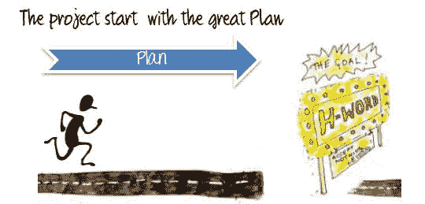
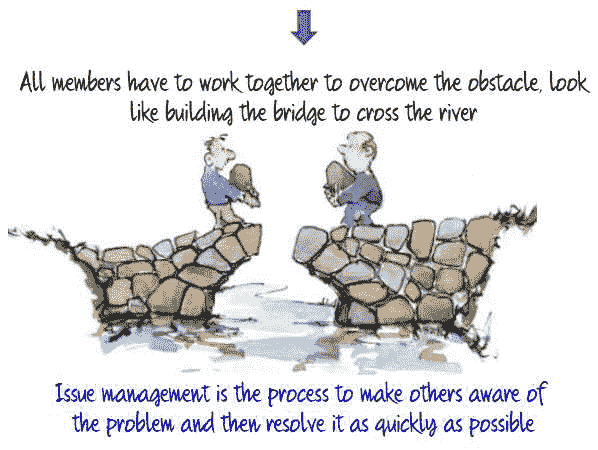
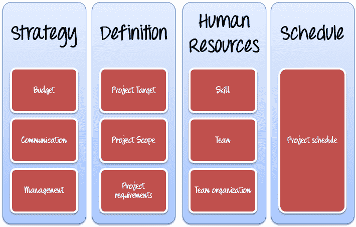
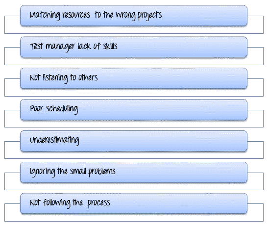
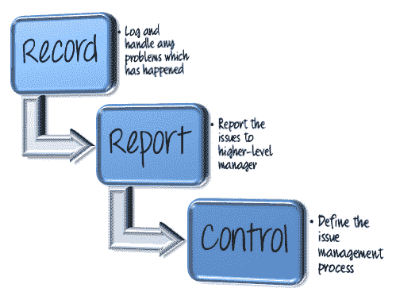
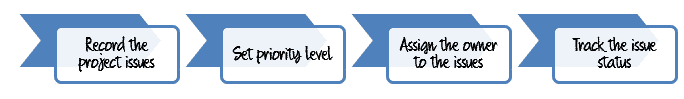
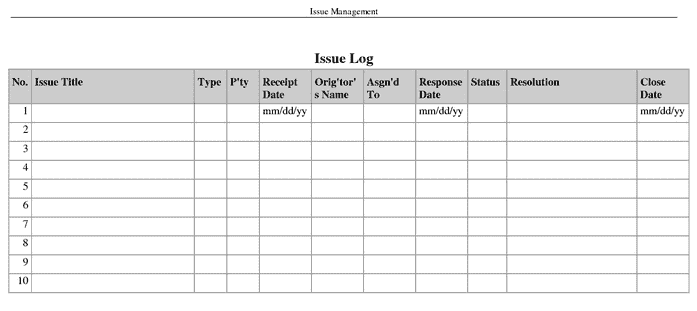
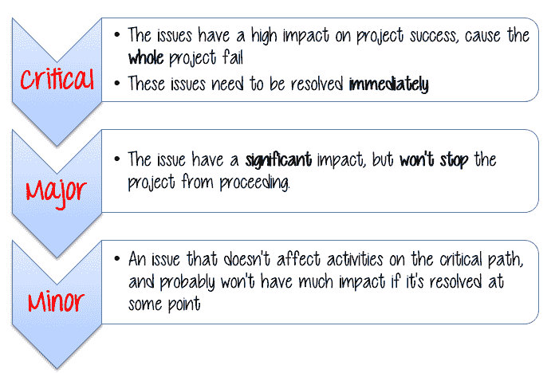
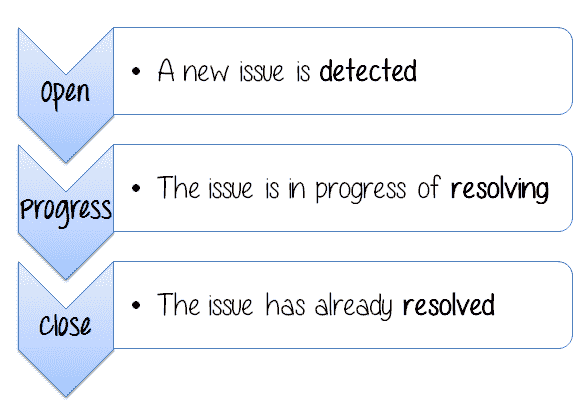
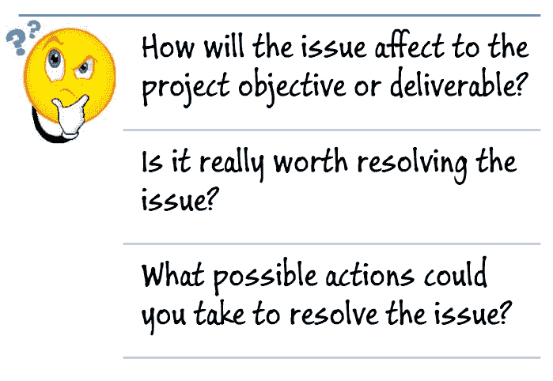

# 测试项目中的问题管理

> 原文： [https://www.guru99.com/issue-management-in-your-testing-project.html](https://www.guru99.com/issue-management-in-your-testing-project.html)

## 什么是问题管理？

问题管理是使其他人意识到问题然后尽快解决的过程

要了解这一点，请执行以下练习-

<input class="alert alert-error" style=" width: 168px; height: 55px; font-size: 25px; " type="button" value="Next">

项目中存在一些**典型问题**

## 战略

*   该项目是预算中的
*   **对项目的可见管理支持不足**
*   项目沟通已无效
*   项目管理过程未**遵循**标准

## 定义

*   **错误的**项目目标
*   未正确定义项目范围
*   **不清楚**项目要求

## 人力资源

*   项目团队**缺乏**技能来完成项目
*   项目团队太大**大**或太大**小** &，因此难以管理
*   项目团队**组织不良。** 他们不想团队合作
*   由于休假或辞职而缺乏熟练的**成员**。

## 时间表

*   项目进度太紧**。** 您没有足够的人力来按时完成任务。
*   该项目需要一些输入，例如测试材料，软件工具等。。。但是交付中存在**延迟**。

## 为什么会发生问题？

有很多原因会引起问题。 大多数原因都是人为错误造成的。 领导项目的测试经理应对该项目失败承担全部责任。

以下是导致问题的**常见**错误

## 将资源匹配到错误的项目

Guru99 银行是一个庞大而复杂的项目。 您需要许多具有**测试**技能的人员。 但是您选择了具有开发技能的资源。 会有什么问题？

可能发生以下问题

*   由于开发人员未经培训的测试人员&将需要学习测试，因此将浪费大量时间。 截止日期可能会错过。
*   [测试](/software-testing.html)的质量可能会受到影响。

资源与项目的匹配是项目管理中最重要的**重要因素**，并且被视为项目成功的**关键阶段**。 为项目分配资源应确保资源**技能**能够**达到项目期望的**。

## 项目经理缺乏管理技能

您被分配为 Guru99 Bank 项目的测试经理。 这是个好消息，但是您以前从未管理过一个项目。 您在管理项目上没有任何**经验**，这可能会导致重大问题。

控制项目非常困难，如果项目经理没有任何经验来良好地管理项目，则控制难度将更大。 开展项目状态会议，管理风险以及与项目利益相关者打交道的经验对于项目的成功开发和执行非常重要。

## 项目进度

进度太紧或太松是导致项目进度延迟或超支的原因之一。 如果项目经理针对项目任务设置了**不现实的**时间表，则会出现这种情况。

## 低估

***知道谁是你可以做什么。*** 测试经理犯的一个大错误是，他认为完成任何项目都很容易。 您的思维必须现实，并确保一开始就不会低估您的需求。

## 忽略小问题

当前一些小问题在将来会变得更糟。 请参见以下示例：

忽略问题只会使问题变得更糟，因此，即使这些问题很小，也建议为这些问题腾出空间并开发出切实可行的解决方案。

## 不遵循流程

测试管理是经理需要严格遵循的大过程。 不遵循流程意味着您违反了规则。

有一个适当的流程将为您提供结构和组织，并减少项目陷入风险的机会

## 不听别人的话

您是项目的测试经理； 您在项目团队中的位置最高。 但是你不能独自做任何事情； 您需要您的项目团队。

团队成员可能在他们的日常工作中最了解即将发生的挑战或项目问题。 如果测试经理不听取成员的建议并且不鼓励其项目团队提出建议，那么他最终可能会导致项目失败。

## 问题管理方法

让我们从以下场景开始

在项目 Guru99 Bank 中，为了制定测试计划，您必须分析并明确客户需求。 这是一个场景

在这种情况下，发生了一个问题。 它来自客户。 在五天内，他将要求更改了 3 次。 善变的客户可能会很麻烦，因为在某个阶段完成之前，他不知道自己想要什么。

本主题将向您显示解决此问题的分步指南。

## 记录

在项目进行过程中的某个时候，您在[规划步骤](/how-precaution-becomes-cure-risk-analysis-and-solutions-in-test-management.html)中确定的风险将变为现实，并且您遇到了问题。 您必须记录已发生并威胁到项目成功的任何事件或问题

在许多项目中，问题很可能在项目的**开始**出现。 因此，在**项目启动**期间检测和讨论问题是一个聪明的主意。

发现问题后，您应该执行以下操作：

### 记录项目问题

记录项目问题的最佳工具之一是**问题日志**。 问题日志将帮助您集中精力查找问题的解决方案。

您可以自己创建问题日志，也可以使用本文中的问题日志[模板](/images/TestManagement/TMP_Issue Management.xls)作为参考。

### 设置优先级

不要忘记问题的优先级，您总是为问题分配优先级。 通常使用三个优先事项

您将为上述主题中提到的问题设置什么优先级？

**What Priority will you set for the issue which is mentioned above (Customer Changing Requirement Frequently)?**

<input class="ebno2" name="ebno2" type="checkbox" value="1">A) Critical

<input class="ebno" name="ebno" type="checkbox" value="11">B) Major

<input class="ebno1" name="ebno1" type="checkbox" value="111">C) Minor

**Incorrect**
**Correct

If customer doesn't fix the requirement, TestManager can not estimate and create the plan. The project is unable to proceed.
It's Critical issue and need to resolve immediately**

### 将所有者分配给问题

将项目问题分配给最适合处理它的人。 该人是项目团队内部或外部的人。 但是，如果您要分配给团队之外的人，请确保他们知道自己正在进入什么领域！

对于上述客户变更要求问题，您可以选择具有最佳沟通技巧的人员来解决此问题。 他将以**桥梁工程师**的身份与客户进行谈判，要求他们确定要求，以便继续进行该项目。

### 跟踪问题状态

在为问题分配所有者后，您必须检查问题日志并定期更新问题状态。 下图代表风险类型

## 报告

在常规进度（突出显示）报告中记录重大项目问题，并将高优先级问题上报给项目委员会-沟通是关键。

专家级项目经理在很大程度上依赖于项目问题状态报告，尤其是在一个大型项目且有很多利益相关者的情况下。

为了帮助您创建自己的报告，您可以使用或利用本文中的[项目问题模板报告](/images/TestManagement/TMP_Issue Report.docx)。

## 控制项目问题

项目经理负责控制项目问题，并应仔细考虑以下活动

1.  承认可能对解决问题有影响的人员。
2.  停止围绕该问题的所有活动，并先解决该问题。 您是项目经理，可以控制局势，除非您解决问题，否则不要着急执行项目。
3.  现在认真思考日志中每个问题的以下问题

4.  创建可能提供您正在寻求突破的可能操作或选项的列表。 然后缩小列表范围，然后选择最有可能解决此问题的选项。

**Back to the above project issue, which possible actions would you prefer to solve it?**

<input class="eb" name="eb" type="checkbox" value="1"> A) Hold the meeting with customer to clarify and baseline the requirement as soon as possible

<input class="ebno" name="ebno" type="checkbox" value="11"> B) Ask the management board to get support from them, to help negotiate with customer

<input class="ebno1" name="ebno1" type="checkbox" value="111"> C) Propose new ideas to customer about the product requirement

<input class="ebno2" name="ebno2" type="checkbox" value="111"> D) All above answers

**Incorrect**
**Correct**

在上述交互式元素中，您可以使用任何操作来解决问题，例如 A，B 或 C。但是在某些情况下，仅使用一个选项可能不足以完全解决问题。 最好的方法是结合所有选项。

例如，如果您选择选项 A“ [*与客户举行会议以尽快明确需求并确定基线”。* 如果您和您的客户在会议之后无法提出最终要求，该怎么办？ 您需要*从更高级别获得更多支持才能与客户*协商（选项 B）。 如果客户不专业，他们甚至不知道他们的要求。 在这种情况下，您应该*向客户提出有关产品要求的新想法。*