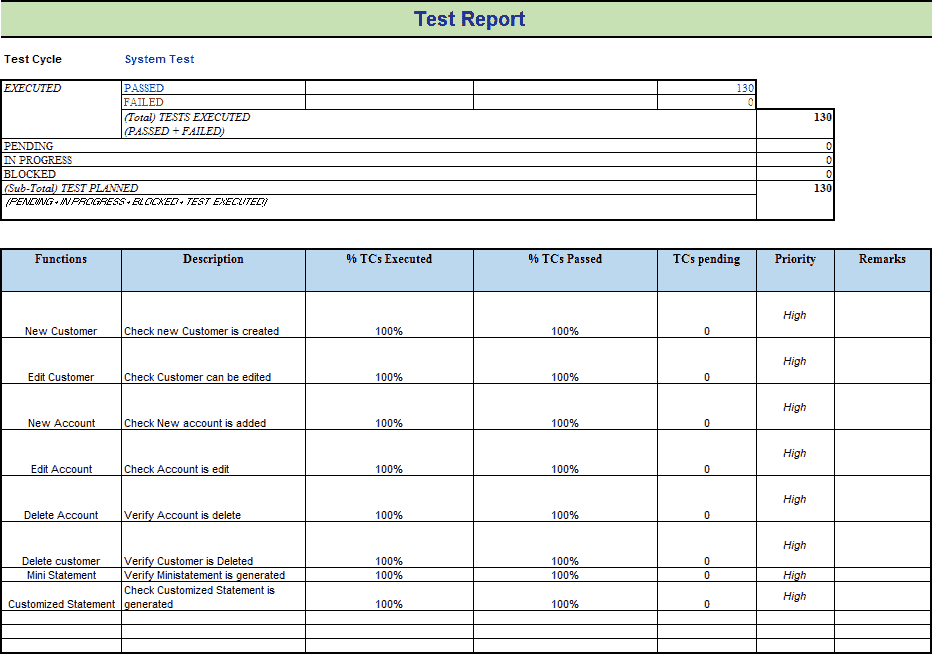
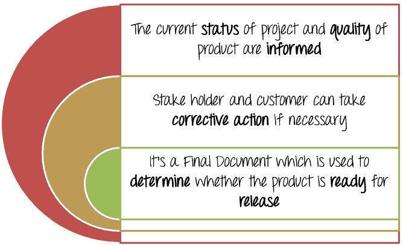
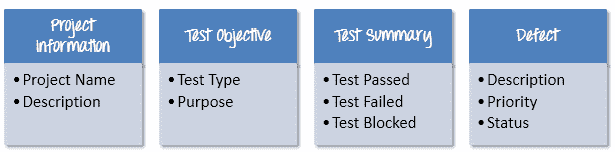
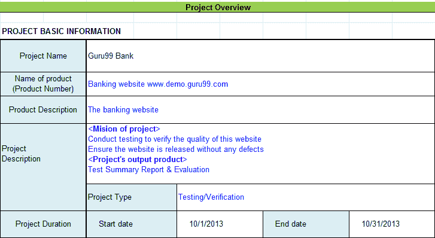
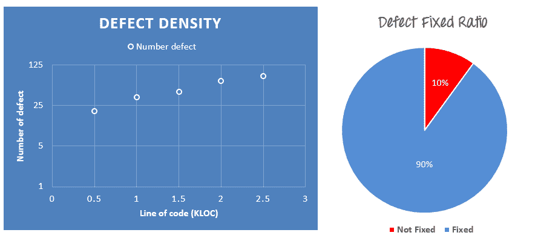
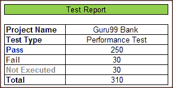

# 测试摘要报告教程：通过示例&模板学习

> 原文： [https://www.guru99.com/how-test-reports-predict-the-success-of-your-testing-project.html](https://www.guru99.com/how-test-reports-predict-the-success-of-your-testing-project.html)

## 什么是测试报告？

测试报告是包含以下内容的文件

*   测试活动和最终测试结果的**摘要**
*   **评估**对[测试](/software-testing.html)执行得如何的评估

根据测试报告，涉众可以

*   **评估**被测产品的**质量**
*   在软件版本上做出**决策**。 例如，如果测试报告告知产品中还有许多缺陷，则涉众可以延迟发布，直到修复所有缺陷为止。
**Test Report Example**

## 为什么要测试报告？

以下情形将向您展示为什么我们确实需要测试报告

| 此前，当老板问您有关 Guru99 Bank 网站是否可以发布的信息时，您回答了他 | 老板信任您，并决定在本月底向客户发布此网站。 但是发布后两个月，您就收到了客户的反馈。 |
|  |  |

您知道此问题的根本原因吗？ 为什么即使您的团队已经测试过，网站仍然存在缺陷？

问题是您忽略了“测试管理”中的报告&评估阶段。 老板没有信息可评估该网站的质量。 他们只是信任您所说的话，并在不了解其测试性能的情况下发布了该网站。

测试报告的典型好处包括：

## 如何制作好的测试报告？

要回答这个问题，您必须知道-

## 测试报告包含哪些内容？

### 项目信息

项目的所有信息，例如项目名称，产品名称和版本，都应在测试报告中说明。 例如，Guru99Bank 项目的信息如下

### 测试目标

如[测试计划](/what-everybody-ought-to-know-about-test-planing.html)教程中所述，测试报告应包括每轮测试的目标，例如单元测试，性能测试，系统测试…等等。

### 测试总结

本节包括测试活动的摘要。 此处详细介绍的信息包括

*   执行的测试用例数
*   测试用例数合格
*   测试用例数量失败
*   及格率
*   失败率
*   注释

通过使用**颜色指示器**，**图形和高亮显示的表格**可以在**上以视觉方式显示**。****

[查看网站 Guru99 Bank 的测试报告，以了解有关测试报告](/images/TestManagement/Guru Test Report.xlsx)的更多详细信息

### 缺陷

测试报告中最重要的信息之一就是缺陷。 该报告应包含以下信息

*   错误总数
*   错误状态（打开，关闭，响应）
*   打开，解决，关闭的错误数量
*   按严重性和优先级细分

像测试摘要一样，您可以包括一些简单的指标，例如[缺陷](/defect-management-process.html)密度，固定缺陷的百分比。

项目团队向您发送了以下缺陷信息：

*   缺陷密度为 20 个缺陷/平均 1000 行代码
*   总共修复了 90％的缺陷
*   错误的详细信息在此缺陷跟踪器[中](https://docs.google.com/spreadsheet/ccc?key=0Au2ff2t4xXuGdFZlek9zbHhUcnVleHVyOVp0VmFHMmc&usp=drive_web#gid=0)中进行了描述

您可以将数据表示为下图

## 撰写优质测试报告的提示

测试报告是测试管理器和涉众之间的**通信**工具。 通过测试报告，利益相关者可以**了解项目状况，产品质量和其他方面。**

以下情况向您展示了为什么我们需要一份好的测试报告

您与外包公司的测试人员合作，完成了 Guru99 Bank 网站的[性能测试](/performance-testing.html)后，会向您发送这样的测试报告

该报告的信息也**摘要**。 它没有任何详细信息。 会读到它的利益相关者可能**有点困惑**。 他们可能会问或有以下问题：-

*   他们为什么不执行剩下的 30 个 TC
*   这些失败的测试用例是什么
*   没有任何错误描述

要解决该问题，一个好的测试报告应该是：

*   **详细信息**：您应该提供测试活动的详细说明，并显示您执行的测试。 不要将摘要信息放入报告中，因为读者不会理解您所说的话。
*   **清楚：**测试报告中的所有信息都应**短**和**清楚**可以理解。
*   **标准：**测试报告应遵循**标准**模板。 利益相关者很容易查看并确保许多项目中测试报告之间的**一致性**。
*   **特定：**不要写有关项目活动的文章。 描述并总结测试结果规范，并着重于重点。

例如，要更正以上测试报告，测试人员应提供更多信息，例如：

*   项目信息
*   测试周期：（系统测试，集成测试等）
*   哪些功能已经过测试（执行的 TC 百分比，通过或失败的 TC 百分比...）
*   缺陷报告（缺陷描述，优先级或状态...）