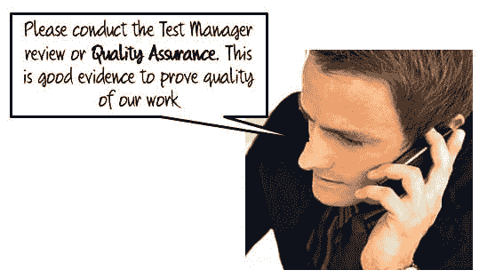
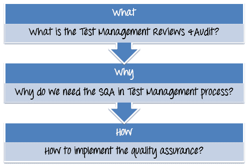
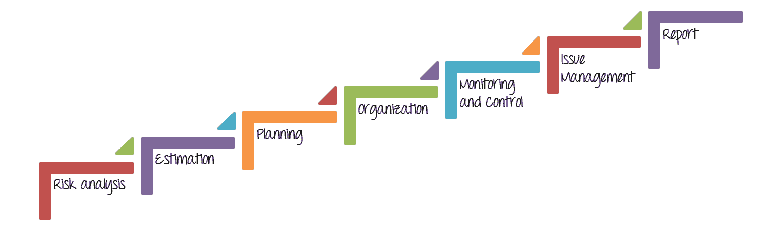
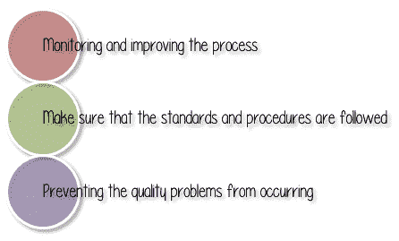
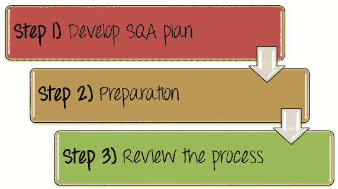
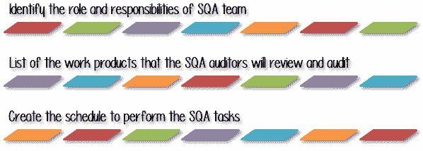
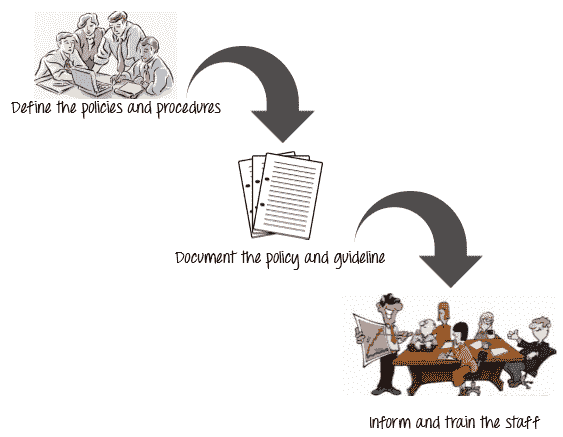
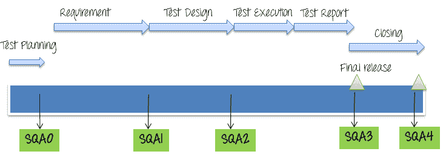

# 软件质量保证（SQA）：计划，审核&审核

> 原文： [https://www.guru99.com/software-quality-assurance-test-audit-review-makes-your-life-easy.html](https://www.guru99.com/software-quality-assurance-test-audit-review-makes-your-life-easy.html)

在完成七个阶段的测试后，结果看起来不错。 Guru99 银行项目未发生重大问题。 您管理得很好，您为这个项目的成功感到自豪

不幸的是，管理委员会认为与众不同

您没有任何证据表明您成功管理了该项目。 您要求顾问提供解决方案。 这是答案

这个答案是一个开始，但是您仍然有以下问题-

本教程将帮助您回答以下问题-

## 什么是测试管理审核&审核？

*   **管理评审：**管理评审又称为软件[质量保证](/all-about-quality-assurance.html)或（SQA）。 它更多地关注软件过程而不是软件工作产品。 质量保证是一组活动，旨在确保项目经理遵循已预先定义的标准流程。 换句话说，质量保证可以确保测试经理以正确的方式做正确的事情。

*   **审核：**审核是对工作产品和相关信息的检查，以评估是否遵循标准流程。

## 为什么在测试管理过程中需要 SQA？

要了解这一点，请考虑以下情形：

在 Guru99 Bank 项目中，处理各种测试阶段，例如-

作为测试经理，您是负责这些活动的人。 但是，**您在项目团队中排名最高。 谁来审查您的任务并检查项目管理活动是否以最高标准执行？**

好的，SQA 审核员是审查和检查项目管理活动是否按最高**标准**执行的人员。 只有通过审查的结果，管理委员会才能评估项目处理的质量。

这就是为什么我们在测试管理过程中确实需要管理评审或 SQA 的原因。

SQA 与您（测试经理）进行面谈，以对照设定的标准对项目进行基准测试。

SQA 的好处是-

## 如何实施质量保证？

## 步骤 1）制定 SQA 计划

测试活动需要[测试计划](/what-everybody-ought-to-know-about-test-planing.html)，同样，SQA 活动也需要**一个计划**，称为 **SQA 计划。**

SQA 计划的目标是制定计划流程和程序，以确保制造的产品或组织提供的服务具有卓越的质量。

在项目计划期间，测试经理会制定 SQA 计划，并定期安排 SQA 审核。

在 SQA 计划中，测试经理应执行以下操作

### 步骤 1.1）确定 SQA 团队的角色和职责

在项目团队中，每个成员都必须对其工作质量负责。 每个人都必须确保其工作符合质量检查标准。

SQA 团队是在项目中扮演**主要角色的人员。 没有质量检查，任何业务都无法成功运营。 因此，测试经理必须明确 SQA 计划中每个 SQA 成员的**责任**：**

*   **审查**和**评估**项目活动的质量以满足质量保证标准
*   **与管理委员会和项目团队协调**以评估需求并参加项目审查和状态会议。
*   **设计跟踪**和**收集**指标以监视项目质量。
*   **测量产品质量**； **确保**产品符合客户期望。

例如，在项目 Guru99 Bank 的 SQA 计划中，您可以创建 **SQA 小组**的列表成员

| 

**否**

 | 

**成员**

 | 

**角色**

 | 

**责任**

 |
| --- | --- | --- | --- |
| 1 | 彼得 | SQA 负责人 | 为所有管理过程制定并记录质量标准和过程
管理项目的软件质量保证活动 |
| 2 | 詹姆士 | SQA 审核员 | 执行 SQA 任务，向 SQA 负责人报告 SQA 审查的结果。 |
| 3 | 豆 | SQA auditor | Perform SQA tasks, report to SQA leader the result of SQA review. |

### 步骤 1.2）SQA 审核员将审核和审核的工作产品清单

测试经理应该

*   **列出**每个测试管理流程的所有工作产品
*   **定义** SQA 审核员可以访问哪些设施或设备来执行 SQA 任务，例如过程评估和审核。

例如，对于项目 Guru99 银行，您可以列出每个测试管理流程的工作产品，并根据下表定义 SQA 成员访问这些工作产品的权限

| **否** | **管理阶段** | **工作产品** | **路径** | **权限** | **授予人** |
| --- | --- | --- | --- | --- | --- |
| 1 | 
风险分析 | 风险管理文件 | [服务器路径] | 读 | 所有 SQA 团队成员 |
| 2 | 
估算 | 估算和指标报告 | … | Read | 
彼得 |
| 3 | 
规划 | 测试计划文件 | … | Read | All SQA team members |
| 4 | 
组织 | 人力资源计划，培训计划 | … | Read | All SQA team members |
| 5 | 监控 | 收集的项目工作量度 | … | Read | 
豆 |
| 6 | 问题管理 | 问题管理报告 | … | Read | 
詹姆斯 |
| 7 | 
测试报告 | 测试报告文件 | … | Read | All SQA team members |

### 步骤 1.3）创建时间表以执行 SQA 任务

在此步骤中，测试经理应描述 SQA 审核员要执行的**任务**，并特别强调 SQA 活动以及每个任务的工作产品。

测试管理器还会为这些 SQA 任务创建**计划**。 通常，SQA 进度表由项目开发进度表驱动。 因此，执行 SQA 任务与正在进行的软件开发活动有关。

在 SQA 计划中，测试经理制定计划以进行管理审查。 例如

| 

**日期**

 | 

**SQA 任务**

 | 

**负责人**

 | 

**说明**

 | 

**输出**

 |
| --- | --- | --- | --- | --- |
| 2014 年 10 月 30 日 | 评估项目计划，跟踪和监督流程 | 
James | -软件规范审查
-估计，总体进度和项目计划审查 | SQA 计划报告，SQA 审查记录 |
| 2014 年 12 月 15 日 | 审查需求分析 | 
James | -审查软件需求开发 | 流程审核报告 |
| 2015 年 3 月 30 日 | 审查和评估测试设计 | 
James | -审核测试设计文档 | SQA 报告，SQA 审核分钟 |
| 30-Mar-2015 | 评论发布 | 
Bean | -流程审核：最终版本 | SQA 流程审核报告 |
| 2015 年 4 月 2 日 | 审查项目结束 | 
Bean | -最终交付给客户后的外部审核 | SQA process audit report |

## 步骤 2）定义标准/方法

要根据标准流程审查管理活动，您应该执行以下步骤

1.  定义旨在防止管理过程中发生缺陷的策略和过程
2.  记录策略&程序
3.  通知和培训员工使用它

## 步骤 3）审查程序

审查项目活动以验证是否符合定义的管理过程。 在管理评审中，SQA 成员必须执行 5 次 SQA 评审，如下所示

SQA 的审核时间取决于项目的开发生命周期模型。 如果是 Guru99 银行项目，则审查时间表应如下

在每个 SQA 阶段， **SQA 成员**提供有关计划计划，工作产品和程序的**咨询**和**审查**，以确保符合已定义的组织政策和标准程序。

在审核期间，SQA 成员应使用 [SQA 审核清单](/images/TestManagement/SQACheckList.xlsx)

**完成软件保证实现的 3 个步骤之后，您将获得测试管理审查&审核的结果。 这是向您的利益相关者展示您的管理质量的证据。**

**** 

## 软件质量保证最佳实践

**以下是有效实施 SQA 的一些最佳做法**

*   **持续改进：**必须经常改进 SQA 中的所有标准流程，并将其作为**正式**，以便其他人可以遵循。 此过程应由 ISO，CMMI 等流行组织通过**认证**。
*   **文档：**应该记录质量保证小组定义的所有质量保证政策和方法，以便培训和在以后的项目中重复使用。
*   **经验：**选择经验丰富的 SQA 审核员是确保管理评审质量的好方法
*   **工具用法：**利用诸如 SQA 流程的跟踪工具，管理工具之类的工具，可以减少 SQA 的工作量和项目成本。
*   **度量标准：**开发和创建度量标准以跟踪当前状态的软件质量，以及将改进与以前的版本进行比较，将有助于提高[测试](/software-testing.html)流程的价值和成熟度
*   **职责：** SQA 流程不是 SQA 成员的任务，而是**每个**的任务。 团队中的每个人应对产品质量负责，而不仅仅是测试负责人或经理。