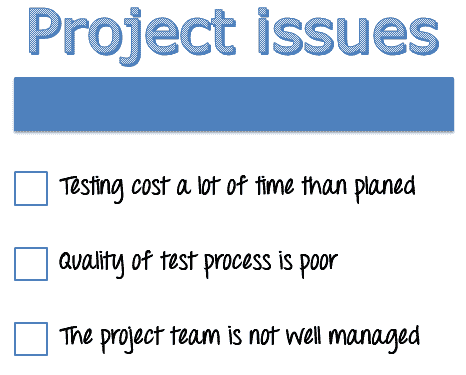
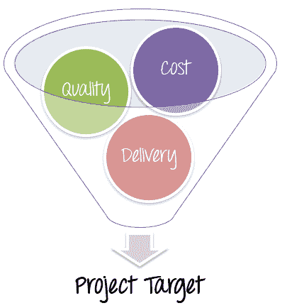
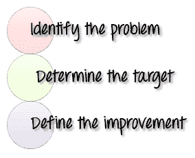
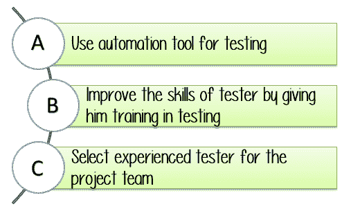
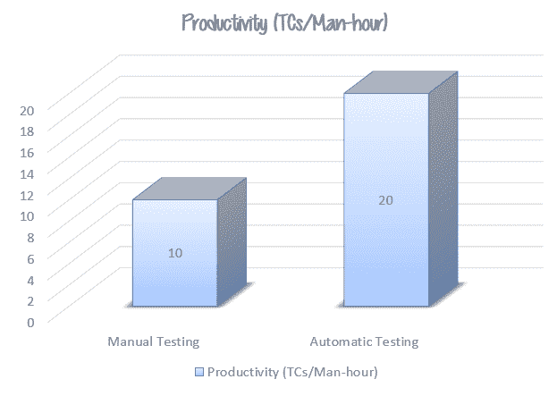
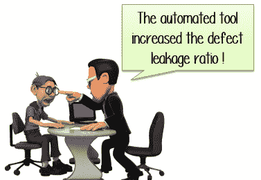
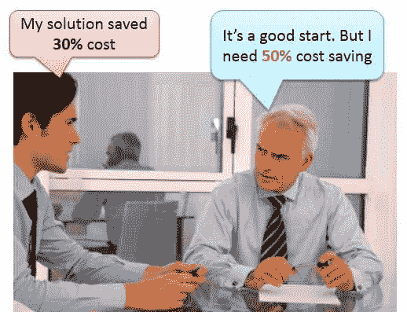
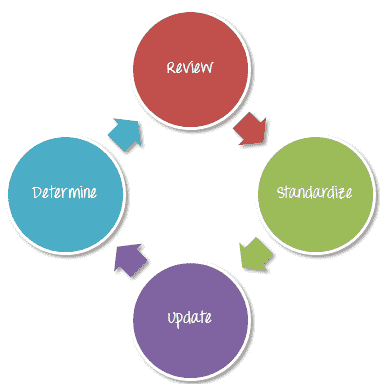

# 使用 PDCA 模型的测试过程改进（TPI）

> 原文： [https://www.guru99.com/a-complete-guide-to-test-process-improvement.html](https://www.guru99.com/a-complete-guide-to-test-process-improvement.html)

Guru99 Bank 项目已成功完成。 董事会非常感谢您所做的出色工作。 但是，您的老板仍然有一些问题要问您。

要回答这些问题，您必须了解测试过程的改进。

## 什么是测试过程改进？

管理人员通常将[测试称为](/software-testing.html)，这是一个麻烦且不可控制的过程。 回顾项目 Guru99 Bank，您在项目中是否遇到以下任何问题？

**这些是任何测试项目中的常见问题。 许多组织意识到改善测试过程可以解决这些问题。 从过去的错误中学习可以帮助改善测试管理流程。**

## 为什么要测试流程改进？

以下方案向您展示了为什么需要改进测试流程-

Guru99 Bank 项目已完成。 测试的质量很棒！ 您得到了客户的好评。

从这种情况中学到了什么？ 它是“ **始终尝试做得更好**”。

即使您认为自己做得很好，总会有其他人做得比您好。 因为他们拥有比您更好的解决方案和更好的主意。

任何企业都希望以**最高**质量，**最低**成本，**最短**交付时间**来完成项目。**

测试流程的改进可帮助您实现这些目标

## 如何实施测试流程改进？

要为项目 Guru99 Bank 实施测试流程改进，测试经理可以遵循 **PDCA** 模型。 PDCA（计划执行检查行为）是一种用于企业的四步管理方法，用于控制和持续改进流程。

## 步骤 1）计划

再次分为 3 个步骤

### 步骤 1.1）找出问题

测试改进过程的第一个活动是**识别**当前项目中发生的问题。 该项目中的问题可能在其他项目中再次发生。 解决问题并找出解决方案以便将来避免它们是测试改进的主要目标。

现在回到项目 Guru99 Bank 网站，您发现任何问题或改进点了吗？ 选择下面

| 先生不 | 问题 | 描述 | 选择 |
| 1 | 质量 | 客户在发布后仍发现一些[缺陷](/defect-management-process.html) | <input class="quality" type="checkbox" value="quality"> |
| 2 | 交货 | 该项目被推迟 | <input class="delivery" type="checkbox" value="delivery"> |
| 3 | 球队 | 一些员工没有与其他团队成员合作 | <input class="team" type="checkbox" value="team"> |
| 4 | 技能专长 | 团队成员缺乏完成任务所需的技能 | <input class="skills" type="checkbox" value="skills"> |
| 5 | 管理 | 测试经理无法很好地监控进度，从而导致某些项目延迟 | <input class="management" type="checkbox" value="management"> |
| 6 | 通讯 | 没有与客户保持持续联系； 误解了客户的要求 | <input class="communication" type="checkbox" value="communication"> |
| 7 | 成本 | 项目费用超出预算 | <input class="cost" type="checkbox" value="cost"> |

<input align="center" id="submit" type="button" value="Submit">You got problem with Quality Delivery Team ,Skills ,Management , Commmunication ,Cost

### 步骤 1.2）确定目标

了解问题和项目中发生的问题。 这样，您将确定哪些改进点和应关注的测试阶段。

假设您已经确定测试执行阶段花费了**太多的时间**花费了&。 测试可以更快，更便宜吗？ 这是目标之一

### 步骤 1.3）定义改进措施

基于设定的目标，确定改进措施。 这些动作应该是循序渐进的，并逐步加以改进，因为立即更改所有内容并不容易。

例如，为了使测试更快，更便宜，下面是一些建议的操作

在上面的示例中，要使测试更快，更便宜，您应该使用选项 A 和 B。选项 C 可以使测试更快，但会花费更多，因为您必须为有经验的测试员支付更多的薪水。

## 步骤 2）

您已经定义了改进点。 现在是制定实施计划的时候了。 在此计划中，您必须回答以下问题

*   必须实施哪些改进点？
*   什么时候完成这个计划？
*   要完成计划应采取哪些步骤？

### 执行改进措施

计划一旦建立，就需要执行。 改进活动可能会影响当前的测试进度。 测试经理必须对**注意**这些活动，以免产生**不必要的**后果。

考虑以下情形-

在 Guru99 Bank 项目中，为了使测试更快，更便宜，您决定使用自动测试代替手动测试。 应用该动作后，生产率显着提高。

## 步骤 3）检查

在此步骤中，您-

*   评估测试改进措施的**效率**
*   测量解决方案在**有效**方面的效果
*   分析是否可以通过任何方式改进**。**

在此阶段，目标是**检查**改进措施是否成功实施以及评估是否达到了预期目标。

进行评估的最佳方法是使用**指标**。 指标对于成功的组织管理至关重要。 测试管理器收集数据并将其用于测量诸如生产率，质量…等参数。

例如，在将自动化测试应用于项目之前，测试的生产率为 **10TCs /工时**。 在应用自动测试之后，测得的生产率为 **20TC /工时**。

但是发生了不想要的问题

在这种情况下，应用自动测试可以帮助您**提高**的测试效率，但是测试质量**降低**。 因此，改进措施可能会导致严重的**后果**。 在这种情况下，您需要更仔细地选择测试工具。 您将在[测试工具选择](/testing-automation-why-right-tools-are-necessary-for-testing-success.html)教程中了解更多信息。

再次考虑相同的情况。 Guru99 的项目成本是**超支**，因为您的团队成员花了**太多的时间**来执行测试用例。 通过使用自动测试工具，您节省了 **30％**项目成本。 这是很好的进步，但您的老板期望更多

因此，您总是必须找到新的&较新的解决方案来进一步改善测试过程&。 在这种情况下，您可以使用其他一些解决方案来节省项目成本

*   有效管理您的人力资源
*   与供应商讨价还价

## 步骤 4）

成功实施改进措施并达到目标时，测试经理应执行以下操作：

*   **审查**的改进活动并根据汲取的教训采取行动
*   **标准化**管理过程中的改进点。
*   **更新**政策文件和计划以及标准流程文件
*   **确定**在下一个项目中的何时何地应用这些更改。