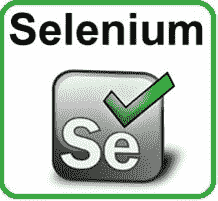
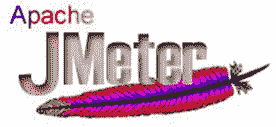
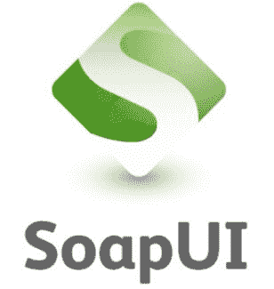

# 2020 年排名前 50 位的软件测试工具

> 原文： [https://www.guru99.com/testing-tools.html](https://www.guru99.com/testing-tools.html)

There are tons of software testing tools available in the market, and with the plethora of choices it becomes difficult to zero in on the best tool for your project. The following list categorizes, ranks and grades the different software testing tools in the market. For each tool - important features, USP and download links are mentioned.

Following tool categories are covered in this list

*   [测试管理工具](#1)
*   [自动化测试工具](#3)
*   [跨浏览器测试工具](#6)
*   [负载测试工具](#2)
*   [缺陷跟踪工具](#4)
*   [移动测试工具](#5)
*   [API 测试工具](#7)
*   [安全测试工具](#8)
*   [CSS 验证程序工具](#9)

## 测试管理工具：

These tools help organize the end to end test Cycle

### 1） [X 射线](https://bit.ly/2oV4nm5)

[X 射线](https://bit.ly/2oV4nm5)是质量检查的＃1 手册&自动化测试管理应用程序。 它是功能齐全的工具，可驻留在内部并与 Jira 无缝集成。 其目的是通过有效和高效的测试来帮助公司提高产品质量。

**功能：**

*   需求，测试，缺陷，执行之间的可追溯性
*   定义可重用的前提条件并关联测试
*   组织文件夹和测试集中的测试
*   测试计划以跟踪进度
*   测试环境
*   BDD-在 Jira 中编写黄瓜方案
*   与测试自动化框架（Selenium，JUnit，Nunit，Robot 等）集成
*   内置 REST API
*   CI 集成（Bamboo，Jenkins）
*   内置报告

* * *

### 2）[测试板](https://bit.ly/2CpRy6u)

[Testpad](https://bit.ly/2CpRy6u) 是一种更简单易用的手动测试工具，优先考虑实用性而不是过程。 它使用清单清单启发式的测试计划，而不是一次管理一个案例，它可以适应多种样式，包括探索性测试，敏捷的手动方面，语法突出显示的 BDD 甚至传统的测试案例管理。

**主要功能：**

*   不需要帐户的访客测试者（通过电子邮件邀请）
*   足够简单，可供非测试人员使用； 在发布时得到大家的帮助
*   键盘驱动的编辑器，具有 JavaScript 驱动的（即响应式）UI
*   拖放测试计划的组织
*   当您想到新想法时，在测试期间添加新测试
*   与问题跟踪器（包括 JIRA）的轻量级集成

* * *

### 3）[最务实的](https://bit.ly/2B4MFzK)

[PractiTest](https://bit.ly/2B4MFzK) is an end-to-end test management tool. A common meeting ground for all QA stakeholders, it enables full visibility into the testing process and a deeper broader understanding of testing results.

**Features:**

*   大量第三方集成，包括常见的错误跟踪器，自动化工具和其他功能强大的 API。
*   完全可定制的&灵活，可满足质量检查团队不断变化的需求：自定义字段，视图，权限，问题工作流等
*   重用测试并关联不同版本和产品的结果。
*   独特的分层过滤器树-整理所有内容并快速查找任何内容。
*   从不工作两次-包含反错误重复项，排列，步骤参数和测试调用
*   使用高级仪表板和报告可视化数据
*   快速的专业和方法支持

* * *

### 4） [TestRail](https://bit.ly/2KlmTfP)

[TestRail](https://bit.ly/2KlmTfP) 是您进行可伸缩，可自定义，基于 Web 的测试用例管理的来源。 使用我们基于云/ SaaS 的解决方案仅需几分钟即可完成设置，或在 TestRail 上安装您自己的服务器。

*   有效管理手动和自动测试用例，计划和运行。
*   借助信息丰富的仪表板，指标和活动报告，实时了解测试进度。
*   通过里程碑，个人任务列表和电子邮件通知提高效率。
*   用截图和预期结果记录测试用例。 使用灵活的内置模板或创建自己的自定义模板。
*   与 CI / CD / DevOps 管道中的工具集成，包括 JIRA，Bugzilla，Jenkins，TFS 等。
*   为大型团队&关键任务项目设计的企业版。
*   支持 Docker 容器。

* * *

### 5） [TestMonitor](https://bit.ly/2JvtS5a)

[TestMonitor](https://bit.ly/2JvtS5a) 是每个组织的端到端测试管理工具。 一种简单，直观的测试方法。 无论您是要实施企业软件，需要进行质量检查，构建高质量的应用程序，还是只需要在测试项目中提供帮助，TestMonitor 都可以满足您的要求。

**功能**

*   需求和基于风险的测试。
*   先进的测试用例设计能够支持数千个案例。
*   具有多测试运行和里程碑克隆功能的强大计划工具。
*   全面的结果跟踪。
*   集成的问题管理。
*   具有许多过滤器和可视化选项的智能报告。
*   革命性的简单 UI。
*   具有 Jira，DevOps 和 Slack 的第三方集成。 包括 REST API。
*   快速响应时间的专业支持。

## 自动化测试工具

这类工具可帮助自动化被测应用程序的功能和[回归测试](/regression-testing.html)。

### 6） [21](https://bit.ly/2Ch9Nym)

[21](https://bit.ly/2Ch9Nym) 是一个适用于 iOS 和 Android 应用程序的高级自学测试自动化和分析平台。

**Features:**

*   快速智能的创作-AI 辅助创作使用户能够在几分钟内创建自动化的功能和 UI 测试。
*   您值得信赖的结果-无缝算法定位器系统可确保在所有框架中保持稳定的结果。
*   消除维护和不稳定的结果-自学维护可以自动更新测试，并确保您的团队可以在依靠测试结果的同时专注于开发新功能。
*   放心发布-生产集成可以关闭反馈循环并分析实际覆盖范围。 释放时使用数据。
*   完全 SaaS，不需要安装或设备即可创建或执行测试。 无缝访问数十种设备。

* * *

### 7） [HeadSpin](https://bit.ly/3bg8Un2)

[HeadSpin](https://bit.ly/3bg8Un2) 是世界上第一个互联智能平台 TM ，它提供 Web，移动，IoT 和 5G 解决方案，以统一跨应用程序，设备和网络的测试，监视和分析。 HeadSpin 支持开发，质量保证，运营和产品团队，以优化关联体验并确保数字业务成功。

**Features:**

*   在共享设备云上访问 30 多个国家/地区的 300 多个设备：
*   远程调试
*   支持 Real SIM 的 Android 和 iOS 设备
*   500 多个并行测试
*   回归测试
*   自动化
*   本地化测试
*   本地调试和代码分析

* * *

### 8） [Parasoft Selenic](https://bit.ly/31mYNqo)

[Parasoft Selenic](https://bit.ly/31mYNqo) 利用 AI 解决您的 Selenium 问题，因此您不必摆脱 Selenium。 它可以直接与您现有的 Selenium 测试一起使用，因此您不会被锁定在专有平台上。

**主要功能：**

*   运行时自我修复，执行后由 AI 驱动的建议。 您可以有效地维护现有的 Selenium 脚本，从而减少维护，修复和修复损坏的测试所花费的时间。
*   使用页面对象模型创建 Selenium 测试套件。 团队可以从一开始就迅速建立可维护的测试实践。
*   使用“测试影响分析”优化测试执行。 将测试执行与基础代码更改进行互相关可为您提供更快的 CI / CD 管道反馈。

* * *

### 9）[压扁](https://bit.ly/2sBm0WP)

[Squish](https://bit.ly/2sBm0WP) 是全球 3000 多家公司选择的 GUI 测试自动化工具，用于自动化其图形用户界面（GUI）和人机界面（HMI）的功能回归测试和系统测试。 Squish GUI 测试工具是 100％跨平台的工具，具有

*   对所有主要 GUI 技术的深入支持
*   全面支持所有桌面，移动，Web 和嵌入式平台
*   测试脚本录制
*   强大而可靠的对象识别和验证（基于对象和基于图像）
*   不依赖于屏幕截图或外观
*   强大的集成开发环境（IDE）
*   多种流行的脚本语言可用于测试脚本
*   全面支持行为驱动开发（BDD）
*   通过命令行工具完全控制
*   与测试管理和 CI 系统集成

* * *

### 10） [Ranorex](https://bit.ly/2MIlSzx)

全球有超过 14,000 个用户使用 [Ranorex Studio](https://bit.ly/2MIlSzx) 加速了测试，这是一种用于跨平台测试自动化的多合一工具。 Ranorex 使用无代码的即点即用界面，对于初学者来说很容易，但对于具有完整 IDE 的自动化专家而言，功能强大。

**功能包括：**

*   可靠的对象识别，可进行可靠的测试并减少维护
*   共享对象存储库和可重用代码模块
*   跨浏览器测试
*   自动化具有挑战性的界面，例如 SAP，ERP，Delphi 和旧版应用程序
*   并行运行测试或在 Selenium 网格上分发
*   内置报告

Ranorex 与 BDD，CI / CD，源代码控制，测试管理，缺陷跟踪等解决方案集成在一起，以提供完整的测试自动化工具链

* * *

### 11）硒：

硒是最流行的自动化测试工具。 它专门设计用于支持[自动化测试](/automation-testing.html)，用于基于 Web 的应用程序，各种平台和浏览器的功能方面。

**Features:**

*   它提供了对并行测试执行的支持，从而减少了执行并行测试所需的时间。
*   与其他测试工具相比，硒需要的资源要少得多。
*   使用此测试工具准备的测试用例可以在任何操作系统上执行
*   它支持许多已知的编程语言，例如 Java，Python，C＃，Perl，PHP 和 JavaScript。

**下载链接：** [http://www.seleniumhq.org/download/](http://www.seleniumhq.org/download/)

* * *

### 12）QTP：

Quick Test Professional（QTP）是一种自动化的功能 GUI 测试工具，它可以使基于 Web 或基于客户端的计算机应用程序上的用户操作自动化。 它广泛用于功能回归测试自动化。 它使用脚本语言来操作被测应用程序的对象和控件。

**Features:**

*   QTP 使初学者可以在几分钟内学习此工具。
*   该工具非常易于理解。 它以简单的工作流程向测试人员展示了一个测试案例。
*   该工具允许通过完整的检查点来对应用程序进行完全验证

**下载链接：** [https://saas.hpe.com/en-us/software/uft](https://saas.hpe.com/en-us/software/uft)

* * *

### 13）瓦蒂尔：

Waitr 是一个开源的跨平台 Web 应用程序测试工具。 它是用于 Web 浏览器自动化的 Ruby 库的最可靠，最灵活的自动化工具。 该跨浏览器测试工具就像人类一样与浏览器进行交互，因此它可以单击链接，填写表格并验证文本。

**Features:**

*   它是免费的，因此没有使用该工具的费用。
*   这个自动测试工具得到了活跃且不断发展的社区的支持。
*   它支持在不同平台上的多个浏览器。
*   这是非常强大且轻巧的工具。

**下载链接：** [http://watir.com/guides/downloads/](http://watir.com/guides/downloads/)

* * *

### 14）测试：

Testim 是现代的自动化测试工具。 它使用机器学习来加快自动化测试的编写，执行和维护。 测试人员可以在几分钟内分析任何测试用例，并在多个 Web 和移动平台上执行它们。

**Features:**

*   轻松添加注释以找出系统中存在的问题。
*   使用错误跟踪器快速查看和共享易于理解的带注释的屏幕截图。
*   开发人员只需要单击自动错误测试即可在浏览器中自动重现。

**下载链接：** [https://www.testim.io/](https://www.testim.io/)

* * *

### 15）AppliTools：

Applitools 是一种自动测试工具，可以自动验证应用程序和网站的外观和用户体验。 它的设计方式使其可以轻松地与现有测试集成，而无需创建新测试。

**Features:**

*   允许在各种设备中进行跨浏览器测试
*   向用户提供交互式视觉测试报告
*   强大的用户访问管理
*   它可以作为云服务或在内部使用

**下载链接：** [https://applitools.com/users/register](https://applitools.com/users/register)

* * *

### 16）Telerik 工作室：

Telerik Studio 是一种软件测试工具，可以测试所有 Windows 操作系统的 Web 和桌面应用程序。 这是测试网络和移动应用程序的功能，负载以及性能的有用工具。 它还提供了一个插件来检查跨浏览问题。

特征：

*   AJAX 应用程序的测试自动化
*   内置对 Telerik UI 控件的支持
*   测试 HTML 弹出窗口和浏览器对话框
*   支持 JavaScript 调用和记录
*   允许持续集成使用构建服务器

**下载链接：** [http://www.telerik.com/download/teststudio](http://www.telerik.com/download/teststudio)

* * *

### 17）TestComplete：

TestComplete 是一种自动化的测试管理工具，有助于提高效率并降低测试过程的成本。 它非常易于使用的界面可帮助质量检查小组在极短的时间内实施自动化解决方案。

**Features:**

*   支持多种脚本语言
*   无需脚本知识即可记录强大的自动化测试
*   提供数据驱动的测试
*   允许用户创建自定义插件和扩展

**下载链接：** [https://support.smartbear.com/downloads/testcomplete/](https://support.smartbear.com/downloads/testcomplete/)

## 跨浏览器测试工具

此类工具可在跨 Chrome，Firefox，IE，Edge，Safari 和其他浏览器的网站的跨浏览器测试中提供帮助。

### 18） [LambdaTest](https://bit.ly/2XuNQow)

[LambdaTest](https://bit.ly/2XuNQow) 是一个可扩展的基于云的跨浏览器测试平台，旨在为云基础架构提供所有网站或 Web 应用程序测试需求。 LambdaTest 平台可通过手动，可视和自动测试支持，确保您的网站公关 Web 应用程序在所有台式机和移动浏览器上无缝呈现。 使用 LambdaTest，您可以在云上访问多达 2000 多种台式机和移动浏览器组合。

**Features**

*   Selenium Web 测试自动化
*   实时交互式浏览器兼容性测试
*   更快的自动化屏幕截图测试
*   并行测试以更快地进入市场
*   连续测试的 API
*   使用持续集成工具进行持续测试

* * *

### 19）浏览器：

这是最好的浏览器兼容性测试软件之一，它可以在多个浏览器中测试网站及其元素。 该工具还用于测试网站和所有网页的脚本和布局错误。

**Features:**

*   Browsera 可以通过比较每个浏览器的输出来快速自动检测跨浏览器的布局问题。
*   每次测试后，都会收集并报告来自每个浏览器的 JavaScript 错误。
*   借助其站点爬网功能，可以轻松测试单个站点的所有网页。

**下载链接：** [http://www.browsera.com/web_sites](http://www.browsera.com/web_sites)

* * *

### 20）CrossBrowser 测试：

跨浏览器测试有助于确保网站或 Web 应用程序在各种 Web 浏览器中正常运行。 借助该工具，可以运行并行自动化测试，比较屏幕截图以及远程调试实际的台式机和移动浏览器。

**Features:**

*   一次在多个设备上运行众多测试
*   可以针对真实的 iOS，Android 和&其他桌面浏览器轻松运行自动化测试
*   它允许运行诸如 WebDriver.IO 和 Nightwatch 之类的测试框架，以提供卓越的质量和速度

**下载链接：** [https://crossbrowsertesting.com/freetrial](https://crossbrowsertesting.com/freetrial)

* * *

### 21）SauceLabs：

Sauce Labs 是基于 Selenium 云的解决方案，支持自动跨浏览器测试。 它可以在任何操作系统，平台和浏览器组合中执行测试。

**Features:**

*   可以使用最多数量的平台，浏览器和操作系统组合来测试 Web 和移动应用程序。
*   该工具可确保 Web 应用程序与所有最新的 Android 和 iOS 移动设备有效地协同工作。
*   对 Web 应用程序运行 JavaScript 单元测试，以确保代码在每种环境中均能正常工作。

**下载链接：** [https://saucelabs.com/signup/trial](https://saucelabs.com/signup/trial)

* * *

### 22）Ghostlab：

Ghostlab 是一个基于 Mac 的测试应用程序，可以在各种设备和浏览器上测试响应式设计。 它是用于同步浏览器测试的工具。 它在所有连接的客户端之间同步滚动，单击，重新加载和形成输入，以测试完整的用户体验。

**Features:**

*   无需安装安装
*   该移动测试工具可以同步点击，事件和滚动
*   它为所有类型的浏览器提供远程调试支持

**Download Link:** [https://saucelabs.com/signup/trial](https://saucelabs.com/signup/trial)

* * *

### 23）浏览器快照：

Browsershots 是一个跨浏览器测试工具，可以测试在 Windows，MacOS，Android 或 iOS 上运行的网站。 它提供了 200 多种浏览器的网站屏幕截图。 该工具在测试环境中提供网站的屏幕快照，有助于发现所有主要的 HTML 或 CSS 错误。

**Features:**

*   Browsershots 是一个完全免费的工具，它支持 200 种不同的浏览器版本以捕获屏幕截图。
*   支持的浏览器包括 Arora，Chrome，Dillo，Firefox，Iceweasel，Konqueror，Links，SeaMonkey 和 Safari。
*   它允许禁用 JavaScript，更改颜色深度以及禁用/启用 Java 和 Flash。

**下载链接：** [http://browsershots.org/](http://browsershots.org/)

* * *

## 负载测试工具

这些工具有助于性能/负载测试站点或应用程序。

### 24）Webload：

WebLOAD 是一个出色的测试工具，它提供了许多强大的脚本功能，这对于测试复杂的场景很有帮助。 该工具支持从 Selenium 到移动，从企业应用程序到 Web 协议的数百种技术。 使用此工具可以在云和本地中生成负载。

**Features:**

*   使用 WebLOAD 更轻松，更有效地构建负载测试方案
*   它通过 80 多种报告类型和图表帮助您确定系统中的性能瓶颈。
*   [性能测试](/performance-testing.html)可以通过从 Amazon EC2 生成负载来从云中运行。

**下载链接：** [http://www.radview.com/webload-download/](http://www.radview.com/webload-download/)

* * *

### 25）Loadrunner：

它是 Windows 和 Linux 的负载测试工具，可以有效地测试 Web 应用程序。 它是确定负载下 Web 应用程序的性能和结果的有用测试工具。

**Features:**

*   它为各种类型的应用程序提供支持
*   该测试工具可以在多个企业环境中工作。
*   只需一个仪表板即可控制所有 Vuser。
*   LoadRunner 提供对多种协议类型的支持。
*   监视和分析非常人性化并且易于掌握。

**下载链接：** [https://www.microfocus.com/zh-CN/products/loadrunner-professional/free-trial](https://www.microfocus.com/en-us/products/loadrunner-professional/free-trial)

* * *

### 26）Wapt：

Wapt 是一种负载，压力测试工具适用于所有 Windows。 它提供了一种简便且经济高效的方法来测试所有类型的网站。 在数据驱动模式下，它可以在安全的 HTTPS 网站，动态内容和 RIA 应用程序上以相同的效率工作。 该测试工具还为数据驱动模式下的 RIA 应用程序提供支持。

**Features:**

*   允许在一次测试中包括不同类型的用户
*   提供最灵活的负载级别定义
*   该工具使用大量先进技术来模拟实际负载条件。
*   WAPT 支持测试受 SSL 保护的网站和应用程序

**下载链接：** [https://www.loadtestingtool.com/download.shtml](https://www.loadtestingtool.com/download.shtml)

* * *

### 27）LoadUI Pro：

LoadUI 是一个开源的负载测试工具，允许您通过简单地拖动不同的组件来执行复杂的负载测试。 它还允许在执行过程中创建和更新测试用例，这使其成为值得使用的工具。

**Features:**

*   允许创建多个绩效策略。
*   重用现有的 SoapUI Pro 功能测试。
*   关于负载测试结果的实时反馈。
*   即使在复杂的情况下也可以同时进行负载测试。

**下载链接：** [https://www.loadui.org/downloads/download-loadui-pro.html](https://www.loadui.org/downloads/download-loadui-pro.html)

* * *

### 28）丝绸表演者：

Silk Performer 是一种经济高效的负载测试工具，可以满足所有关键应用程序，性能预期和服务级别要求。 它还支持云集成，这意味着可以轻松模拟大量负载，而无需投资硬件设置。

**Features:**

*   通过深入分析快速找到性能问题的根本原因
*   它可以在云中无限扩展的任何地方使用
*   通过事务监视和性能跟踪来验证实时用户体验

**下载链接：** [https://www.microfocus.com/products/silk-portfolio/silk-performer/trial/](https://www.microfocus.com/products/silk-portfolio/silk-performer/trial/)

* * *

### 29）Jmeter：

Apache JMeter 是一个开源负载测试工具。 它是一个 Java 桌面应用程序，旨在加载测试功能行为并衡量网站的性能。 该工具是为了对 Web 应用程序进行负载测试而开发的，但现在已扩展到其他测试功能。

**Features:**

*   JMeter 允许对各种服务器类型执行负载和性能测试。
*   该负载测试工具以 XML 格式存储其测试计划，允许用户使用文本编辑器生成测试计划。
*   该工具可用于执行应用程序的自动化和功能测试。

**下载链接：** [http://jmeter.apache.org/download_jmeter.cgi](http://jmeter.apache.org/download_jmeter.cgi)

* * *

### 30）敏捷加载：

AgileLoad 是一种负载测试工具，用于增强关键业务应用程序的性能。 借助此负载测试工具，可以轻松测试各种 Web 和移动应用程序的性能。

**Features:**

*   全面支持动态 Web 和移动技术
*   出色的监控和综合分析诊断
*   它支持创建可自定义的测试报告
*   做出正确的决定，以快速提高应用程序性能

**下载链接：** [http://www.agileload.com/signup-download/getting-started-with-agileload](http://www.agileload.com/signup-download/getting-started-with-agileload)

* * *

### 31）负载聚焦

LoadFocus 是用于负载测试和性能测试的最佳云测试工具。 它还在不同类型的移动设备上提供云测试服务，例如网站速度测试，移动应用程序，API 测试和移动仿真。

**Features:**

*   云负载测试网站和 RESTful API
*   负载测试可以在云中或安全服务器上运行
*   允许重复次数检查应用程序行为
*   它提供网站速度测试和洞察分析

**下载链接：** [https://loadfocus.com/](https://loadfocus.com/)

* * *

### 32）BlazeMeter：

BlazeMeter 是一种负载测试工具，可确保交付高性能软件来快速运行针对移动应用程序，网站或 API 的性能测试，以在其开发的每个阶段检查性能。

**Features:**

*   它允许测试网站并将多地理位置的结果集成到单个报告中
*   从 Google Analytics（分析）帐户中检索网站数据，并将其集成到新的测试设置中。
*   使用 VPN 凭据将一系列负载服务器集成到专用网络中。

**下载链接：** [http://info.blazemeter.com/live-request-a-demo](http://info.blazemeter.com/live-request-a-demo)

* * *

### 33）LoadImpact：

Load Impact 是最好的基于云的负载测试系统，已被世界各地的企业广泛使用，通过执行所有类型的测试来开发其网站，移动应用程序，基于 Web 的应用程序和 API。

**Features:**

*   它模拟实际发生的流量。 没有隐藏的缓存或虚假的用户行为。
*   可以同时从 10 个不同的位置生成负载。
*   允许使用代理记录器记录 HTTP 会话，并允许在测试期间执行相同的操作。

**Download Link:** [https://saucelabs.com/signup/trial](https://saucelabs.com/signup/trial)

* * *

## 缺陷跟踪工具

这类工具有助于缺陷/错误管理。

### 34）JIRA：

JIRA 是一种缺陷跟踪工具，可用于缺陷/问题跟踪以及项目管理。 该工具不仅用于记录，报告，还与代码开发环境直接集成。

**Features:**

*   JIRA 查询语言只需单击一下即可帮助创建快速过滤器
*   可以创建任意大小的自定义工作流程，这有助于构建，测试和发布软件。
*   从 Atlassian 市场安装即插即用插件，以适应各种情况。

**下载链接：** [https://www.atlassian.com/software/jira/try](https://www.atlassian.com/software/jira/try)

* * *

### 35）曼蒂舒布：

Mantis 是一种开源缺陷跟踪工具，可在简单性和强大功能之间取得很好的平衡。 用户可以轻松地开始使用此工具来有效地管理队友和客户。

**Features:**

*   改善组织的工作流程和效率
*   支持内部问题跟踪
*   该工具允许使用 Bitbucket 和 GitHub 进行单点登录
*   MantisHub 拥有自己的内置时间跟踪功能，有助于有效报告在特定问题上花费的时间。

**下载链接：** [https://www.mantishub.com/signup/gold](https://www.mantishub.com/signup/gold)

* * *

### 36）FogBugz：

FogBugz 是一个跟踪工具，可用于跟踪缺陷状态和正在进行的软件项目（例如，应用程序开发和部署）中的更改。 对于组织跟踪多个项目的错误特别有用。

**Features:**

*   Fogbugz 提供了立即查找信息的灵活性。
*   它为敏捷项目管理提供支持
*   通知和电子邮件使团队成员随时了解项目和案例的更改

**下载链接：** [https://www.fogcreek.com/fogbugz](https://www.fogcreek.com/fogbugz)

* * *

### 37）Bugzilla：

Bugzilla 是最好的缺陷跟踪系统之一。 该工具允许个人或成组的开发人员跟踪其系统中未解决的错误。 它是小型和大型组织在市场上使用的最佳开源软件。

**Features:**

*   优化的数据库结构可增强性能和可伸缩性
*   先进的查询工具，可记住用户的自定义搜索
*   可编辑的用户个人资料和全面的电子邮件首选项
*   高度可定制安装的扩展机制

**下载链接：** [https://www.bugzilla.org/download/](https://www.bugzilla.org/download/)

* * *

### 38）BugNet：

BugNet 是开源的 Bug 查找工具。 它是使用 ASP.NET 平台编写的跨平台应用程序，并且需要 MySQL 数据库作为后端工具。 此缺陷跟踪工具的主要目标是使代码库简单易行。

**Features:**

*   它是 GPL 许可下的开源 Web 基本应用程序
*   BugNET 工具使归档，管理和报告错误变得简单
*   该工具支持多个数据库
*   提供轻松的导航和轻松的管理

**下载链接：** [https://bugnet.codeplex.com/releases](https://bugnet.codeplex.com/releases)

* * *

### 39）Bug Genie：

它是一个开源的，基于 Web 的错误跟踪软件。 它的主要功能包括问题跟踪，错误报告和项目管理。 它还包括一个反馈发布系统。

**Features:**

*   简单高效的源代码管理
*   有助于交互式项目规划
*   它提供了强大的命令行工具
*   提供对传入和传出电子邮件的支持

**下载链接：** [http://www.thebuggenie.com/](http://www.thebuggenie.com/)

* * *

### 40）RedMine：

Redmine 是另一个重要的缺陷跟踪工具。 该工具的基本版本是开源的，可以在任何支持 Ruby 的计​​算机上使用。 安装需要花费更多时间，但是一旦安装，它将运行平稳。

**Features:**

*   通过电子邮件创建问题
*   提供对多个数据库的支持
*   灵活的问题跟踪系统
*   基于角色的灵活访问控制

**下载链接：** [http://www.redmine.org/](http://www.redmine.org/)

* * *

## 移动测试工具

这些工具有助于自动测试 Android 或 iOS 应用程序。

### 41）时代

Appium 是针对移动应用程序的开源测试自动化工具。 它允许用户测试所有类型的本机，移动，Web 和混合应用程序。 它还支持在模拟器和模拟器上的自动化测试。

**Features:**

*   测试即将投放市场的相同应用程序。
*   这是一个简单的应用程序，只需要很少的内存即可进行测试。
*   测试本机应用程序不需要 SDK，它提供了可用于所有类型平台的标准自动化 API。

**下载链接：** [http://appium.io/](http://appium.io/)

* * *

### 42）意式浓缩咖啡

Espresso 是企业的移动测试工具。 作为一种开源工具，它非常易于使用，并且可以在该工作环境中扩展。 该测试记录器工具允许为移动应用创建 UI 测试，而无需编写一行测试代码。

**Features:**

*   Espresso 工作流程易于使用
*   减少移动测试的脆弱性
*   快速一致地反馈给开发人员
*   开发 Espresso 测试自动化非常容易。

**下载链接：** [https://developer.android.com/training/testing/espresso/](https://developer.android.com/training/testing/espresso/)

* * *

### 43）完美：

Perfecto 是一个 SaaS 平台，允许应用程序开发人员执行网络，移动& IoT 软件测试。 该工具还允许客户选择最适合特定项目的部署选项。

**Features:**

*   云基础移动应用程序测试
*   它为敏捷环境提供支持
*   该工具可以与其他测试工具集成，例如 Selenium 和 Appium

**下载链接：** [https://www.perfecto.io/](https://www.perfecto.io/)

* * *

### 44）ExperiTest：

Experitest 是面向移动开发人员的质量保证工具。 该工具包括[手动测试](/manual-testing.html)，性能测试和针对移动应用程序的负载测试。 该测试工具支持所有移动 OS，iOS，Android，Windows Phone 和 Blackberry。

**Features:**

*   在 Experitest 数据中心中托管的模拟器上创建并执行自动化测试
*   记录并播放测试，并自动记录测试代码并针对不同的移动操作系统使用相同的测试脚本。
*   它提供基于视频或基于屏幕 HTML 的报告的报告
*   查看移动应用程序元素结构并轻松生成标识符

**下载链接：** [https://experitest.com](https://experitest.com)

* * *

### 45）机器人；

Robotium 是一个开源测试自动化工具，主要用于 Android UI 测试。 它支持本机和混合应用程序。 借助此工具，可以对基于 Android 的应用执行[系统测试](/system-testing.html)，功能测试和用户接受度测试。

**Features:**

*   在几分钟内记录 Android UI 测试用例
*   为仿真器和实际设备的记录提供支持
*   自动检测资源 ID：
*   完全支持本机和混合 Android 应用

**下载链接：** [https://robotium.com/pages/free-trial](https://robotium.com/pages/free-trial)

* * *

## API 测试工具

这些工具有助于测试 REST / SOAP 协议

### 46）SoapUI：

SoapUI 是使用 Java 语言编写的，用于 SOAP 和 REST 的跨平台免费开源功能测试工具。 它主要用于对 API 执行功能和负载测试。

**Features:**

*   该软件的 GUI 易于操作和使用
*   漏洞测试功能有助于保护网站免受黑客和病毒的侵害。
*   可以使用其报告功能进行详细分析。
*   SQL 注入功能提供一些标准 [SQL](/sql.html) 查询和方法，以识别应用程序的薄弱环节。

**下载链接：** [https://www.soapui.org/downloads/download-soapui-pro-trial.html](https://www.soapui.org/downloads/download-soapui-pro-trial.html)

* * *

### 47）SOAPSonar：

SOAPSonar 是 [Api 测试](/api-testing.html)工具，致力于减少开发和维护测试用例的时间和复杂性。 它支持独立于客户端应用程序测试每个单独的服务，并且对测试工作流进行分组以实现自动化。 而且，这些测试用例的创建和执行不需要编程或脚本编写技能。

**Features:**

*   SOAP，XML 和 REST 服务验证
*   使用成功规则框架进行功能测试
*   性能分析和并发客户端负载测试
*   带有风险中介的 Web 服务安全性测试

**下载链接：** [http://www.crosschecknet.com/products/soapsonar.php](http://www.crosschecknet.com/products/soapsonar.php)

* * *

### 48）WebInject：

WebInject 是用于自动测试 Web 应用程序和 Web 服务的最佳 Api 测试工具。 它还可以测试具有 HTTP 接口的单个​​系统组件，并可用于执行自动功能，回归和验收测试。

**Features:**

*   在执行测试时，可以实时监视 HTTP 响应时间。
*   将移动和桌面 GUI 测试与 Web 测试结合
*   在运行时期间将计算并显示计时器统计信息。

**下载链接：** [http://www.webinject.org/download.html](http://www.webinject.org/download.html)

* * *

### 49）Tricentis：

Tricentis 是一种 Api 测试工具，可通过构建和执行测试用例来帮助管理测试用例，从而减少测试时间，人工和成本。

**Features:**

*   它提供自动 SAP 测试
*   成熟，强大的 SAP 测试自动化功能
*   解决方案管理器集成

**下载链接：** [https://www.tricentis.com/automated-software-testing-tool-trial/](https://www.tricentis.com/automated-software-testing-tool-trial/)

* * *

## 安全测试工具

这些工具可检测被测应用程序中的安全漏洞。

### 50）NetSparker：

NetSparker 是一个安全测试工具，可以自动扫描网站，Web 应用程序和 Web 服务中的漏洞。 它是唯一使用概念证明自动识别和验证漏洞的扫描程序。

**Features:**

*   经济实惠且免维护的 Web 应用程序安全解决方案
*   它是完全可配置的在线 Web 漏洞扫描程序
*   此安全测试工具可轻松将网络安全扫描集成到 SDLC 中
*   它支持企业级协作

**下载链接：** [http://browsershots.org/](http://browsershots.org/)

* * *

### 51）OWASP：

开放 Web 应用程序安全项目称为 OWASP，它是一种工具，可以帮助组织开发，购买和维护可靠且受信任的 Web 和软件。

**Features:**

*   尽早验证安全性
*   验证所有类型的输入
*   实施身份和身份验证控制
*   实施所有适当的访问控制

**下载链接：** [https://github.com/zaproxy/zaproxy/wiki/Downloads](https://github.com/zaproxy/zaproxy/wiki/Downloads)

* * *

### 52）Acunetix 漏洞扫描程序：

Acunetix Web 漏洞扫描程序是领先的安全测试工具。 与其他扫描仪相比，它可以找到各种类型的安全漏洞，并显示最少的误报次数。

**Features:**

*   最先进的跨站点脚本测试和深入的 SQL 注入
*   全面扫描单页应用程序和基于 JavaScript 的网站
*   检测盲 XSS 漏洞
*   自动检测基于 DOM 的 XSS 漏洞

**下载链接：** [https://www.acunetix.com/vulnerability-scanner/download/](https://www.acunetix.com/vulnerability-scanner/download/)

* * *

## CSS 验证程序工具

### 53）W3C CSS 验证器：

它是 W3C 开发的一种免费软件，可帮助 Web 设计人员和 Web 开发人员检查其 CSS。 借助此验证工具。 它还可以帮助用户发现错误或错误使用 CSS。

**Features:**

*   W3C CSS 验证程序可以识别许多浏览器扩展名和前缀
*   它包括一个集成的 Web 浏览器。 因此，可以同时浏览和检查网站。
*   它检查并警告可访问性问题，以防止人们使用该页面。

**下载链接：** [https://jigsaw.w3.org/css-validator/DOWNLOAD.html](https://jigsaw.w3.org/css-validator/DOWNLOAD.html)