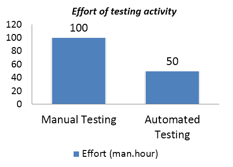
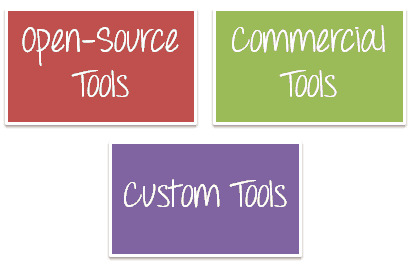
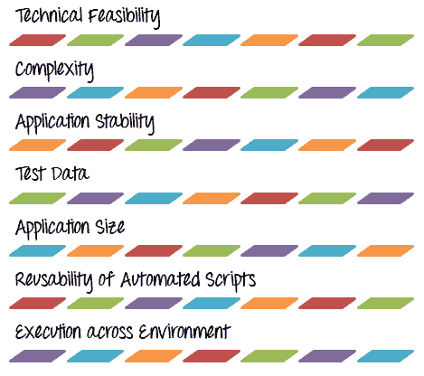
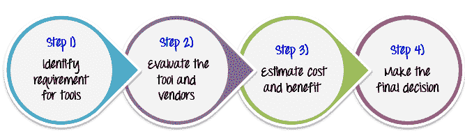
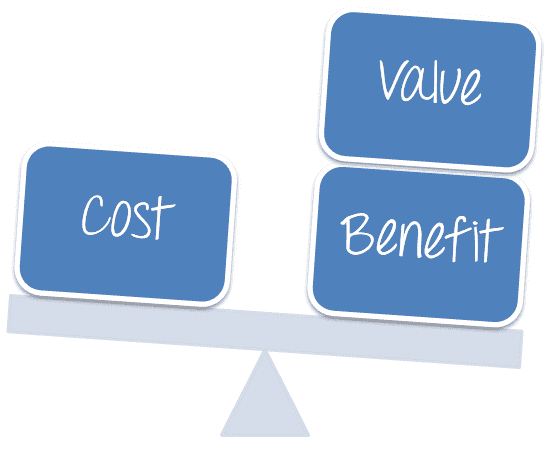
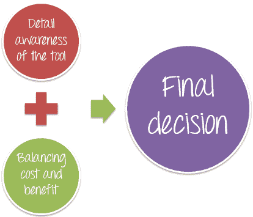

# 如何选择最佳自动化测试工具

> 原文： [https://www.guru99.com/testing-automation-why-right-tools-are-necessary-for-testing-success.html](https://www.guru99.com/testing-automation-why-right-tools-are-necessary-for-testing-success.html)

在文章[测试过程改进](/a-complete-guide-to-test-process-improvement.html)中，您从项目 Guru99 Bank 了解了改进点。 它使用自动[测试](/software-testing.html)代替了[手动测试](/manual-testing.html)。 但是团队成员可能会问您-

这个问题的答案具有挑战性，因为有许多因素需要考虑

*   您想通过软件工具来支持您的测试活动，但是您不知道市场上当前可用的工具
*   哪种类型的工具最适合需求和项目预算？
*   购买该工具后，团队中的谁就有使用该工具的技能

本教程将帮助您回答上述问题

## 选择软件测试工具的重要性

任何测试自动化的成功都取决于确定正确的自动化工具。 为项目选择“正确的”测试工具是实现项目目标的最佳方法之一。 以下示例将向您展示选择测试工具的好处

我们建议 [Ranorex Studio](https://bit.ly/32yW39Y) 作为多合一的测试解决方案，以构建可在浏览器和设备上执行的可靠的台式机，Web 和移动应用程序测试

在项目 Guru99 Bank 中，为了节省测试的精力，项目团队决定使用自动测试工具来执行测试。 经过多次会议之后，您的团队为该项目选择了合适的工具。

一个月后，您从项目团队获得了有关此工具的报告

结果很棒。 新的自动化工具使测试生产率提高了一倍。 这意味着我们节省了 **50％**的测试执行成本

这是在项目中使用测试工具的好处的一个示例。 选择正确的测试工具可帮助您提高项目生产率并节省项目成本。

## 测试工具类型

有很多类型的测试工具，测试经理在选择测试工具时可以考虑使用。

## 开源工具

开源工具是这样的程序，其中源代码**是免费公开的，其源代码由**公开发布，供其原始设计使用和/或修改。****

从[测试用例](/test-case.html)管理到[缺陷](/defect-management-process.html)跟踪，几乎在测试过程的任何阶段都可以使用开源工具。 与商业工具相比，开源工具可能具有较少的功能。

## 商业工具

商业工具是为销售或用于商业目的而生产的软件。

商业工具比开源工具具有更多的支持和来自供应商的更多功能。

## 定制工具

在某些测试项目中，测试环境和测试过程具有特殊的特征。 没有任何开源或商业工具可以满足要求。 因此，测试经理必须考虑开发定制工具。

示例：您想为项目 Guru99 Bank 找到一个测试工具。 您希望该工具满足项目的某些特定要求。

## 自动化可行性分析

回到上面的示例，项目团队决定开发一个可以满足项目要求的自定义工具。 假设已经为他们提供了 100 个测试用例以进行自动化，并且他们估计需要 5 天的时间才能开发出可以自动化所有这些 的工具。

这是他们工作的结果

与上述情况一样，问题在于测试工具无法自动化测试规范的所有测试用例。 这意味着无法使用测试工具对**的所有**应用功能全部进行**彻底的测试。**

如果被测应用程序**的功能频繁更改**或过于复杂，则很难为**所有**应用程序功能创建测试自动化，因为每个工具都有其功能 自己的**局限性**。

如果您不希望出现这种情况，则在选择测试工具之前，您必须分析测试用例，并确定哪些测试用例应该自动化，哪些不应该使用。 这是**自动化可行性分析**活动。

自动化可行性分析是测试的重要贡献者。 在此分析中，您需要检查被测应用程序是否符合**资格**用于自动测试。

您需要考虑的一些因素：

要了解有关这些因素的更多信息，可以使用本文包含的[清单](/images/TestManagement/App_feasibilty_analysis.xls)

## 工具选择过程

要为项目选择最合适的测试工具，测试经理应遵循以下工具选择过程

## 步骤 1）确定工具要求

如果您不知道要寻找什么，如何选择测试工具？

您可以精确地确定您的测试工具要求。 所有要求都必须由项目团队和管理委员会将**记录在案**和**审查中**。

考虑以下示例：

**You want to find the testing tool for the Guru99 Bank project. What do you expect from the tool?**

<input class="eb" name="eb" type="checkbox" value="1"> A) The tool can generate the test cases automatically

<input class="ebno" name="ebno" type="checkbox" value="11"> B) The tool can generate the test result in the desired format

<input class="ebno1" name="ebno1" type="checkbox" value="111"> C) The tester can select which test cases to execute with given set of test data

<input class="ebno2" name="ebno2" type="checkbox" value="1111"> D) The tool can execute the test case automatically

<input class="ebno3" name="ebno3" type="checkbox" value="11111"> E) The tool can judge and perform test output validation and mark test cases pass or fail

<input class="ebno4" name="ebno4" type="checkbox" value="111111"> F) All above the items

**Incorrect**
**Correct**

## 步骤 2）评估工具和供应商

在确定了工具的要求之后，测试经理应该

*   根据项目需求分析市场上可用的商业和开源工具。
*   创建最符合您条件的**工具候选清单**
*   您应该考虑的因素之一是**供应商**。 在做出决定时，您应该考虑供应商的声誉，售后支持，工具更新频率等。
*   通过试用**试用版&并启动试点**来评估工具的质量。 许多供应商经常提供其软件的试用版以供下载。

## 步骤 3）估算成本和收益

为了确保测试工具对企业有利，测试经理必须**平衡**以下因素：

在获取或构建工具之前，应先进行**成本效益分析**

示例：在花费大量时间研究测试工具之后，项目团队为项目 Guru99 Bank 网站找到了理想的测试工具。 评估结果得出结论，该工具可以

*   **两倍**当前测试执行的生产率
*   **将**的管理工作减少 30％

但是，与软件供应商讨论后，您发现此工具的**成本**与**值**和**带来的收益**相比过高 团队合作。

在这种情况下，工具的成本&收益之间的**余额**可能会影响最终决策。

## 步骤 4）做出最终决定

要做出最终决定，测试经理必须具备：

*   对**工具有很高的认识**。 这意味着您必须了解该工具的哪个**强点**和**弱**点
*   **平衡**的成本和收益。

即使花了数小时阅读软件手册和供应商信息，您仍可能需要在实际的工作环境中试用该工具，然后再购买许可证。

您应该与项目团队，顾问开会，以更深入地了解该工具。

您的决定可能会对项目，测试过程和业务目标产生不利影响； 您应该花点时间思考一下。