# 掌握团队管理技能的 5 个步骤

> 原文： [https://www.guru99.com/how-not-knowing-people-skills-blocks-your-success-as-test-manager.html](https://www.guru99.com/how-not-knowing-people-skills-blocks-your-success-as-test-manager.html)

假设您的项目团队发生了严重问题。

您与项目成员的关系不佳。 有时您会忘记自己处于专业环境中，并认为自己是老板，每个人都必须服从您。 尽管似乎没有人对您说任何消极的话，但是您可以肯定他们的想法有所不同，并且开始对项目产生影响。

在这种情况下，您可能会问自己一些问题：

*   **我需要做什么**才能在工作场所扭转局面？
*   我有很多技能，例如：

**尽管有这些技能，但为什么**这些问题在我的项目中出现？

您认为这些技能足以使**成为一名优秀的测试经理吗？ 测试经理还必须具备其他技能，例如**人际交往技能****

在几乎所有工作中，您的人际关系技巧（也称为“ **软技能**”）对成功的影响与管理技巧一样重要。 当您担任管理或领导角色时，尤其如此。

# 什么是人际交往能力？

人际交往能力是使人们能够

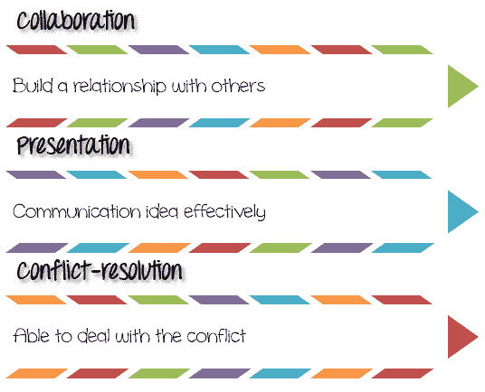

## 人际关系技能的作用

**30％**项目的成功来自诸如[测试](/software-testing.html)技能，开发技能，管理技能等技术技能。 **70％**来自人力资源。 为了管理人力资源，测试经理需要人员技能。 关于管理最重要的是人际交往能力，即我们如何与他人打交道。 对自己和他人的意识可以极大地帮助您处理您负责的工作任务。

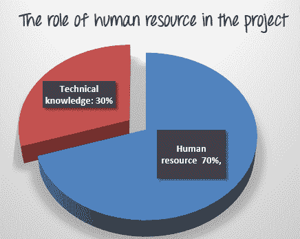

在项目团队中，让我们考虑一下您每天与之互动的成员。

*   你和他们有良好的关系吗？
*   这些关系有麻烦吗？

良好的人际交往技巧可以帮助您

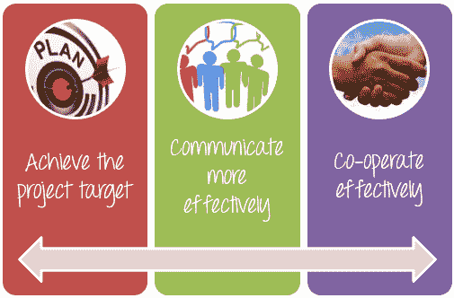

*   **实现项目目标：**人力资源是实现项目目标的最重要因素。 如果您具有良好的人际交往能力，则可以完美地管理人力资源。
*   **更有效地沟通：**良好的人际交往能力可以帮助您有效地表达思想和感情。 此外，您可以从其他人那里得到交流，以适当的方式理解和回应他们。
*   **有效合作：**如果您与他们之间有**不良关系**，您可以管理项目团队吗？ 答案是不可能的。 团队是一群人，而不是个人。 只有团队中的所有成员相互合作并相互理解，才能成为一支强大的团队。

## 如何掌握人际交往能力？

掌握人际交往能力的过程分为以下 5 个步骤-

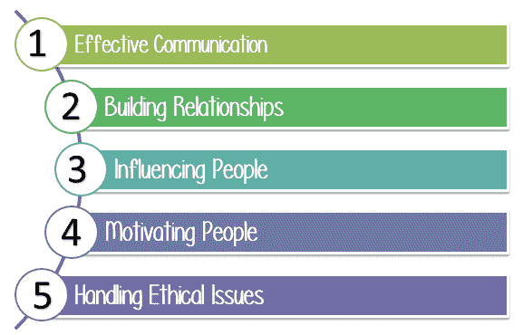

## 步骤 1）有效沟通

作为团队中的最高职位，测试经理必须

*   **发送**，**每天收到来自团队成员的大量消息**和**处理**。
*   **讨论** & **与其他人交换**信息。
*   **向项目团队有效表达**不同的想法。

**有效的**通信远不止上述功能。 这也与理解信息背后的情感有关。 通过从别人那里得到的信息，您可以了解他们的想法，他们对&的反应。

有效的沟通结合了一系列技能，包括

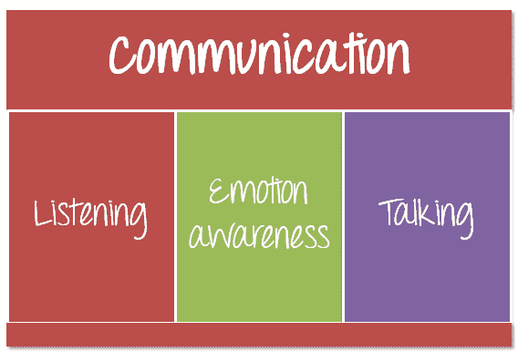

### 步骤 1.1）聆听

听力是有效沟通的最重要方面之一。 成功的聆听不仅意味着理解所要交流的单词或信息，而且还应理解说话者对他们正在交流的感受。

以下示例说明了通信中的监听

您的项目团队有才华横溢的成员。 其中一位团队成员在测试方面拥有非常丰富的经验，并且努力工作。 她总是提出新想法，以提高项目质量。

但是最近，她改变了，变得悲伤，消极，并且在你的背后说了关于你的坏话。

作为测试经理，您必须执行以下操作

*   您的员工可能会告诉您，**停止**交谈并开始**倾听**，并对**耐心**，因为不是每个人都能很好地表达自己的想法
*   不要当老板 以**父母**或**朋友的身份保持**与**的互动。** 即使她对您持消极态度或难以与您交流，您也应该倾听她的声音。
*   **让她感到被人听到和理解**，可以帮助您和您的成员之间建立更牢固，更深入的联系。
*   询问**更多**信息，以确保您听过**整个**故事，因为您需要**了解**她的问题，找出她的想法并解决。

这种情况下的问题是，尽管您**努力工作，有上进心，但您却没有**认可她的贡献。 这件事使她失去了动力。

### 步骤 1.2）情绪意识

成功沟通的秘诀是情感意识。 所有人类**情绪**都会反映在**脸上。** 如果您感到高兴或沮丧，无论您多么努力避免这种情况，其他人都可以通过您的脸看到。

注意并了解他人的情绪，它可以帮助您实现他们的感觉。 将帮助您找出他们的真正担忧并解决。

### 步骤 1.3）交谈

倾听之后，您已经了解了您的员工想要什么，感觉如何。 现在该表达您的想法和想法了。 您需要**谈论**技能。 您所说的**词**，**声音和**您的**肢体语言**代表您的表情。

下图显示了您传达信息的方式

**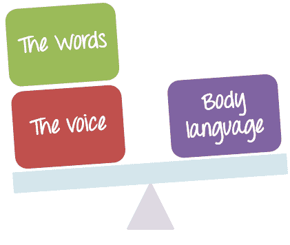** 

*   **单词：**您传达给其他人的消息必须**清楚**，**易于**理解，并且**重点要放在**上。 不要说太多，否则没人会理解你说的话。
*   **语音：**您说的语音大约占我们发送消息的 40％。 音调涉及您使用的**音量**，**级别**和**类型**，您可以交流情绪，以及对所选单词的重视程度。
*   **肢体语言：**肢体语言是**非语言**交流的各种形式，其中，一个人可能会通过自己的身体行为来揭示一些未表达的意图或感觉的线索。 肢体语言包括：

了解肢体语言并了解其含义后，您可以

*   学习更轻松地阅读人
*   与他们进行更有效的沟通。
*   加深您对他人的了解
*   更加了解您传达给他们的消息

**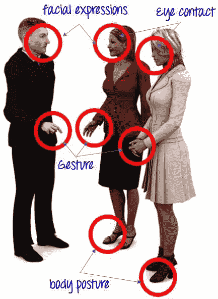** 

通过以下方案了解谈话技巧的重要性

您发现了一个新的解决方案，可以加快项目 Guru99 Bank 的测试执行速度。 您如何说服团队成员使用您的解决方案？

让我们利用您所学的说话技巧向项目团队介绍您的想法

在上面的示例中，通过使用**语音**的正确音调，您将重点放在了要点上。 对特定**单词**（生产率，成本，30％）的强调意味着比单词所说的内容更多的信息。 结合眼睛，手势等**肢体语言**，您成功说服了团队成员使用您的解决方案

## 步骤 2）建立关系

你有没有问过自己一个问题？

*您与团队之间的关系如何？*

参加下面的在线测试，然后单击测试底部的“计算”按钮以评估您的关系

| 先生先生 | 陈述 | 决不 | 很少 | 经常 | 总是 |
| 1 | 我感谢与我一起工作的其他成员 | <input id="cost1" name="1" type="radio" value="0"> | <input id="cost2" name="1" type="radio" value="1"> | <input id="cost3" name="1" type="radio" value="2"> | <input id="cost4" name="1" type="radio" value="3"> |
| 2 | 我主动解决冲突 | <input class="cost" name="2" type="radio" value="0"> | <input class="cost" name="2" type="radio" value="1"> | <input class="cost" name="2" type="radio" value="2"> | <input class="cost" name="2" type="radio" value="3"> |
| 3 | 我积极主动 | <input class="cost" name="3" type="radio" value="0"> | <input class="cost" name="3" type="radio" value="1"> | <input class="cost" name="3" type="radio" value="2"> | <input class="cost" name="3" type="radio" value="3"> |
| 4 | 我会注意并听取其他人的声音，即使他们说了负面的话 | <input class="cost" name="4" type="radio" value="0"> | <input class="cost" name="4" type="radio" value="1"> | <input class="cost" name="4" type="radio" value="2"> | <input class="cost" name="4" type="radio" value="3"> |
| 5 | 我想我是老板！ 每个人都必须服从我 | <input class="cost" name="5" type="radio" value="3"> | <input class="cost" name="5" type="radio" value="2"> | <input class="cost" name="5" type="radio" value="1"> | <input class="cost" name="5" type="radio" value="0"> |

<input id="submit" type="button" value="Calculate">

您可以根据以下分数解释来自我评估您的人际关系

| 

**得分**

 | 

**评估**

 |
| 10-12 | 您与团队成员关系牢固。 您具有领导项目团队成功的潜在能力 |
| 7-9 | 您认识到在工作场所与他人的良好合作很重要，但您的表现却不那么好。 无论如何，您仍然有机会改善关系 |
| 0-6 | 您与团队中的其他人有**不良的**关系。 这是你的弱点。 您必须更加协作才能实现建立关系的目标 |

建立关系是项目团队中的重要因素。 这就是让人们像一样接受**并让**信任**的人，以便他们可以做您需要的事情。**

建立良好关系需要遵循 **3 个步骤**

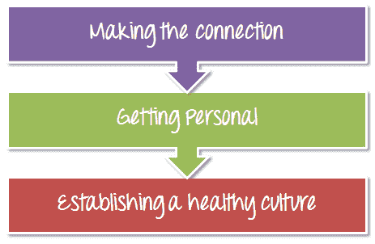

### 步骤 2.1）建立连接

项目团队中有很多人，他们具有特殊的个性和不同的技能。

如果这些具有这种技能和个人能力的人可以作为一个团队进行联系，那么它将建立起牢固的业务关系，强大的信心。 一个人不能做任何事情，但是一群人可以做任何事情。

### 步骤 2.2）变得个人化

建立牢固关系的最好方法之一就是变得个人化。 在讨论项目时，问题通常是与某人交谈，找出与他们个人相关的东西的主要目的，并将关系提升到一个新的水平。

考虑以下情形

您的团队有 2 位才华横溢且经验丰富的成员。 作为测试经理，您还意识到他们的才能，并希望与他们建立良好的**关系**。 但是，您对他们的**个人**，例如他们的家人，他们的爱好……一无所知。

**How can you build the good relationship with them?**

<input class="ebno2" name="ebno2" type="checkbox" value="1">A) It is impossible to build a good relationship without any idea about their personal life

<input class="ebno" name="ebno" type="checkbox" value="11">B) No Problem. I can build a good relationship with them because I am their manager!

<input class="ebno1" name="ebno1" type="checkbox" value="111">C) I don't know how

**Incorrect**
**Correct**

建立牢固关系的最好方法之一是**成为个人**。 在讨论项目时，问题通常是与某人交谈的主要目的，找出与他们有关的个人信息，以使关系更上一层楼。

### 步骤 2.3）建立健康文化

**Answer the following -**

<input class="ebno1" name="ebno1" type="checkbox" value="1"> A) I feel lonely on this team. I cannot work for them anymore

<input class="ebno" name="ebno" type="checkbox" value="11"> B) I am a member of the project team. I have to trust and obey the manager

<input class="ebno2" name="ebno2" type="checkbox" value="111"> C) My project team is like my family. I love them.

**Incorrect**
**Correct**

当一个成员觉得自己是家庭成员时，其他人会尊重他并信任他，他将以极大的动力和最大的努力来工作。

## 第三步：影响人

如果项目团队中的**没有人**倾听并服从您的命令，您该怎么办？ 尽管您是测试经理，但是您对团队成员不再有任何实际影响。

本主题将回答您的问题

*   如何通过增加您的信誉，信任和沟通技巧来影响人们
*   有哪些特征使某些人比其他人更有影响力？

测试经理角色要求您始终影响项目成员。 影响人是-

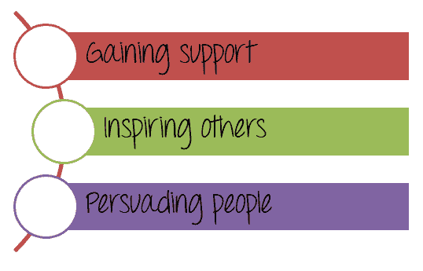

作为具有出色影响力技能的测试经理，您可以轻松地让团队成员做您想做的事情&使您的工作变得轻松。

要成为有影响力的人，您必须：

*   结合人际交往能力，沟通能力，表达能力和聆听能力。
*   适应和修改您的个人风格，改变您与之合作的成员的行为和态度

## 步骤 4）激励人

Guru99 项目非常困难。 截止日期已经到来，但是这个项目还有很多工作要做。 发生了很多问题，例如项目预算削减，人力资源不足。 项目团队正在失去他们的**希望**； 不鼓励他们使用**。**

在这种情况下，您必须**鼓励**他们，给他们 **HOPE** ，并让您的团队知道他们有能力实现自己设定的目标。 这是人们激励的原则

你可能会问一个问题

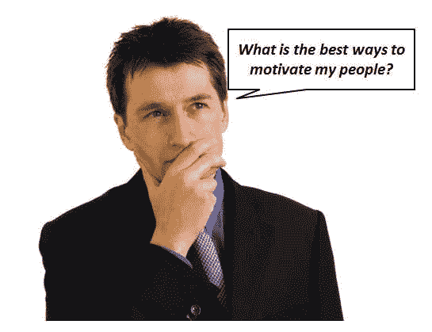

有些人认为金钱和奖金是激励人们的最佳方法。 表现出色的员工获得加薪； 感谢他们的薪水提升成就。

但是，如果公司处境艰难，金钱并不是激励员工的唯一途径。 测试经理应该找出其他激励他的项目成员的方法

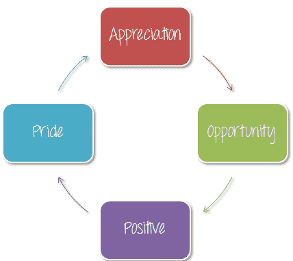

*   **赞赏**：在您的团队中，有些成员表现出色。 作为测试经理，您应该注意他们的出色工作； 向他们表示感谢。
*   **机会：**为高潜力人才提供机会，例如通过领导项目的某些部分来继续学习，发展和发展他们的技能。 让他们有机会证明自己的能力，提高自己的技能。
*   **积极：**总是找到一种创新的方式来保持幸福并以积极的态度让他人工作是激励人们的最佳方法。

这是一些推荐的活动，您应该在 Guru99 Bank 项目中激励团队成员。

*   让人们认为他们不仅是项目团队，而且是**家庭**
*   在团队中营造一种**友好**，**和**以及**有趣的**气氛。
*   向您周围的人表示**尊重**。 即使你是经理； 你必须有同情心，仁慈，谦卑和真诚。
*   **自豪感：**激励员工的最佳方法是找到使自己的技能和知识感到自豪的方法。 始终尊重他人并感谢他们的贡献，这是使他们为自己的工作感到自豪的好方法。

以下示例向您展示了自豪感在激励人们方面的重要性

项目团队的一位成员想提出他关于提高项目质量的想法。 这是测试管理器的两种不同行为。

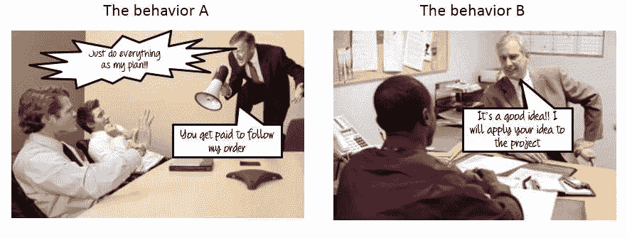

**The behavior which can make the employee proud of their work is the**

<input class="ab" name="ab" type="checkbox" value="1"> The Behavior A

<input class="abno" name="abno" type="checkbox" value="11"> The Behavior B

**Incorrect**
**Correct**

在上述情况下，如果您确实喜欢测试经理 A，则没有人会提出或分享他们的见解和想法。 他们成为被动的追随者，只为自己的薪水工作。

## 步骤 5）处理道德问题

如果您的团队中的某些成员遵循以下规定，您将怎么办？

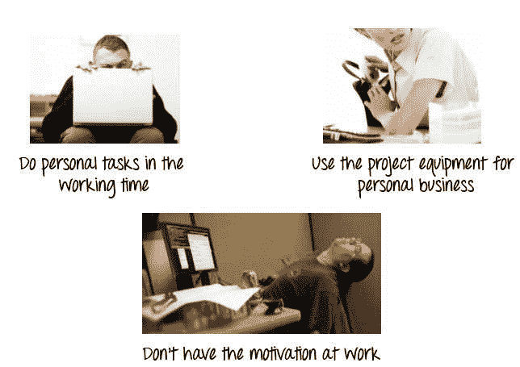

以上案例是工作场所道德问题的例子。 对于任何项目而言，它们都是一个很大的麻烦。

项目团队是一个业务团队。 它有自己的规则，该组中的所有成员都必须遵守此规则。 工作场所中的道德规范很重要，因为它可以创建一个安全且内容丰富的工作环境。

返回项目 Guru99 Bank，如果发生上述情况，您将怎么办？ 以下互动向您展示了一些处理项目中道德问题的建议

**Ethical issue 1 : Team members do personal tasks in their working time**

<input id="submit2" type="button" value="Solution">

**I will create certain guidelines that shoud be followed to make sure no personal work is done during business hours**

**Ethical issue 2 :Team members use project equipment for personal use**

<input id="submit1" type="button" value="Solution">
**I will educate them on general ethical principles, help them to be aware of the importance of work ethics**