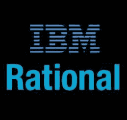
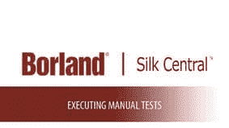

# 最佳 25 种测试管理工具（2020 年 7 月更新）

> 原文： [https://www.guru99.com/top-20-test-management-tools.html](https://www.guru99.com/top-20-test-management-tools.html)

无论是要捕获需求，设计测试用例，测试执行报告，将[测试](/software-testing.html)进度通知其他团队成员，还是必须使用测试管理工具。 记录这些详细信息即使是很小的错误也可能导致灾难性后果和项目失败。 因此，要管理所有这些详细信息，一些测试管理工具会非常方便和有用。 让我们看一些顶级的免费/付费测试管理软件。

### 1）[测试板](https://bit.ly/2RuBFGh)

我们的首选工具是与以下传统选项完全不同的工具。 [Testpad](https://bit.ly/2RuBFGh) 是一种轻量级的测试计划程序，是 DIY 电子表格的完美升级，旨在为您提供足够的过程，而又避免了繁琐的测试用例管理。

**主要功能：**

*   足够简单，任何人都可以使用-无需培训
*   来宾测试员–在需要时提供额外帮助； 客户，经理，市场营销…
*   显而易见的报告：经过测试，需要处理多少时间，“我们准备发布了吗？”
*   基于分层清单的自然测试计划
*   创建灵活的测试，可以在测试过程中快速改进
*   适应您的测试方式：TCM，BDD 或任何探索性

* * *

### 2） [PractiTest](https://bit.ly/2CJ8m8x)

[PractiTest](https://bit.ly/2CJ8m8x) 是一种端到端的测试管理工具。 它是所有 QA 利益相关者的共同聚会场所，可让您全面了解测试过程并更广泛地了解测试结果。

**功能：**

*   大量第三方集成，包括常见的错误跟踪器，自动化工具和其他功能强大的 API。
*   完全可定制的&灵活，可满足质量检查团队不断变化的需求：自定义字段，视图，权限，问题工作流等
*   重用测试并关联不同版本和产品的结果。
*   独特的分层过滤器树-整理所有内容并快速查找任何内容。
*   从不工作两次-包含反错误重复项，排列，步骤参数和测试调用
*   使用高级仪表板和报告可视化数据
*   快速的专业和方法支持

* * *

### 3） [X 射线](https://bit.ly/2Y60ZRn)

[X 射线](https://bit.ly/2Y60ZRn)是质量检查的＃1 手册&自动化测试管理应用程序。 它是功能齐全的工具，可驻留在内部并与 Jira 无缝集成。 其目的是通过有效和高效的测试来帮助公司提高产品质量。

**Features:**

*   需求，测试，缺陷，执行之间的可追溯性
*   定义可重用的前提条件并关联测试
*   组织文件夹和测试集中的测试
*   测试计划以跟踪进度
*   测试环境
*   BDD-在 Jira 中编写黄瓜方案
*   与测试自动化框架（Selenium，JUnit，Nunit，Robot 等）集成
*   内置 REST API
*   CI 集成（Bamboo，Jenkins）
*   内置报告

* * *

### 4） [TestRail](https://bit.ly/2Nlo0wr)

[TestRail](https://bit.ly/2Nlo0wr) 提供全面的测试用例管理，以帮助您组织测试工作并获得有关测试活动的实时见解。 强大的报告和指标使质量检查团队能够提高生产率并提供快速反馈。

**Features:**

*   轻松跟踪各个测试的状态。
*   使用信息丰富的仪表板和活动报告衡量进度
*   比较多个测试运行，配置和里程碑的结果
*   跟踪团队工作量以调整任务和资源
*   高度可定制的，具有基于云或本地的安装选项
*   与缺陷跟踪和协作解决方案集成，例如 Atlassian Jira，FogBugz，Bugzilla，Axosoft，GitHub 和 TFS； 并使用领先的测试自动化工具，包括 Ranorex Studio。

* * *

### 5） [TestMonitor](https://bit.ly/2LENXZh)

[TestMonitor](https://bit.ly/2LENXZh) 是每个组织的端到端测试管理工具。 一种简单，直观的测试方法。 无论您是要实施企业软件，用户验收测试（UAT），需要进行质量检查，构建高质量的应用程序，还是只需要在测试项目中提供帮助，TestMonitor 都可以满足您的要求。

**功能**

*   需求和基于风险的测试。
*   先进的测试用例设计能够支持数千个案例。
*   具有多测试运行和里程碑克隆功能的强大计划工具。
*   全面的结果跟踪。
*   集成的问题管理。
*   具有许多过滤器和可视化选项的智能报告。
*   革命性的简单 UI。
*   具有 Jira，DevOps 和 Slack 的第三方集成。 包括 REST API。
*   快速响应时间的专业支持。

* * *

### 6） [TestCaseLab](https://bit.ly/2WrTd6H)

TestCaseLab =强大的测试用例管理=有组织的测试=更高质量的产品

[TestCaseLab](https://bit.ly/2WrTd6H) 允许您关注大多数测试活动：创建测试用例，对它们进行分类，将它们收集到测试计划中并开始测试运行，向 Jira 报告结果等。最便宜的计划从$ 40 /每月起，共 500 个 测试用例，您无需为每个用户支付额外费用！ 获得 30 天的免费试用并进行检查。

**Key features:**

*   无限的用户和项目
*   进出口
*   与以下设备集成：Jira，Redmine，Pivotal Tracker，Asana，YouTrack，Trello
*   各种测试用例属性
*   测试计划/要求
*   测试运行+分配用户

* * *

### 7） [HipTest](https://bit.ly/2OOET1V)

[Hiptest](https://bit.ly/2OOET1V) 是敏捷团队和 DevOps 团队的连续测试平台，它使团队可以就一个想法进行协作，连续测试代码并从实时洞察中生成实时文档。 Hiptest 在 140 个国家/地区中有 25,000 多名用户使用。

**Features:**

*   本地 BDD 支持可协调您的团队并简化产品的工作流程和实时文档
*   通过支持 20 多个框架的选择来使您的测试自动化，这些框架包括：Cucumber，Specflow，Java / Junit，Selenium 等！
*   CI / CD 管道与 Jenkins，Bamboo，TravisCI，Shippable 等工具的集成
*   场景编辑器，可重复使用的步骤以及易于重构的测试，可轻松创建测试
*   免费的快速，专业的支持以及专业的客户成功团队

* * *

### 8） [Qase](https://bit.ly/36xm8Ii)

[Qase](https://bit.ly/36xm8Ii) 是基于云的现代测试管理工具，专为 QA 和开发团队设计，具有简洁直观的用户界面。 免费使用，不受项目，测试用例或测试运行的任何限制。 对所有用户的高级支持。

**Features:**

*   将您的测试用例和套件组织到分层树中
*   共享步骤减少了测试用例编写的时间
*   进行测试运行的智能向导将促进您的测试过程
*   制定测试计划并将测试用例分配给您的队友
*   Jira，Redmine，Youtrack，GitHub 和 Slack 集成
*   Rest API 进行交互，并通过 Webhooks 获得通知
*   测试用例的自定义字段
*   UI 主题（包括 Night 主题）

* * *

### 9）[音高](https://bit.ly/2YstKIG)

**[吉拉](https://bit.ly/2YstKIG)** 的需求和测试管理将整个软件项目引入 Atlassian 套件中。 该应用程序可以计划需求，编写测试用例并将其添加到测试计划中，跟踪测试执行并报告 Jira 实例内部的缺陷。

**功能和优势：**

*   内置需求管理
*   对敏捷流程和 Jira 本机功能的可靠支持
*   具有每个模块的文件夹和子文件夹的树状视图
*   所有应用程序元素之间的透明关系
*   从收集需求到创建缺陷的简化流程
*   用户友好的报告，用于最佳进度跟踪：可追溯性矩阵，需求覆盖率，测试执行和测试用例执行（可用用户仪表板）
*   轻松，即插即用的配置
*   从外部工具轻松迁移测试用例

* * *

10.  #### IBM Rational 质量经理

IBM Rational Quality Manger 可以用于自动化，以加快项目进度并报告度量标准，以制定明智的发布决策。 它可以用于跟踪在线测试管理，维护简单的在线库，跟踪工程发布，客户发布等。它独立于平台，可以有效地管理质量检查项目

[IBM Rational Quality Manager](http://www-03.ibm.com/software/products/en/ratiqualmana)

* * *

11.  #### HP-ALM 质量中心

HP QC 是最常用的测试管理软件。 它具有许多方面必需的所有功能。 它是提供可靠跟踪和报告的高端工具之一。 ALM 还可以连接电子邮件系统，并将任何更改发送给期望的团队成员。

[HP-ALM 质量中心](http://www8.hp.com/in/en/software-solutions/quality-center-quality-management/index.html)

* * *

12.  #### 测试链接

它是一个开源的基于 Web 的测试管理工具。 该工具包括计划，报告，测试规范，计划，报告和需求跟踪。 为了跟踪项目的进度，可以使用报告和图表，同时附加功能包括分配关键字，指定需求和事件日志。

TestLink 的重要功能包括

*   图表支持
*   指标支持
*   测试创建和执行
*   友好的用户界面
*   缺陷记录

[TestLink](http://sourceforge.net/projects/testlink/)

* * *

13.  #### XQual

它旨在避免由于测试管理效率低下而导致的测试中常见的错误，例如错误，滑动和回归。 它提供了对存储在 MySQL 中的数据的集成管理，并允许安排和运行全自动或手动测试活动。 它可以与所有持续集成平台集成。

[XQual](https://www.xqual.com/products/xstudio.html)

* * *

14.  #### TestLodge

测试小屋提供了四个基本方面，即测试计划，需求，测试套件&用例和测试运行。 它具有管理测试用例所需的一切，同时可以轻松快速地生成测试计划。 Testlodge 可以与您现有的问题跟踪工具集成在一起，以允许在测试用例失败时自动创建故障单和缺陷报告。

[TestLodge](http://www.testlodge.com/)

* * *

15.  #### 宝兰丝绸中心

Silk Central 允许您将所有测试资产统一到一个易于使用的计划，跟踪，报告和执行中心。 使用 Silk Central，很容易重现他们发现的问题。

Borland Silk Central 的主要特点

*   使用 TestBook 洞悉测试执行
*   创建订阅并根据您的计划生成报告
*   它允许测试人员通过在测试时发布评论来共享评论并提出问题，这些评论可以直接发送到 TestBook

[Borland Silk Central](http://www.borland.com/Products/Software-Testing/Test-Management/Silk-Central)

* * *

16.  #### Testuff

Testuff 不受限制-可以报告和管理无限的测试，测试人员，项目和缺陷。 它是高度安全的，并具有完整的备份环境。 在 testtuff 中，可以按项目，分支和分层套件来组织测试。 它还允许从 [Excel](/excel-tutorials.html) 表导入和导出数据。

Testtuff 的主要特点

*   与任何数量的错误跟踪器集成
*   使用 Twitter 集成与团队沟通
*   将视频附加到缺陷报告
*   将测试分配给特定的测试人员
*   共享的步骤
*   使用多个实验室进行测试周期计划

[Testuff](http://www.testuff.com/product/)

* * *

17.  #### 双子座

使用 Gemini，测试人员可以将他们的工作与开发团队和客户事件联系起来。 复杂的问题可以分解为可管理的项目，没有项目限制。 可以将项目分配给多个团队成员，也可以将任何数量的报告自动发送给任何用户或组。 您可以订阅任何人到 Gemini，以接收与产品有关的通知。

**Gemini 主要功能**

*   应用框架
*   进出口设施
*   测试运行记录

[双子座](https://www.countersoft.com/solutions/test-management/)

* * *

18.  #### BugZilla Testopia

Testopia 是 Bugzilla 的测试管理扩展。 它用于跟踪测试用例。 您还可以跟踪各个质量检查团队每周进行的测试或基于发布的测试的进度。 Testopia 允许您创建自己的测试用例，测试报告并进行测试运行。 由于它具有所有测试用例的相关缺陷的历史记录，因此可以帮助 QA 成员加快 QA 流程。

**睾丸的主要特征**

*   测试用例和结果可以导出到 CSV 文件
*   大量错误修复
*   使用最新的 Extjs 3.0 库
*   为个别案例设定优先顺序
*   支持 XML 导出和导入测试计划和子级
*   与 Bugzilla 元素有关
*   在错误和测试用例之间建立联系

[Bugzilla Testopia](https://developer.mozilla.org/en-US/docs/Mozilla/Bugzilla/Testopia)

* * *

19.  #### 健身

Fitnesse 是一个测试框架，允许测试人员，开发人员和客户协作以在 Wiki 上创建测试用例。 该工具既是测试工具，也是文档工具，使测试人员，客户和程序员能够以独立于平台的方式创建测试用例。 Fitnesse 在几乎所有编程语言和环境下都能很好地工作。

[Fitnesse](http://www.fitnesse.org/)

* * *

20.  #### 涡轮增压涡轮

RTH-Turbo 是 RTH 测试管理工具的扩展。 它允许需求管理，缺陷跟踪，测试用例管理，创建测试计划并分析测试结果。 该工具最初基于 HP / Mercury 的 TestDirector。

RTH-Turbo 的主要特点

*   测试用例/测试套件编写
*   需求管理工具
*   解除关联的要求
*   支持将此工具与任何测试自动化工具（如 Load Runner 或 Win Runner）集成

[RTH 涡轮](http://sourceforge.net/projects/rth-turbo/)

* * *

21.  #### 铁

Stryka 是企业级的测试管理工具，可在台式机，手机和智能手表上使用。 Stryka 的主要功能是

*   无需安装。 这是一个 SaSS 工具。
*   适应任何测试方法。 支持敏捷测试和持续交付环境
*   强大的指标，报告和排行榜
*   需求管理，缺陷管理&手动/自动执行测试全部合为一体。
*   所有利益相关者之间的轻松协作
*   与流行的测试工具（如 Selenium，Jira，Rally 等）轻松集成。

eBay，百事可乐，Verizon，沃达丰和其他世界 500 强公司都使用 Stryka。

[了解有关 Stryka](http://www.plutora.com/products/stryka-test-management-software) 的更多信息

除了所有这些测试管理和质量检查工具，其他工具很少，但功能有限。 这些工具大多数仅提供测试用例管理，而错误跟踪则可以通过外部工具进行集成。

*   [VersionOne](http://www.versionone.com/product/agile-test-management/) ：它是针对敏捷项目的商业产品。 它具有测试管理模块以及计划，报告和其他功能
*   [Aptest](http://www.aptest.com/atm2/) ：它具有所有可能的功能，一看一下测试管理工具
*   [Spiratest](https://www.inflectra.com/SpiraTest/Default.aspx) ：此商用工具与自动化和单元测试框架集成在一起，在单个工具中包含所有 QA 功能
*   [测试波](http://www.testwave.co.uk/)：它也是一种商业产品，但不需要安装。 该工具使您可以从 excel 表格中导入您已经存在的需求/测试资产。
*   [Tosca](http://www.tricentis.com/tricentis-tosca-testsuite/) ：Tricentis Tosca Testsuite 是有效的企业端到端测试套件

### 常问问题

## 💻 What is a Test Management Tool?

测试管理工具用于存储有关如何进行测试的信息，计划特定的测试活动以及报告质量保证活动的完整状态。

## ⚡如何选择测试管理工具？

选择工具之前，应考虑以下因素

1.  **预算：**首先，根据预算选择您的工具。
2.  **生产率：**测试管理工具应能够通过专注于关键领域（例如测试信息的粒度，发布管理跟踪和报告）来提高整体生产率。
3.  **敏捷，DevOps，连续：**展望当前趋势和需求，测试管理工具必须支持敏捷，DevOps，连续测试
4.  **外部集成：**需要测试管理工具中的自动化测试结果，您的测试管理工具必须支持自动化和持续集成
5.  **Mobile：**测试管理工具中的 Mobile 支持非常有帮助
6.  **支持：**最好的测试管理工具应具有支持功能，例如实时聊天，电话，FAQ，提高服务台票证等。

## ✔️测试用例管理工具的优点是什么？

这里是使用测试用例管理工具的好处：

*   捕获要求
*   设计测试用例
*   创建测试执行报告
*   测试计划以跟踪进度
*   通过信息丰富的仪表板和活动报告帮助您评估进度

## 💻 What is a Test Management Tool?

Test management tools are used to store information on how testing is to be done, plan specific testing activities, and report the complete status of quality assurance activities.

Test management tools are used to store information on how testing is to be done, plan specific testing activities, and report the complete status of quality assurance activities.

Test management tools are used to store information on how testing is to be done, plan specific testing activities, and report the complete status of quality assurance activities.

## ⚡ How to choose a Test Management Tool?

You should consider the following factors before selecting a tool

1.  **预算：**首先，根据预算选择您的工具。
2.  **生产率：**测试管理工具应能够通过专注于关键领域（例如测试信息的粒度，发布管理跟踪和报告）来提高整体生产率。
3.  **敏捷，DevOps，连续：**展望当前趋势和需求，测试管理工具必须支持敏捷，DevOps，连续测试
4.  **外部集成：**需要测试管理工具中的自动化测试结果，您的测试管理工具必须支持自动化和持续集成
5.  **Mobile：**测试管理工具中的 Mobile 支持非常有帮助
6.  **支持：**最好的测试管理工具应具有支持功能，例如实时聊天，电话，FAQ，提高服务台票证等。

You should consider the following factors before selecting a tool

1.  **预算：**首先，根据预算选择您的工具。
2.  **生产率：**测试管理工具应能够通过专注于关键领域（例如测试信息的粒度，发布管理跟踪和报告）来提高整体生产率。
3.  **敏捷，DevOps，连续：**展望当前趋势和需求，测试管理工具必须支持敏捷，DevOps，连续测试
4.  **外部集成：**需要测试管理工具中的自动化测试结果，您的测试管理工具必须支持自动化和持续集成
5.  **Mobile：**测试管理工具中的 Mobile 支持非常有帮助
6.  **支持：**最好的测试管理工具应具有支持功能，例如实时聊天，电话，FAQ，提高服务台票证等。

You should consider the following factors before selecting a tool

1.  **预算：**首先，根据预算选择您的工具。
2.  **生产率：**测试管理工具应能够通过专注于关键领域（例如测试信息的粒度，发布管理跟踪和报告）来提高整体生产率。
3.  **敏捷，DevOps，连续：**展望当前趋势和需求，测试管理工具必须支持敏捷，DevOps，连续测试
4.  **外部集成：**需要测试管理工具中的自动化测试结果，您的测试管理工具必须支持自动化和持续集成
5.  **Mobile：**测试管理工具中的 Mobile 支持非常有帮助
6.  **支持：**最好的测试管理工具应具有支持功能，例如实时聊天，电话，FAQ，提高服务台票证等。

## ✔️ What are the advantages of a Test Case Management Tool?

Here, are benefits of using a Test Case Management Tool:

*   捕获要求
*   设计测试用例
*   创建测试执行报告
*   测试计划以跟踪进度
*   通过信息丰富的仪表板和活动报告帮助您评估进度

Here, are benefits of using a Test Case Management Tool:

*   捕获要求
*   设计测试用例
*   创建测试执行报告
*   测试计划以跟踪进度
*   通过信息丰富的仪表板和活动报告帮助您评估进度

Here, are benefits of using a Test Case Management Tool:

*   捕获要求
*   设计测试用例
*   创建测试执行报告
*   测试计划以跟踪进度
*   通过信息丰富的仪表板和活动报告帮助您评估进度