# TestLink 教程：完整指南

> 原文： [https://www.guru99.com/testlink-tutorial-complete-guide.html](https://www.guru99.com/testlink-tutorial-complete-guide.html)

### 什么是 TestLink？

Test-link 是最广泛使用的基于 Web 的开源测试管理工具。 它将需求规范和测试规范同步在一起。 用户可以使用此工具创建测试项目并记录测试用例。 使用 Test-Link，您可以为多个用户创建一个帐户，并分配不同的用户角色。 管理员用户可以管理测试用例分配任务。

它支持自动执行和手动执行测试用例。 测试人员可以使用此工具在短时间内生成[测试计划](/what-everybody-ought-to-know-about-test-planing.html)和测试报告。 它支持各种格式的测试报告，例如 Excel，MS word 和 HTML 格式。 除此之外，它还支持与许多流行的[缺陷](/defect-management-process.html)跟踪系统集成，例如 JIRA，MANTIS，BUGZILLA，TRAC 等。由于它是一个基于 Web 的工具，因此多个用户可以同时使用 他们的凭据和分配的角色。

在本教程中，我们将学习

*   [什么是 TestLink？](#11)
*   [TestLink](#12) 的优势
*   [登录到 TestLink](#13)
*   [创建测试项目](#14)
*   [创建测试计划](#15)
*   [构建创建](#16)
*   [创建测试套件](#17)
*   [创建测试用例](#18)
*   [将测试用例分配给测试计划](#19)
*   [在 TestLink](#21) 中创建用户并分配角色
*   [写作要求：](#22)
*   [执行测试用例](#23)
*   [生成测试报告](#24)
*   [导出测试用例/测试套件](#25)
*   [导入测试用例/测试套件](#26)

## TestLink 的优势

*   它支持多个项目
*   轻松导出和导入测试用例
*   易于与许多缺陷管理工具集成
*   通过 XML-RPC 自动执行测试用例
*   使用版本，关键字，测试用例 ID 和版本轻松过滤测试用例
*   易于将测试用例分配给多个用户
*   易于生成各种格式的测试计划和测试报告
*   向多个用户提供凭据并为其分配角色

## 登录到 TestLink

**步骤 1：**打开 Testlink 主页并输入登录详细信息

1.  输入用户 ID –管理员
2.  输入密码
3.  点击登录标签

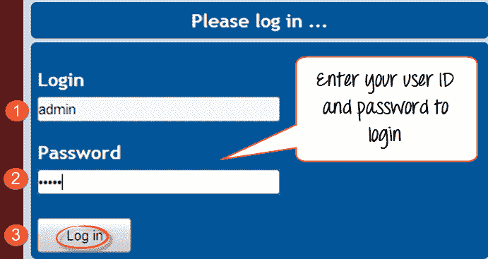

## 创建测试项目

**步骤 1：**在主窗口中，单击“测试项目管理”，它将打开另一个窗口

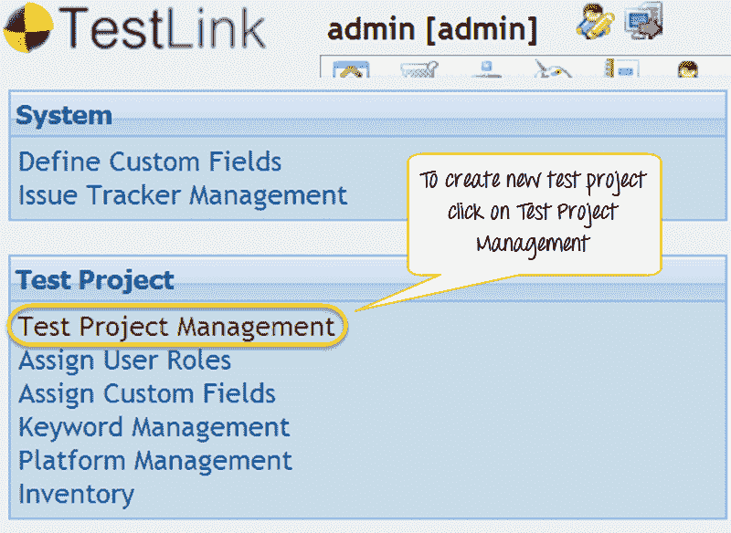

**步骤 2：**单击选项卡“创建”创建一个新项目。

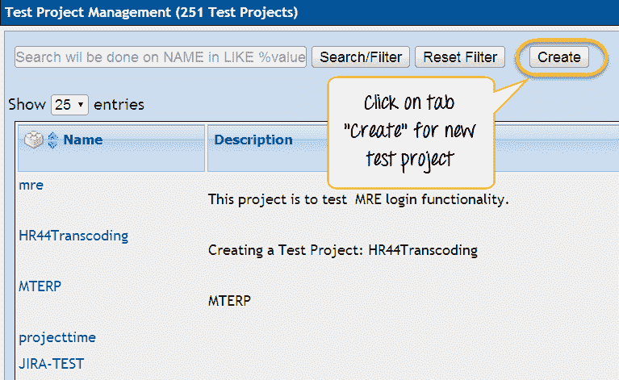

**步骤 3：**在窗口中输入所有必填字段，例如测试项目的类别，项目名称，前缀，描述等。填写所有必要的详细信息后，在 窗口的尽头。

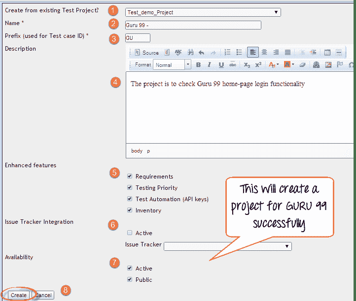

这将成功创建您的项目“ Guru99”。

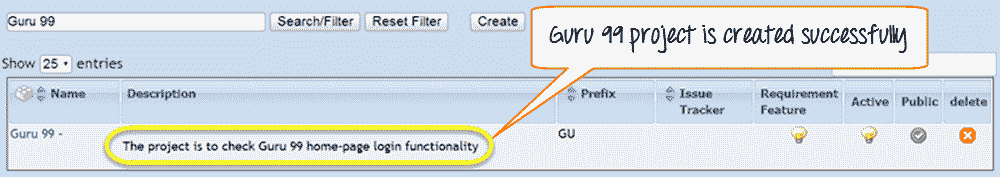

## 创建测试计划

测试计划包含完整的信息，例如软件测试范围，里程碑，测试套件和测试用例。 创建测试项目后，下一步就是创建测试计划。

**步骤 1：**从主页上，单击主页上的“测试计划管理”

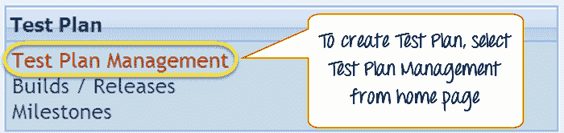

**步骤 2** ：它将打开另一个页面，在页面底部单击选项卡“创建”

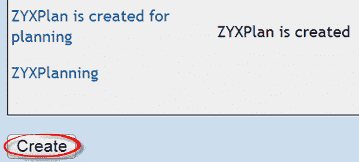

**步骤 3** ：在打开的窗口中填写所有必要的信息，例如名称，描述，根据现有测试计划创建等，然后单击“创建选项卡”

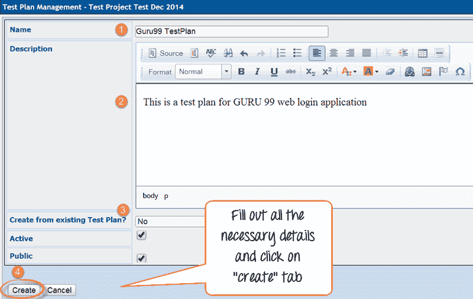

**步骤 4：** Guru 99 测试计划已成功创建

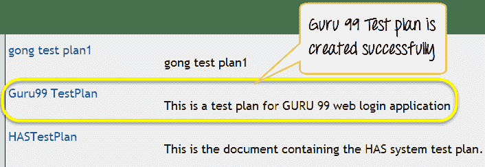

## 构建创建

构建是软件的特定发行版

**步骤 1：**从主页上的“测试计划”下单击“构建/发布”

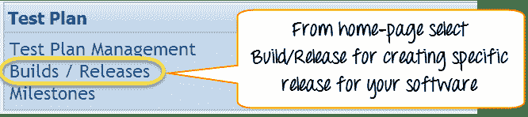

**步骤 2：**在下一个窗口中，填写软件版本的所有必要详细信息，然后单击“创建”以保存您的版本

1.  输入标题名称
2.  输入有关软件版本的描述
3.  将复选框标记为状态-有效
4.  标记状态复选框-打开
5.  选择发布日期
6.  单击创建按钮

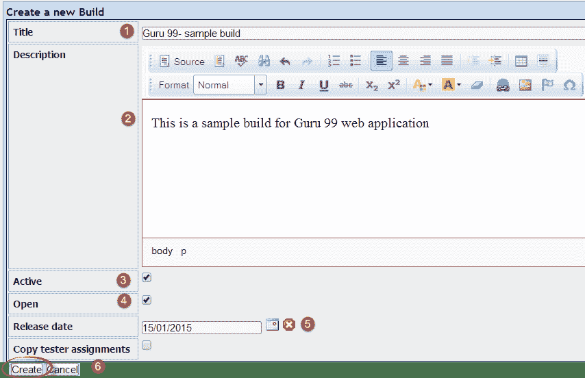

发布软件后，它将显示如下

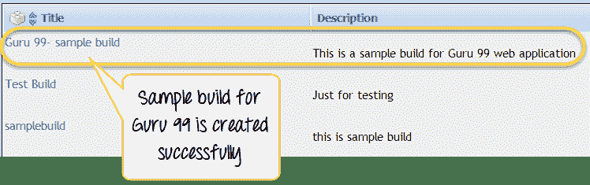

## 创建测试套件

测试套件是可能正在测试或验证同一组件的测试用例的集合。 以下步骤将说明如何为您的项目创建测试套件。

**步骤 1：**从主页上单击测试规范选项。

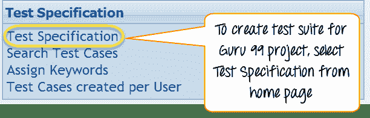

**步骤 2：**在面板的右侧，单击设置图标 **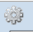 。** 将显示一系列测试操作。

**步骤 3：**单击测试套件的“创建”标签

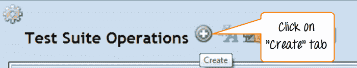

**步骤 4：**填写测试套件的所有详细信息，然后单击“保存”选项卡。

1.  输入测试套件名称
2.  输入有关您的测试套件的详细信息
3.  单击保存按钮以保存测试套件的详细信息

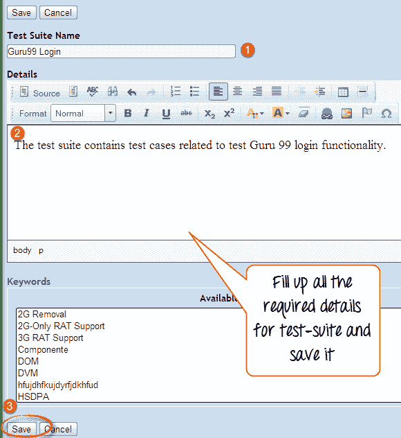

您可以看到针对 Guru 99 的测试套件已创建

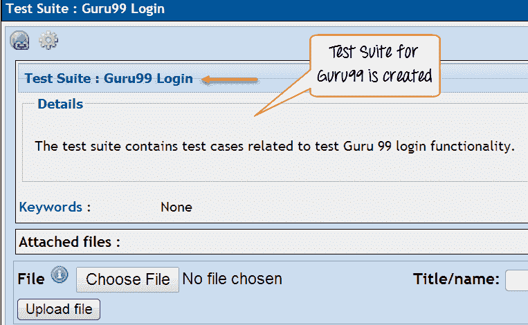

您的测试套件显示在面板左侧的文件夹结构树下

## 创建测试用例

测试用例包含一系列测试步骤，以测试具有预期结果的特定方案。 以下步骤将说明如何与测试步骤一起创建测试用例。

**步骤 1** ：在面板左侧的文件夹树结构下，单击测试套件文件夹

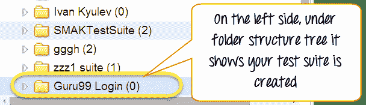

**步骤 2：**单击右侧面板中的设置图标。 测试用例操作列表将显示在右侧面板上

**步骤 3：**将打开新窗口，要创建测试用例，请在测试用例操作中单击创建按钮

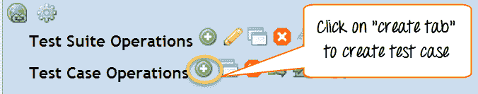

**步骤 4：**在测试用例规范页面中输入详细信息

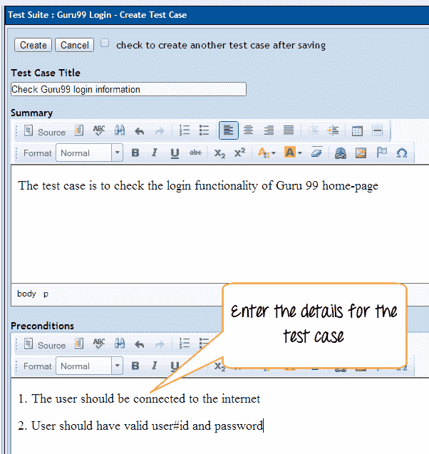

**步骤 5：**输入详细信息后，单击“创建”按钮以保存详细信息。 Guru99 的测试用例已成功创建

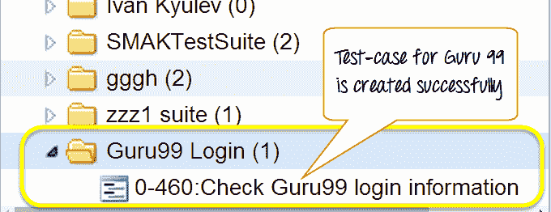

**步骤 6：**从文件夹中单击测试用例，如上所示，它将打开一个窗口。 在测试用例中单击“创建步骤”按钮。 它将打开一个测试用例步骤编辑器

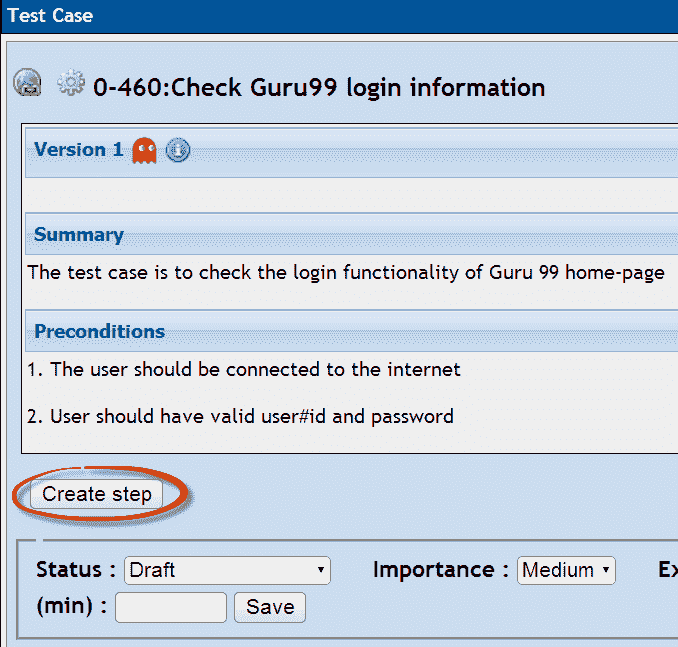

**步骤 7）**它将在同一页面上打开另一个窗口，在该窗口中，您必须输入以下详细信息

1.  输入测试用例的步骤
2.  输入有关步骤操作的详细信息
3.  单击保存并添加另一个步骤操作，或者如果没有更多测试步骤要添加，请单击保存并退出选项卡

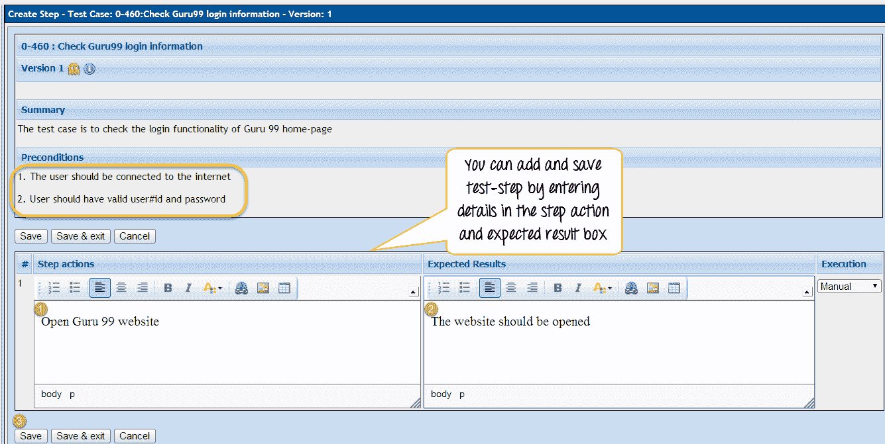

**步骤 8）**保存并退出测试步骤后，它将显示如下

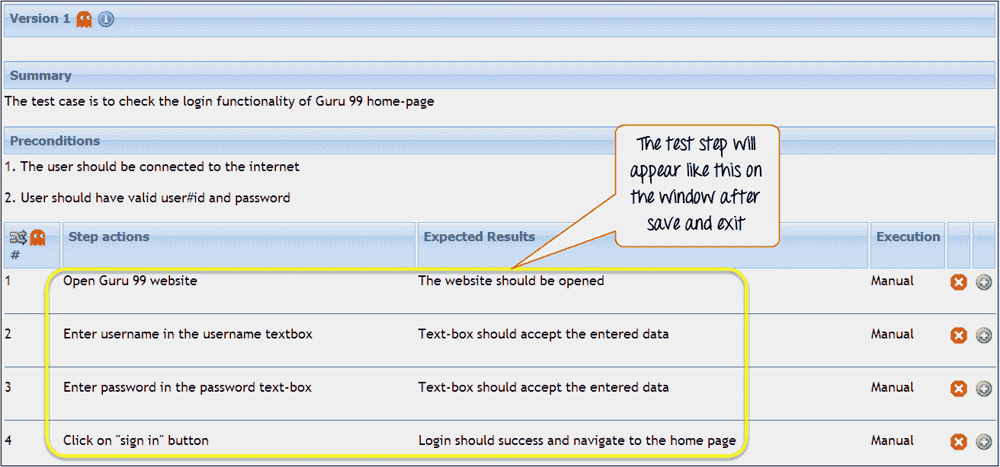

## 将测试用例分配给测试计划

为了使测试用例得以执行，应将其分配给测试计划。 在这里，我们将看到如何为测试计划分配测试用例。

**步骤 1）**单击测试面板上的设置图标  。 它将显示操作列表。

**步骤 2）**单击“添加到测试计划”

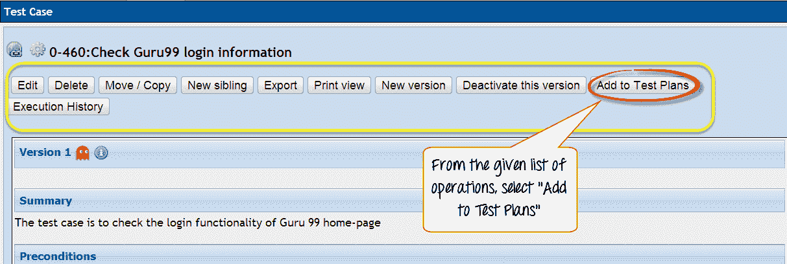

**步骤 3）**将打开新窗口，搜索您的项目“ Guru99”

1.  根据您的测试计划标记该复选框
2.  点击添加按钮

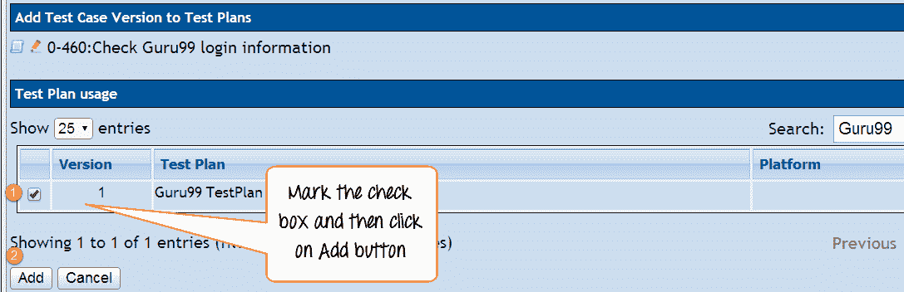

这会将您的测试用例添加到您的测试计划中。

## 在 TestLink 中创建用户并分配角色

Testlink 提供用户管理和授权功能。

以下是 Testlink 中的默认角色及其权限的列表-

<colgroup><col style="width: 208px;"><col style="width: 208px;"><col style="width: 208px;"></colgroup>
| **角色** | **测试用例** | **测试指标** |
| 客人 | 视图 | View |
| 测试仪 | 执行 | View |
| 高级测试员 | 编辑&执行 | View |
| 主管&管理员 | Edit & Execute | Edit & Execute |

**步骤 1：**在 Testlinks 主页上，单击导航栏中的“用户/角色”图标

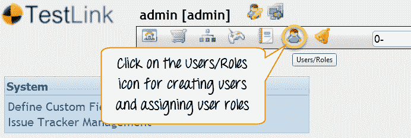

**步骤 2：**点击创建

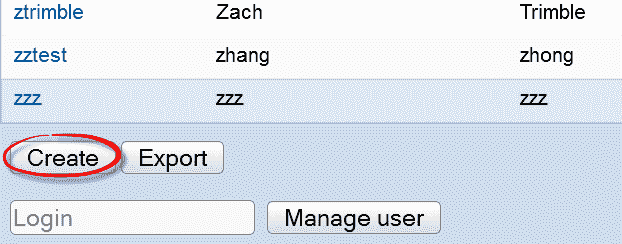

**步骤 3** ：填写所有用户详细信息，然后单击“保存”按钮

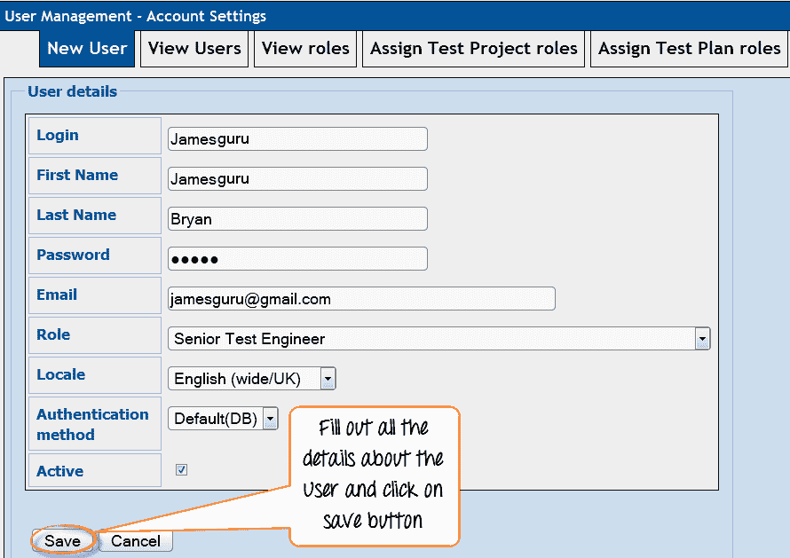

在列表中，我们可以看到已经创建了用户

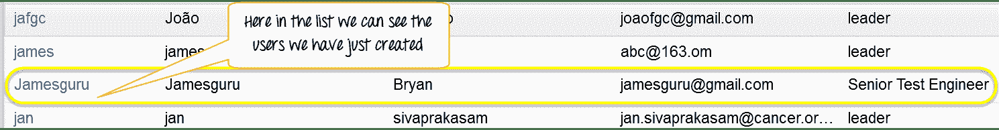

**步骤 4** ：将测试项目角色分配给用户，

1.  单击**“分配测试项目角色”** 选项卡
2.  选择项目名称
3.  Select the user role from the drop down 

    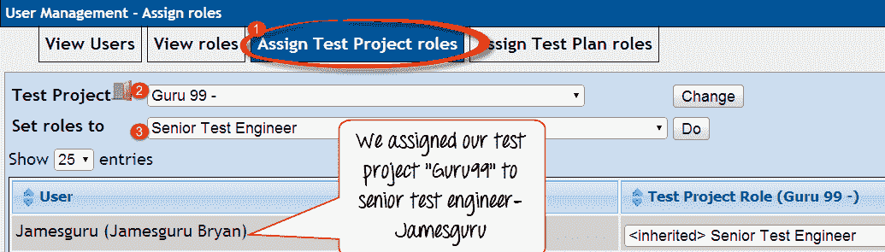

## 写作要求：

**步骤 1：**从导航栏中选择“需求链接”，它会打开“需求”页面。

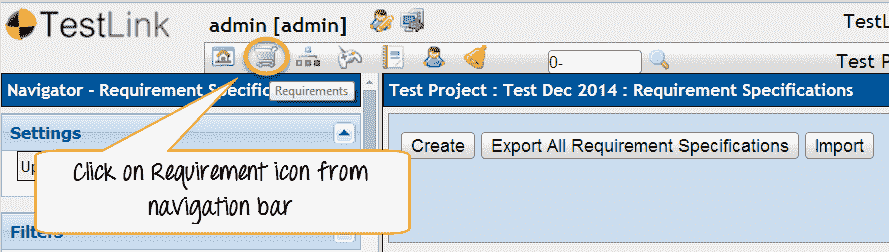

**步骤 2** ：在需求页面的面板右侧，单击“创建”按钮

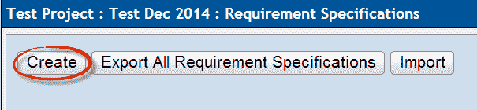

**步骤 3** ：将打开一个新窗口，输入所有详细信息，例如

1.  文件编号
2.  标题名称
3.  要求说明
4.  然后点击“保存”按钮

对于类型，您可以从下拉菜单中选择选项-在这里我们选择了**“用户需求规范”**

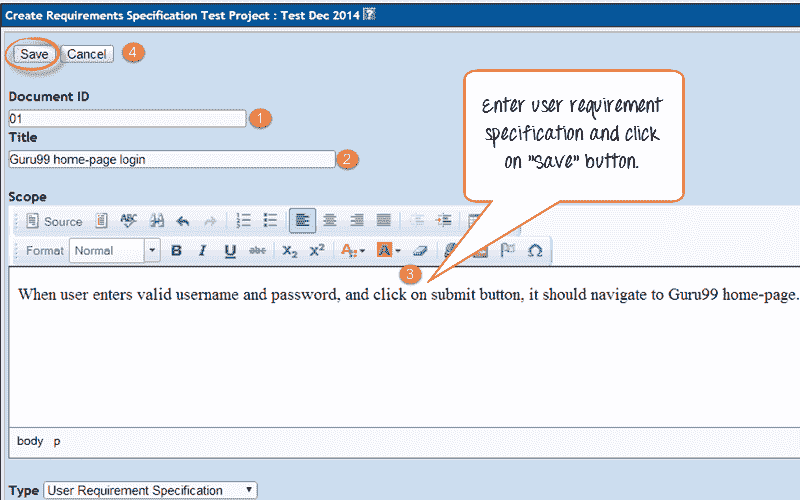

**步骤 4** ：它应该创建需求规范，并显示在项目“ Guru99”下的左侧面板上。

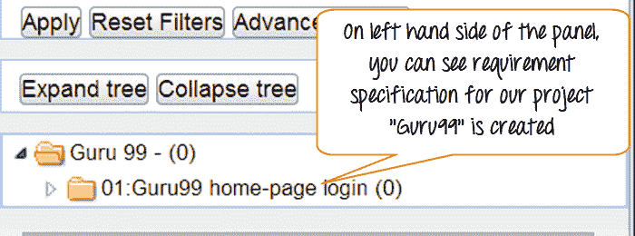

**步骤 5** ：从需求规格主页中选择设置按钮。 它将打开另一个窗口。

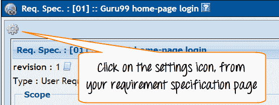

**步骤 5：**单击“需求操作”下的“创建”选项卡。

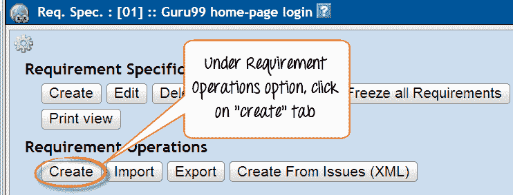

**步骤 6** ：填写所有指定的详细信息，然后单击“保存”按钮

1.  输入文件编号
2.  输入标题名称
3.  输入描述
4.  输入状态-是否处于草稿，返工，审核，不可测试等状态。在这里，我们选择有效
5.  输入类型-用户界面，非功能，信息，功能等。在这里我们选择用例
6.  输入所需的测试用例数
7.  最后输入“保存”按钮

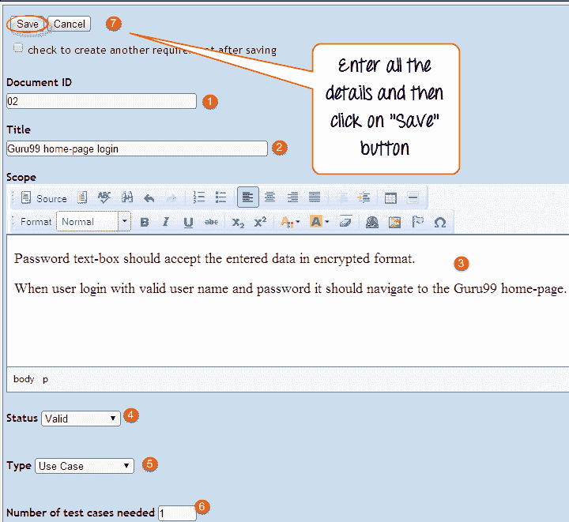

**注意：**要添加更多要求，可以标记复选框并单击“保存”按钮

在面板的左侧，我们可以看到已添加了需求。

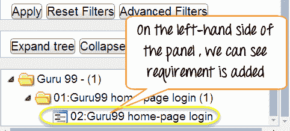

**将需求分配给测试用例**

在 Testlink 中，可以将需求连接到测试用例。 为了根据需求跟踪测试范围，这是非常关键的功能。 在测试报告中，您可以验证未涵盖哪些要求**，并对其进行操作** **以在测试套件中附加**，以最大程度地覆盖测试

**步骤 1：**从测试规范部分打开任何单个测试用例，然后单击需求图标

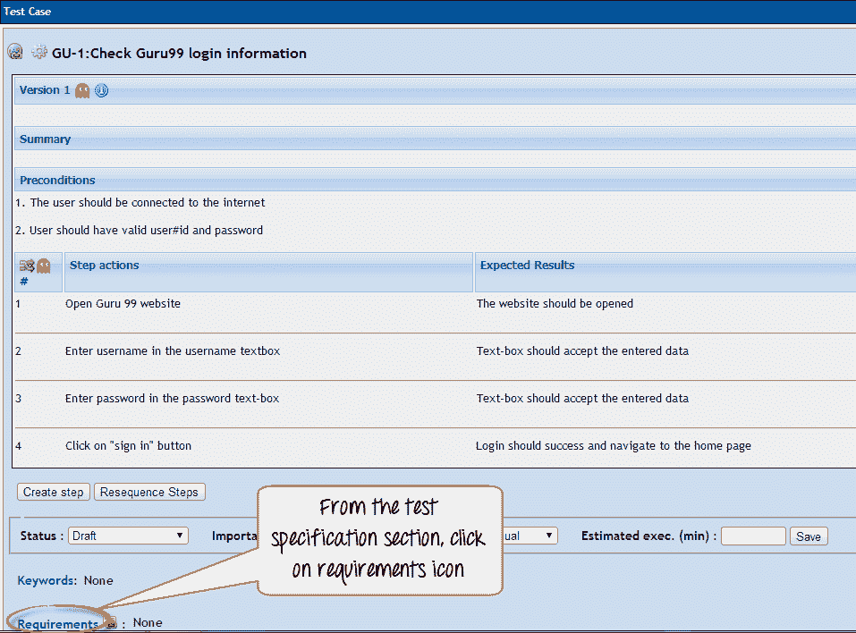

**步骤 2：**要将需求规范分配给测试用例，您必须遵循以下步骤

1.  滚动下拉框以选择需求规格
2.  标记需求复选框
3.  点击“分配”标签

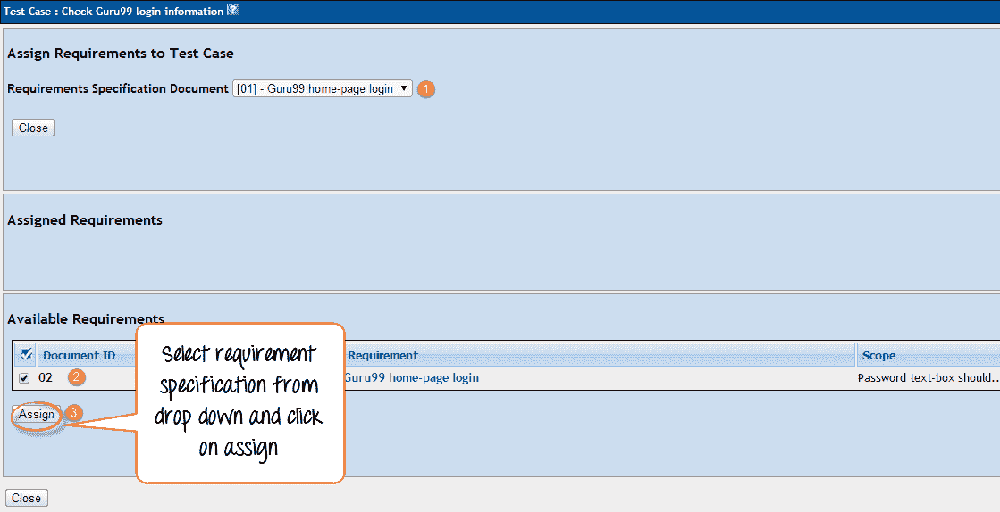

单击“分配”选项卡后，将出现一个窗口，指出“分配的要求”。

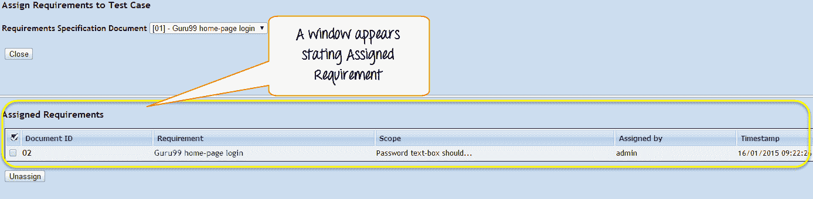

## 执行测试用例

在 TestLink 中，我们可以运行测试用例并更改测试用例的执行状态。 可以将测试用例**的状态设置为**为“已阻止”，“通过”，**或**为“失败”。 最初，**它将处于“不运行”** 状态，但是一旦您**进行了**更新后，便无法再次将其更改为“不运行”状态。

**步骤 1：**从导航栏中，单击“测试执行”链接。 它会将您定向到“测试执行面板”。

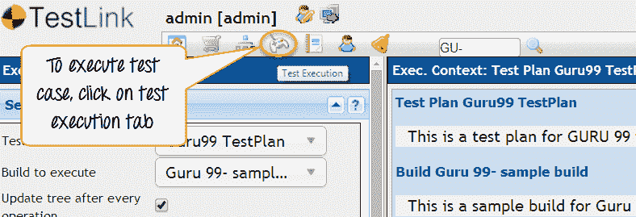

**步骤 2：**从左侧面板中选择要运行的测试用例

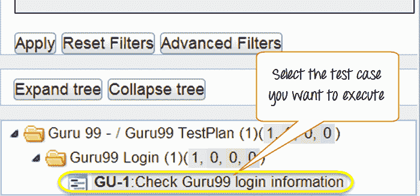

**步骤 3** ：选择测试用例后，将打开一个窗口。

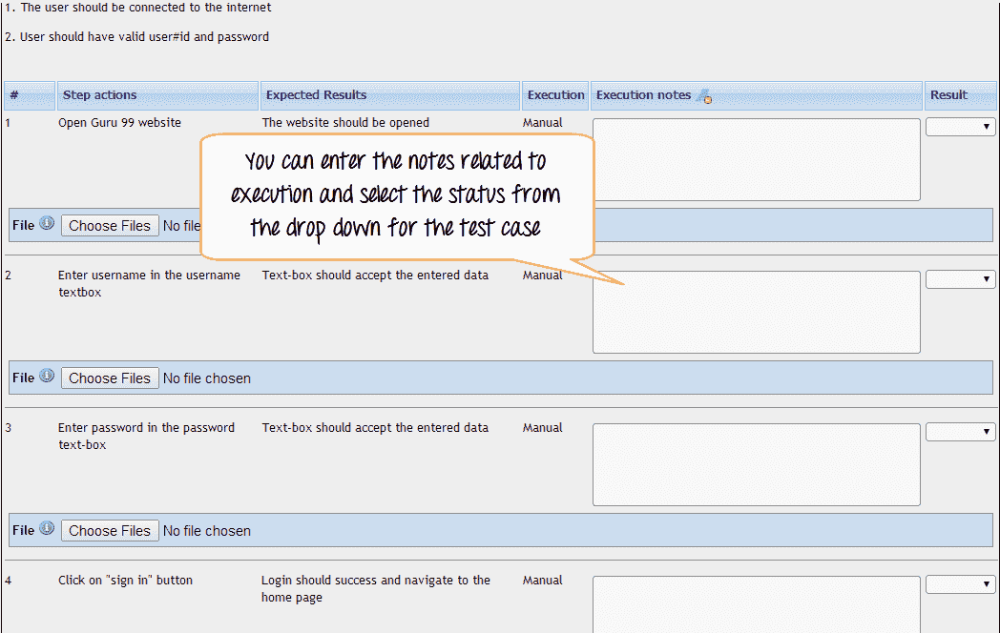

**步骤 4** ：请执行以下步骤

1.  输入与执行的测试用例相关的注释
2.  选择其状态

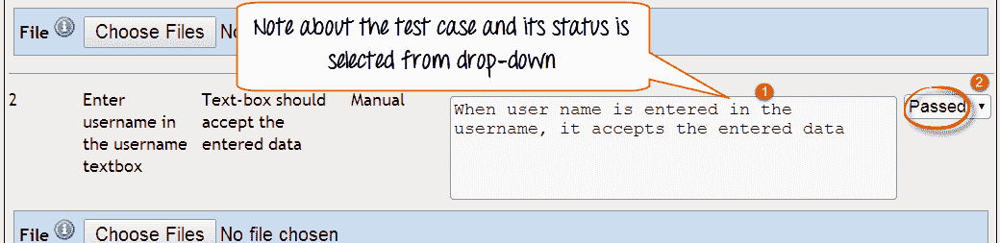

**步骤 5：**在同一页面上，您必须填写有关测试用例执行的类似详细信息。 填写详细信息，选择状态，然后单击“保存执行”。

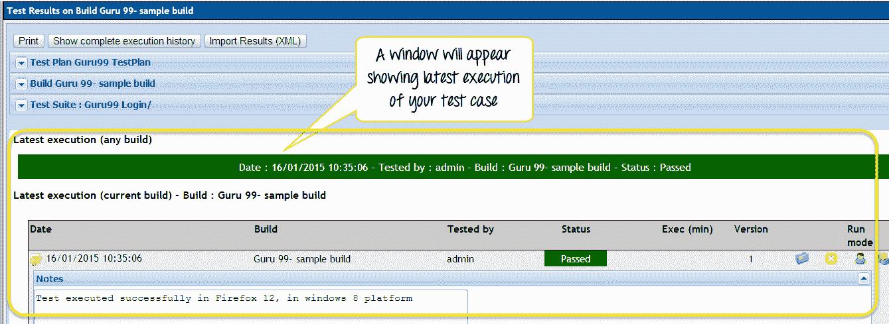

## 生成测试报告

测试链接支持各种测试报告格式，例如

*   的 HTML
*   MS Word
*   微软 Excel
*   OpenOffice 作家
*   OpenOffice Calc

**步骤 1** ：从导航栏中，单击“测试报告”选项

**步骤 2** ：从左侧面板中，选择“测试报告”链接

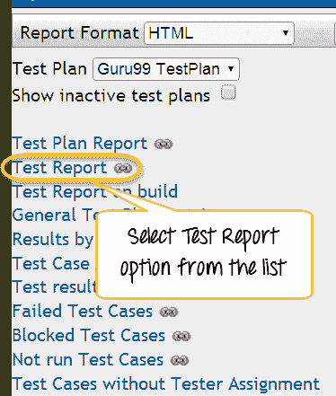

**步骤 3** ：要生成报告，请执行以下步骤

1.  标记和取消标记要在测试报告中突出显示的选项
2.  单击您的项目文件夹

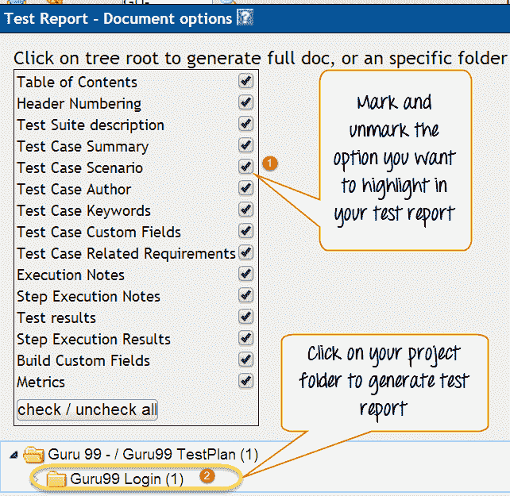

测试报告将如下所示

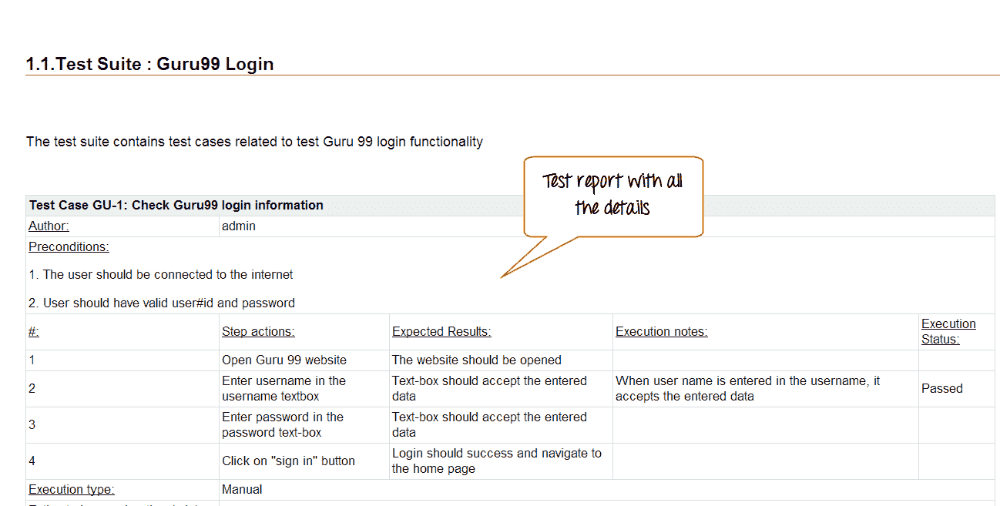

## 导出测试用例/测试套件

Testlink 提供了在 Testlink 中导出测试项目/测试套件的功能，然后您可以将它们导入到不同服务器或系统上的另一个 Testlink 项目中。 为此，您必须遵循以下步骤

**步骤 1：**在“测试规范”页面中选择要导出的测试用例

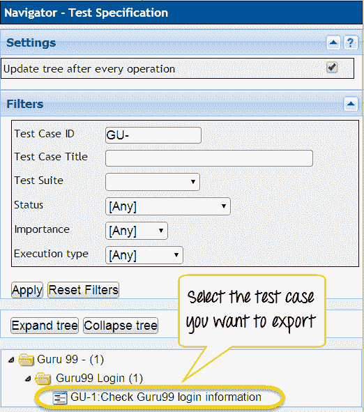

**步骤 2** ：现在，在面板右侧单击  设置图标，它将显示可在测试用例上执行的所有操作。

**步骤 3** ：单击**“导出”** 按钮

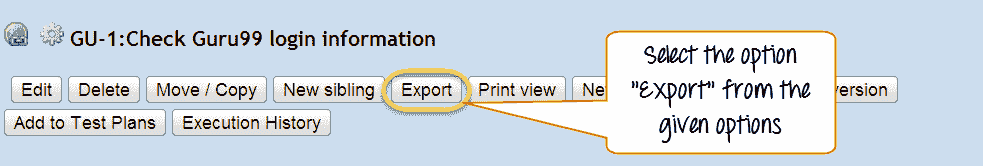

**步骤 4：**将打开另一个窗口，根据要求标记选项，然后单击“导出”选项卡

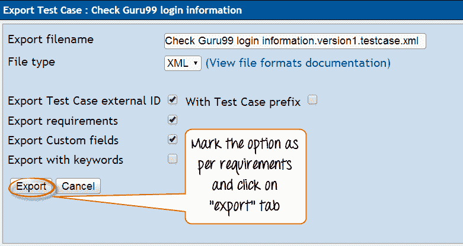

生成以下 XML

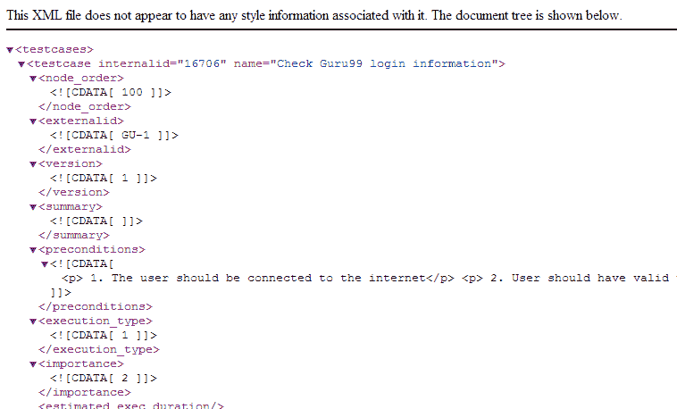

## 导入测试用例/测试套件

**步骤 1** ：选择要在其中导入测试用例的“测试套件”文件夹

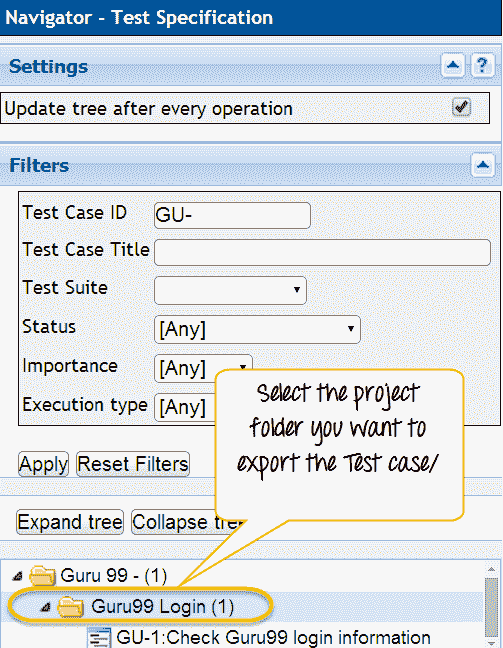

**步骤 2：**单击面板右侧的设置图标  ，它将显示可在测试套件/测试上执行的所有操作 案件

**步骤 3：**在测试用例操作列表中单击导入按钮，如下所示：

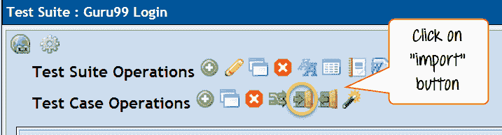

**步骤 4：**浏览并附加从测试链接中导出的 XML 测试用例文件，然后单击上载按钮。

1.  使用浏览选项来附加从 testlink 导出的 XML 测试用例文件
2.  点击上传文件

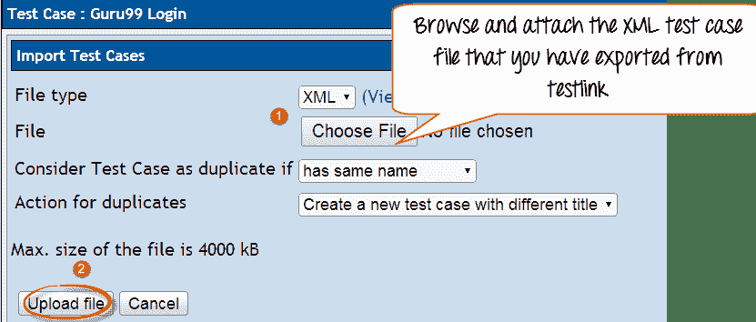

上传文件时，它将打开一个窗口，说明导入测试用例

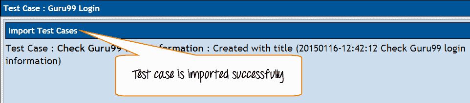

**步骤 5：**测试用例将被上传并显示在面板的右侧

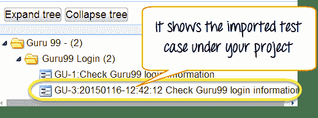

### 摘要：

在本教程中，我们涵盖了 TestLink 的各个方面-例如如何使用 Testlink-作为测试管理。 它逐步解释了如何管理项目的测试计划，如何创建用户并相应地为其分配角色，甚至如何将测试用例导入或导出到项目。 在本教程中还很好地演示了其他有用的功能，如生成报告，定义需求等。