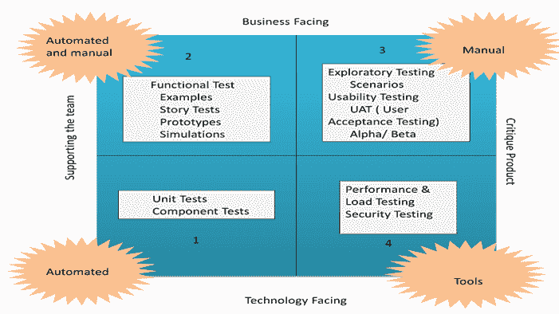

# 什么是敏捷测试？ 流程，策略，测试计划，生命周期示例

> 原文： [https://www.guru99.com/agile-testing-a-beginner-s-guide.html](https://www.guru99.com/agile-testing-a-beginner-s-guide.html)

## 什么是敏捷测试？

**敏捷测试**是遵循敏捷软件开发规则和原则的测试实践。 与瀑布方法不同，敏捷测试可以在项目开始时就开始进行，而开发和测试之间会不断进行集成。 敏捷测试不是顺序的（从某种意义上说，它仅在编码阶段之后才执行），而是连续的。

在本文中，我们将讨论

*   [敏捷性测试计划。](#1)
*   [敏捷测试策略。](#2)
*   [敏捷测试象限。](#3)
*   [敏捷软件开发的质量保证挑战。](#4)
*   [敏捷过程中的自动化风险。](#5)

### 敏捷性测试计划

与瀑布模型不同，在敏捷模型中，针对每个发行版编写并更新测试计划。 敏捷测试计划包括在该迭代中完成的测试类型，例如测试数据需求，基础架构，测试环境和测试结果。 敏捷的典型测试计划包括

1.  测试范围
2.  正在测试的新功能
3.  基于功能复杂性的测试级别或类型
4.  负载和性能测试
5.  基础设施注意事项
6.  缓解或风险计划
7.  资源配置
8.  可交付成果和里程碑

### 敏捷测试策略

敏捷测试生命周期涵盖四个阶段

**（a）** **迭代 0**

在第一阶段或迭代 0 中，您执行初始设置任务。 它包括确定要测试的人员，安装测试工具，安排资源（可用性测试实验室）等。在迭代 0 中设置了以下步骤来实现

a）为项目建立业务案例

b）确定边界条件和项目范围

c）概述将推动设计权衡的关键要求和用例

d）概述一个或多个候选架构

e）识别风险

f）成本估算并准备初步项目

**（b）** **构造迭代**

测试的第二阶段是构造迭代，大部分测试在此阶段进行。 该阶段被视为一组迭代以建立解决方案的增量。 为了做到这一点，在每次迭代中，**团队都将[XP]，XP，Scrum，敏捷建模和敏捷数据等各种实践结合在一起**。

在构造迭代中，敏捷团队遵循优先级的需求实践：在每次迭代中，他们都会提取工作项堆栈中剩余的最重要的需求并加以实施。

施工迭代分为确认测试和调查测试两种。 **确认性测试集中在**上，以验证系统是否满足团队迄今所描述的利益相关者的意图，并由团队执行。 当调查性测试检测到确认小组已跳过或忽略的问题时。 在调查测试中，测试人员以缺陷案例的形式确定潜在的问题。 调查测试处理常见问题，例如集成测试，负载/压力测试和安全测试。

再次，对于确认性测试，有两个方面**开发人员测试**和**敏捷接受测试** **。 两者**都是自动化的，可以在整个生命周期中进行连续回归测试。 确认性测试是与规范测试敏捷等效的方法。

敏捷验收测试是作为开发团队的传统功能测试和传统验收测试的结合，利益相关者正在共同努力。 开发人员测试是传统单元测试和传统服务集成测试的混合。 开发人员测试将验证应用程序代码和数据库架构。

**（c）** **发行结束游戏或过渡阶段**

“发布，结束游戏”的目标是成功地将系统部署到生产中。 在此阶段的活动包括对最终用户，支持人员和操作人员的培训。 此外，它还包括产品发布的市场营销，备份&还原，系统定稿和用户文档。

最后的测试阶段包括完整的系统测试和验收测试。 为了完成最后的测试阶段而没有任何障碍，您应该在产品迭代过程中对产品进行更严格的测试。 在最终游戏中，测试人员将研究其缺陷故事。

**（d）** **产量**

在发布阶段之后，产品将进入生产阶段。

### 敏捷测试象限

敏捷测试象限将整个过程分为四个象限，并有助于了解如何执行敏捷测试。

a）**敏捷象限 I** –内部代码质量是此象限的主要重点，它由技术驱动并为支持团队而实施的测试用例组成，其中包括

1.单元测试

2.组件测试

b）**敏捷象限 II** –它**包含**测试用例，这些测试用例是**业务驱动的，并已实施**以支持团队。 本象限关注需求。 在此阶段执行的测试类型是

1.测试可能的场景和工作流的示例

2.测试用户体验，例如原型

3.配对测试

c）**敏捷象限 III** –该象限向第一和第二象限提供反馈。 测试用例可以用作执行自动化测试的基础。 在此象限中，进行了许多轮迭代审核，从而建立了对产品的信心。 在该象限中完成的测试类型是

1.可用性测试

2.探索性测试

3.与客户配对测试

4.协同测试

5.用户验收测试

d）**敏捷象限 IV** – **该象限将**集中于非功能性要求，例如性能，安全性，稳定性等。借助该象限，可以使应用程序交付 非功能性质量和期望值。

1.非功能测试，例如压力和性能测试

2.关于**身份验证**和黑客的安全测试

3.基础架构测试

4.数据迁移测试

5.可伸缩性测试

6.负载测试

### 敏捷软件开发的质量保证挑战

a）错误的可能性更大，因为文档的优先级降低，最终给质量检查团队带来更大的压力

b）快速引入了新功能，这减少了测试团队用于确定最新功能是否符合要求并真正解决了商务问题的可用时间

c）测试人员通常需要扮演半开发人员的角色

d）测试执行周期被高度压缩

e）很少时间准备测试计划

f）对于回归测试，他们将有最少的时间

g）他们的角色从成为质量关守的角色转变为成为质量合作伙伴的角色

h）需求变更和更新是敏捷方法所固有的，成为质量检查的最大挑战

### 敏捷过程中的自动化风险

*   自动化的 UI 提供了很高的置信度，但是它们执行速度慢，易维护且构建成本高。 除非测试人员知道如何进行测试，否则自动化可能不会显着提高测试效率
*   不可靠的测试是自动化测试中的主要问题。 修复失败的测试并解决与脆性测试相关的问题应是当务之急，以避免误报
*   如果自动测试是手动启动的，而不是通过 CI（连续集成）启动的，则可能会导致它们无法正常运行，因此可能导致测试失败
*   自动化测试不能替代探索性的手动测试。 为了获得预期的产品质量，需要混合测试类型和级别
*   许多可商购的自动化工具提供了简单的功能，例如自动化手动测试用例的捕获和重放。 这种工具鼓励通过 UI 进行测试，并导致固有的脆弱性和难以维护的测试。 另外，将测试用例存储在版本控制系统之外会产生不必要的复杂性
*   为了节省时间，很多时候自动化测试计划的计划不当或计划外，都会导致测试失败
*   通常在测试自动化过程中会错过测试设置和拆卸程序，而执行手动测试时，测试设置和拆卸程序听起来是无缝的
*   诸如每天创建或执行的多个测试用例之类的生产率指标可能会产生极大的误导，并可能导致对运行无用测试的大量投资
*   敏捷自动化团队的成员必须是有效的顾问：平易近人，合作且足智多谋，否则该系统将很快失效
*   自动化可能会提出并提供测试解决方案，这些解决方案相对于所提供的价值而言需要过多的持续维护
*   自动化测试可能缺乏构思和交付有效解决方案的专业知识
*   自动化测试可能是如此成功，以至于用尽了重要的问题来解决，因此变成了不重要的问题。

### 结论

敏捷测试包括在软件开发生命周期中尽早进行测试。 它一经推出，就需要高度的客户参与和测试代码。 该代码应足够稳定以进行系统测试。 可以进行广泛的回归测试以确保错误已得到修复和测试。 主要是，团队之间的沟通使敏捷测试成功！！！