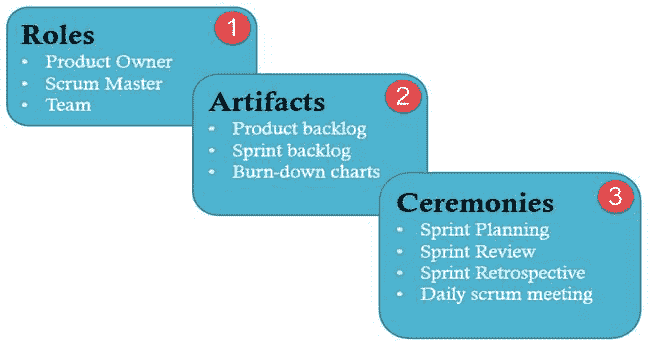
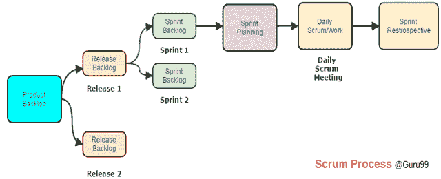
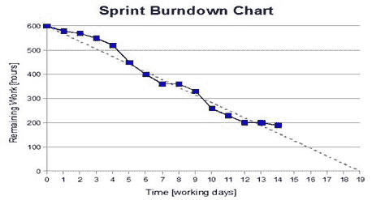

# Scrum 测试方法论教程：什么是流程，工件，冲刺

> 原文： [https://www.guru99.com/scrum-testing-beginner-guide.html](https://www.guru99.com/scrum-testing-beginner-guide.html)

## 什么是 Scrum？

构建复杂的软件应用程序是一项艰巨的任务。 Scrum 方法是执行此类复杂任务的解决方案。 它可以帮助开发团队专注于产品的各个方面，例如质量，性能，可用性等。

## 什么是 Scrum 测试？

**SCRUM TESTING** 是用 Scrum 方法进行的测试，目的是验证软件应用程序是否满足要求。 Scrum 测试还涉及检查非功能性参数，例如安全性，可用性，性能等。在 Scrum 流程中，Tester 并未发挥积极作用。 通常，测试是由开发人员通过单元测试进行的。 有些 Scrum 项目确实有专门的测试团队，具体取决于项目的性质&。

在本教程中，您将学习-

*   [什么是 Scrum？](#1)
*   [Scrum 方法论的主要特征](#2)
*   [在 Scrum](#3) 中的角色
*   [Scrum 伪像](#4)
*   Scrum 中的[仪式（进程）](#5)
*   [测试人员在 Scrum](#6) 中的作用
*   [测试 Scrum 中的活动](#7)
*   [测试报告](#8)

## Scrum 方法论的主要特征

以下是 Scrum 的主要功能-

*   Scrum 具有较短的固定发布周期时间表，其可调范围称为**冲刺**，可以满足快速变化的开发需求。 每个版本可以有多个冲刺。 每个 Scrum 项目可以有多个发布周期。
*   **会议，事件和里程碑**的重复序列
*   一种测试和实施新要求的实践，称为**故事**，以确保在每次冲刺后都能发布一些工作

Scrum 基于以下 3 个支柱-

让我们一一看

### 1\. Scrum 中的角色

Scrum 测试中有三个主要角色-产品所有者，Scrum 主管和开发团队。 让我们详细研究一下

<colgroup><col style="width: 208px;"><col style="width: 208px;"><col style="width: 208px;"></colgroup>
| 

产品拥有者

 | 

Scrum 大师

 | 

团队

 |
| 

*   他/她定义了产品的功能。

 | 

*   他/她管理团队并照顾团队的生产力

 | 

*   团队通常只有 5-9 名成员

 |
| 

*   产品负责人确定发布日期和相应功能

 | 

*   他/她维护黑名单并消除开发过程中的障碍

 | 

*   它包括开发人员，设计师，有时还包括测试人员等。

 |
| 

*   他们根据产品的市场价值和获利能力确定功能的优先级

 | 

*   他/她协调所有角色和功能

 | 

*   团队自行组织和安排工作

 |
| 

*   他/她负责产品的获利能力

 | 

*   他/她保护团队免受外界干扰

 | 

*   有权在项目范围内做所有事情以达到冲刺目标

 |
| 

*   他/她可以接受或拒绝工作项目结果

 | 

*   邀请参加每日 Scrum，冲刺审查和计划会议

 | 

*   积极参加日常活动

 |

### 2\. Scrum 工件

Scrum 过程包括

*   **用户案例：**它们是对被测系统功能的简短说明。 保险提供商的示例是–“可以使用在线系统支付保费。”
*   **产品待办事项列表：**它是为 Scrum 产品捕获的用户故事的集合。 **产品所有者准备**并维护产品积压。 它由产品所有者确定优先级，任何人都可以在产品所有者批准的情况下将其添加。
*   **版本积压：**版本是一个时间范围，其中迭代次数已完成。 **产品所有者与 Scrum 负责人协调**，以决定发布应针对哪些故事。 发行积压中的故事旨在在发行中完成。
*   **冲刺：**由产品所有者和开发人员团队决定，完成用户故事的时间是固定的，通常是 2-4 周。
*   **Sprint 待办事项列表：**这是一组需要在 sprint 中完成的用户案例。 在 sprint 积压期间，永远不会分配工作，团队会自行签约工作。 它由团队拥有和管理，而估计的剩余工作每天更新。 这是必须在 Sprint 中执行的任务列表
*   **阻止列表：**这是 Scrum 管理员拥有并每日更新的阻止和未作决定的列表
*   **燃尽图：**燃尽图表示进行中的工作的整体进度和整个过程中已完成的工作。 它以图形格式表示未完成的故事和功能

### 3\. Scrum 中的仪式（进程）

*   **冲刺计划：**冲刺开始于团队将故事从发布待办事项导入到冲刺待办事项中。 它由 scrum master 托管。 测试人员估计需要花费大量精力来测试 Sprint Backlog 中的各种故事。
*   **Daily Scrum：**由 Sc​​rum 管理员托管，持续约 15 分钟。 在每日 Scrum 期间，成员将讨论前一天完成的工作，第二天的计划工作以及冲刺期间面临的问题。 在每日站立会议期间，将跟踪团队的进度。
*   **Sprint 回顾/回顾：**它也是由 Scrum 管理员主持的，持续约 2-4 小时，并讨论团队在上一个 Sprint 中取得的成就以及汲取的经验教训。

### 测试人员在 Scrum 中的作用

**在 Scrum** 流程中没有测试者的积极作用。 通常，测试是由开发人员通过单元测试进行的。 在每次冲刺期间，产品所有者还经常参与测试过程。 **一些 Scrum 项目确实有专门的测试团队，具体取决于项目**的性质&。

下一个问题是，测试人员在 Scrum 中做什么？ 以下注释将回答

## 测试 Scrum 中的活动

测试人员在 Scrum 的各个阶段进行以下活动-

**冲刺计划**

*   在 sprint 计划中，测试人员应从应该测试的产品待办事项中选择一个用户故事。
*   作为测试人员，他/她应确定**需要花费多少小时（努力估算）才能完成对每个选定用户故事的**测试。
*   作为测试人员，他/她必须知道什么是冲刺目标。
*   作为测试人员，为优先级排序过程做出贡献

**冲刺**

*   在单元测试中支持开发人员
*   完成后测试用户故事。 **在测试人员和开发人员携手工作的实验室中，执行**执行测试。 缺陷记录在“缺陷管理”工具中，每天进行跟踪。 可以在 Scrum 会议期间授予和分析缺陷。 一旦**解决**并部署进行测试，便会重新测试缺陷
*   作为测试员，他/她参加所有日常站立会议并发表意见
*   作为测试人员，他/她可以将当前冲刺中无法完成的任何积压项目带入下一个冲刺中
*   Tester 负责开发自动化脚本。 他计划使用持续集成（CI）系统进行自动化测试。 由于交货时间短，自动化受到重视。 可以通过利用市场上可用的各种开源或付费工具来实现测试自动化。 事实证明，这可以确保确保覆盖所有需要测试的内容。 与团队密切沟通可以充分覆盖测试范围。

*   审查 CI 自动化结果并将报告发送给利益相关者
*   对已批准的用户案例执行非功能测试
*   与客户和产品所有者协调，以定义验收测试的验收标准
*   在冲刺结束时，测试人员还会在某些情况下进行验收测试（UAT），并确认当前冲刺的测试完整性

**冲刺回顾**

*   作为测试人员，他将找出当前 sprint 中出了哪些问题以及哪些是正确的

*   作为一名测试人员，他确定了经验教训和最佳实践

## 测试报告

Scrum Test 指标报告为项目涉众提供透明性和可见性。 报告的度量标准使团队可以分析其进度并计划其未来策略以改进产品。 有两个经常用于报告的指标。

**分解图表：** Scrum Master 每天记录该 sprint 的估计剩余工作量。 这不过是燃尽图。 它每天更新。

燃尽图可以快速概览项目进度，该图包含诸如项目中必须完成的工作总量，每个 sprint 期间完成的工作量之类的信息。

**速度历史记录图：**速度历史记录图预测在每个短跑中达到的团队速度。 它是一个条形图，表示团队的输出随着时间的变化。

可能有用的其他指标包括进度表消耗，预算消耗，主题完成百分比，故事完成-故事剩余等。

您有任何技巧或经验可以分享给 Scrum Testing 吗？ 请在下面发表评论-