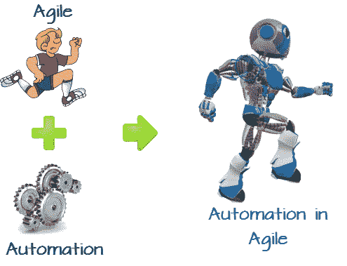
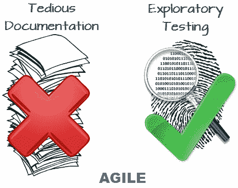
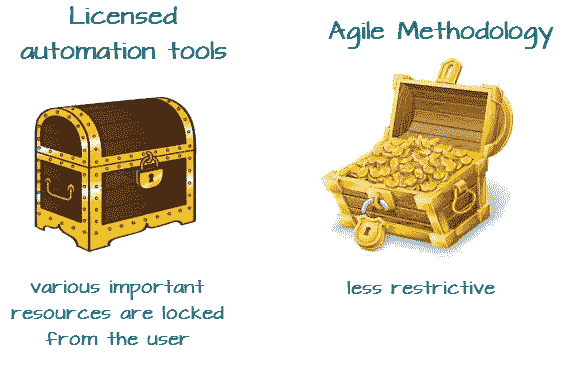
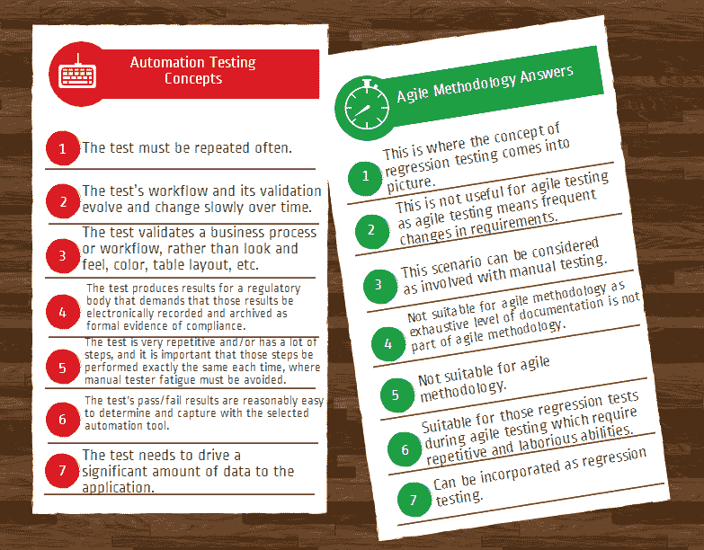

# 敏捷/ Scrum 方法论的自动化测试框架

> 原文： [https://www.guru99.com/automation-testing-agile-scrum.html](https://www.guru99.com/automation-testing-agile-scrum.html)

在过去的几年中，自从敏捷方法的开发者开始大声疾呼并愿意消除传统瀑布模型的平凡而艰辛的现实以来，当涉及到[HTG0 自动化测试。

.jpg)

## 瀑布式自动化与敏捷式自动化

在传统的软件测试生命周期过程中，当应用程序**稳定，稳定并且**的需求与**的实际时间**有关时，自动化测试通常是可行的。 在大多数情况下，它们涉及一组非常熟练的自动化专家资源以及相当多的设置成本。 自动化测试的基本目的是降低长期成本，并确保不会由于现有测试案例而引入新的缺陷。

**从本质上讲，自动化测试不是探索性的**，因为自动化测试的主要作用是节省时间和降低成本。 自动化测试并非要提出新的创新缺陷。 自动化测试主要旨在确认已经存在的内容。

## 如何在敏捷方法论中实现自动化

现在，根据其定义，敏捷方法论讨论了消除繁琐而繁琐的文档，以便可以实施新的和创新的想法，并且人们可以彼此自由地交互，以便可以实施更多的这些创新和探索性想法。

因此，我们可以看到敏捷方法论的基本基本哲学与自动化测试之间的矛盾。

## 敏捷测试自动化的基本要点

因此，在评估针对自动化测试方法和技术的敏捷方法的使用时，我们需要在此处考虑某些基本点。 因此，我们需要考虑一些基本点，例如设计和编码所花费的时间，使用现有测试数据对设计脚本进行验证以及将其用于测试（无论测试是出于功能还是回归目的），因此 所有这些事件是为了执行所有这些事实，我们需要确保这些任务以及在平均冲刺平均需要 1-2 周才能完成的敏捷环境中花费大量时间。 显然很难考虑花这么多时间以这种方式自动执行脚本。

另一个重要因素仍然存在，即敏捷方法论发挥作用时需求变化的类型。 敏捷方法论本身就是一种技术，它对响应快速的客户变更需求非常有帮助，因此很适合在应用程序的整体开发过程中进行频繁的变更。

相反，当涉及到更稳定，更不频繁的需求类型时，自动化测试非常有用。 因此，按照定义，自动化测试不能很好地适应各种频繁变化的需求变化，同时还需要采用任何敏捷方法。

## 敏捷自动化工具

在整个敏捷方法论范围内采用自动化测试时，相关自动化工具的选择也是潜在的非常重要的因素。 例如，获得许可的自动化工具在访问属于该特定测试自动化框架的各种重要资源时，会对不同类型和级别的用户施加严格的安全访问标准。

相比之下，敏捷方法论着重于团队成员之间的开放式协作和开放式交互，因此，限制性政策直接影响用户如何对团队内部的整体凝聚力产生负面影响，从而可能导致结果不尽相同 有益也无益于项目的整体成功。

因此，该过程的首要重要性应该是确保在敏捷方法所提供的规定时间内获得自动化测试脚本的高质量交付； 我们需要选择将以更加细微的方式自动化的预期测试用例，以使这些自动化测试脚本很适合将来重用，并确保可以在指定的时间段内准备好它们（例如 在敏捷方法论过程中是必需的）。

考虑到上述所有因素后，我们可以认识到，即使采用敏捷方法，我们也需要将测试类型（例如回归测试）带入图片（因为即使在敏捷测试期间，也需要进行大量测试工作） 投入敏捷方法的工作，以确保整体产品的质量更高）

现在，让我们看一下可以使用自动化测试的最基本情况，以及如何将其应用于敏捷测试领域。

## 应用于敏捷的自动化测试概念

