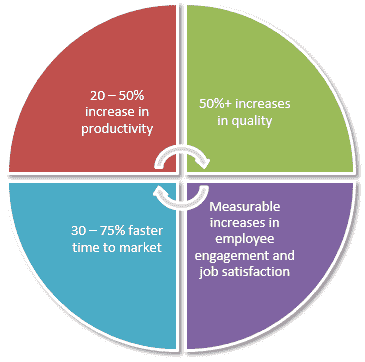
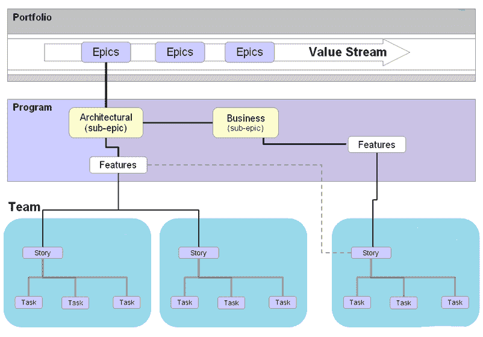
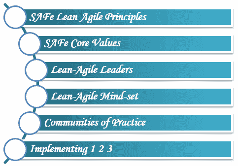
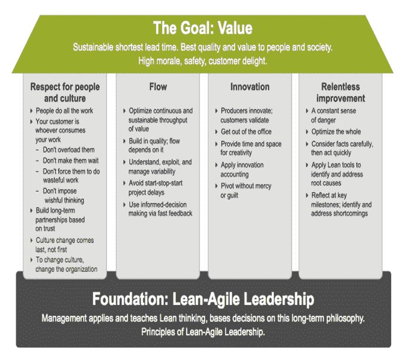
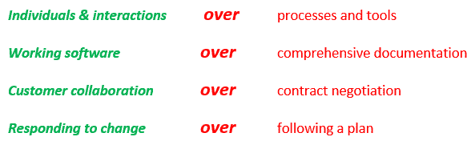
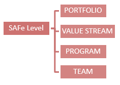

# SAFe 方法论教程：什么是可扩展敏捷框架

> 原文： [https://www.guru99.com/scaled-agile-framework.html](https://www.guru99.com/scaled-agile-framework.html)

## 什么是可扩展敏捷框架（SAFe）？

Scaled Agile Framework SAFe 是一个免费的在线知识库，可让您在企业级应用精益敏捷实践。 它为软件开发团队提供了简单，轻便的体验。 整个框架分为三个部分：**团队，计划和项目组合**。 稍后我们将详细介绍。 SAFe 允许团队进行以下活动：

*   在企业级实施精益敏捷软件和系统
*   它基于精益和敏捷原则。
*   它为企业投资组合，价值流，计划和团队的工作提供了详细的指导。
*   它旨在满足组织内所有利益相关者的需求。

SAFe 首先在该领域开发，并在 **Dean Leffingwell 的**的书和博客中进行了详细说明。 1.0 版是 2011 年的第一个正式版本。最新版本是 4.6 版，于 2018 年 10 月发布。它提供了在企业产品组合，价值流，计划和团队级别上工作的指南。

在本教程中，您将学习-

*   [什么是可伸缩敏捷框架（SAFe）](#1)
*   [为什么使用敏捷框架](#2)
*   [何时使用缩放敏捷框架](#3)
*   [与其他敏捷实践](#4)有何不同
*   [可扩展敏捷框架](#5)的基础
*   [敏捷宣言](#6)
*   [安全级别不同](#7)

*   [团队等级](#8)
*   [程序级别](#9)
*   [投资组合级别](#10)
*   [值流级别](#11)

## 为什么使用敏捷框架

它更简单，更轻，但可以扩展以处理大价值流和复杂系统开发的需求。 通过实施敏捷框架，您将获得以下好处，

*   **生产率将**提高了 **20-50％**
*   **质量**增长超过 **50％**
*   **上市时间**比**快 30 -75％**
*   提高了**员工敬业度**和**的工作满意度。**

详细的框架图可在[网站](http://www.scaledagileframework.com/)上找到。 它显示了所有关键角色，活动，可交付成果和流程。 它也可以作为网站其他部分的导航工具。

下图说明了敏捷过程的工作原理。 史诗是一项庞大的工作，可以进一步细分为许多较小的故事或子史诗。 这些子主题将作为故事分配给团队。 然后，每个团队都会相应地处理这些故事或软件功能。

## 何时使用缩放敏捷框架

*   当团队有兴趣在较大的多团队计划和项目组合中一致地实施敏捷方法时。
*   当多个团队以各自的敏捷实施方式运行，但经常遇到障碍，延误和失败时。
*   当团队想要独立工作时。
*   当您想在整个组织范围内扩展敏捷但不确定需要哪些新角色或需要更改哪些现有角色（即管理）时以及如何更改。
*   当您尝试在整个组织中扩展敏捷性，但在努力协调一致以实现业务部门（从投资组合到计划和团队级别）的统一或一致策略时，就遇到了麻烦。
*   当组织需要改善产品开发的交货时间并想知道其他公司如何成功地通过 SAFe 扩展敏捷时。

## 与其他敏捷实践有何不同

让我们看看 Scaled Agile 框架与其他敏捷实践有何不同，

*   它是公开可用的，可以免费使用。
*   以高度易用和可用的形式提供。
*   它是轻量级的，经过实践证明的结果并且特定于级别。
*   它不断/定期修改/保持最常用的敏捷实践。
*   提供了对常见敏捷实践的有用扩展。
*   使敏捷实践基于企业环境。
*   提供软件开发的完整图片。
*   在所有级别上可见性或透明性都更高。
*   关于质量和改进的持续或定期反馈。

## 规模化敏捷框架的基础

规模化敏捷框架（SAFe）：它立足于其基础

1.  精益敏捷原则
2.  核心价值，
3.  精益敏捷领导
4.  精益敏捷思维定势，
5.  实践社区（不断从事 SAFe 实践的人群）
6.  实施 1-2-3

1.  **SAFe 精益敏捷原则**

必须了解，展示和延续 SAFe 的这些基本原理和值，以便获得所需的结果。

*   从经济角度看
*   应用系统思考
*   假设可变性； 保留选项
*   通过快速，集成的学习周期逐步构建
*   里程碑基于对工作系统的客观评估
*   可视化和限制在制品，减少批次大小和管理队列长度
*   应用节奏，与跨域计划同步
*   释放知识工作者的内在动力
*   分权决策

2.  **SAFe 敏捷核心价值观**

SAFe 敏捷度基于这四个值。

**对齐方式：**

*   SAFe 支持对齐。
*   对齐开始于
    *   投资组合积压和
    *   下移至计划积压的愿景和路线图，然后
    *   移至团队待办事项列表。

**内置质量：**

*   它确保每次增量交付都反映质量标准。
*   质量不是内置的“以后添加”。
*   内置质量是精益和强制性的前提

**透明度：**

*   透明是信任的促成因素。
*   SAFe 帮助企业实现各个级别的透明度-高管，投资组合经理和其他利益相关者。
*   每个人都可以查看投资组合积压/看板，程序积压/看板和团队积压/看板。
*   每个级别都对 PI 目标有清晰的了解。
*   培训计划可以查看团队的待办事项以及其他计划的待办事项
*   团队和计划可以了解业务和架构史诗。 他们可以看到前进的方向。

**程序执行：**

*   SAFe 非常重视工作系统和由此产生的业务成果。
*   如果团队无法执行并持续交付价值，SAFe 就没有用。

3.  **精益敏捷领导者：**

精益敏捷领导者是终身学习者和教师。 它通过理解和展示精益敏捷 SAFe 原则，帮助团队构建更好的系统。

作为团队的推动者，最终的责任是精益敏捷开发的采用，成功和持续改进。 为了改变和不断改进，必须对领导者进行培训。

领导者需要采用新的领导方式。 真正赋予个人和团队力量并使其发挥最大潜力的团队。

**这些精益领导者的原则**

*   领导变革
*   知道路； 强调终身学习
*   培养人才
*   激发和配合使命； 最小化约束
*   分散决策
*   释放知识工作者的内在动机

4.  **精益敏捷思维方式：**

精益敏捷的心态体现在两方面：

1.  **SAFe 精益议院**
2.  **敏捷宣言**

**SAFe 精益议院**：

SAFe 源自精益生产原则和实践。 基于这些因素，SAFe 提出了“ SAFe 精益之家”。 它受到精益丰田的“家”的启发。

精益生产的目标无与伦比：在最短的交货时间内以最大的质量为客户提供最大的客户价值

下图说明了“ SAFe 精益之家”的目标，支柱和基础。

## 敏捷宣言

我们正在探索通过开发软件并帮助他人开发软件的更好方法。 通过这项工作，我们开始重视：

这就是为什么，尽管右侧的项目中有一个值，但我们更重视左侧的项目。

**敏捷宣言**

1.  最重要的是通过持续和早期交付有价值的软件来满足客户。
2.  接受不断变化的需求，甚至在开发后期。 敏捷流程利用变更为客户带来利益。
3.  频繁交付工作软件，从几周到几个月不等，而更倾向于缩短时间。
4.  开发人员和商人必须在整个项目中每天一起工作。
5.  围绕有上进心的个人建立项目。 给他们支持和他们所需的环境，并信任他们来完成工作。
6.  与开发团队进行交流的最有效方法是面对面的对话。
7.  工作软件是进度的主要衡量标准。
8.  敏捷过程促进可持续发展。 赞助者，开发者和用户应该能够无限期地保持恒定的步伐。
9.  持续关注技术卓越性和良好的设计可增强敏捷性。
10.  简单性-最大化未完成工作量的艺术-是必不可少的。
11.  最好的体系结构，需求和设计来自自组织团队。
12.  团队会定期思考如何提高效率，然后相应地调整和调整其行为。

## 安全级别不同

SAFe 实现有两种不同类型：

1.  **SAFe 4.0 实施**
2.  **SAFe 3.0 实施**

*   在 SAFe 4.0 实施中，我们有 4 个级别：**投资组合，价值流，计划和团队。**
*   在 SAFe 3.0 实施中，我们分为 3 个级别：**项目组合，计划和团队**
*   3 级 SAFe 适用于人数少于 100 人的小型实现。 不需要大量协作的程序。
*   4 级 SAFe 适用于通常需要数百名从业人员开发部署和维护软件的解决方案。

### 团队级别

| **角色/团队** |   | **活动** |   | **伪影** |
| *敏捷团队 |   | *冲刺计划 |   | *团队积压 |
| * 产品拥有者 |   | *积压整理 |   | *非功能性要求 |
| * Scrum 大师 |   | *每日站立 |   | *团队 PI 目标 |
|   |   | *执行 |   | *迭代 |
|   |   | * Sprint 演示 |   | *故事（工作软件） |
|   |   | * Sprint 回顾展 |   | *冲刺目标 |
|   |   | * IP 冲刺 |   | *内置质量 |
|   |   |   |   | *钉 |
|   |   |   |   | *看板团队 |

*   所有 SAFe 团队都是一个或其他敏捷发布培训（ART）的一部分。
*   SAFe 团队是授权，自我组织，自我管理，跨职能的团队
*   每个团队均负责以固定长度的迭代从团队积压中定义，构建和测试故事
*   团队根据商定的迭代目标计划并执行为期两周的有时间限制的迭代。
*   团队将使用 ScrumXP / Team Kanban 例程交付高质量的系统，每两周进行一次系统演示。
*   ART（敏捷发布培训）中的所有不同团队将创建一个集成且经过测试的系统。 利益相关者将评估并做出快速反馈
*   他们采用内置质量实践。
*   每个 ScrumXP 团队将有 5-9 个团队成员，其中包括在每个 Iteration 中建立高质量增量值所需的所有角色。
*   ScrumXP 角色包括：
    *   小组（开发+质量检查）
    *   Scrum 大师
    *   产品拥有者。 等等..
*   SAFe 将开发时间线划分为 PI（程序增量）内的一组迭代。
*   PI 持续时间为 8 -12 周。
*   团队将使用故事来传递价值。 产品负责人将拥有创作和接受故事的内容权限。
*   故事包含客户的要求。
*   团队待办事项包括在 PI 计划期间确定的用户和启用者故事。 产品管理提出路线图，愿景和计划待办事项时。
*   识别，阐述，确定优先顺序，安排，实施，测试和接受故事是团队级别管理工作的主要要求。
*   每次迭代提供：
    *   新功能的宝贵增量
    *   通过不断重复的模式来完成
    *   计划迭代
    *   承诺一些功能
    *   通过构建和测试故事来执行迭代
    *   演示新功能
    *   回顾性
    *   重复下一次迭代
*   在每个迭代的末尾，团队还支持系统演示。 这是 ART 的关键集成点。
*   较大的价值流将包含多个 ART。
*   创新和计划（IP）迭代利用团队，为创新和探索提供了机会。

### 程序级别

| **Roles/Teams** |   | **Events** |   | **Artifacts** |
| * DevOps |   | * PI（程序增量）计划 |   | *愿景 |
| *系统团队 |   | *系统演示 |   | *路线图 |
| * 发布管理 |   | *检查并采用研讨会 |   | *指标 |
| * 产品管理 |   | *建筑跑道 |   | *里程碑 |
| * UEX 架构师 |   | *随时发布 |   | *发布 |
| *发布培训工程师（RTE） |   | *敏捷发布火车 |   | *计划史诗 |
| *系统架构师/工程师 |   | * 释放 |   | *程序看板 |
| * 企业主 |   |   |   | *计划积压 |
| *精益敏捷的领导者 |   |   |   | * Non-Functional Requirements |
| *实践社区 |   |   |   | *加权最短作业优先（WSJF） |
| * 共享服务 |   |   |   | *计划 PI 目标 |
| *客户 |   |   |   | *功能 |
|   |   |   |   | *启动器 |
|   |   |   |   | *解决方案 |
|   |   |   |   | *价值流协调 |

*   在计划级别，SAFe 的价值是通过长期的敏捷发布火车（ART）实现的。 迭代适用于团队，培训适用于该程序。
*   敏捷发布火车（ART）是在计划级别实现价值传递的主要工具。 它为组织提供了价值流。
*   计划增量（PI）的持续时间为 8 到 12 周。
*   ART 由 5-12 个敏捷团队（约 50-125 +人）组成，其中包括交付经过全面测试，有效的系统级软件所需的所有角色和基础架构。
*   每个 PI 是一个多次迭代时间框。 在此期间，开发并交付了系统的大量有价值的增量。
*   在每个 PI 中，都将进行“演示”和“检查和调整”会话，并且开始为下一个 PSI 进行计划。
*   在计划级别，SAFe 强调一致性原则。 这是因为整合了多个敏捷团队的努力来创造客户价值。
*   SAFe 工件层次结构是 **Epics- >功能->用户案例**。
*   在程序级别，产品经理/程序经理具有内容权限。 他定义了程序待办事项并确定了优先次序。
*   程序积压是功能的优先列表。
*   在程序级别，功能可以起源，也可以从组合级别定义的史诗派生。
*   功能会分解为用户故事，并流入团队级别的待办事项列表。
*   产品经理或发布培训工程师角色可以由项目经理/高级项目经理处理
*   计划级别的系统架构师角色是与团队协作。 它确保满足非功能性要求。 此外，他们在产品组合级别与企业架构师合作，以确保有足够的架构跑道来满足即将到来的用户和业务需求。
*   UX 设计人员提供了团队的界面设计，用户体验指南和设计元素。
*   “发布培训工程师”扮演首席首席管理员的角色。
*   各个团队（来自市场，开发，质量，运营和部署）组成“发布管理团队”。 他们将批准向客户例行发布质量解决方案。
*   DevOps 团队负责将软件部署到客户环境中并成功交付。

### 投资组合级别

| **Roles/Teams** |   | **Events** |   | **Artifacts** |
| *企业架构师 |   | *战略投资计划 |   | *战略主题 |
| *计划组合管理 |   | *看板投资组合（史诗）计划 |   | *企业 |
| *史诗般的车主 |   |   |   | *投资组合积压 |
|   |   |   |   | *投资组合看板 |
|   |   |   |   | * Non-Functional Requirements |
|   |   |   |   | *史诗和推动者 |
|   |   |   |   | * 价值流 |
|   |   |   |   | *预算（资本支出和运营支出） |

*   对 SAFe 的最高关注/关注/参与/是 **SAFe 投资组合**
*   该产品组合提供了通过一个或多个价值流来组织精益敏捷企业价值流的基本模块。
*   该产品组合有助于开发战略主题中描述的系统和解决方案（将 SAFe 产品组合链接到企业不断变化的业务战略）。
*   为了达到战略目标，投资组合级别封装了这些要素。 它提供了基本的预算编制和其他治理机制。 这样，可以确保对价值流的投资为企业提供必要的回报。
*   投资组合双向连接到业务：
    *   为了指导业务组合达到更大的不断变化的业务目标，它提供了战略主题。
    *   另一个方向表明投资组合价值的持续流动。
*   计划组合管理是利益相关者，他们对交付业务成果负责。
*   SAFe 产品组合级别包含企业满足其战略目标所需的人员，流程以及必要的构建系统和解决方案。
*   价值流是投资组合中的主要目标，构建解决方案需要人力和其他资源。
*   这里使用的重要关键概念是：
    *   与企业的连接，
    *   程序组合管理，
    *   管理投资组合史诗的流程。

### 值流级别

| **Roles/Teams** |   | **Events** |   | **Artifacts** |
| * DevOps |   | * PI（计划增量）之前和之后的计划 |   | * Vision |
| * System Team |   | *解决方案演示 |   | * Roadmap |
| * Release Management |   | * Inspect and Adopt Workshop |   | * Metrics |
| *解决方案管理 |   | * Agile Release Train |   | * Milestones |
| * UEX Architect |   |   |   | * Releases |
| *价值流工程师（RTE） |   |   |   | *价值流史诗 |
| *解决方案架构师/工程师 |   |   |   | *价值流看板 |
| * Shared Services |   |   |   | *价值流积压 |
| * Customer |   |   |   | * Non-Functional Requirements |
| *供应商 |   |   |   | * Weighted Shortest Job First (WSJF) |
|   |   |   |   | *价值流 PI 目标 |
|   |   |   |   | *能力 |
|   |   |   |   | * Enabler |
|   |   |   |   | *解决方案上下文 |
|   |   |   |   | * Value Stream Coordination |
|   |   |   |   | *经济框架 |
|   |   |   |   | *解决方案意图 |
|   |   |   |   | * MBSE |
|   |   |   |   | *基于设置 |
|   |   |   |   | *敏捷架构 |

*   值流级别在 SAFe 中是可选的。
*   值流级别是 SAFe 4.0 中的新增功能。
*   价值流级别是为以下企业/建筑商/组织设计/设计的：

1.  大号
2.  独立
3.  有复杂的解决方案
4.  他们的解决方案通常需要多个 ART
5.  他们有供应商的贡献。
6.  他们面临最大的系统挑战
7.  对于网络物理系统
8.  适用于软件，硬件，电气和电子，光学，机械，流体学等。

*   构建此类系统通常需要数百甚至数千名从业人员，外部和内部供应商。
*   如果系统对任务至关重要。 解决方案甚至子系统的故障都会带来不可接受的经济和社会后果。
*   如果企业可以由几百名从业者建立，则可能不需要此级别的构建。 在这种情况下，他们可以使用“ **折叠视图”** ，它是 3 级 SAFe。
*   以精益敏捷模式构建价值流解决方案需要其他工件，协调和构造。 因此，此级别包含一个经济框架，可为价值流提供财务边界
*   它支持多个 ART 和供应商的节奏和同步。 它包括 PI 前后计划会议和解决方案演示。
*   它提供了其他角色，包括：价值流工程师，解决方案架构师/工程和解决方案管理。

**摘要：**

*   SAFe 是一种行业认可的，以价值为中心的方法，可用于在企业级别扩展敏捷。
*   它回答了诸如“我们如何计划？”，“我们如何预算？”和“我们如何在架构和 DevOps 中变得跨职能？”之类的问题。
*   SAFe 帮助大型组织团队实现组织的战略目标，而不仅仅是单个项目目标。
*   该框架提供了维护和创建集中式战略以交付价值的能力。
*   SAFe 模型具有三个/四个级别，这些级别集中了组织的战略主题。
*   集中战略，结合分散的敏捷开发执行力。

**参考：**

供参考的官方和当前网站是：

[http://www.scaledagileframework.com](http://www.scaledagileframework.com)

本文由 **Jyothi Rangaraj** 提供