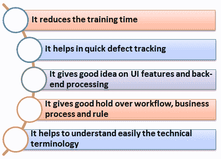

# 银行领域应用测试：示例测试案例

> 原文： [https://www.guru99.com/banking-application-testing.html](https://www.guru99.com/banking-application-testing.html)

BFSI（银行，金融服务和保险）行业是 IT 服务的最大消费者。 银行应用程序直接处理机密财务数据。 银行软件执行的所有活动必须平稳运行且没有任何错误是强制性的。 银行软件执行各种功能，如转帐和存款，余额查询，交易历史记录，提款等。 测试银行应用程序可确保这些活动不仅执行得当，而且不受黑客攻击。

在本教程中，我们将学习

*   [测试中的域是什么？](#1)
*   [为什么领域知识如此重要？](#2)
*   [银行领域简介](#3)
*   [银行应用程序的特征](#4)
*   [测试银行应用程序的阶段](#5)
*   [网上银行登录应用程序的测试例](#6)
*   [测试银行领域&的挑战及其缓解措施](#7)

[免费加入我们的实时银行测试项目](/live-testing-project.html)

## 什么是测试领域？

Domain 就是创建软件测试项目的行业。 当我们谈论软件项目或开发时，通常会使用该术语。 例如，保险域，银行域，零售域，电信域等。

通常，在开发任何特定的领域项目时，都会寻求领域专家的帮助。 领域专家是该主题的大师，他可能知道产品或应用程序的内在知识。

## 为什么领域知识如此重要？

领域知识对于测试任何软件产品都是最典型的，它具有自己的优势，例如

## 银行领域知识-简介

银行领域的概念是巨大的，基本上将其细分为两个部门

1.  **传统银行业**
2.  **服务型银行业**

下表是这两个银行业所包含的服务表

| **传统银行业** | 

*   核心银行业务
*   公司银行业务
*   零售银行业务

 |
| **服务型银行业** | 

*   核心
*   企业
*   零售
*   贷款
*   贸易融资
*   私人银行业务
*   消费金融
*   伊斯兰银行业务
*   客户交付渠道/前端交付

 |

根据您的项目范围，您可能需要测试上述一项或全部服务。 在开始测试之前，请确保您对被测试的服务有足够的背景知识。

## 银行应用程序的特征

在开始测试之前，请务必注意任何银行应用程序所期望的标准功能。 因此，您可以调整测试工作以实现这些特征。

标准银行应用程序应满足以下所有这些特征。

*   它应该支持数千个并发用户会话
*   银行应用程序应与其他众多应用程序集成，例如交易账户，账单支付工具，信用卡等。
*   它应该处理快速，安全的交易
*   它应包括海量存储系统。
*   要解决客户问题，它应具有较高的审核能力
*   它应该处理复杂的业务工作流程
*   需要在多个平台（Mac，Linux，Unix，Windows）上支持用户
*   它应该支持来自多个位置的用户
*   它应该支持多语言用户
*   它应支持各种支付系统（VISA，AMEX，MasterCard）上的用户
*   它应支持多个服务部门（贷款，零售银行等）
*   万无一失的灾难管理机制

## 测试银行应用程序中的测试阶段

对于测试银行应用程序，测试的不同阶段包括

*   **需求分析：**由业务分析师完成； 收集并记录特定银行应用程序的要求
*   **需求审查：**质量分析师，业务分析师和开发负责人都参与了此任务。 在此阶段审核需求收集文档，并进行交叉检查，以确保它不会影响工作流程
*   **业务需求文档：**业务需求文档由质量分析人员准备，其中涵盖了所有已审核的业务需求
*   **数据库测试：**这是银行应用程序测试中最重要的部分。 进行此测试是为了确保数据完整性，数据加载，数据迁移，存储过程和功能验证，规则测试等。
*   **集成测试：**在[集成测试](/integration-testing.html)下，所有开发的组件均已集成并经过验证
*   **功能测试：**在此阶段完成了诸如[测试用例](/test-case.html)准备，测试用例复审和测试用例执行之类的常规软件测试活动
*   **安全测试：**它确保软件没有任何安全缺陷。 在测试准备期间，QA 团队需要同时包括否定测试场景和肯定测试场景，以便在未经授权的个人访问系统之前闯入系统并进行报告。 在防止黑客入侵的同时，银行还应实施多层访问验证，例如一次性密码。 对于[安全测试](/what-is-security-testing.html)，使用自动化工具，例如 IBM AppScan 和 HPWebInspect；对于[，使用手动测试](/manual-testing.html)工具，例如代理嗅探器，Paros 代理，HTTP 监视等。
*   **可用性测试：**它确保能力不同的人应该能够以普通用户的身份使用系统。 例如，具有听力和盲文设施的 ATM 用于残疾人
*   **用户验收测试：**这是最终用户完成的测试的最后阶段，以确保应用程序符合实际情况。

## 网上银行登录应用程序的测试示例

对于任何银行应用程序来说，安全性都是至关重要的。 因此，在测试准备期间，QA 团队应同时包括否定测试场景和肯定测试场景，以便在任何未经授权的个人访问系统之前先潜入系统并报告所有漏洞。 它不仅涉及编写否定测试用例，还可能包括破坏性测试。

以下是检查任何银行应用程序的通用测试用例

| 样本测试用例 |  |
| 对于管理员 | 

*   验证包含有效数据和无效数据的管理员登录名
*   验证不含数据的管理员登录名
*   验证所有管理员主页链接
*   验证管理员更改密码的有效性和无效性 数据
*   验证没有数据的管理员更改密码
*   验证具有现有数据的管理员更改密码
*   验证管理员注销

 |
| 对于新分支 | 

*   创建具有有效和无效数据的新分支
*   创建不具有数据的新分支
*   创建具有现有分支数据的新分支
*   验证重置并 取消选项
*   使用有效和无效数据更新分支
*   没有数据的更新分支
*   使用现有分支数据
*   更新分支验证取消选项

*   验证有无依赖项的分支删除
*   验证分支搜索选项

 |
| 对于新角色 | 

*   创建一个包含有效和无效数据的新角色
*   创建一个没有数据的新角色
*   使用现有数据验证新角色
*   验证角色描述和角色 类型
*   验证取消和重置选项
*   验证具有和不具有依赖项的角色删除
*   验证角色详细信息页面

中的链接 |
| 对于客户&访问者 | 

*   验证所有访客或客户链接
*   验证客户使用有效和无效的数据登录
*   验证客户在没有数据的情况下登录
*   验证银行在没有数据的情况下登录
*   验证银行登录信息是否有效或无效

 |
| 对于新用户 | 

*   创建一个具有有效和无效数据的新用户
*   创建一个没有数据的新用户
*   创建一个具有现有分支数据的新用户
*   验证取消并 重置选项
*   用有效和无效数据更新用户
*   用现有数据更新用户
*   验证取消选项
*   验证删除用户

 |

## 测试银行领域&缓解挑战

测试人员在测试银行领域时可能面临的挑战是

|  **
挑战
**  |  **
缓解措施
**  |
| 

*   获得生产数据并将其复制为测试数据，以进行测试具有挑战性

 | 

*   确保测试数据符合法规遵从性要求和准则
*   通过以下技术来维护数据机密性，例如数据屏蔽，综合测试数据，测试系统集成等。

 |
| 

*   测试银行系统的最大挑战是在将系统从旧系统迁移到新系统的过程中，例如测试所有例程，过程和计划。 以及迁移后如何获取，上传和传输数据到新系统

 | 

*   确保完成数据迁移测试
*   确保在新旧系统上执行回归测试用例，并且结果匹配。

 |
| 

*   在某些情况下，需求记录得不好，并可能导致测试计划中的功能空白
*   许多非功能性需求没有得到充分记录，测试人员也不知道 是否测试

 | 

*   测试应从需求分析阶段开始参与项目，并应积极审查业务需求

 |
| 

*   最重要的是检查所述系统是否遵循所需的策略和过程。

 | 

*   必须进行符合性或法规政策测试

 |
| 

*   随着银行应用程序与互联网或 [移动](/mobile-testing.html) 银行业务

 | 

*   如果您的银行应用程序具有许多外部接口，请确保考虑了集成测试的时间预算

 |

## 摘要

银行领域是最容易受到网络盗窃的领域，而保护软件需要进行精确测试。 本教程给出了银行领域测试所需的内容及其重要性的清晰思路。 一个人必须明白-

*   大多数银行软件是在**大型机**和 **Unix** 上开发的
*   测试有助于减少软件开发过程中可能遇到的故障
*   适当的测试并符合行业标准，使公司免于罚款
*   良好的做法有助于公司取得良好的业绩，声誉和更多业务
*   手动和自动测试都有各自的优点和可用性

**加入我们的** [网上银行域名测试项目](/live-testing-project.html)

*   [上一页](/complete-web-application-testing-checklist.html "Web Application Testing Checklist: Example Test Cases for Website")
[**Report a Bug**](javascript:void( window.open( 'https://form.jotform.me/72391811797466', 'blank', 'scrollbars=yes, toolbar=no, width=700, height=700' ) ))

*   [下一个](/testing-e-commerce-applications.html "eCommerce Testing: How to Test an E-Commerce Website")