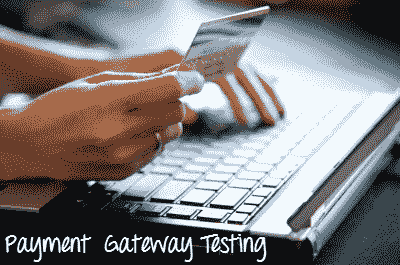

# 带有示例测试案例的支付网关测试教程

> 原文： [https://www.guru99.com/payment-gateway-testing-tutorial-with-sample-test-cases.html](https://www.guru99.com/payment-gateway-testing-tutorial-with-sample-test-cases.html)

### 什么是支付网关测试？

支付网关测试是对支付网关的测试。 支付网关系统是一种电子商务应用程序服务，其**批准**信用卡付款以进行在线购买。 支付网关通过加密敏感信息（例如信用卡号，帐户持有人详细信息等）来保护信用卡详细信息。 此信息在客户和商人之间安全地传递，反之亦然。

现代付款网关**还通过借记卡，电子银行转账，现金卡，奖励积分等安全地批准**付款。

在本教程中，您将学习

*   [付款网关系统](#1)的类型
*   [支付域](#2)的测试类型
*   [如何测试付款网关：完整清单](#3)
*   [付款网关测试](#4)的测试用例示例
*   [购买网关套餐](#5)之前应考虑的事项

[免费加入我们的 Live Payment Gateway 测试项目](/live-payment-gateway-project.html)

## 付款网关系统的类型

<figure>

 

<figcaption>付款网关知识很重要</figcaption>

</figure>

*   **Hosted Payment Gateway**:

    托管支付网关系统可在付款过程中将客户从电子商务站点引导至网关链接。 付款完成后，它将把客户带回到电子商务站点。 对于此类付款，您不需要商户 ID，托管付款网关的示例为 PayPal，Noche 和 WorldPay。

*   **Shared Payment Gateway**:

    在共享付款网关中，在处理付款时，客户将被定向到付款页面并停留在电子商务站点上。 填写付款明细后，付款流程便会继续进行。 由于它在处理付款时不会离开电子商务站点，因此此模式很容易，更可取的是，共享付款网关的示例是 eWay，Stripe。

## 支付域的测试类型

付款网关的测试应包括

**功能测试**：这是测试支付网关的基本功能的动作。 这是为了验证应用程序的行为是否与假定的行为相同，如处理订单，计算，按国家/地区添加增值税等。

**集成**：测试与信用卡服务的集成。

**性能**：确定各种性能指标，例如在特定的一天中通过网关访问的最大用户数，并将其转换为并发用户

**安全性**：您需要为 Payment Gateway 执行深度安全传递。

## 如何测试付款网关：完整清单

在开始测试之前-

*   收集适用于大师，签证，主人等的虚拟信用卡号的正确测试数据。
*   收集付款网关信息，例如 Google Wallet，Paypal 或其他
*   收集带有错误代码的支付网关文档
*   了解通过应用程序和支付网关传递的会话和参数
*   了解并测试通过查询字符串或变量或会话传递的金额相关信息
*   连同支付网关语言一起检查应用程序的语言
*   在付款网关的各种设置（例如货币格式）下，收集了订户数据。

## 付款网关测试示例测试用例

以下是检查付款网关的重要测试方案/案例

| **Sr＃** | **测试用例** |
| 1 | 在付款过程中，请尝试更改付款网关的语言 |
| 2 | 成功付款后，测试所有必要的组件，无论是否已检索到 |
| 3 | 检查付款网关在付款过程中停止响应会发生什么 |
| 4 | 在付款过程中，检查会话结束会发生什么情况 |
| 5 | 在付款过程中，请检查后端发生了什么 |
| 6 | 检查付款流程失败时会发生什么 |
| 7 | 检查数据库条目是否存储了信用卡详细信息 |
| 8 | 在付款过程中，检查错误页面和安全页面 |
| 9 | 检查弹出窗口阻止程序的设置，并查看是否打开和关闭弹出窗口阻止程序会发生什么 |
| 10 | 在付款网关和应用程序检查缓冲区页面之间 |
| 11 | 检查成功付款，将成功代码发送到应用程序，并向用户显示确认页面 |
| 12 | 验证交易是立即处理还是正在处理交给您的银行 |
| 13 | 成功交易后，检查付款网关是否返回到您的应用程序 |
| 14 | 付款成功后，请检查所有格式和消息 |
| 15 | 除非您没有来自付款网关的授权收据，否则不应发货 |
| 16 | 通知所有者有关通过电子邮件处理的任何交易。 加密邮件内容 |
| 17 | 用货币格式检查金额格式 |
| 18 | 检查每个付款选项是否可选 |
| 19 | 检查列出的每个付款选项是否根据规格打开了相应的付款选项 |
| 20 | 验证支付网关是否默认为所需的借记卡/信用卡选项 |
| 21 | 验证借记卡的默认选项是否显示卡选择下拉菜单 |

## 购买网关套餐之前应考虑的事项

*   如果您购买了购物车包装，请了解其兼容性
*   如果需要购买购物网关软件包，请向支付网关提供商咨询支持的应用程序列表
*   网关必须提供地址验证系统保护
*   找出提供的交易保护类型
*   检查您选择的付款网关接受哪些类型的借记卡或信用卡
*   查看付款网关收取的交易费用
*   检查网关是在表格上收取付款权利还是直接转到另一页以完成购买