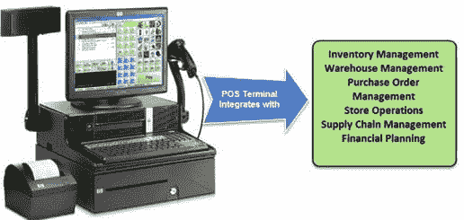
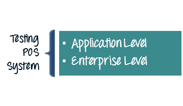

# 测试零售销售点（POS）系统：示例测试案例

> 原文： [https://www.guru99.com/testing-for-retail-pos-point-of-sale-system.html](https://www.guru99.com/testing-for-retail-pos-point-of-sale-system.html)

### 什么是 POS 测试？

POS 测试被定义​​为销售点应用程序的测试。 POS 或销售点软件是零售企业从任何地方毫不费力地进行零售交易的重要解决方案。 在您最喜欢的购物中心结账时，您一定已经看过销售点终端。

该系统比您想象的要复杂，并且与其他软件系统（如仓库，库存，采购订单，供应链，市场营销，商品计划等）紧密集成。POS 域知识对于测试很重要。

在本教程中，您将学习-

*   [POS 应用程序的测试体系结构](#1)
*   [POS 系统](#2)的测试类型
*   [用于零售](#3)的 POS 的示例测试用例
*   [零售 POS 系统的安全性测试](#4)
*   [POS 测试中的挑战](#5)

## POS 应用程序的测试体系结构

POS 测试体系结构包括三个测试组件-POS 终端，商店服务器和企业服务器。 基本上，它分为三个级别来测试 POS 应用程序。

| **级别 1-（POS 终端）** | **级别 2（存储服务器）** | **级别 3-（企业服务器）** |
| 

*   设备和硬件测试（RFID，扫描仪，打印机，条形码读取器）
*   互操作性测试
*   BI 和分析测试
*   [性能测试

 | 

*   [安全测试](/what-is-security-testing.html)
*   BI & 分析测试
*   灾难恢复测试
*   接口测试

 | 

*   安全测试
*   BI & 分析测试
*   灾难恢复测试
*   接口测试

 |

## POS 系统的测试类型

POS 系统的测试可以分为两个级别

1.  应用等级
2.  企业级

| 在应用程序级别执行的测试 | 在企业级别执行的测试 |
| 

*   功能测试
*   [兼容性测试](/compatibility-testing.html)
*   支付网关测试
*   报告测试

 | 

*   一致性测试
*   性能测试
*   互操作性测试
*   数据迁移
*   移动性

 |

## 零售中使用的 POS 示例测试用例

为了确保 POS 系统的质量，必须对 POS 软件进行适当的测试。 POS 测试涵盖许多方面，例如

| **测试场景** | 

测试用例

 |
| **出纳活动** | 

*   测试客户购买的商品的输入是否正确
*   正确应用测试折扣
*   验证是否可以使用储值卡
*   检查零用钱 管理工作按预期进行
*   检查总额和结账额是否匹配
*   检查现金抽屉贷款是否得到正确处理
*   测试 POS 系统是否与 RFID 阅读器，条形码扫描仪等外围设备兼容 。

 |
| **支付网关处理** | 

*   测试信用卡 CVV 号码的有效性
*   测试双方从卡和芯片上刷卡的情况
*   验证捕获的卡详细信息是否已正确加密和解​​密

 |
| **销售** | 

*   检查常规销售流程
*   可以使用借记卡/信用卡处理检查销售
*   检查忠诚度会员购买
*   检查价格是否正确 显示购买的商品
*   测试是否为“ 0”或无效交易
*   将 UPC 或条形码与供应商绑定
*   在付款管理器

*   测试参考交易
*   测试生成的收据的打印格式
*   验证是否为批准，保留或拒绝的交易生成了正确的代码

 |
| **返回&交换方案** | 

*   确保内部库存与其他网点或供应链整合良好
*   检查是否有现金交换或退回物品
*   检查系统是否响应交换 或使用信用卡退回物品
*   检查系统处理有收据或无收据的销售
*   验证系统是否应允许手动输入条形码，以防扫描仪不工作

*   验证系统是否在项目交换中同时显示当前金额和折扣金额

 |
| **效果** | 

*   检查接收响应或发送请求所需的速度或时间
*   检查基于交易的规则是否适用（折扣/税收/回扣等）。
*   验证 为批准，持有或拒绝的交易生成正确的代码

 |
| **负面情况** | 

*   具有过期卡详细信息的测试系统
*   使用无效的信用卡 PIN 码进行测试
*   通过为项目

*   输入错误发票编号时系统如何响应
*   测试否定交易
*   测试系统响应，同时输入无效的在线促销商品日期

 |
| **管理促销和折扣** | 

*   用于各种折扣的测试系统，例如退伍军人折扣，季节性折扣，未成年人或超额折扣等。
*   用于某些订单项上各种促销优惠的测试系统
*   测试提醒系统 通知季节性要约的结束或开始的信息
*   测试收据打印的确切折扣还是利用杠杆的要约
*   用于分配错误要约或折扣在线项目的测试系统
*   订单管理流程
*   验证扫描条形码后获得的产品数据是否正确

 |
| **跟踪客户数据** | 

*   测试带有错误客户数据输入的系统响应
*   测试系统，用于允许授权访问客户的机密数据
*   测试数据库，以记录客户的购买历史记录，例如（他们购买了什么） ，他们购买的频率等）。

 |
| **安全性&法规遵从性** | 

*   根据监管要求验证 POS 系统
*   通知安全防御者的测试警报系统
*   确保在发布
*   测试用户个人资料之前可以取消付款 POS 软件上的访问和访问级别
*   测试数据库一致性
*   验证有关每个投标现金，优惠券标识符，支票号码等的特定信息

 |
| **报告测试** | 

*   趋势分析报告的测试
*   与信用卡交易相关的测试信息应反映在报告中
*   个人测试以及客户购买历史的综合报告
*   测试以生成在线报告

 |

## 零售 POS 系统的安全性测试

最近的一些研究表明销售点系统存在非常高的安全漏洞。 采取以下措施将有助于 POS 的安全性

*   符合 PCI 标准的安全测试对于作为企业测试的一部分非常重要
*   积极管理网络上的所有软件，以便仅授权软件只能执行和安装
*   定期进行[渗透测试](/learn-penetration-testing.html)，以确定攻击媒介和漏洞
*   包括针对未受保护的系统信息和工件的存在的测试，这对黑客很有用
*   使用漏洞测试工具
*   创建一个模仿生产环境的测试平台，以进行特定的渗透测试以及对未经生产测试的元素的攻击

## POS 测试中的挑战

*   多种配置
*   复杂的界面
*   周边问题
*   升级版
*   符合 PCI
*   测试实验室维护

**摘要**

*   零售 POS 需要进行高水平的测试，同时要牢记其性能和正确的功能会直接影响业务收入。
*   为了降低交易过程中 POS 失败的风险和机会，在极端条件下进行测试至关重要。
*   测试需要在应用程序以及企业级别执行
*   您的测试应涵盖以下场景-收银员活动，支付网关处理，销售，退货&交换场景，性能，负面场景，管理促销和折扣，安全&法规遵从性。
*   多种配置设置，外围设备问题，升级是您在测试期间需要解决的几个问题。