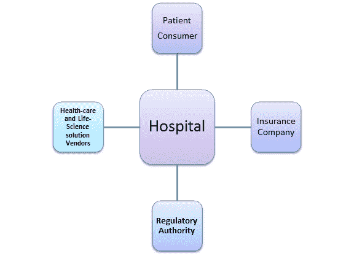
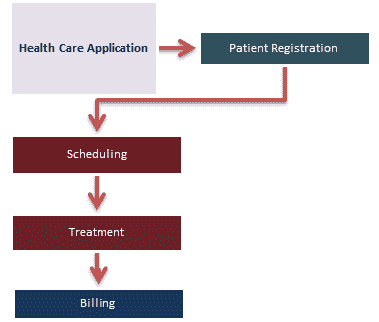
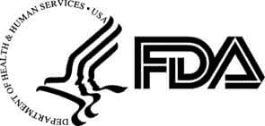

# 使用样本测试用例进行 HealthCare 域测试

> 原文： [https://www.guru99.com/healthcare-application-testing-with-sample-test-cases.html](https://www.guru99.com/healthcare-application-testing-with-sample-test-cases.html)

在开始测试之前，让我们快速学习基本的医疗领域知识。

## 卫生保健领域的基本知识

整个卫生保健系统由医院或提供者（医生）的单一机构相互编织。

其他实体包括-

*   **保险公司：** Medicare，Medicaid，BCBS 等。
*   **患者/消费者：**参加的患者
*   **监管机构：** HIPAA，OASIS 评估，HCFA 1500 和 UB92 等。
*   **保健和生命科学解决方案供应商**

卫生保健系统的基本术语

*   **提供者**：由医疗保健服务许可的医疗保健专业人员（医生），医疗小组，诊所，实验室，医院等
*   **索赔：**要求您的健康保险公司支付医疗服务费
*   **经纪人：**保险专业人士，代表受保人或准受保人谈判，购买保险
*   **财务：**支付医疗费用的保险机构，可以是政府（Medicare 或 Medicaid）或商业（BCBS）
*   **Medicare：**针对老年人和永久残障人士的联邦健康保险计划
*   **医疗补助：**一项联合州计划，旨在帮助低收入家庭和个人支付与医疗相关的费用
*   **CPT 代码**：当前的程序术语代码是用于描述医疗，外科和诊断服务的医疗代码集
*   **HIPAA** ：这是医生，医院，医疗保健提供者和健康计划必须遵循的一组规则和规定，以提供其服务

在本教程中，我们将学习-

*   [卫生保健领域的基本知识](#1)
*   [医疗保健业务流程](#13)
*   [供应商系统](#2)的测试
*   [经纪人系统](#3)的测试
*   [成员系统](#4)的测试
*   [索赔系统](#5)的测试
*   [财务系统](#6)的测试
*   [符合法规要求的测试](#7)
*   [医疗保健应用程序的性能测试](#8)
*   [医疗保健应用程序的其他测试类型](#9)
*   [测试医疗保健应用程序中的挑战](#10)
*   [医疗设备测试](#11)
*   [医疗保健测试的有用技巧](#12)

## 医疗保健业务流程

大多数医疗保健组织都采用了适应性软件程序来处理系统的平稳运行。 该软件系统为处理该问题的每个实体在单个文档中提供所有信息。

将整个系统与单个 Web 应用程序互连是一项艰巨的任务，而使其有效工作则是一项更大的任务。 对该健康应用程序进行严格的测试是强制性的，并且必须经过各个测试阶段。

在本教程中，我们将学习，

## 提供商系统测试

**提供者（医生/医院）系统**的示例测试场景和测试案例：

| 测试场景 | 测试用例 |
| 

1.  访问提供商系统

 | 

*   提供者系统应让我们输入，编辑和保存提供者的数据

 |
| 

2.  正流量 [系统测试](/system-testing.html)

 | 

*   它包括用于输入不同类型的提供程序，更改提供程序详细信息，保存并查询它们的方案。

 |
| 

3.  负流系统测试

 | 

*   允许保存提供商信息以及不完整的数据，合同的生效日期，输入有关系统中现有提供商的详细信息

 |
| 

4.  系统 [集成测试](/integration-testing.html)

 | 

*   验证成员系统，财务系统，索赔系统和提供者门户的提要。 此外，请验证是否将来自提供商门户的更改输入到相应提供商的记录

 |
| 

5.  正向流量提供者门户网站测试

 | 

*   登录并查看提供者的详细信息，声明状态和成员详细信息
*   发出更改请求以更改名称，地址，电话号码等。

 |
| 

6.  负流提供者​​门户网站测试

 | 

*   使用无效的 ID 查看会员详细信息
*   使用无效的凭据登录

 |
| 

7.  正向流量代理门户测试

 | 

*   登录并查看有关经纪人和佣金支付的详细信息
*   请求更改名称，地址，电话号码等。

 |
| 

8.  负流代理门户测试

 | 

*   它应包括使用无效凭据登录的方案

 |

## 经纪人系统测试

**经纪人系统**的示例测试场景和测试案例：

| Sr＃ | 测试场景 | Test Cases |
| 1) | 经纪人系统 | 

*   它应该能够编辑，输入和保存经纪人数据
*   基于会员系统

中溢价支付明细的经纪人佣金计算 |
| 2) | 正流系统测试 | 

*   输入，保存和编辑不同类型的经纪人的经纪人记录
*   对于活跃的经纪人，通过创建供稿文件来计算佣金，该文件包含具有不同计划的会员的相应记录

 |
| 3) | 负流系统测试 | 

*   输入不完整数据的经纪人记录，并保存为不同类型的经纪人
*   通过为具有不同计划的成员创建具有相应记录的 Feed 文件，计算终止经纪人的佣金
*   通过为具有不同计划的成员创建具有相应记录的提要文件来计算无效经纪人的佣金

 |
| 4) | 系统测试 | 

*   对于诸如财务系统，经纪人门户和成员系统的下游系统，验证提要
*   验证是否将经纪人门户的更改合并到相应的经纪人记录

中 |

## 成员系统测试

**成员（患者）系统**的示例测试场景和测试案例：

| 

Sr＃

 | Test Scenario | Test Cases |
| 1) | 会员制度 | 

*   注册，恢复和终止会员
*   删除并添加受抚养者
*   生成保费账单
*   处理保费付款

 |
| 2) | 正流系统测试 | 

*   使用当前，过去和将来的有效日期注册不同类型的成员
*   查询和更改成员
*   为下个月的活跃成员生成保费账单
*   终止当前，过去和将来终止日期大于生效日期的活动成员
*   重新注册具有当前，过去和将来生效日期的终止成员
*   恢复终止的成员 编号

 |
| 3) | 负流系统测试 | 

*   数据不足，则需要注册会员
*   对于终止的会员，请在下个月出示保费账单

 |
| 4) | 系统集成测试 | 

*   验证对下游系统（例如，提供商门户，经纪人门户，财务系统和索赔系统）的提要
*   验证成员门户的更改是否合并到相应的成员记录

*   处理由会员门户网站的 Feed 生成的溢价帐单的付款，其中包含付款细节

 |

## 索赔系统测试

**声明系统**的示例测试场景和测试案例：

| # | 测试方案 | 测试用例 |
| 1) | 索偿制度 | 

*   保健索赔应编辑，输入并处理成员及其从属的索赔
*   对于无效的索赔，当输入错误的数据时应抛出错误

 |
| 2) | Positive Flow System Testing | 

*   它应包括场景，以编辑，输入和处理成员以及从属

的声明 |
| 3) | 负流系统测试 | 

*   应当验证并输入带有无效程序代码和诊断代码的索赔
*   验证并输入具有无效提供商 ID 的索赔
*   验证并输入已终止的索赔 成员

 |
| 4) | 系统整合 | 

*   它应包括一个场景，以验证对下游系统（例如提供商和财务门户网站）的提要

 |

## 财务系统测试

**金融系统**的示例测试场景和测试案例

| Sr# | 测试方案 | Test Cases |
| 1) | 财务系统 | 

*   注册，恢复和终止成员

 |
| 2) | 正流系统测试 | 

*   应该检查是否为付款的相应成员，提供者或经纪人选择了正确的帐号或地址

 |
| 3) | 负流系统测试 | 

*   通过在 Feed 中创建各自的记录来验证是否为无效的会员，提供者或经纪人 ID 付款。
*   验证是否为会员，提供者或经纪人的无效金额付款 通过在 Feed

中创建相应的记录 |

## 测试合规性

保护患者敏感数据和健康信息是健康监管机构的首要任务。 测试应遵守此类监管机构的规定。

**样本合规性测试场景和测试用例**：

| Sr# | Test Scenarios | Test Cases |
| 1) | 用户认证 | 

*   使用验证方法来确保正确的用户登录并拒绝他人

 |
| 2) | 信息披露 | 

*   授权访问信息基于用户的角色和患者的限制

 |
| 3) | 数据传输 | 

*   在所有传输中，点确保数据已加密

 |
| 4) | 审计追踪 | 

*   记录了所有事务以及所有使用适当的审计跟踪信息集访问数据的尝试。

 |
| 5) | 与监管机构相关的健全性测试 | 

*   执行健全性测试并验证数据加密是否在诸如 EPHI（电子保护健康信息）

的特定区域中完成。 |

## 医疗保健应用程序的性能测试

在准备测试方案之前，应考虑系统的某些要求。 例如，医疗保健提供者（医生/医院）提供 24/7 全天候护理，因此患者检查软件需要始终可用。 此外，它还需要与保险公司进行沟通，以验证保单信息，发送索赔和接收汇款。 在这里，架构应定义系统的不同组件，与保险公司进行通信的协议以及如何部署系统以使其符合 24/7 的要求。

作为测试人员，您需要确保医疗软件系统符合所需的负载/性能基准。

## 医疗保健应用的其他测试类型

*   **功能测试**：针对功能功能测试医疗保健应用程序
*   **一致性测试**：一致性测试医疗保健安全要求和行业框架
*   **平台测试**：[移动](/mobile-testing.html)平台上的应用程序测试以及跨浏览器兼容性的应用程序测试
*   **互操作性测试**：测试是否符合互操作性标准（例如：DICOM，HL7，CCD / CDA）

## 测试医疗保健应用中的挑战

测试医疗保健应用程序中的测试挑战与其他 Web 应用程序测试没有什么不同。

*   需要测试方面的专业知识，通常成本很高
*   除常规测试技术（非功能，功能和集成测试）外，还要求互操作性，合规性，法规，安全性，安全性测试
*   在进行测试时应牢记安全和法规标准-因为任何错误都可能对患者的生活造成直接影响
*   测试团队需要充分了解软件将要用于的各种功能，临床用途和环境
*   保健产品在使用前应符合 FDA，ISO 和 CMMI 等各种标准
*   软件测试人员的相互依赖性需要确保一个组件或层中的任何更改都不会对另一组件或层产生副作用。

## 医疗设备测试

尽管医疗保健设备软件不是患者的直接关注点，但它们也需要像其他软件测试一样进行严格的测试。 例如，由软件程序控制的 X 射线机应进行良好的测试，因为软件中的任何测试错误都可能对患者造成严重影响。

FDA（食品药品监督管理局）有针对医疗设备的移动和 Web 应用程序的准则。 在测试医疗设备时，正确的功能性[测试计划](/what-everybody-ought-to-know-about-test-planing.html)以及通过和失败标准也是 FDA 准则的一部分。 执行测试计划后，将收集结果并报告给 FDA。 此过程可确保设备符合监管机构的标准。

## 医疗保健测试的有用提示

在测试软件时，您可以考虑测试医疗保健系统的一些重要技巧。

*   日期很重要，需要准确
*   在设计测试用例时，请考虑各种参数，例如不同类型的计划，经纪人，成员，佣金等。
*   需要完整的领域知识