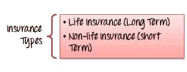
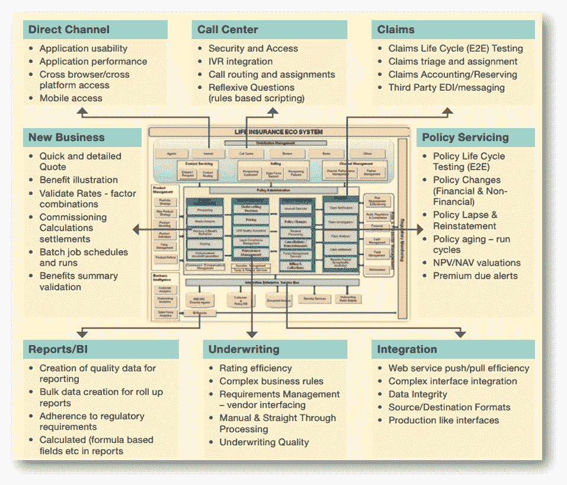

# 使用样本测试用例测试保险领域的应用程序

> 原文： [https://www.guru99.com/testing-insurance-applications-with-sample-testcases.html](https://www.guru99.com/testing-insurance-applications-with-sample-testcases.html)

保险公司严重依赖软件来开展业务。 软件系统可以帮助他们处理各种保险活动，例如制定标准的保险单，处理账单流程，管理客户数据，为客户提供优质服务，在分支机构之间进行协调等。

尽管此软件旨在满足客户的期望，但其耐用性和一致性仍需要在实际部署之前进行测试。 软件测试通过在上线之前识别错误来确保保险软件的质量。

在本教程中，我们将学习，

*   [测试中的域是什么？](#1)
*   [为什么保险领域知识如此重要？](#2)
*   [什么是保险？ 保险类型](#3)
*   [什么是高级会员？ 如何计算保费？](#4)
*   [在保险](#5)的不同过程区域中需要进行的测试
*   [在保险中要测试什么？](#6)
*   [用于保险应用程序测试的示例测试用例](#7)

[免费加入我们的实时保险测试项目](/live-insurance-testing-project.html)

## 什么是测试领域？

Domain 就是创建软件测试项目的行业。 当我们谈论软件项目或开发时，通常会使用该术语。 例如，保险领域，银行领域，零售领域，医疗保健领域等。

通常，在开发任何特定的领域项目时，都会寻求领域专家的帮助。 领域专家是该主题的大师，他可能知道产品或应用程序的内在知识。

## 为什么保险领域知识如此重要？

领域知识对于测试任何软件产品都是最典型的，它具有自己的优势，例如

## 什么是保险？ 保险种类

保险的定义是将损失的风险从一个实体公平地转移到另一个实体以换取付款。 出售保单的保险公司称为 INSURER，而使用该保单的个人或公司称为 INSURED。

保险单通常分为两类，保险公司根据其要求和预算购买这些保单。

但是，还有其他类型的保险属于这些类别

*   失业保险
*   社会保障
*   劳动者报酬

## 什么是 Premium？ 如何计算保费？

保费定义为针对一定数量的保险额或被保险人已购买的保单收取的金额。

保险费是根据两个因素确定的

*   索赔频率
*   索赔的严重程度（每项索赔的费用）

例如，我们将了解保险制度的运作方式，

**假设一家保险公司为一个村庄的所有房屋提供保险**

| **家庭保险** | **金额** |
| 乡村房屋总数 | = 1000 |
| 每栋房屋的价值 | = $ 800 |
| 每个房主缴纳的保险费 | = $ 8 |
| 收取的保费总额 | = $8000 |

据统计，据统计，在发生火灾的情况下，最多要烧毁 10 座房屋，这需要进行补偿。

因此，万一发生火灾，它将不得不向 10 所房屋支付 800 美元，相当于其收取的保险费 8000 美元。

10 名房屋所有者的风险分布在村庄的 1000 名房屋所有者中，因此减轻了任何一名房屋所有者的负担。

如果在特定年份不发生火灾，则全部款项都将计入其利润，而如果烧毁超过 10 栋房屋，则保险公司将蒙受损失。

## 在保险的不同过程区域中需要进行的测试

测试可以减轻软件部署期间和部署后业务中断的风险。 保险公司有许多分支机构需要测试。

*   政策管理系统
*   索赔管理系统
*   分销管理系统
*   投资管理系统
*   第三方管理系统
*   风险管理解决方案
*   法规与合规
*   精算系统（评估&定价）

## 在保险中应进行哪些测试？

保险业是由小型单位组成的网络，直接或间接处理索赔。 为了使保险公司顺利运作，有必要对每个单元进行严格的测试，然后再将它们同步在一起以提供所需的结果。 测试包括

| 

*   **呼叫中心**

 | 

*   IVR [集成测试](/integration-testing.html)
*   呼叫路由和分配
*   安全和访问
*   自反问题

 |
| 

*   **策略服务**

 | 

*   政策生命周期测试
*   财务和非财务政策变更
*   政策失效和恢复原状
*   政策老化运行周期
*   高级到期警报
*   NPV / NAV 的估值

 |
| 

*   **要求保护**

 | 

*   声明分类和分配
*   测试声明生命周期
*   声明计费/保留
*   第三方 EDI /消息传送

 |
| 

*   **直接通道**

 | 

*   移动访问
*   跨浏览器/跨平台可访问性
*   应用性能
*   应用程序的可用性

 |
| 

*   **报告/ BI**

 | 

*   符合法规要求
*   生成用于报告的质量数据
*   为汇总报告创建批量数据
*   在报告中测试基于公式的字段

 |
| 

*   **承保**

 | 

*   承保质量
*   手动和直通处理
*   复杂的业务规则
*   评估效率
*   需求管理（供应商接口）

 |
| 

*   **集成**

 | 

*   数据集成
*   复杂接口集成
*   源/目标格式
*   类似接口的生产
*   Web 服务拉/推效率

 |
| 

*   **新业务**

 | 

*   验证费率因子组合
*   批处理作业计划和运行
*   调试计算结算
*   快速详细的报价
*   好处图
*   利益摘要验证
*   快速详细的报价

 |

## 用于保险申请测试的样本测试用例

| **Sr＃** | **保险申请的测试用例** |
| 1 | 验证索赔规则 |
| 2 | 确保可以发生最高和最低付款的索赔 |
| 3 | 验证数据是否已正确传输到所有子系统，包括帐户和报告。 |
| 4 | 检查索赔是否可以通过所有渠道处理，例如网络，手机，电话等 |
| 5 | 在确定溢价率的计算中测试 100％的覆盖率和准确性 |
| 6 | 确保计算股息和已付价值的公式给出正确的值 |
| 7 | 验证投降值是根据策略要求计算的 |
| 8 | 验证受托人详细信息和簿记要求 |
| 9 | 测试政策失效和复兴的复杂方案 |
| 10 | 测试各种条件的非没收价值 |
| 11 | 策略终止的测试方案 |
| 12 | 验证总分类帐帐户的行为与与子分类帐一致 |
| 13 | 评估净负债的测试计算 |
| 14 | 长期保险的测试条件 |
| 15 | 验证非没收期权的政策 |
| 16 | 检查不同的保险产品期限是否符合预期 |
| 17 | 根据产品计划验证溢价 |
| 18 | 测试自动消息传递系统以通知客户有关新产品的信息 |
| 19 | 验证用户输入的所有数据在工作流中的进度，以触发警告，合规性，通知和其他工作流事件 |
| 20 | 验证保险单据模板是否支持 MS-Word 之类的单据格式 |
| 21 | 自动生成发票并通过电子邮件发送给客户的测试系统 |

## **摘要**

及时制定保险单并管理客户数据是任何保险公司的首要任务。 他们完全依赖于用于处理索赔的软件解决方案以及客户，因此需要精确且准确的软件解决方案。 考虑到保险公司要求的所有关键方面，本教程中介绍了一些测试策略和方案。

**检查我们的** [现场保险测试项目](/live-insurance-testing-project.html)