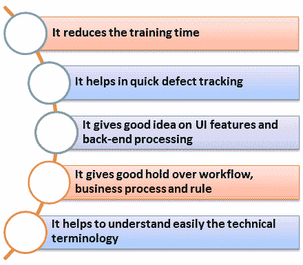
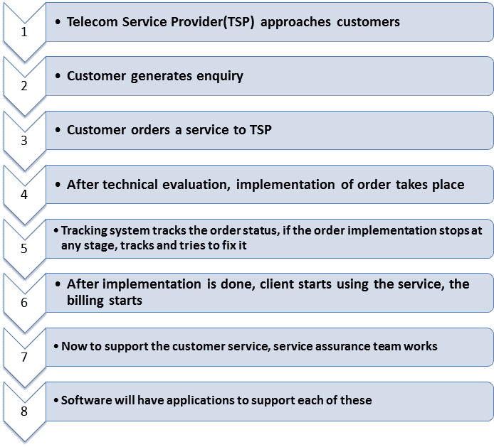

# 使用示例 OSS / BSS 测试用例测试电信域

> 原文： [https://www.guru99.com/testing-telecom-application-with-sample-testcases.html](https://www.guru99.com/testing-telecom-application-with-sample-testcases.html)

### 什么是电信测试？

电信测试定义为电信软件的测试。 自从电信业向数字和计算机网络转移以来，电信业使用了必不可少的软件。 电信部门依靠各种类型的软件组件来提供许多服务，例如路由和交换，VoIP 宽带访问等。因此，电信软件测试是不可避免的。

在本教程中，您将学习-

*   [测试中的域是什么？](#1)
*   [为什么领域知识如此重要？](#2)
*   [电信行业的业务流程](#3)
*   [典型的电信业务流程](#4)
*   [电信行业中使用的协议类型](#5)
*   [测试电信行业的生命周期](#6)
*   [在电信软件](#7)上执行的测试类型
*   [用于电信测试的示例测试案例](#8)

[免费加入我们的实时电信测试项目](/live-telecom-project.html)

## 什么是测试领域？

领域不过是为其创建软件测试项目的行业。 当我们谈论软件项目或开发时，通常会使用该术语。 例如，保险域，银行域，零售域，电信域等。

通常在开发任何特定的领域项目时，都会寻求领域专家的帮助。 领域专家是该主题的大师，他可能知道产品或应用程序的内幕。

## 为什么测试领域知识很重要？

领域知识对于测试任何软件产品都是最典型的，它具有自己的优势，例如

## 电信行业的业务流程

对于电信测试，端到端服务验证很重要。 为了确保高效测试，必须对不同的业务流程有很好的理解。

在起草测试用例之前，您需要了解服务可交付性的每个阶段。

电信服务要么基于包含 IVR 的业务支持系统，呼叫中心，生成发票等，要么基于包含路由器，交换机，基站等的运营支持系统。

下表显示了在不同级别执行的活动

| 

电信部门

 | 

电信活动

 |
| 售前 | 

*   它处理所有销售信息，如折扣，服务，促销等。

 |
| 定购 | 

*   申请新连接或断开连接

 |
| 供应 | 

*   该部门处理客户与 TSP（电信服务提供商）之间的物理连接

 |
| 开票 | 

*   在此部门下，所有结算工作均已完成。

 |
| 保险服务 | 

*   如果发生任何故障，此部门将解决问题

 |
| 库存系统 | 

*   它是所有信息的存储库

 |
| 追踪 | 

*   此部门跟踪订购系统和订单的状态

 |

## 典型的电信业务流程

以下是电信行业中的典型业务流程。

## 电信行业中使用的协议类型

这里是电信行业使用的流行协议

*   **VoIP 技术**：VoIP，IMS，MPLS，ISDN，PSTN
*   **信令和协议**：SIP，ISDN，编解码器，H.323
*   **无线技术：** GPRS，CDMA，GSM，UMTS
*   **网络管理：** SNMP
*   **第 2 层协议：** ARP，STP，L2TP，PPP
*   **第 3 层协议/路由：** ICMP，BGP，ISIS，MPLS
*   **基础结构/安全性：** ATM，TCP / IP，LAN / VLAN，SSH

**您可以在此处** 了解有关协议测试[的更多信息。](/protocol-testing.html)

## 在电信行业中测试生命周期

电信行业的测试生命周期与任何其他行业相似，但都注重细节。 这是测试生命周期以及测试工件的外观。

| 

电信测试阶段

 | 

测试工件

 |
| 

*   业务视图

 | 

*   基于需求的测试工件
*   基于可行性的工件
*   基于标准和策略标识的测试工件
*   操作和维护注意事项相关的测试工件

 |
| 

*   系统/体系结构

 | 

*   系统测试工件（安全性，安装）
*   虚拟原型测试工件
*   特殊 [系统测试](/system-testing.html) 工件（互操作性，灾难恢复）

 |
| 

*   实现

 | 

*   单元测试工件
*   集成测试工件
*   质量和性能工件
*   回归，负载测试，健全性等。

 |
| 

*   部署

 | 

*   验收测试工件
*   集成测试工件
*   质量和性能工件
*   功能测试工件
*   Alpha / Beta 测试工件

 |

## 在电信软件上执行的测试类型

*   互连测试
*   符合性测试
*   IVR 测试
*   [性能测试](/performance-testing.html)
*   [安全测试](/what-is-security-testing.html)
*   互操作性测试
*   协议测试
*   功能测试
*   [自动化测试](/automation-testing.html)

## 用于电信测试的示例测试案例

在电信测试中，必须考虑以下测试

| 

各种电信测试

 | 

电信中的测试活动

 |
| **计费系统** | 

*   验证客户的电话号码已在电信运营商
*   之下验证该号码是否仍在工作
*   验证输入的号码是否有效，并且是 10 位数字 号码
*   验证号码是否由于某些原因而被阻止
*   验证号码是否有未结账单（如果存在），在屏幕上显示它
*   验证号码是否已全部 清除以前的帐户或账单
*   验证系统是否能够根据客户要求生成对帐单
*   验证系统已准确记录了多个呼叫
*   验证客户选择的计划 在计费系统上显示
*   验证计费的总金额是否正确并映射到所提供的服务

 |
| **应用测试** | 

*   物联网的协议，信令，现场测试
*   用法和 [功能测试](/functional-testing.html) ，用于核心 [移动](/mobile-testing.html) 手机应用程序，例如呼叫，SMS，转移/保持 等等。
*   测试各种应用程序，例如金融，体育和基于位置的服务等。OSS-BSS 测试

 |
| **OSS-BSS 测试** | 

*   计费，客户案例，互连计费，订单和欺诈管理，收入保证
*   网络管理，中介，配置等。
*   EAI，CRM & ERP， 数据仓库等。

 |
| **一致性测试** | 

*   电气接口兼容性
*   协议的一致性
*   传输层的一致性

 |
| **IVR 测试** | 

*   交互式测试场景
*   语音能量检测
*   宽带音频
*   广泛的条件分支序列
*   DTMF 条目

 |

**摘要**

电信服务是一个非常广阔的领域，由电缆，网络，信号，协议等各种组件组成，其测试需要广泛的测试技术，因此测试技术和策略的选择在很大程度上取决于电信的组成部分。 经过测试。

测试要求，范围，测试方案，测试技术，测试工具等随所涉及的测试类型而有所不同，它可以是 VoIP 的协议测试或 CDMA 的无线设备测试。 本教程对如何执行电信测试给出了基本但完整的概述，并讨论了对于电信测试至关重要的各种前景。